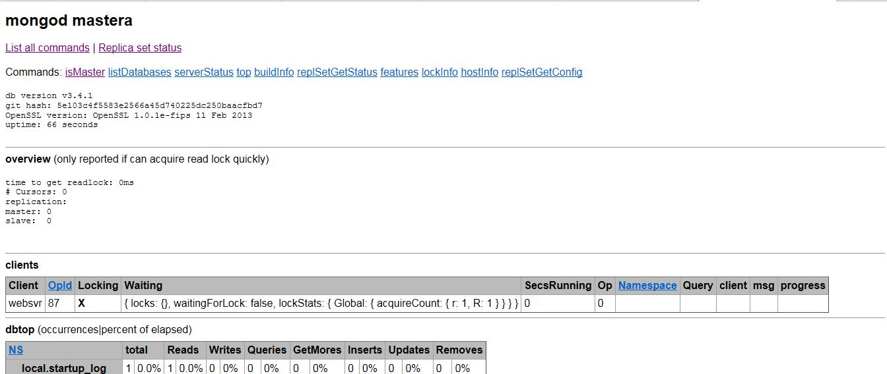

# MongoDB 

[TOC]

## 课程要求	

* 熟悉 MongoDB 数据库各种概念
* 学会 MongoDB 的搭建
* 熟悉 MongoDB 的使用
* 简单运维

## 概念

### NoSQL 简介

NoSQL(NoSQL = Not Only SQL )，意即"不仅仅是SQL"。

NoSQL，指的是非关系型的数据库。NoSQL有时也称作Not Only SQL的缩写，是对不同于传统的关系型数据库的数据库管理系统的统称。

NoSQL用于超大规模数据的存储。（例如谷歌或Facebook每天为他们的用户收集万亿比特的数据）。这些类型的数据存储不需要固定的模式，无需多余操作就可以横向扩展。

### 为什么使用NoSQL ?

今天我们可以通过第三方平台（如：Google,Facebook等）可以很容易的访问和抓取数据。用户的个人信息，社交网络，地理位置，用户生成的数据和用户操作日志已经成倍的增加。我们如果要对这些用户数据进行挖掘，那SQL数据库已经不适合这些应用了, NoSQL数据库的发展却能很好的处理这些大的数据。

NoSQL纪元

当下已经存在很多的NoSQL数据库，比如MongoDB、Redis、Riak、HBase、Cassandra等等。每一个都拥有以下几个特性中的一个：

* 不再使用SQL语言，比如MongoDB、Cassandra就有自己的查询语言
* 通常是开源项目
* 为集群运行而生
* 弱结构化――不会严格的限制数据结构类型

### NoSQL 数据库的类型一览表

|数据库类型|描述|主流产品|有谁在用|适用场景|不适用场景|
|:--|:--|:--|:--|:--|:--|:--|
|键值（Key-Value）数据库|键值数据库就像在传统语言中使用的哈希表。你可以通过 key 来添加、查询或者删除数据，鉴于使用主键访问，所以会获得不错的性能及扩展性。|Riak、Redis、Memcached、Amazon’s Dynamo、Project Voldemort|	GitHub （Riak）、BestBuy （Riak）、Twitter （Redis和Memcached）、StackOverFlow （Redis）、 Instagram （Redis）、Youtube （Memcached）、Wikipedia（Memcached）|储存用户信息，比如会话、配置文件、参数、购物车等等。这些信息一般都和 ID（键）挂钩，这种情景下键值数据库是个很好的选择。	|1. 取代通过键查询，而是通过值来查询。Key-Value 数据库中根本没有通过值查询的途径。2. 需要储存数据之间的关系。在 Key-Value 数据库中不能通过两个或以上的键来关联数据。3. 事务的支持。在 Key-Value 数据库中故障产生时不可以进行回滚。|
|面向文档（Document-Oriented）数据库|	面向文档数据库会将数据以文档的形式储存。每个文档都是自包含的数据单元，是一系列数据项的集合。每个数据项都有一个名称与对应的值，值既可以是简单的数据类型，如字符串、数字和日期等；也可以是复杂的类型，如有序列表和关联对象。数据存储的最小单位是文档，同一个表中存储的文档属性可以是不同的，数据可以使用 XML、JSON 或者 JSONB 等多种形式存储。	|MongoDB、CouchDB、RavenDB|	SAP （MongoDB）、Codecademy （MongoDB）、Foursquare （MongoDB）、NBC News （RavenDB）	|1. 日志。企业环境下，每个应用程序都有不同的日志信息。Document-Oriented 数据库并没有固定的模式，所以我们可以使用它储存不同的信息。2. 分析。鉴于它的弱模式结构，不改变模式下就可以储存不同的度量方法及添加新的度量。|在不同的文档上添加事务。Document-Oriented 数据库并不支持文档间的事务，如果对这方面有需求则不应该选用这个解决方案。|
|列存储（Wide Column Store/Column-Family）数据库|	列存储数据库将数据储存在列族（column family）中，一个列族存储经常被一起查询的相关数据。举个例子，如果我们有一个 Person 类，我们通常会一起查询他们的姓名和年龄而不是薪资。这种情况下，姓名和年龄就会被放入一个列族中，而薪资则在另一个列族中。	|Cassandra、HBase|	Ebay （Cassandra）、Instagram （Cassandra）、NASA （Cassandra）、Twitter （Cassandra and HBase）、Facebook （HBase）、Yahoo!（HBase）|	1. 日志。因为我们可以将数据储存在不同的列中，每个应用程序可以将信息写入自己的列族中。2. 博客平台。我们储存每个信息到不同的列族中。举个例子，标签可以储存在一个，类别可以在一个，而文章则在另一个。|	1. 如果我们需要 ACID 事务。Vassandra 就不支持事务。2. 原型设计。如果我们分析Cassandra 的数据结构，我们就会发现结构是基于我们期望的数据查询方式而定。在模型设计之初，我们根本不可能去预测它的查询方式，而一旦查询方式改变，我们就必须重新设计列族。|
|图（Graph-Oriented）数据库	|图数据库允许我们将数据以图的方式储存。实体会被作为顶点，而实体之间的关系则会被作为边。比如我们有三个实体，Steve Jobs、Apple 和 Next，则会有两个“Founded by”的边将 Apple 和 Next 连接到 Steve Jobs。	|Neo4J、Infinite Graph、OrientDB	|Adobe （Neo4J）、Cisco （Neo4J）、T-Mobile （Neo4J）	|1. 在一些关系性强的数据中2. 推荐引擎。如果我们将数据以图的形式表现，那么将会非常有益于推荐的制定	不适合的数据模型。图数据库的适用范围很小，因为很少有操作涉及到整个图。|


### MongoDB 简介
   
#### 网站

* mongoDB 官网 www.mongodb.org
* mongoDB 中文官网 www.mongoing.com
* github.com/mongodb
* jira.mongodb.org #bug 

MongoDB 是一个基于分布式文件存储的数据库。由 C++ 语言编写。旨在为 WEB 应用提供可扩展的高性能数据存储解决方案。

MongoDB 是一个介于关系数据库和非关系数据库之间的产品，是非关系数据库当中功能最丰富，最像关系数据库的。		

#### 分布式文件系统

分布式文件系统（Distributed File System）是指文件系统管理的物理存储资源不一定直接连接在本地节点上，而是通过计算机网络与节点相连。分布式文件系统的设计基于客户机/服务器模式。一个典型的网络可能包括多个供多用户访问的服务器。另外，对等特性允许一些系统扮演客户机和服务器的双重角色。

#### 文档

文档是 MongoDB 中数据的基本单位，类似于关系数据库中的行（但是比行复杂）。多个键及其关联的值有序地放在一起就构成了文档。不同的编程语言对文档的表示方法不同，在JavaScript 中文档表示为：

{“greeting”:“hello,world”}

这个文档只有一个键“greeting”，对应的值为“hello,world”。多数情况下，文档比这个更复杂，它包含多个键/值对。例如：

{“greeting”:“hello,world”,“foo”: 3}

文档中的键/值对是有序的，下面的文档与上面的文档是完全不同的两个文档。

{“foo”: 3 ,“greeting”:“hello,world”}

文档中的值不仅可以是双引号中的字符串，也可以是其他的数据类型，例如，整型、布尔型等，也可以是另外一个文档，即文档可以嵌套。文档中的键类型只能是字符串。

#### 集合

集合就是一组文档，类似于关系数据库中的表。集合是无模式的，集合中的文档可以是各式各样的。例如，`{“hello,word”:“Mike”}和{“foo”: 3}`，它们的键不同，值的类型也不同，但是它们可以存放在同一个集合中，也就是不同模式的文档都可以放在同一个集合中。既然集合中可以存放任何类型的文档，那么为什么还需要使用多个集合？这是因为所有文档都放在同一个集合中，无论对于开发者还是管理员，都很难对集合进行管理，而且这种情形下，对集合的查询等操作效率都不高。所以在实际使用中，往往将文档分类存放在不同的集合中，例如，对于网站的日志记录，可以根据日志的级别进行存储，Info级别日志存放在Info 集合中，Debug 级别日志存放在Debug 集合中，这样既方便了管理，也提供了查询性能。但是需要注意的是，这种对文档进行划分来分别存储并不是MongoDB 的强制要求，用户可以灵活选择。

可以使用“.”按照命名空间将集合划分为子集合。例如，对于一个博客系统，可能包括blog.user 和blog.article 两个子集合，这样划分只是让组织结构更好一些，blog 集合和blog.user、blog.article 没有任何关系。虽然子集合没有任何特殊的地方，但是使用子集合组织数据结构清晰，这也是MongoDB 推荐的方法。

#### 数据库

MongoDB 中多个文档组成集合，多个集合组成数据库。一个MongoDB 实例可以承载多个数据库。它们之间可以看作相互独立，每个数据库都有独立的权限控制。在磁盘上，不同的数据库存放在不同的文件中。MongoDB 中存在以下系统数据库。

* Admin 数据库：一个权限数据库，如果创建用户的时候将该用户添加到admin 数据库中，那么该用户就自动继承了所有数据库的权限。
* Local 数据库：这个数据库永远不会被负责，可以用来存储本地单台服务器的任意集合。
* Config 数据库：当MongoDB 使用分片模式时，config 数据库在内部使用，用于保存分片的信息。


## 搭建 MongoDB

### MongoDB 下载

MongoDB提供了可用于32位和64位系统的预编译二进制包，你可以从MongoDB官网下载安装，MongoDB预编译二进制包下载地址：http://www.mongodb.org/downloads

### 搭建简单的单机服务 

实验环境为rhel7.2 mongodb 3.4.1

mastera	192.168.196.11

1.下载到本地并解压

安装指南可以查看压缩后的README 

```
[root@mastera ~]# cd /tmp
[root@mastera tmp]# ls
mongodb-linux-x86_64-rhel70-3.4.1.tgz  mysql_scripts.zip
[root@mastera tmp]# tar -xf mongodb-linux-x86_64-rhel70-3.4.1.tgz -C /usr/local/
[root@mastera tmp]# cd /usr/local
[root@mastera local]# ls
bin  etc  games  include  lib  lib64  libexec  mongodb-linux-x86_64-rhel70-3.4.1  sbin  share  src
[root@mastera local]# cd mongodb-linux-x86_64-rhel70-3.4.1/
[root@mastera mongodb-linux-x86_64-rhel70-3.4.1]# ls
bin  GNU-AGPL-3.0  MPL-2  README  THIRD-PARTY-NOTICES
[root@mastera mongodb-linux-x86_64-rhel70-3.4.1]# ln -s /usr/local/mongodb-linux-x86_64-rhel70-3.4.1/ /usr/local/mongodb
[root@mastera mongodb-linux-x86_64-rhel70-3.4.1]# cd /usr/local/mongodb
[root@mastera mongodb]# pwd
/usr/local/mongodb
```

2.将可执行文件路径加入PATH变量中，并永久生效

```shell
[root@mastera mongodb]# echo "export PATH=$PATH:/usr/local/mongodb/bin" >> /etc/bashrc
[root@mastera mongodb]# source /etc/bashrc
[root@mastera mongodb]# ls bin
bsondump  mongo  mongod  mongodump  mongoexport  mongofiles  mongoimport  mongooplog  mongoperf  mongoreplay  mongorestore  mongos  mongostat  mongotop
[root@mastera mongodb]# which mongo
/usr/local/mongodb/bin/mongo
```

3.创建数据库目录和日志目录

MongoDB 默认的启动的数据库路径是 /data/db 。

```shell
[root@mastera mongodb]# mkdir /mongodb/data/db -p
[root@mastera mongodb]# mkdir /mongodb/data/log -p
```

4.运行 MongoDB 服务

1)命令行参数运行 MongoDB 服务

可以在命令行中执行mongo安装目录中的bin目录执行mongod命令来启动mongdb服务。

--dbpath 指定数据路径

--logpath 指定日志路径

--logappend 指定日志追加

--port 指定监听端口

```shell
[root@mastera mongodb]# mongod --dbpath /mongodb/data/db/ --logpath /mongodb/data/log/mongodb.log --logappend &
[1] 1714
```

这里有四个警告
1. 访问权限问题
2. 进程执行用户为root问题
3. 内核参数/sys/kernel/mm/transparent_hugepage/enabled
4. 内核参数/sys/kernel/mm/transparent_hugepage/defrag

```shell
[root@mastera mongodb]# cat /sys/kernel/mm/transparent_hugepage/enabled
[always] madvise never
[root@mastera mongodb]# echo never > /sys/kernel/mm/transparent_hugepage/enabled
[root@mastera mongodb]# cat /sys/kernel/mm/transparent_hugepage/enabled
always madvise [never]
[root@mastera mongodb]# echo never > /sys/kernel/mm/transparent_hugepage/defrag 
[root@mastera mongodb]# cat /sys/kernel/mm/transparent_hugepage/defrag 
always madvise [never]
```

查看守护进程为mongod，监听端口为27017

```shell
[root@mastera mongodb]# ps -ef|grep mongo
root       1714   1585  0 21:50 pts/0    00:00:00 mongod --dbpath /mongodb/data/db/ --logpath /mongodb/data/log/mongodb.log --logappend
root       1736   1585  0 21:51 pts/0    00:00:00 grep --color=auto mongo
[root@mastera mongodb]# netstat -luntp|grep mongo
tcp        0      0 0.0.0.0:27017           0.0.0.0:*               LISTEN      1714/mongod 
```

2)配置文件启动 MongoDB 服务

新建配置文件存放路径/mongodb/mongodb.cnf

```shell
[root@mastera mongodb]# vim /mongodb/mongodb.cnf
dbpath=/mongodb/data/db
logpath=/mongodb/data/log/mongodb.log
logappend=true
port=27017
[root@mastera mongodb]# mongod -f /mongodb/mongodb.cnf &
[1] 1762
[root@mastera mongodb]# ps -ef|grep mongo
root       1762   1585  1 22:00 pts/0    00:00:00 mongod -f /mongodb/mongodb.cnf
root       1780   1585  0 22:00 pts/0    00:00:00 grep --color=auto mongo
[root@mastera mongodb]# netstat -luntp|grep mongo
tcp        0      0 0.0.0.0:27017           0.0.0.0:*               LISTEN      1762/mongod 
```


5.MongoDB后台管理 Shell

如果你需要进入MongoDB后台管理，你需要先打开mongodb装目录的下的bin目录，然后执行mongo命令文件。

MongoDB Shell是MongoDB自带的交互式Javascript shell,用来对MongoDB进行操作和管理的交互式环境。

当你进入mongoDB后台后，它默认会链接到 test 文档（数据库）：

```shell
[root@mastera mongodb]# mongo
MongoDB shell version v3.4.1
connecting to: mongodb://127.0.0.1:27017
MongoDB server version: 3.4.1
Welcome to the MongoDB shell.
For interactive help, type "help".
For more comprehensive documentation, see
	http://docs.mongodb.org/
Questions? Try the support group
	http://groups.google.com/group/mongodb-user
Server has startup warnings: 
2017-01-16T22:00:11.868+0800 I CONTROL  [initandlisten] 
2017-01-16T22:00:11.868+0800 I CONTROL  [initandlisten] ** WARNING: Access control is not enabled for the database.
2017-01-16T22:00:11.868+0800 I CONTROL  [initandlisten] **          Read and write access to data and configuration is unrestricted.
2017-01-16T22:00:11.868+0800 I CONTROL  [initandlisten] ** WARNING: You are running this process as the root user, which is not recommended.
2017-01-16T22:00:11.868+0800 I CONTROL  [initandlisten] 
```

由于它是一个JavaScript shell，您可以运行一些简单的算术运算:

```shell
> 2+2
4
> 3*9
27
```

可以输入help获取帮助

```shell
> help
	db.help()                    help on db methods
	db.mycoll.help()             help on collection methods
	sh.help()                    sharding helpers
	rs.help()                    replica set helpers
	help admin                   administrative help
	help connect                 connecting to a db help
	help keys                    key shortcuts
	help misc                    misc things to know
	help mr                      mapreduce

	show dbs                     show database names
	show collections             show collections in current database
	show users                   show users in current database
	show profile                 show most recent system.profile entries with time >= 1ms
	show logs                    show the accessible logger names
	show log [name]              prints out the last segment of log in memory, 'global' is default
	use <db_name>                set current database
	db.foo.find()                list objects in collection foo
	db.foo.find( { a : 1 } )     list objects in foo where a == 1
	it                           result of the last line evaluated; use to further iterate
	DBQuery.shellBatchSize = x   set default number of items to display on shell
	exit                         quit the mongo shell
```

现在让我们插入一些简单的数据，并对插入的数据进行检索：

```shell
> db.runoob.insert({x:10})
WriteResult({ "nInserted" : 1 })
> db.runoob.find()
{ "_id" : ObjectId("587cd2d4ba6fb83076d228f0"), "x" : 10 }
```

第一个命令将数字 10 插入到 runoob 集合的 x 字段中。

6.MongoDb web 用户界面

MongoDB 提供了简单的 HTTP 用户界面。 如果你想启用该功能，需要在启动的时候指定参数 --rest 。

```shell
[root@mastera mongodb]# mongod --dbpath /mongodb/data/db/ --logpath /mongodb/data/log/mongodb.log --logappend --rest &
2017-01-16T22:10:49.463+0800 I CONTROL  [main] ** WARNING: --rest is specified without --httpinterface,
2017-01-16T22:10:49.464+0800 I CONTROL  [main] **          enabling http interface
[root@mastera ~]# ps -ef|grep mongo
root       1859   1585  2 22:10 pts/0    00:00:00 mongod --dbpath /mongodb/data/db/ --logpath /mongodb/data/log/mongodb.log --logappend --rest
root       1880   1680  0 22:11 pts/1    00:00:00 grep --color=auto mongo
[root@mastera ~]# netstat -luntp|grep mongo
tcp        0      0 0.0.0.0:27017           0.0.0.0:*               LISTEN      1859/mongod         
tcp        0      0 0.0.0.0:28017           0.0.0.0:*               LISTEN      1859/mongod     
```
MongoDB 的 Web 界面访问端口比服务的端口多1000。

如果你的MongoDB运行端口使用默认的27017，你可以在端口号为28017访问web用户界面，即地址为：http://localhost:28017。




### 搭建具有冗余容错功能的复制集

### 搭建大规模数据集群

### 完成集群的自动部署

## 使用 MongoDB

### 最基本的文档的读写更新删除

### 各种不同类型的索引的创建与使用

### 复杂的聚合查询

### 对数据集合进行分片 在不同分片间维持均衡

### 数据备份与恢复

### 数据迁移

## 简单运维 MongoDB

### 部署 MongoDB 集群

### 处理多种常见的故障

### 单节点失效 如何恢复工作

### 数据库意外被杀死如何进行数据恢复

### 数据库发生拒绝服务时如何排查原因

### 数据库磁盘快满时如何处理

## 难度 

* 初级 背景知识 基本操作
* 中级 常见部署操作 简单运维
* 高级 介绍集群及大型集群的运维经验及 mongoDB 的实现原理 常见问题及解决方案

### 如何运维一个几十T甚至上百T的MongoDB数据库

### 如何维持几十个甚至上百个节点的MongoDB数据库的均衡

	


