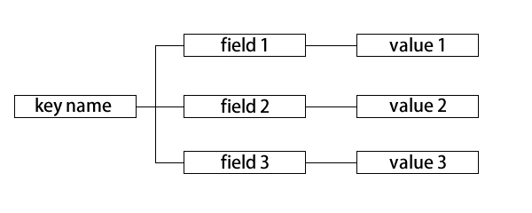
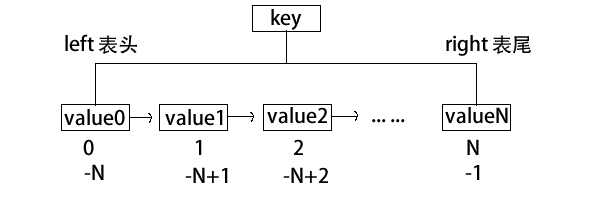
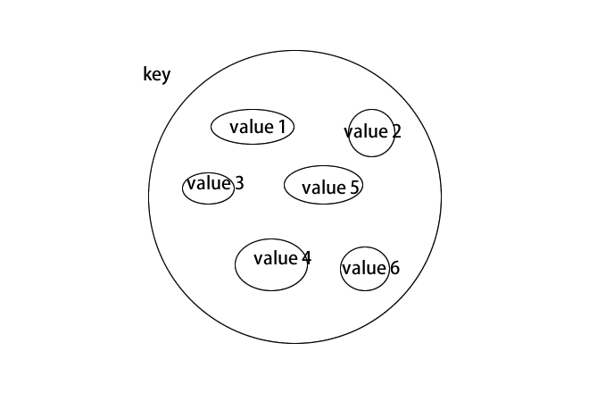

# Redis

[TOC]

## Redis入门


Redis是一个开源的（BSD许可），基于内存的存储系统，可以用作于缓存系统，数据库等，支持多种数据结构，支持主从，高可用等特性。由于Redis出色的性能表现与丰富的功能，经常被用于各种高效的数据检索环境或者缓冲环境中。

### Redis 特性


* 性能高
* 多种数据结构
* 持久化
* 功能丰富


### Redis 基本安装使用


#### 初始化环境

启动实验主机，演示主机为matsera0 ，你们需要按自己的主机名启动。

```shell
[kiosk@foundation0 ~]$ rht-vmctl  start mastera
Downloading virtual machine definition file for mastera.
######################################################################## 100.0%
Downloading virtual machine disk image db100-mastera-vda.qcow2
######################################################################## 100.0%
Creating virtual machine disk overlay for db100-mastera-vda.qcow2
Downloading virtual machine disk image db100-mastera-vdb.qcow2
######################################################################## 100.0%
Creating virtual machine disk overlay for db100-mastera-vdb.qcow2
Starting mastera.
```

登录到实验主机上并配置基本环境

* 登录并配置相关安装源

```shell

[kiosk@foundation0 ~]$ ssh root@mastera0
Warning: Permanently added 'mastera0' (ECDSA) to the list of known hosts.
root@mastera0's password:
Last login: Sun Aug 14 08:19:23 2016 from 172.25.0.250
[root@mastera0 ~]# yum install wget -y
Loaded plugins: product-id, search-disabled-repos, subscription-manager
This system is not registered to Red Hat Subscription Management. You can use subscription-manager to register.
Repodata is over 2 weeks old. Install yum-cron? Or run: yum makecache fast
rhel_dvd                                                                                                                               | 4.1 kB  00:00:00     
Resolving Dependencies
--> Running transaction check
---> Package wget.x86_64 0:1.14-10.el7_0.1 will be installed
--> Finished Dependency Resolution

Dependencies Resolved

==============================================================================================================================================================
 Package                          Arch                               Version                                       Repository                            Size
==============================================================================================================================================================
Installing:
 wget                             x86_64                             1.14-10.el7_0.1                               rhel_dvd                             546 k

Transaction Summary
==============================================================================================================================================================
Install  1 Package

Total download size: 546 k
Installed size: 2.0 M
Downloading packages:
wget-1.14-10.el7_0.1.x86_64.rpm                                                                                                        | 546 kB  00:00:00     
Running transaction check
Running transaction test
Transaction test succeeded
Running transaction
  Installing : wget-1.14-10.el7_0.1.x86_64                                                                                                                1/1
  Verifying  : wget-1.14-10.el7_0.1.x86_64                                                                                                                1/1

Installed:
  wget.x86_64 0:1.14-10.el7_0.1                                                                                                                               

Complete!
[root@mastera0 ~]# cd /etc/yum.repos.d/
[root@mastera0 yum.repos.d]# wget http://172.25.254.254/content/courses/db100/rhel7.2/materials/redis.repo
--2016-08-14 08:23:15--  http://172.25.254.254/content/courses/db100/rhel7.2/materials/redis.repo
Connecting to 172.25.254.254:80... connected.
HTTP request sent, awaiting response... 200 OK
Length: 108
Saving to: ‘redis.repo’

100%[====================================================================================================================>] 108         --.-K/s   in 0s      

2016-08-14 08:23:15 (24.7 MB/s) - ‘redis.repo’ saved [108/108]

[root@mastera0 yum.repos.d]# ls
redhat.repo  redis.repo  rhel_dvd.repo
[root@mastera0 yum.repos.d]# yum makecache
Loaded plugins: product-id, search-disabled-repos, subscription-manager
This system is not registered to Red Hat Subscription Management. You can use subscription-manager to register.
redis                                                                                                                                  | 2.9 kB  00:00:00     
rhel_dvd                                                                                                                               | 4.1 kB  00:00:00     
(1/3): redis/filelists_db                                                                                                              | 1.6 kB  00:00:00     
(2/3): redis/other_db                                                                                                                  | 2.4 kB  00:00:00     
(3/3): redis/primary_db                                                                                                                | 3.7 kB  00:00:00     
Metadata Cache Created
```

* 安装相关rpm包

```shell
[root@mastera0 yum.repos.d]# yum install redis -y
Loaded plugins: product-id, search-disabled-repos, subscription-manager
This system is not registered to Red Hat Subscription Management. You can use subscription-manager to register.
Resolving Dependencies
--> Running transaction check
---> Package redis.x86_64 0:2.8.19-2.el7 will be installed
--> Processing Dependency: libjemalloc.so.1()(64bit) for package: redis-2.8.19-2.el7.x86_64
--> Running transaction check
---> Package jemalloc.x86_64 0:3.6.0-1.el7 will be installed
--> Finished Dependency Resolution

Dependencies Resolved

==============================================================================================================================================================
 Package                               Arch                                Version                                   Repository                          Size
==============================================================================================================================================================
Installing:
 redis                                 x86_64                              2.8.19-2.el7                              redis                              419 k
Installing for dependencies:
 jemalloc                              x86_64                              3.6.0-1.el7                               redis                              105 k

Transaction Summary
==============================================================================================================================================================
Install  1 Package (+1 Dependent package)

Total download size: 523 k
Installed size: 1.4 M
Downloading packages:
(1/2): jemalloc-3.6.0-1.el7.x86_64.rpm                                                                                                 | 105 kB  00:00:00     
(2/2): redis-2.8.19-2.el7.x86_64.rpm                                                                                                   | 419 kB  00:00:00     
--------------------------------------------------------------------------------------------------------------------------------------------------------------
Total                                                                                                                         8.9 MB/s | 523 kB  00:00:00     
Running transaction check
Running transaction test
Transaction test succeeded
Running transaction
  Installing : jemalloc-3.6.0-1.el7.x86_64                                                                                                                1/2
  Installing : redis-2.8.19-2.el7.x86_64                                                                                                                  2/2
  Verifying  : redis-2.8.19-2.el7.x86_64                                                                                                                  1/2
  Verifying  : jemalloc-3.6.0-1.el7.x86_64                                                                                                                2/2

Installed:
  redis.x86_64 0:2.8.19-2.el7                                                                                                                                 

Dependency Installed:
  jemalloc.x86_64 0:3.6.0-1.el7                                                                                                                               

Complete!

```

* 配置防火墙
* 配置selinux

redis默认使用6379端口，所以需要在防火墙中允许此端口，或者关闭防火墙

```shell
[root@mastera0 ~]# systemctl  stop firewalld
[root@mastera0 ~]# systemctl  disable firewalld
Removed symlink /etc/systemd/system/dbus-org.fedoraproject.FirewallD1.service.
Removed symlink /etc/systemd/system/basic.target.wants/firewalld.service.
```

禁用selinux

```shell
[root@mastera0 ~]# setenforce 0
[root@mastera0 ~]# vi /etc/selinux/config
SELINUX=permissive
```


#### 包组成

redis包由以下文件组成

```shell
[root@mastera0 ~]# rpm -ql redis
/etc/logrotate.d/redis
/etc/redis-sentinel.conf
/etc/redis.conf
/etc/systemd/system/redis-sentinel.service.d
/etc/systemd/system/redis-sentinel.service.d/limit.conf
/etc/systemd/system/redis.service.d
/etc/systemd/system/redis.service.d/limit.conf
/usr/bin/redis-benchmark
/usr/bin/redis-check-aof
/usr/bin/redis-check-dump
/usr/bin/redis-cli
/usr/bin/redis-sentinel
/usr/bin/redis-server
/usr/bin/redis-shutdown
/usr/lib/systemd/system/redis-sentinel.service
/usr/lib/systemd/system/redis.service
/usr/lib/tmpfiles.d/redis.conf
/usr/share/doc/redis-2.8.19
/usr/share/doc/redis-2.8.19/00-RELEASENOTES
/usr/share/doc/redis-2.8.19/BUGS
/usr/share/doc/redis-2.8.19/CONTRIBUTING
/usr/share/doc/redis-2.8.19/MANIFESTO
/usr/share/doc/redis-2.8.19/README
/usr/share/licenses/redis-2.8.19
/usr/share/licenses/redis-2.8.19/COPYING
/var/lib/redis
/var/log/redis
/var/run/redis
```

其中主配置文件

> /etc/redis.conf

启动脚本

> /usr/lib/systemd/system/redis.service

相关命令

| 命令                        | 介绍          |
| :------------------------ | :---------- |
| /usr/bin/redis-benchmark  | 性能测试命令      |
| /usr/bin/redis-check-aof  | aof文件修复命令   |
| /usr/bin/redis-check-dump | rdb文件检查命令   |
| /usr/bin/redis-cli        | 命令行客户端      |
| /usr/bin/redis-server     | redis服务启动命令 |
| /usr/bin/redis-shutdown   | redis服务停止命令 |


启动redis

```shell
[root@mastera0 ~]# systemctl start redis
```
​

### Redis使用初步

登录redis

```shell
[root@mastera0 ~]# redis-cli -h 127.0.0.1 -p 6379
127.0.0.1:6379>
```

数据库选择

```shell
[root@mastera0 ~]# redis-cli -h 127.0.0.1 -p 6379
127.0.0.1:6379> select 0
```

键值创建赋值语法

| 语法                              | 作用        |
| :------------------------------ | :-------- |
| set key value                   | 设定单个键值    |
| mset key1 value1 key2 value2 …. | 设定多个键值    |
| Append key value                | 对一个key追加值 |

Ex: 设定name键，值为mark

```shell
[root@mastera0 ~]# redis-cli -h 127.0.0.1 -p 6379
127.0.0.1:6379> set  name  mark
OK
```
Ex: 设定name2键，值为jack , 追加赋值 tom

```shell
[root@mastera0 ~]# redis-cli -h 127.0.0.1 -p 6379
127.0.0.1:6379> set name2 "jack"
OK
127.0.0.1:6379> get name2
"jack"
127.0.0.1:6379> append name2 " tom"
(integer) 8
127.0.0.1:6379> get name2
"jack tom"
127.0.0.1:6379>
```

 查询语法

| 语法                    | 作用         |
| :-------------------- | :--------- |
| keys [ keyname / * ] | 列出已经生效的key |
| get   keyname         | 查询某个key的值  |

Ex: 列出当前生效的key，并查询name的值
```shell
[root@mastera0 ~]# redis-cli -h 127.0.0.1 -p 6379
127.0.0.1:6379> keys  *
1) name
2) "name2"
127.0.0.1:6379> get name
"mark"
```

其他基础语法

| 语法                  | 作用                   |
| :------------------ | :------------------- |
| del keyname         | 删除一个key              |
| rename key newkey   | 重命名一个key             |
| renamenx key newkey | 重命名一个key (不会覆盖同名key) |
| exists key          | 判断一个键是否存在            |
| move key dbnumber   | 将一个key移动到其他库         |
| flushdb             | 清空当前库                |
| type keyname        | 查询一个键的数据类型           |

Ex：删除name健，并判断name是否还存在

```shell​
[root@mastera0 ~]# redis-cli -h 127.0.0.1 -p 6379
127.0.0.1:6379> del name
(integer) 1
127.0.0.1:6379> exists name
(integer) 0
```

Ex：在０号库中创建name键，并将它移动到２号库

```shell
[root@mastera0 ~]# redis-cli -h 127.0.0.1 -p 6379
127.0.0.1:6379> select 0
OK
127.0.0.1:6379> set name mark
OK
127.0.0.1:6379> get name
"mark"
127.0.0.1:6379> move name 2
(integer) 1
127.0.0.1:6379> get name
(nil)
127.0.0.1:6379> select 2
OK
127.0.0.1:6379[2]> get name
"mark"
```


Ex：清空当前库

```shell
[root@mastera0 ~]# redis-cli -h 127.0.0.1 -p 6379
127.0.0.1:6379> flushdb
OK
```


## Redis 常见数据类型


### 字符串

语法：Set key value [ex] [px] [nx/xx]

| 参数              | 作用              |
| :-------------- | :-------------- |
| EX seconds      | 设置指定的到期时间，单位为秒。 |
| PX milliseconds | 设置指定到期时间，单位为毫秒。 |
| NX              | 设置键，如果它不存在。     |
| XX              | 设置键，如果它已经存在。    |
| -------------   | -------------   |

Ex : 如果name键不存在则设置键name，值为mark,生效时间为10秒

```shell
[root@mastera0 ~]# redis-cli -h 127.0.0.1 -p 6379
127.0.0.1:6379> flushdb
OK
127.0.0.1:6379> set name mark ex 10 nx
OK
127.0.0.1:6379[2]> get name
"mark"
127.0.0.1:6379[2]> get name
(nil)
```

相关操作命令

| 语法                               | 作用        |
| :------------------------------- | :-------- |
| mset key1 vaule1 key2 value2 ... | 同时设置多个key |
| get key                          | 取值        |
| mget key1 key2                   | 取多个key值   |
| append                           | 追加key值    |
| getset                           | 取得旧值并设置新值 |


redis并未提供整数型数据类型，但确有一些专用指令可以回复整数结果

| 语法                          | 作用                        |
| :-------------------------- | :------------------------ |
| incr key                    | 作用: 指定的key的值加1,并返回加1后的值   |
| incrby key number           | 指定的key的值加number,并返回值      |
| incrbyfloat key floatnumber | 指定的key的值加floatnumber,并返回值 |
| decr key                    | 指定的key的值减1,并返回减1后的值       |
| decrby key number           | 指定的key的值减number,并返回值      |


Ex:设置键number，初始值为10，做一次加1操作，一次加10操作，一次减1操作，一次减5操作，一次加0.5操作

```shell
[root@mastera0 ~]# redis-cli -h 127.0.0.1 -p 6379
127.0.0.1:6379> set number 10
OK
127.0.0.1:6379> INCR number
(integer) 11
127.0.0.1:6379> INCRBY number 10
(integer) 21
127.0.0.1:6379> DECR number
(integer) 20
127.0.0.1:6379> DECRBY number 5
(integer) 15
127.0.0.1:6379> INCRBYFLOAT number 0.5
"15.5"
```


### 散列hash

Hash格式由键名，字段以及值组成，其功能类似关联数组。



相关命令语法

| 语法                                       | 作用           |
| :--------------------------------------- | :----------- |
| hset key field value                     | 创建hash并定义一个域 |
| hmset key field1 value1 [field2 value2 field3 value3 ......fieldn valuen] | 创建hash并定义多个域 |
| hget key field                           | 取值(单个域)      |
| hmget key field1 field2 fieldN           | 取值(多个域)      |
| hgetall key                              | 取值(所有域)      |
| hdel key field                           | 删除一个域        |

Example：创建hash散列（user1）,定义此用户性别（Gender） 身高（180）体重　（75）　年龄　（28）　工作（sale）

```shell
[root@mastera0 ~]# redis-cli -h 127.0.0.1 -p 6379
127.0.0.1:6379> hmset user1 Gender male height 180 weight 75 Age 28 job sale
OK
127.0.0.1:6379> hget user1 Gender
"male"
127.0.0.1:6379> hgetall user1
 1) "Gender"
 2) "male"
 3) "height"
 4) "180"
 5) "weight"
 6) "75"
 7) "Age"
 8) "28"
 9) "job"
10) "sale"
```


课后练习：使用hash来记录书籍相关信息（ID，书名，作者，发行日期，价格）


### 列表 list

列表用于存储一个有序字符串链表。我们可以在其头部(left)和尾部(right)添加新的元素。



基本语法

| 语法                      | 作用                                       |
| :---------------------- | :--------------------------------------- |
| lpush key value [value] | 把值插入到链接头部                                |
| rpush key value [value] | 把值插入到链接尾部                                |
| lpop key                | 删除链表头部元素                                 |
| rpop key                | 删除链表尾部元素                                 |
| lrange key start  stop  | 返回链表中[start ,stop]中的元素                   |
| lrem key count value    | 删除若干（count）个value值，count为正数代表从头部开始删除，count为负数则从尾部开始删除 |
| ltrim key start stop    | 剪切链表,切[start,stop]一段,并把该段重新赋给key         |
| lindex key index        | 返回index索引上的值                             |
| llen key                | 返回链表长度                                   |
| linsert  key after      | before search value                      |


Ex:创建列表route，在列表尾部添加r7值，取出列表内容，取出列表内第3个元素

```shell
[root@mastera0 ~]# redis-cli -h 127.0.0.1 -p 6379
127.0.0.1:6379> RPUSH route R1 R5 R6
(integer) 3
127.0.0.1:6379> LRANGE route 0 -1
1) "R1"
2) "R5"
3) "R6"
127.0.0.1:6379> RPUSH route R7
(integer) 4
127.0.0.1:6379> LRANGE route 0 -1
1) "R1"
2) "R5"
3) "R6"
4) "R7
127.0.0.1:6379> LINDEX route 2
"R6"
```

课后练习：使用list来存储每本书的章节信息


### 集合


由元素组成的总体叫做集合，也简称集。每个元素不同，且无序。



基本语法

| 语法                              | 作用                                |
| :------------------------------ | :-------------------------------- |
| sadd key  value1 value2         | 往集合key中增加元素                       |
| srem value1 value2              | 删除集合中集为 value1 value2的元素          |
| spop key                        | 返回并删除集合中key中1个随机元素                |
| srandmember key                 | 返回集合key中,随机的1个元素                  |
| smembers key                    | 返回集中中所有的元素                        |
| sismember key  value            | 判断value是否在key集合中                  |
| scard key                       | 返回集合中元素的个数                        |
| smove source dest value         | 将value从source集合移动到dest集合          |
| sinter  key1 key2 key3          | 求出key1 key2 key3 三个集合中的交集         |
| sunion key1 key2.. Keyn         | 求出key1 key2 keyn的并集,并返回           |
| sinterstore dest key1 key2 key3 | 求出key1 key2 key3 三个集合中的交集,并赋给dest |
| sdiff key1 key2 key3            | 求出key1与key2 key3的差集               |

Ex:	创建集合word1,word2。返回集合wrod2中所有内容，求word1与word2的并集，交集，差集

```shell
[root@mastera0 ~]# redis-cli -h 127.0.0.1 -p 6379
127.0.0.1:6379> SADD word1 a d c f k e
(integer) 6
127.0.0.1:6379> SADD word2 a d p v m e  r t
(integer) 8
127.0.0.1:6379> SMEMBERS word1
1) "f"
2) "c"
3) "d"
4) "a"
5) "k"
6) "e"
127.0.0.1:6379> SUNION word1 word2
 1) "a"
 2) "d"
 3) "m"
  4) "f"
  5) "p"
  6) "k"
  7) "r"
  8) "e"
  9) "v"
10) "t"
11) "c"
127.0.0.1:6379> SINTER word1 word2
1) "d"
2) "a"
3) "e"
127.0.0.1:6379> SDIFF word1 word2
1) "k"
2) "c"
3) "f"
```
课后练习：使用集合来定义书籍分类信息


### 有序集合

与集合的区别只是有序而已，与列表有很像，但与列表有几个不同之处。列表操作头尾两端数据性能比特别高效，有序集合不是，列表不能简单的实现某个元素的位置调整，有序集合可以，列表内的元素可以重复，有序集合不可，有序集合比列表更消耗内存。

基本语法

| 语法                                      | 作用                                       |
| :-------------------------------------- | :--------------------------------------- |
| zadd key score1 value1 score2 value2 .. | 添加元素                                     |
| zrem key value1 value2 ..               | 删除集合中的元素                                 |
| zremrangebyscore key min max            | 按照socre来删除元素,删除score在[min,max]之间的        |
| zremrangebyrank key start end           | 按排名删除元素,删除名次在[start,end]之间的              |
| zrank key value1                        | 查询value1的排名                              |
| zrevrank key value1                     | 查询 value1的排名(降续 0名开始)                    |
| ZRANGE key start stop [WITHSCORES]      | 把集合排序后,返回名次[start,stop]的元素 默认是升续排列 Withscores 是把score也打印出来 |
| zrevrange key start stop                | 把集合降序排列,取名字[start,stop]之间的元素             |
| zcard key                               | 返回元素个数                                   |
| zcount key min max                      | 返回[min,max] 区间内元素的数量                     |
​
Ex:创建有序集合ranking，查看集合，查询lisi的排名

```shell
[root@mastera0 ~]# redis-cli -h 127.0.0.1 -p 6379
127.0.0.1:6379> ZADD ranking 45 zhangsan 60 lisi 85 laowang  70 xiaoming
(integer) 4
127.0.0.1:6379> ZRANGE ranking 0 -1
1) "zhangsan"
2) "lisi"
3) "xiaoming"
4) "laowang
127.0.0.1:6379> ZRANK ranking lisi
(integer) 1
127.0.0.1:6379> zrange ranking 0 2
1) "zhangsan"
2) "lisi"
3) "xiaoming"
```

课后练习：使用有序集合来定义top10排行榜


还有更多其他的数据类型这里就不一一讲解了，可以自行参考官方帮助文档。


## Redis 事务

在Redis中，事务是一组命令的集合。

语法格式:

	Multi
	…..
	…..
	Exec

Redis的事务功能非常简单，并未像其他数据库（mysql,oracle）那样可以实现事务性ACID的特性。
​
以原子性(Atomicity )为例，如果multi~exec之间有明显的语法错误，则所有语句失效，如果是操作的数据出错，则会忽略出错语句，执行其他正确语句。

例-error1：

```shell
[root@mastera0 ~]# redis-cli -h 127.0.0.1 -p 6379
127.0.0.1:6379> multi
OK
127.0.0.1:6379> set name1 zhangsan
QUEUED
127.0.0.1:6379> set name2
(error) ERR wrong number of arguments for 'set' command
127.0.0.1:6379> set name3 lisi
QUEUED
127.0.0.1:6379> exec
(error) EXECABORT Transaction discarded because of previous errors.
127.0.0.1:6379> get name1
```

上述例子中可以看到因为语法错误而导致所有语句全部未执行。


例-error2：

```shell
[root@mastera0 ~]# redis-cli -h 127.0.0.1 -p 6379
127.0.0.1:6379> MULTI
OK
127.0.0.1:6379> RPUSH testlist aa bb cc dd
QUEUED
127.0.0.1:6379> LRANGE testlist 0 -1
QUEUED
127.0.0.1:6379> zadd testlist 10 ee
QUEUED
127.0.0.1:6379> RPUSH testlist ff
QUEUED
127.0.0.1:6379> exec
1) (integer) 4
2) 1) "aa"
 	2) "bb"
	3) "cc"
	4) "dd"
3) (error) WRONGTYPE Operation against a key holding the wrong kind of value
4) (integer) 5
127.0.0.1:6379> LRANGE testlist 0 -1
1) "aa"
2) "bb"
3) "cc"
4) "dd"
5) "ff"
```

可以看到zadd语句是有问题的，执行过程中zadd被忽略，其他语句仍然执行了。

另一个与事务处理相关的命令watch. 此命令可以用于监控某些键值，以决定是否运行事务。

例-watch

终端1：

```shell
[root@mastera0 ~]# redis-cli -h 127.0.0.1 -p 6379
127.0.0.1:6379> set key1 100
OK
127.0.0.1:6379> get key1
"100"
127.0.0.1:6379> watch key1
OK
127.0.0.1:6379> multi
OK
127.0.0.1:6379> INCR key1
QUEUED
```

终端2：

```shell
[root@mastera0 ~]# redis-cli -h 127.0.0.1 -p 6379
127.0.0.1:6379> set key1 101
OK
```

终端1继续：
```shell
[root@mastera0 ~]# redis-cli -h 127.0.0.1 -p 6379
127.0.0.1:6379> exec
(nil)
```

可以看到所有事务都没执行。那是因为在事务定义过程中key1发生了改变，并且使用了watch命令对key1做了监控。Watch命令发现自己监控的键值发生改变，那么就会取消事务执行。


## Redis 持久化

Redis之所以拥有非常高的性能，很大一个原因是只使用内存进行读写，所以一但宕机或重启导致内存数据丢失，那么Redis数据库也会丢失。为了解决这个问题，Redis需要能够将数据保存到硬盘上，这个过程称之为持久化。

Redis持久化有两种方案，分别为RDB方式与AOF方式。

### RDB持久化

RDB的实现原理非常简单，根据一定的规则周期化的将内存中的Redis的数据同步到硬盘上。整个过程会使用类似快照的方法来实现。简单的讲，父进程先fork出一个子进程，之后父进程继续处理用户请求，子进程创建临时文件执行数据同步。为了保证数据一致性，会启用COW方式进行读写。当数据同步完成后再用临时文件覆盖真正的RDB文件。

同步规则主要由配置文件中的save参数定义。
​
	save 900 1
	save 300 10
	save 60 10000

以上这些参数的含义为：

900秒内有10个以上的键被更改则执行RDB同步，300秒内有10个键发生更改则同步，60秒内有10000个键发生更改则同步。三者关系为“或”，只要满足任何一个条件都会执行同步操作。

除了以上参数以外，还有些指令与事件也会自动触发同步，比如save,bgsave,flushall,主从同步事件等等。

RDB方式有一个比较严重的问题，如果在一次同步完成之后，连续15分钟内只做了2次修改，那么最终要到15分钟的时候才会同步，对应的对数为“save 900 1”。那如果在15分钟服务器宕机或者重启了，那么就有可能丢失这2次操作，所以RDB方式的持久化并不是非常完整。

Ex:配置RDB持久化并测试

```shell
[root@mastera0 ~]# vi /etc/redis.conf
save 900 1
save 300 10
save 60 10000
dbfilename dump.rdb
dir /var/lib/redis/

[root@mastera0 ~]# systemctl  restart redis
[root@mastera0 ~]# redis-cli  -h 127.0.0.1
127.0.0.1:6379> flushdb
OK
127.0.0.1:6379> set name aa
OK
127.0.0.1:6379> exit

等待15分钟
[root@mastera0 ~]# systemctl  restart redis
[root@mastera0 ~]# redis-cli  -h 127.0.0.1
127.0.0.1:6379> get name
"aa"

```

### AOF持久化

相对于RDB方式而言，AOF对数据完整性就做的更好了。AOF会将用户执行过的每一条指令都记录到硬盘上。如果出现意外中断，那么可以通过重演指令来还原数据库。由于经常要将指令同步到硬盘上，所以会对性能造成一定影响。

相关参数：

​
	appendonly yes

	auto-aof-rewrite-percentage 100

	auto-aof-rewrite-min-size 64mb

以上两个参数用于重写AOF文件，以便自动去除重复指令，减小文件体积。

	appendfsync [always|everysec|no]

此参数用于定义同步的频率，always代表每个操作都立刻同步，everysec代表1秒同步1次，no代表按操作系统默认的同步方式（Linux默认内存中修改过的文件会以30秒为周期同步到硬盘）。


Ex：配置AOF持久化并测试

```shell
[root@mastera0 ~]# vi /etc/redis.conf
appendonly yes
appendfsync everysec
[root@mastera0 ~]# systemctl  restart redis
[root@mastera0 ~]# redis-cli  -h 127.0.0.1
127.0.0.1:6379> flushdb
OK
127.0.0.1:6379> set name aa
OK
127.0.0.1:6379> exit
[root@mastera0 ~]# systemctl  restart redis
[root@mastera0 ~]# redis-cli  -h 127.0.0.1
127.0.0.1:6379> get name
"aa"
```


Redis允许RDB与AOF是可以同时打开。

## Redis 主从

Redis可以通过持久化方式，将数据保存在硬盘上，防止数据丢失，但这样仍然存在一些问题，比如单点故障，当redis主机发生宕机，会严重影响到服务。比较常见的做法是使用多台主机来运行Redis，并且通过数据同步实现其一致性。我们将此环境称之为Redis主从。

Redis主从分为master（主）与slave（从）。一般情况下，主服务器可以读写，从机只读。主服务器会将所有写操作同步给slave。一个主服务器可以拥有多个slave。一个slave只能有一个master。

 从服务器启用时，会向主服务器发送sync指令。此时，主服务器会立刻执行RDB快照备份，并将备份过程中收到的命令缓冲下来。RDB备份完成后，将备份文件与缓冲命令一起传输给从机，从机加载备份文件并执行缓冲命令，实现数据一致。这个过程称为复制初始化。自此以后主服务器执行的所有命令都将以异步方式传输到从机。

相关参数：

	slaveof masterip msaterport

	slave-read-only

主从同步的作用不单单是为了提高可用性，同时也可以通过负载均衡和读写分离来提升性能。另外有一个和性能相关的建议，如果你需要搭建一个主从环境，那你可以考虑在主服务器上停用RDB备份，只在从机上启用即可。RDB备份是一种比较消耗性能的操作，这样我们可以相对节约主服务器性能消耗。不过就算你关闭了RDB备份，但是在执行复制初始化过程中，乃会创建一个RDB文件，此时你可以通过以下参数开启redis无硬盘复制模式。此模式一但开启，主服务器会将RDB备份文件直接传输给从机，而不会保存到硬盘上。

	repl-diskless-sync yes

Ex：配置主从（master:mastera0 ip:172.25.0.10 , slave:slave0 ip:172.25.0.12）

登录master redis : mastera0，将监听ＩＰ改为网卡ＩＰ，以便与slave通信

```shell
[root@mastera0 ~]# vi /etc/redis.conf
bind 172.25.0.11 127.0.0.1
[root@mastera0 ~]# systemctl  restart redis
```

物理机上启动slavea虚拟机　并登录

```shell
[kiosk@foundation0 materials]$ rht-vmctl  start slavea
Downloading virtual machine definition file for slavea.
######################################################################## 100.0%
Downloading virtual machine disk image db100-slavea-vda.qcow2
######################################################################## 100.0%
Creating virtual machine disk overlay for db100-slavea-vda.qcow2
Downloading virtual machine disk image db100-slavea-vdb.qcow2
######################################################################## 100.0%
Creating virtual machine disk overlay for db100-slavea-vdb.qcow2
Starting slavea.

[kiosk@foundation0 materials]$ ssh root@slavea0
root@slavea0's password:
Last login: Sun Apr 24 14:43:13 2016
[root@slavea0 ~]#
```

初始化slave虚拟机环境(安装源，防火墙，selinux)

```shell
[root@slavea0 ~]# yum install wget -y
Loaded plugins: product-id, search-disabled-repos, subscription-manager
This system is not registered to Red Hat Subscription Management. You can use subscription-manager to register.
Repodata is over 2 weeks old. Install yum-cron? Or run: yum makecache fast
rhel_dvd                                                                                                                               | 4.1 kB  00:00:00     
Resolving Dependencies
--> Running transaction check
---> Package wget.x86_64 0:1.14-10.el7_0.1 will be installed
--> Finished Dependency Resolution

Dependencies Resolved

==============================================================================================================================================================
 Package                          Arch                               Version                                       Repository                            Size
==============================================================================================================================================================
Installing:
 wget                             x86_64                             1.14-10.el7_0.1                               rhel_dvd                             546 k

Transaction Summary
==============================================================================================================================================================
Install  1 Package

Total download size: 546 k
Installed size: 2.0 M
Downloading packages:
wget-1.14-10.el7_0.1.x86_64.rpm                                                                                                        | 546 kB  00:00:00     
Running transaction check
Running transaction test
Transaction test succeeded
Running transaction
  Installing : wget-1.14-10.el7_0.1.x86_64                                                                                                                1/1
  Verifying  : wget-1.14-10.el7_0.1.x86_64                                                                                                                1/1

Installed:
  wget.x86_64 0:1.14-10.el7_0.1                                                                                                                               

Complete!

[root@slavea0 ~]# cd /etc/yum.repos.d/
[root@slavea0 yum.repos.d]# wget http://172.25.254.254/content/courses/db100/rhel7.2/materials/redis.repo
--2016-08-14 08:45:03--  http://172.25.254.254/content/courses/db100/rhel7.2/materials/redis.repo
Connecting to 172.25.254.254:80... connected.
HTTP request sent, awaiting response... 200 OK
Length: 108
Saving to: ‘redis.repo’

100%[====================================================================================================================>] 108         --.-K/s   in 0s      

2016-08-14 08:45:03 (18.2 MB/s) - ‘redis.repo’ saved [108/108]

[root@slavea0 yum.repos.d]# yum install redis -y
Loaded plugins: product-id, search-disabled-repos, subscription-manager
This system is not registered to Red Hat Subscription Management. You can use subscription-manager to register.
redis                                                                                                                                  | 2.9 kB  00:00:00     
redis/primary_db                                                                                                                       | 3.7 kB  00:00:00     
Resolving Dependencies
--> Running transaction check
---> Package redis.x86_64 0:2.8.19-2.el7 will be installed
--> Processing Dependency: libjemalloc.so.1()(64bit) for package: redis-2.8.19-2.el7.x86_64
--> Running transaction check
---> Package jemalloc.x86_64 0:3.6.0-1.el7 will be installed
--> Finished Dependency Resolution

Dependencies Resolved

==============================================================================================================================================================
 Package                               Arch                                Version                                   Repository                          Size
==============================================================================================================================================================
Installing:
 redis                                 x86_64                              2.8.19-2.el7                              redis                              419 k
Installing for dependencies:
 jemalloc                              x86_64                              3.6.0-1.el7                               redis                              105 k

Transaction Summary
==============================================================================================================================================================
Install  1 Package (+1 Dependent package)

Total download size: 523 k
Installed size: 1.4 M
Downloading packages:
(1/2): jemalloc-3.6.0-1.el7.x86_64.rpm                                                                                                 | 105 kB  00:00:00     
(2/2): redis-2.8.19-2.el7.x86_64.rpm                                                                                                   | 419 kB  00:00:00     
--------------------------------------------------------------------------------------------------------------------------------------------------------------
Total                                                                                                                         9.0 MB/s | 523 kB  00:00:00     
Running transaction check
Running transaction test
Transaction test succeeded
Running transaction
  Installing : jemalloc-3.6.0-1.el7.x86_64                                                                                                                1/2
  Installing : redis-2.8.19-2.el7.x86_64                                                                                                                  2/2
  Verifying  : redis-2.8.19-2.el7.x86_64                                                                                                                  1/2
  Verifying  : jemalloc-3.6.0-1.el7.x86_64                                                                                                                2/2

Installed:
  redis.x86_64 0:2.8.19-2.el7                                                                                                                                 

Dependency Installed:
  jemalloc.x86_64 0:3.6.0-1.el7                                                                                                                               

Complete!

[root@slavea0 yum.repos.d]# systemctl  stop firewalld
[root@slavea0 yum.repos.d]# systemctl  disable firewalld
Removed symlink /etc/systemd/system/dbus-org.fedoraproject.FirewallD1.service.
Removed symlink /etc/systemd/system/basic.target.wants/firewalld.service.

[root@mastera0 ~]# setenforce 0
[root@mastera0 ~]# vi /etc/selinux/config
SELINUX=permissive
```


配置slave redis: slavea0
```shell
[root@slavea0 ~]# vi /etc/redis.conf
bind 172.25.0.13 127.0.0.1
slaveof 172.25.0.11 6379
[root@slavea0 ~]# systemctl  restart redis
```

切换至master redis : mastera0 ，创建测试数据test
```shell
[root@mastera0 ~]# redis-cli  -h 127.0.0.1
127.0.0.1:6379> set test replication
OK
127.0.0.1:6379> get test
"replication"
```

切换至slave redis : slavea0 ，验证主从结果
```shell
[root@slavea0 ~]# redis-cli  -h 127.0.0.1
127.0.0.1:6379> get test
"replication"
```


## redis集群方案

* 60s1万条是正常的
* mycat多实例join的分析
* hash算法

redis使用哈希槽，而不是一致性hash

没有槽的节点不发生切换（S升级为主），为何还要保留没有槽的节点？

当有槽节点压力大时，可以作数据迁移，分当压力

### 数据一致性保证

M和S各8个节点
如果2号M节点出现故障，那么2号S节点立刻升级为M
当master fail，S会全量同步，是否会有数据丢失呢？

save 900 1 #15分钟1条
save 300 1000 #5分钟1000条
save 60 10000 #1分钟1万条

假设距离上一次保存后的52秒写了9999条，那么就会全部丢了

可以使用AOF，有点类似mysql的二进制的日志，redis写一条记一条。

### redis集群搭建步骤

#### 1.安装软件

```shell
[root@mastera0 redis]# cp redis-3.0.7.tar.gz /usr/local
[root@mastera0 redis]# cd /usr/local/
[root@mastera0 local]# ls
bin  etc  games  include  lib  lib64  libexec  redis-3.0.7.tar.gz  sbin  share  src
[root@mastera0 local]# tar -xf redis-3.0.7.tar.gz 
[root@mastera0 local]# ls
bin  etc  games  include  lib  lib64  libexec  redis-3.0.7  redis-3.0.7.tar.gz  sbin  share  src

[root@mastera0 local]# ln -s  redis-3.0.7 redis
[root@mastera0 redis]# ls
00-RELEASENOTES  CONTRIBUTING  deps     Makefile   README      runtest          runtest-sentinel  src    utils
BUGS             COPYING       INSTALL  MANIFESTO  redis.conf  runtest-cluster  sentinel.conf     tests
```

创建数据目录

```shell
[root@mastera0 redis]# mkdir /app/redis_cluster/node{6380..6385} -p
```

创建配置目录

```shell
[root@mastera0 redis]# mkdir /app/redis_cluster/conf
```

源码编译

```shell
[root@mastera0 redis]# yum install -y gcc* 
[root@mastera0 redis]# make
[root@mastera0 redis]# make install
cd src && make install
make[1]: Entering directory `/usr/local/redis-3.0.7/src'

Hint: It's a good idea to run 'make test' ;)

    INSTALL install
    INSTALL install
    INSTALL install
    INSTALL install
    INSTALL install
make[1]: Leaving directory `/usr/local/redis-3.0.7/src'
[root@mastera0 redis]#  
```


#### 2.集群配置文件

```shell
port 6380
pidfile /var/run/redis6380.pid
dir /app/redis_cluster/node6380
cluster-enabled yes
cluster-config-file node6380.conf
cluster-node-timeout 5000

[root@mastera0 redis]# vim create_redis_conf.sh 
#!/bin/bash
for i in `seq $1 $2`
do 
	cat > $3/redis$i.conf << ENDF
daemonize no
pidfile /var/run/redis$i.pid
port $i
tcp-backlog 511
timeout 0
tcp-keepalive 0
loglevel notice
logfile ""
databases 16
save 900 1
save 300 10
save 60 10000
stop-writes-on-bgsave-error yes
rdbcompression yes
rdbchecksum yes
dbfilename dump.rdb
dir /app/redis_cluster/node$i
slave-serve-stale-data yes
slave-read-only yes
repl-diskless-sync no
repl-diskless-sync-delay 5
repl-disable-tcp-nodelay no
slave-priority 100
appendonly no
appendfilename "appendonly.aof"
appendfsync everysec
no-appendfsync-on-rewrite no
auto-aof-rewrite-percentage 100
auto-aof-rewrite-min-size 64mb
aof-load-truncated yes
lua-time-limit 5000
slowlog-log-slower-than 10000
slowlog-max-len 128
latency-monitor-threshold 0
notify-keyspace-events ""
hash-max-ziplist-entries 512
hash-max-ziplist-value 64
list-max-ziplist-entries 512
list-max-ziplist-value 64
set-max-intset-entries 512
zset-max-ziplist-entries 128
zset-max-ziplist-value 64
hll-sparse-max-bytes 3000
activerehashing yes
client-output-buffer-limit normal 0 0 0
client-output-buffer-limit slave 256mb 64mb 60
client-output-buffer-limit pubsub 32mb 8mb 60
hz 10
aof-rewrite-incremental-fsync yes
cluster-enabled yes
cluster-config-file node$i.conf
cluster-node-timeout 5000
ENDF
done

[root@mastera0 redis]# bash create_redis_conf.sh 6380 6384 /app/redis_cluster/conf
[root@mastera0 redis]# ll /app/redis_cluster/conf
total 24
-rw-r--r--. 1 root root 1232 Dec 17 12:57 redis6380.conf
-rw-r--r--. 1 root root 1232 Dec 17 12:57 redis6381.conf
-rw-r--r--. 1 root root 1232 Dec 17 12:57 redis6382.conf
-rw-r--r--. 1 root root 1232 Dec 17 12:57 redis6383.conf
-rw-r--r--. 1 root root 1232 Dec 17 12:57 redis6384.conf
-rw-r--r--. 1 root root 1232 Dec 17 13:27 redis6385.conf

[root@mastera0 redis]# pwd
/usr/local/redis
[root@mastera0 redis]# cd /app/redis_cluster/
[root@mastera0 redis_cluster]# ls
conf  node6380  node6381  node6382  node6383  node6384
```

#### 3.启动redis服务

```shell
[root@mastera0 redis_cluster]# redis-server /app/redis_cluster/conf/node6380.conf 
29837:M 17 Dec 13:02:36.216 * Increased maximum number of open files to 10032 (it was originally set to 1024).
29837:M 17 Dec 13:02:36.226 * No cluster configuration found, I'm d3609c8b68dcc4884501d14ec7803eef6223513b
                _._                                                  
           _.-``__ ''-._                                             
      _.-``    `.  `_.  ''-._           Redis 3.0.7 (00000000/0) 64 bit
  .-`` .-```.  ```\/    _.,_ ''-._                                   
 (    '      ,       .-`  | `,    )     Running in cluster mode
 |`-._`-...-` __...-.``-._|'` _.-'|     Port: 6380
 |    `-._   `._    /     _.-'    |     PID: 29837
  `-._    `-._  `-./  _.-'    _.-'                                   
 |`-._`-._    `-.__.-'    _.-'_.-'|                                  
 |    `-._`-._        _.-'_.-'    |           http://redis.io        
  `-._    `-._`-.__.-'_.-'    _.-'                                   
 |`-._`-._    `-.__.-'    _.-'_.-'|                                  
 |    `-._`-._        _.-'_.-'    |                                  
  `-._    `-._`-.__.-'_.-'    _.-'                                   
      `-._    `-.__.-'    _.-'                                       
          `-._        _.-'                                           
              `-.__.-'                                               

29837:M 17 Dec 13:02:36.422 # WARNING: The TCP backlog setting of 511 cannot be enforced because /proc/sys/net/core/somaxconn is set to the lower value of 128.
29837:M 17 Dec 13:02:36.422 # Server started, Redis version 3.0.7
29837:M 17 Dec 13:02:36.422 # WARNING overcommit_memory is set to 0! Background save may fail under low memory condition. To fix this issue add 'vm.overcommit_memory = 1' to /etc/sysctl.conf and then reboot or run the command 'sysctl vm.overcommit_memory=1' for this to take effect.
29837:M 17 Dec 13:02:36.423 * The server is now ready to accept connections on port 6380
^C29837:signal-handler (1481950975) Received SIGINT scheduling shutdown...
29837:M 17 Dec 13:02:55.685 # User requested shutdown...
29837:M 17 Dec 13:02:55.686 * Saving the final RDB snapshot before exiting.
29837:M 17 Dec 13:02:55.850 * DB saved on disk
29837:M 17 Dec 13:02:55.850 # Redis is now ready to exit, bye bye...

[root@mastera0 redis_cluster]# vim /etc/sysctl.conf
vm.overcommit_memory = 1
[root@mastera0 redis_cluster]# sysctl -a

[root@mastera0 redis_cluster]# redis-server /app/redis_cluster/conf/node6380.conf 
29861:M 17 Dec 13:04:39.478 * Increased maximum number of open files to 10032 (it was originally set to 1024).
29861:M 17 Dec 13:04:39.479 * Node configuration loaded, I'm d3609c8b68dcc4884501d14ec7803eef6223513b
                _._                                                  
           _.-``__ ''-._                                             
      _.-``    `.  `_.  ''-._           Redis 3.0.7 (00000000/0) 64 bit
  .-`` .-```.  ```\/    _.,_ ''-._                                   
 (    '      ,       .-`  | `,    )     Running in cluster mode
 |`-._`-...-` __...-.``-._|'` _.-'|     Port: 6380
 |    `-._   `._    /     _.-'    |     PID: 29861
  `-._    `-._  `-./  _.-'    _.-'                                   
 |`-._`-._    `-.__.-'    _.-'_.-'|                                  
 |    `-._`-._        _.-'_.-'    |           http://redis.io        
  `-._    `-._`-.__.-'_.-'    _.-'                                   
 |`-._`-._    `-.__.-'    _.-'_.-'|                                  
 |    `-._`-._        _.-'_.-'    |                                  
  `-._    `-._`-.__.-'_.-'    _.-'                                   
      `-._    `-.__.-'    _.-'                                       
          `-._        _.-'                                           
              `-.__.-'                                               

29861:M 17 Dec 13:04:39.480 # WARNING: The TCP backlog setting of 511 cannot be enforced because /proc/sys/net/core/somaxconn is set to the lower value of 128.
29861:M 17 Dec 13:04:39.480 # Server started, Redis version 3.0.7
29861:M 17 Dec 13:04:39.480 # WARNING overcommit_memory is set to 0! Background save may fail under low memory condition. To fix this issue add 'vm.overcommit_memory = 1' to /etc/sysctl.conf and then reboot or run the command 'sysctl vm.overcommit_memory=1' for this to take effect.
29861:M 17 Dec 13:04:39.480 * DB loaded from disk: 0.000 seconds
29861:M 17 Dec 13:04:39.480 * The server is now ready to accept connections on port 6380
```

测试1台成功后，同时启动6台


#### 4.安装ruby rubygems 

目的是使用gem工具安装redis.gem

ruby，rhel6中自带，而rubygems没有，需要下载

```shell
[root@mastera0 redis_cluster]# cd
[root@mastera0 ~]# ls
anaconda-ks.cfg  Downloads           Music     rubygems-1.3.7-5.el6.noarch.rpm
Desktop          install.log         Pictures  Templates
Documents        install.log.syslog  Public    Videos
[root@mastera0 ~]# yum install -y ruby
[root@mastera0 ~]# rpm -ivh rubygems-1.3.7-5.el6.noarch.rpm 
warning: rubygems-1.3.7-5.el6.noarch.rpm: Header V3 RSA/SHA1 Signature, key ID c105b9de: NOKEY
error: Failed dependencies:
	ruby-rdoc is needed by rubygems-1.3.7-5.el6.noarch
[root@mastera0 ~]# yum localinstall -y rubygems-1.3.7-5.el6.noarch.rpm 

[root@mastera0 ~]# cp /mnt/lesson9/redis/redis-3.0.7.gem ~
[root@mastera0 ~]# ls
anaconda-ks.cfg  install.log         Public                           Videos
Desktop          install.log.syslog  redis-3.0.7.gem
Documents        Music               rubygems-1.3.7-5.el6.noarch.rpm
Downloads        Pictures            Templates
[root@mastera0 ~]# gem install redis-3.0.7.gem 
Successfully installed redis-3.0.7
1 gem installed
Installing ri documentation for redis-3.0.7...
Installing RDoc documentation for redis-3.0.7...
```


#### 5.启动reids集群

至少 3 master

此处写了一个小脚本来实现多个实例启动关闭

```shell
[root@mastera0 redis]# cat redis_multi_ctl.sh 
#!/bin/bash
redis_conf_dir="/app/redis_cluster/conf"
redis_data_dir="/app/redis_cluster"
ALL_start()
{
	for i in `seq 6380 6385`
	do
	 	redis-server $redis_conf_dir/redis$i.conf &> $redis_data_dir/redis$i.log &
	done
	
}

ALL_stop()
{
	for i in `ps -ef|grep redis|grep cluster |awk '{print $2}'`
	do 
		kill -9 $i
	done
}

ALL_status()
{
	ps -ef|grep redis
}

case $1 in
start)
	ALL_start;;
status)
	ALL_status;;
stop)
	ALL_stop;;
*)
	echo "start|stop|status";;
esac
[root@mastera0 redis]# bash redis_multi_ctl.sh start
[root@mastera0 redis]# bash redis_multi_ctl.sh status
root     30115     1  0 13:47 pts/0    00:00:00 redis-server *:6380 [cluster]                      
root     30116     1  0 13:47 pts/0    00:00:00 redis-server *:6381 [cluster]                      
root     30117     1  0 13:47 pts/0    00:00:00 redis-server *:6382 [cluster]                      
root     30118     1  0 13:47 pts/0    00:00:00 redis-server *:6383 [cluster]                      
root     30119     1  0 13:47 pts/0    00:00:00 redis-server *:6384 [cluster]                      
root     30120     1  0 13:47 pts/0    00:00:00 redis-server *:6385 [cluster]                      
root     30133  1717  0 13:47 pts/0    00:00:00 bash redis_multi_ctl.sh status
root     30135 30133  0 13:47 pts/0    00:00:00 grep redis
```

此时还没有启动集群，只启动了节点

```shell
[root@mastera0 redis]# redis-cli -p 6380 cluster info
cluster_state:fail
cluster_slots_assigned:0
cluster_slots_ok:0
cluster_slots_pfail:0
cluster_slots_fail:0
cluster_known_nodes:1
cluster_size:0
cluster_current_epoch:0
cluster_my_epoch:0
cluster_stats_messages_sent:0
cluster_stats_messages_received:0
```

启动集群的命令为 src/redis-trib.rb

```shell
[root@mastera0 redis]# pwd
/usr/local/redis
[root@mastera0 redis]# src/redis-trib.rb create --replicas 1 127.0.0.1:6380 127.0.0.1:6381 127.0.0.1:6382 127.0.0.1:6383 127.0.0.1:6384 127.0.0.1:6385
>>> Creating cluster
>>> Performing hash slots allocation on 6 nodes...
Using 3 masters:
127.0.0.1:6380
127.0.0.1:6381
127.0.0.1:6382
Adding replica 127.0.0.1:6383 to 127.0.0.1:6380
Adding replica 127.0.0.1:6384 to 127.0.0.1:6381
Adding replica 127.0.0.1:6385 to 127.0.0.1:6382
M: d3609c8b68dcc4884501d14ec7803eef6223513b 127.0.0.1:6380
   slots:0-5460 (5461 slots) master
M: 0dedd063912ddd0eae7cf111f8be805929290c6e 127.0.0.1:6381
   slots:5461-10922 (5462 slots) master
M: cb5c188083e726c85ac1270f203255ba1c784894 127.0.0.1:6382
   slots:10923-16383 (5461 slots) master
S: 7fd120256350adf8f0d1378f60bd6ea9ddd8376f 127.0.0.1:6383
   replicates d3609c8b68dcc4884501d14ec7803eef6223513b
S: 26b67747334de461c57eef438f282c332d736a8b 127.0.0.1:6384
   replicates 0dedd063912ddd0eae7cf111f8be805929290c6e
S: a6a4c51535ad00407f8c636cd620b63a4469c796 127.0.0.1:6385
   replicates cb5c188083e726c85ac1270f203255ba1c784894
Can I set the above configuration? (type 'yes' to accept): yes
>>> Nodes configuration updated
>>> Assign a different config epoch to each node
>>> Sending CLUSTER MEET messages to join the cluster
Waiting for the cluster to join...
>>> Performing Cluster Check (using node 127.0.0.1:6380)
M: d3609c8b68dcc4884501d14ec7803eef6223513b 127.0.0.1:6380
   slots:0-5460 (5461 slots) master
M: 0dedd063912ddd0eae7cf111f8be805929290c6e 127.0.0.1:6381
   slots:5461-10922 (5462 slots) master
M: cb5c188083e726c85ac1270f203255ba1c784894 127.0.0.1:6382
   slots:10923-16383 (5461 slots) master
M: 7fd120256350adf8f0d1378f60bd6ea9ddd8376f 127.0.0.1:6383
   slots: (0 slots) master
   replicates d3609c8b68dcc4884501d14ec7803eef6223513b
M: 26b67747334de461c57eef438f282c332d736a8b 127.0.0.1:6384
   slots: (0 slots) master
   replicates 0dedd063912ddd0eae7cf111f8be805929290c6e
M: a6a4c51535ad00407f8c636cd620b63a4469c796 127.0.0.1:6385
   slots: (0 slots) master
   replicates cb5c188083e726c85ac1270f203255ba1c784894
[OK] All nodes agree about slots configuration.
>>> Check for open slots...
>>> Check slots coverage...
[OK] All 16384 slots covered.
```

#### 6.查看redis集群状态


```shell
[root@mastera0 redis]# for i in `seq 6380 6385`;do redis-cli -p $i cluster info;echo ======================;done
cluster_state:ok
cluster_slots_assigned:16384
cluster_slots_ok:16384
cluster_slots_pfail:0
cluster_slots_fail:0
cluster_known_nodes:6
cluster_size:3
cluster_current_epoch:6
cluster_my_epoch:1
cluster_stats_messages_sent:742
cluster_stats_messages_received:742
======================
cluster_state:ok
cluster_slots_assigned:16384
cluster_slots_ok:16384
cluster_slots_pfail:0
cluster_slots_fail:0
cluster_known_nodes:6
cluster_size:3
cluster_current_epoch:6
cluster_my_epoch:2
cluster_stats_messages_sent:724
cluster_stats_messages_received:724
======================
cluster_state:ok
cluster_slots_assigned:16384
cluster_slots_ok:16384
cluster_slots_pfail:0
cluster_slots_fail:0
cluster_known_nodes:6
cluster_size:3
cluster_current_epoch:6
cluster_my_epoch:3
cluster_stats_messages_sent:720
cluster_stats_messages_received:720
======================
cluster_state:ok
cluster_slots_assigned:16384
cluster_slots_ok:16384
cluster_slots_pfail:0
cluster_slots_fail:0
cluster_known_nodes:6
cluster_size:3
cluster_current_epoch:6
cluster_my_epoch:1
cluster_stats_messages_sent:745
cluster_stats_messages_received:745
======================
cluster_state:ok
cluster_slots_assigned:16384
cluster_slots_ok:16384
cluster_slots_pfail:0
cluster_slots_fail:0
cluster_known_nodes:6
cluster_size:3
cluster_current_epoch:6
cluster_my_epoch:2
cluster_stats_messages_sent:719
cluster_stats_messages_received:719
======================
cluster_state:ok
cluster_slots_assigned:16384
cluster_slots_ok:16384
cluster_slots_pfail:0
cluster_slots_fail:0
cluster_known_nodes:6
cluster_size:3
cluster_current_epoch:6
cluster_my_epoch:3
cluster_stats_messages_sent:718
cluster_stats_messages_received:718
======================
```

redis-trib.rb 命令使用方法

- 启动集群 `create --replicas 1 ip:port`
- 添加节点	`add-node masterip`		`add-node --slave --master-id [masterid] slaveip:prot`
- 删除节点 `del-node ip:port id`

   删除时节点必须为空，无数据


#### 7. 使用reids集群

客户端以集群的方式来连接，-c 任意一个master的端口即可

```shell
[root@mastera0 redis]# redis-cli -c -p 6380
127.0.0.1:6380> set name booboo
-> Redirected to slot [5798] located at 127.0.0.1:6381
OK
127.0.0.1:6381> set age 99
-> Redirected to slot [741] located at 127.0.0.1:6380
OK
127.0.0.1:6380> set addr shagnhai
-> Redirected to slot [12790] located at 127.0.0.1:6382
OK
127.0.0.1:6382> set tel 10086
-> Redirected to slot [7485] located at 127.0.0.1:6381
OK
127.0.0.1:6381> get name
"booboo"
127.0.0.1:6381> get tel
"10086"
127.0.0.1:6381> get age
-> Redirected to slot [741] located at 127.0.0.1:6380
"99"
127.0.0.1:6380> get addr
-> Redirected to slot [12790] located at 127.0.0.1:6382
"shagnhai"
127.0.0.1:6382> exit
[root@mastera0 redis]# redis-cli -p 6380
127.0.0.1:6380> get name
(error) MOVED 5798 127.0.0.1:6381
127.0.0.1:6380> get age
"99"
127.0.0.1:6380> get addr
(error) MOVED 12790 127.0.0.1:6382
127.0.0.1:6380> get tel
(error) MOVED 7485 127.0.0.1:6381
127.0.0.1:6380> exit
```

#### 8.哈希槽的配置

redis-cli

集群命令

- CLUSTER INFO 打印集群的信息
- CLUSTER NODES 列出集群当前已知的所有节点( node ),以及这些节点的相关信息。

节点

- CLUSTER MEET <ip> <port> 将 ip 和 port 所指定的节点添加到集群当中,让它成为集群的一份子。
- CLUSTER FORGET <node_id> 从集群中移除 node_id 指定的节点。
- CLUSTER REPLICATE <node_id> 将当前节点设置为 node_id 指定的节点的从节点。
- CLUSTER SAVECONFIG 将节点的配置文件保存到硬盘里面。

槽 (slot)

- CLUSTER ADDSLOTS <slot> [slot ...] 将一个或多个槽( slot )指派( assign )给当前节点。
- CLUSTER DELSLOTS <slot> [slot ...] 移除一个或多个槽对当前节点的指派。
- CLUSTER FLUSHSLOTS 移除指派给当前节点的所有槽,让当前节点变成一个没有指派任何槽的节点。
- CLUSTER SETSLOT <slot> NODE <node_id> 将槽 slot 指派给 node_id 指定的节点,如果槽已经指派给另一个节点,那么先让另一个节点删除该槽 > ,然后再进行指派。
- CLUSTER SETSLOT <slot> MIGRATING <node_id> 将本节点的槽 slot 迁移到 node_id 指定的节点中。
- CLUSTER SETSLOT <slot> IMPORTING <node_id> 从 node_id 指定的节点中导入槽 slot 到本节点。
- CLUSTER SETSLOT <slot> STABLE 取消对槽 slot 的导入( import )或者迁移( migrate )。

键

- CLUSTER KEYSLOT <key> 计算键 key 应该被放置在哪个槽上。
- CLUSTER COUNTKEYSINSLOT <slot> 返回槽 slot 目前包含的键值对数量。
- CLUSTER GETKEYSINSLOT <slot> <count> 返回 count 个 slot 槽中的键。


```shell
[root@mastera0 redis]# redis-cli -p 6380 -c
127.0.0.1:6380> cluster info
cluster_state:ok
cluster_slots_assigned:16384
cluster_slots_ok:16384
cluster_slots_pfail:0
cluster_slots_fail:0
cluster_known_nodes:6
cluster_size:3
cluster_current_epoch:6
cluster_my_epoch:1
cluster_stats_messages_sent:3410
cluster_stats_messages_received:3410
127.0.0.1:6380> cluster nodes
7fd120256350adf8f0d1378f60bd6ea9ddd8376f 127.0.0.1:6383 slave d3609c8b68dcc4884501d14ec7803eef6223513b 0 1481954680681 4 connected
26b67747334de461c57eef438f282c332d736a8b 127.0.0.1:6384 slave 0dedd063912ddd0eae7cf111f8be805929290c6e 0 1481954681683 5 connected
a6a4c51535ad00407f8c636cd620b63a4469c796 127.0.0.1:6385 slave cb5c188083e726c85ac1270f203255ba1c784894 0 1481954682685 6 connected
0dedd063912ddd0eae7cf111f8be805929290c6e 127.0.0.1:6381 master - 0 1481954681683 2 connected 5461-10922
cb5c188083e726c85ac1270f203255ba1c784894 127.0.0.1:6382 master - 0 1481954681683 3 connected 10923-16383
d3609c8b68dcc4884501d14ec7803eef6223513b 127.0.0.1:6380 myself,master - 0 0 1 connected 0-5460
127.0.0.1:6380> CLUSTER SLOTS
1) 1) (integer) 5461
   2) (integer) 10922
   3) 1) "127.0.0.1"
      2) (integer) 6381
   4) 1) "127.0.0.1"
      2) (integer) 6384
2) 1) (integer) 10923
   2) (integer) 16383
   3) 1) "127.0.0.1"
      2) (integer) 6382
   4) 1) "127.0.0.1"
      2) (integer) 6385
3) 1) (integer) 0
   2) (integer) 5460
   3) 1) "127.0.0.1"
      2) (integer) 6380
   4) 1) "127.0.0.1"
      2) (integer) 6383
```

redis集群不应该配密码

### redis集群测试

1. 向集群中循环插入10000个key
2. 模拟node6380fail，查看集群状态；重新启动node6380，查看集群状态
3. 模拟node6384fial后，插入记录，其主node6381fail，查看集群是否失效

什么时候整个集群不可用(cluster_state:fail)?

a:如果集群任意 master 挂掉,且当前 master 没有 slave.集群进入 fail 状态,也可以理解成集群的 slot 映射[0-16383]不完成 时进入 fail 状态. ps : redis-3.0.0.rc1 加入 cluster-require-full-coverage 参数,默认关闭,打开集群兼容部分失败.

b:如果集群超过半数以上 master 挂掉,无论是否有 slave 集群进入 fail 状态.

```shell
[root@mastera0 redis]# cat insert.sh
#!/bin/bash
for i in `seq 1 10000`
do
cat >> insert.file << ENDF
set name$i $i
ENDF
done
[root@mastera0 redis]# bash insert.sh
[root@mastera0 redis]# tail insert.file
set name9991 9991
set name9992 9992
set name9993 9993
set name9994 9994
set name9995 9995
set name9996 9996
set name9997 9997
set name9998 9998
set name9999 9999
set name10000 10000
[root@mastera0 redis]# redis-cli -c -p 6380 < insert.file
[root@mastera0 redis]# redis-cli -c -p 6380 get name100
"100"
[root@mastera0 redis]# redis-cli -c -p 6380 get name10000
"10000"
-------------------------
[root@mastera0 redis]# ps -ef|grep redis
root      8073  1717  0 14:33 pts/0    00:00:00 grep redis
root     30293     1  0 14:19 pts/0    00:00:01 redis-server *:6380 [cluster]                      
root     30294     1  0 14:19 pts/0    00:00:01 redis-server *:6381 [cluster]                      
root     30295     1  0 14:19 pts/0    00:00:01 redis-server *:6382 [cluster]                      
root     30296     1  0 14:19 pts/0    00:00:01 redis-server *:6383 [cluster]                      
root     30297     1  0 14:19 pts/0    00:00:01 redis-server *:6384 [cluster]                      
root     30298     1  0 14:19 pts/0    00:00:01 redis-server *:6385 [cluster]                      
[root@mastera0 redis]# kill -9 30293
[root@mastera0 redis]# redis-cli -c -p 6381 cluster nodes
7fd120256350adf8f0d1378f60bd6ea9ddd8376f 127.0.0.1:6383 master - 0 1481956452010 7 connected 0-5460
a6a4c51535ad00407f8c636cd620b63a4469c796 127.0.0.1:6385 slave cb5c188083e726c85ac1270f203255ba1c784894 0 1481956450405 3 connected
d3609c8b68dcc4884501d14ec7803eef6223513b 127.0.0.1:6380 master,fail - 1481956439636 1481956438935 1 disconnected
0dedd063912ddd0eae7cf111f8be805929290c6e 127.0.0.1:6381 myself,master - 0 0 2 connected 5461-10922
cb5c188083e726c85ac1270f203255ba1c784894 127.0.0.1:6382 master - 0 1481956449903 3 connected 10923-16383
26b67747334de461c57eef438f282c332d736a8b 127.0.0.1:6384 slave 0dedd063912ddd0eae7cf111f8be805929290c6e 0 1481956451408 5 connected
```

看到master6380挂了后，slave6383已经升级为master了

重新启动6380，发现他已经变成了slave

```shell
[root@mastera0 redis]# redis-server /app/redis_cluster/conf/redis6380.conf &> /app/redis_cluster/node6380/node6380.log &
[2] 8093

[root@mastera0 redis]# redis-cli -p 6380 cluster nodes
7fd120256350adf8f0d1378f60bd6ea9ddd8376f 127.0.0.1:6383 master - 0 1481956789544 7 connected 0-5460
0dedd063912ddd0eae7cf111f8be805929290c6e 127.0.0.1:6381 master - 0 1481956787538 2 connected 5461-10922
a6a4c51535ad00407f8c636cd620b63a4469c796 127.0.0.1:6385 slave cb5c188083e726c85ac1270f203255ba1c784894 0 1481956789544 6 connected
26b67747334de461c57eef438f282c332d736a8b 127.0.0.1:6384 slave 0dedd063912ddd0eae7cf111f8be805929290c6e 0 1481956788541 5 connected
d3609c8b68dcc4884501d14ec7803eef6223513b 127.0.0.1:6380 myself,slave 7fd120256350adf8f0d1378f60bd6ea9ddd8376f 0 0 1 connected
cb5c188083e726c85ac1270f203255ba1c784894 127.0.0.1:6382 master - 0 1481956788039 3 connected 10923-16383

-----------

[root@mastera0 redis]# ps -ef |grep redis
root      8093  1717  0 14:38 pts/0    00:00:00 redis-server *:6380 [cluster]                      
root      8120  1717  0 14:43 pts/0    00:00:00 grep redis
root     30294     1  0 14:19 pts/0    00:00:02 redis-server *:6381 [cluster]                      
root     30295     1  0 14:19 pts/0    00:00:02 redis-server *:6382 [cluster]                      
root     30296     1  0 14:19 pts/0    00:00:01 redis-server *:6383 [cluster]                      
root     30297     1  0 14:19 pts/0    00:00:01 redis-server *:6384 [cluster]                      
root     30298     1  0 14:19 pts/0    00:00:01 redis-server *:6385 [cluster]                      
[root@mastera0 redis]# kill -9 30297
[root@mastera0 redis]# redis-cli -p 6384 cluster slots
Could not connect to Redis at 127.0.0.1:6384: Connection refused
[root@mastera0 redis]# vim insert.sh
[root@mastera0 redis]# cat insert.sh
#!/bin/bash
for i in `seq 1 10000`
do
cat >> insert.file << ENDF
set age$i $i
ENDF
done
[root@mastera0 redis]# bash insert.sh
[root@mastera0 redis]# tail -n 4 insert.file
set age9997 9997
set age9998 9998
set age9999 9999
set age10000 10000
[root@mastera0 redis]# time redis-cli -c -p 6381 < insert.file &> /dev/null

real	0m4.140s
user	0m0.473s
sys	0m1.859s
[root@mastera0 redis]# kill -9 30294

[root@mastera0 redis]# ps -ef|grep redis
root      8093  1717  0 14:38 pts/0    00:00:01 redis-server *:6380 [cluster]                      
root     18142  1717  0 14:46 pts/0    00:00:00 grep redis
root     30295     1  0 14:19 pts/0    00:00:03 redis-server *:6382 [cluster]                      
root     30296     1  0 14:19 pts/0    00:00:03 redis-server *:6383 [cluster]                      
root     30298     1  0 14:19 pts/0    00:00:02 redis-server *:6385 [cluster]                      
[root@mastera0 redis]# redis-cli -p 6382 cluster nodes
cb5c188083e726c85ac1270f203255ba1c784894 127.0.0.1:6382 myself,master - 0 0 3 connected 10923-16383
0dedd063912ddd0eae7cf111f8be805929290c6e 127.0.0.1:6381 master,fail - 1481957155300 1481957154698 2 disconnected 5461-10922
d3609c8b68dcc4884501d14ec7803eef6223513b 127.0.0.1:6380 slave 7fd120256350adf8f0d1378f60bd6ea9ddd8376f 0 1481957227007 7 connected
26b67747334de461c57eef438f282c332d736a8b 127.0.0.1:6384 slave,fail 0dedd063912ddd0eae7cf111f8be805929290c6e 1481957013040 1481957012739 5 disconnected
7fd120256350adf8f0d1378f60bd6ea9ddd8376f 127.0.0.1:6383 master - 0 1481957226003 7 connected 0-5460
a6a4c51535ad00407f8c636cd620b63a4469c796 127.0.0.1:6385 slave cb5c188083e726c85ac1270f203255ba1c784894 0 1481957226506 3 connected
[root@mastera0 redis]# redis-cli -p 6382 cluster slots
1) 1) (integer) 10923
   2) (integer) 16383
   3) 1) "127.0.0.1"
      2) (integer) 6382
   4) 1) "127.0.0.1"
      2) (integer) 6385
2) 1) (integer) 5461
   2) (integer) 10922
   3) 1) "127.0.0.1"
      2) (integer) 6381
3) 1) (integer) 0
   2) (integer) 5460
   3) 1) "127.0.0.1"
      2) (integer) 6383
   4) 1) "127.0.0.1"
      2) (integer) 6380
[root@mastera0 redis]# redis-cli -p 6382
127.0.0.1:6382> get age10000
(error) CLUSTERDOWN The cluster is down
127.0.0.1:6382> cluster info
cluster_state:fail
cluster_slots_assigned:16384
cluster_slots_ok:10922
cluster_slots_pfail:0
cluster_slots_fail:5462
cluster_known_nodes:6
cluster_size:3
cluster_current_epoch:7
cluster_my_epoch:3
cluster_stats_messages_sent:14759
cluster_stats_messages_received:6997
```

### redis集群手动启动

除了使用src/redis-trib.rb 还可以通过redis-cli

* cluster meet 配置集群中的master

  * cluster replicate配置master的slave

  * cluster addslots配置hash槽


```shell
[root@mastera0 redis]# bash redis_multi_ctl.sh stop
[2]-  Killed                  redis-server /app/redis_cluster/conf/redis6380.conf &>/app/redis_cluster/node6380/node6380.log
[root@mastera0 redis]# bash redis_multi_ctl.sh status
root     18185  1717  0 14:54 pts/0    00:00:00 bash redis_multi_ctl.sh status
root     18187 18185  0 14:54 pts/0    00:00:00 grep redis
[3]+  Killed                  redis-server /app/redis_cluster/conf/redis6381.conf &>/app/redis_cluster/node6381/node6381.log
[root@mastera0 redis]# bash redis_multi_ctl.sh status
root     18189  1717  0 14:55 pts/0    00:00:00 bash redis_multi_ctl.sh status
root     18191 18189  0 14:55 pts/0    00:00:00 grep redis
[root@mastera0 redis]# cd /app/redis_cluster/
[root@mastera0 redis_cluster]# ls
conf      node6381  node6383  node6385       redis6381.log  redis6383.log  redis6385.log
node6380  node6382  node6384  redis6380.log  redis6382.log  redis6384.log
[root@mastera0 redis_cluster]# ll node6380
total 96
-rw-r--r--. 1 root root 82548 Dec 17 14:50 dump.rdb
-rw-r--r--. 1 root root   753 Dec 17 14:51 node6380.conf
-rw-r--r--. 1 root root  4191 Dec 17 14:51 node6380.log
[root@mastera0 redis_cluster]# vim conf/redis6380.conf 
[root@mastera0 redis_cluster]# rm -rf node6380/*
[root@mastera0 redis_cluster]# rm -rf node6381/*
[root@mastera0 redis_cluster]# rm -rf node6382/*
[root@mastera0 redis_cluster]# rm -rf node6383/*
[root@mastera0 redis_cluster]# rm -rf node6384/*
[root@mastera0 redis_cluster]# rm -rf node6385/*
[root@mastera0 redis_cluster]# rm -rf *.log
[root@mastera0 redis_cluster]# ls
conf  node6380  node6381  node6382  node6383  node6384  node6385


[root@mastera0 redis_cluster]# cd -
/usr/local/redis
[root@mastera0 redis]# pwd
/usr/local/redis
[root@mastera0 redis]# bash redis_multi_ctl.sh start
[root@mastera0 redis]# bash redis_multi_ctl.sh status
root     18293     1  0 15:07 pts/0    00:00:00 redis-server *:6380 [cluster]                      
root     18294     1  0 15:07 pts/0    00:00:00 redis-server *:6381 [cluster]                      
root     18295     1  0 15:07 pts/0    00:00:00 redis-server *:6382 [cluster]                      
root     18296     1  0 15:07 pts/0    00:00:00 redis-server *:6383 [cluster]                      
root     18297     1  0 15:07 pts/0    00:00:00 redis-server *:6384 [cluster]                      
root     18298     1  0 15:07 pts/0    00:00:00 redis-server *:6385 [cluster]                      
root     18311  1717  0 15:07 pts/0    00:00:00 bash redis_multi_ctl.sh status
root     18313 18311  0 15:07 pts/0    00:00:00 grep redis
```

查看当前的集群信息，发现每一个节点就是一个独立的集群

```shell
[root@mastera0 redis]# for i in `seq 6380 6385`;do redis-cli -p $i cluster nodes;done
8b60be5c7dc08c85fbf3e46854f13bb0f36f59b2 :6380 myself,master - 0 0 0 connected
f95d8a90e129c8b9067ba1c97e77cd71508c42a0 :6381 myself,master - 0 0 0 connected
0e0958e72964fd922820ef9ed4377d10a33a2356 :6382 myself,master - 0 0 0 connected
ef29f1294accee3ec85d9272becbe20307f4fc9e :6383 myself,master - 0 0 0 connected
d4f9c7b0dc141a86a9d1b7b1381540d8aca04b5a :6384 myself,master - 0 0 0 connected
fa7c7d5e866359f3863d9ef54654f3cfee8ccc4a :6385 myself,master - 0 0 0 connected
```

将master节点加入一个集群中

```shell
[root@mastera0 redis]# redis-cli -p 6380 cluster meet 127.0.0.1 6381
OK
[root@mastera0 redis]# redis-cli -p 6380 cluster meet 127.0.0.1 6382
OK
[root@mastera0 redis]# redis-cli -p 6380 cluster meet 127.0.0.1 6383
OK
[root@mastera0 redis]# redis-cli -p 6380 cluster meet 127.0.0.1 6384
OK
[root@mastera0 redis]# redis-cli -p 6380 cluster meet 127.0.0.1 6385
OK
[root@mastera0 redis]# redis-cli -p 6380 cluster nodes
0e0958e72964fd922820ef9ed4377d10a33a2356 127.0.0.1:6382 master - 0 1481958712420 2 connected
8b60be5c7dc08c85fbf3e46854f13bb0f36f59b2 127.0.0.1:6380 myself,master - 0 0 1 connected
f95d8a90e129c8b9067ba1c97e77cd71508c42a0 127.0.0.1:6381 master - 0 1481958712921 0 connected
```

设置主从

```shell
[root@mastera0 redis]# redis-cli -p 6381 cluster replicate 8b60be5c7dc08c85fbf3e46854f13bb0f36f59b2
OK
[root@mastera0 redis]# redis-cli -p 6383 cluster replicate 0e0958e72964fd922820ef9ed4377d10a33a2356
OK
[root@mastera0 redis]# redis-cli -p 6385 cluster replicate d4f9c7b0dc141a86a9d1b7b1381540d8aca04b5a
OK
[root@mastera0 redis]# redis-cli -p 6380 cluster nodes
fa7c7d5e866359f3863d9ef54654f3cfee8ccc4a 127.0.0.1:6385 slave d4f9c7b0dc141a86a9d1b7b1381540d8aca04b5a 0 1481959454916 3 connected
d4f9c7b0dc141a86a9d1b7b1381540d8aca04b5a 127.0.0.1:6384 master - 0 1481959453913 3 connected
0e0958e72964fd922820ef9ed4377d10a33a2356 127.0.0.1:6382 master - 0 1481959452911 2 connected
8b60be5c7dc08c85fbf3e46854f13bb0f36f59b2 127.0.0.1:6380 myself,master - 0 0 1 connected
f95d8a90e129c8b9067ba1c97e77cd71508c42a0 127.0.0.1:6381 slave 8b60be5c7dc08c85fbf3e46854f13bb0f36f59b2 0 1481959454416 1 connected
ef29f1294accee3ec85d9272becbe20307f4fc9e 127.0.0.1:6383 slave 0e0958e72964fd922820ef9ed4377d10a33a2356 0 1481959455079 4 connected
```


哈希槽还没有设置

```shell
[root@mastera0 redis]# redis-cli -p 6380 cluster slots
(empty list or set)
```

0-16383 （16383是15 * 2^10）

通过cluster addslots来为节点分配槽

如果平均分配，则为每个node为5461个槽
- 0-5460
- 5461-10922
- 10923-16383 

我有三个master，分配如下：

| 节点   | node6380 | 6382        | 6384        |
| :--- | :------- | :---------- | :---------- |
| 槽范围  | 0-15999  | 16000-16200 | 16201-16383 |
| 槽数量  | 16000    | 200         | 182         |

```shell
[root@mastera0 redis]# for i in `seq 0 16000`;do redis-cli -p 6380 cluster addslots $i;done
[root@mastera0 redis]# for i in `seq 16001 16200`;do redis-cli -p 6382 cluster addslots $i;done
[root@mastera0 redis]# for i in `seq 16201 16383`;do redis-cli -p 6384 cluster addslots $i;done

[root@mastera0 redis]# redis-cli -p 6380 cluster info
cluster_state:ok
cluster_slots_assigned:16384
cluster_slots_ok:16384
cluster_slots_pfail:0
cluster_slots_fail:0
cluster_known_nodes:6
cluster_size:3
cluster_current_epoch:4
cluster_my_epoch:1
cluster_stats_messages_sent:7042
cluster_stats_messages_received:7042

[root@mastera0 redis]# redis-cli -p 6380 cluster nodes|grep master
d4f9c7b0dc141a86a9d1b7b1381540d8aca04b5a 127.0.0.1:6384 master - 0 1481960686619 3 connected 16201-16383
0e0958e72964fd922820ef9ed4377d10a33a2356 127.0.0.1:6382 master - 0 1481960685617 2 connected 16001-16200
8b60be5c7dc08c85fbf3e46854f13bb0f36f59b2 127.0.0.1:6380 myself,master - 0 0 1 connected 0-16000
```

0-16383的槽是固定的，一定是连续的，否则集群的状态就会是no。

向集群中插入10000条数据

```shell
[root@mastera0 redis]# cat insert.sh
#!/bin/bash
for i in `seq 1 10000`
do
cat >> insert.file << ENDF
set $i $i
ENDF
done
[root@mastera0 redis]# bash insert.sh
[root@mastera0 redis]# tail -n 3 insert.file
set 9998 9998
set 9999 9999
set 10000 10000

[root@mastera0 redis]# time redis-cli -c -p 6380 < insert.file &> /dev/null

real	0m2.383s
user	0m0.438s
sys	0m1.024s
```

到此已经成功插入10000条记录

```shell
[root@mastera0 redis]# redis-cli -c -p 6384 
127.0.0.1:6384> get 1
-> Redirected to slot [9842] located at 127.0.0.1:6380
"1"
127.0.0.1:6380> get 2
"2"
127.0.0.1:6380> get 3
"3"
127.0.0.1:6380> get 5
"5"
127.0.0.1:6380> get 100
"100"
127.0.0.1:6380> get 1000
"1000"
127.0.0.1:6380> get 10000
"10000"
127.0.0.1:6380> exit
```

## redis数据迁移

实验目标：将9842槽（6380实例）中的数据key 1迁移到6382实例中

通过dbsize来判断数据是否丢失

数据迁移之前的总大小为30000

```shell
[root@mastera0 redis]# for i in 6380 6382 6384;do redis-cli -p $i dbsize;done|awk 'BEGIN{sum=0};{sum=$1+sum};END{print sum}'
30000
```

查看要迁移的数据在哪个槽上

1.get的时候返回信息

```shell
[root@mastera0 redis]# redis-cli -c -p 6384
127.0.0.1:6384> get 1
-> Redirected to slot [9842] located at 127.0.0.1:6380
"1"
```

2.cluster keyslot查看

```shell
[root@mastera0 redis]# redis-cli -c -p 6384 cluster keyslot 1
(integer) 9842
[root@mastera0 redis]# redis-cli -c -p 6384 cluster keyslot 10000
(integer) 15413
```

---

### slot数据迁移详细步骤

```shell
1. 保存数据 save
2. 备份数据 tar -jcf /tmp/redis.all /app/redis_cluster/  
3. 查看要迁移数据所在节点和槽
4. 开始迁移
	1）目标原节点接收原节点的槽		<old_port> cluster setslot <slot> migrating <new_node_id> 
	2）原节点移出槽到目标节点 	<new_port> cluster setslot <slot> importing <old_node_id>
	3）查看槽中key的个数		cluster countkeysinslot <slot>
	   返回槽中num个数量的key		cluster getkeysinslot <slot> <num>
	4）将槽中的key value迁移到目标槽中	<old_port> migrate <ip>  <new_port> <key> 0 1000  
 	5）将槽指派给节点			<port> cluster setslot <slot> node <node_id>
```

```shell
[root@mastera0 redis]# redis-cli -c -p 6384 cluster nodes
f95d8a90e129c8b9067ba1c97e77cd71508c42a0 127.0.0.1:6381 slave 8b60be5c7dc08c85fbf3e46854f13bb0f36f59b2 0 1481964122803 1 connected
ef29f1294accee3ec85d9272becbe20307f4fc9e 127.0.0.1:6383 slave 0e0958e72964fd922820ef9ed4377d10a33a2356 0 1481964122303 4 connected
d4f9c7b0dc141a86a9d1b7b1381540d8aca04b5a 127.0.0.1:6384 myself,master - 0 0 3 connected 16201-16383
8b60be5c7dc08c85fbf3e46854f13bb0f36f59b2 127.0.0.1:6380 master - 0 1481964121901 1 connected 0-16000
fa7c7d5e866359f3863d9ef54654f3cfee8ccc4a 127.0.0.1:6385 slave d4f9c7b0dc141a86a9d1b7b1381540d8aca04b5a 0 1481964120798 3 connected
0e0958e72964fd922820ef9ed4377d10a33a2356 127.0.0.1:6382 master - 0 1481964122803 2 connected 16001-16200
[root@mastera0 redis]# redis-cli -c -p 6384 cluster keyslot 1
(integer) 9842
```

从以上查询的信息得到以下分析：

分析结果

```
slot=9842
old_port=6380
old_node_id=8b60be5c7dc08c85fbf3e46854f13bb0f36f59b2
key=1
new_port=6382
newo_node_id=0e0958e72964fd922820ef9ed4377d10a33a2356
```

目标节点6382你愿意接收原节点6380指定的槽9842吗？

原节点6380你确定要将槽9842迁移到目标节点6382吗？

```shell
[root@mastera0 redis]# redis-cli -c -p 6382 cluster setslot 9842 importing 8b60be5c7dc08c85fbf3e46854f13bb0f36f59b2
OK
[root@mastera0 redis]# redis-cli -c -p 6380 cluster setslot 9842 migrating 0e0958e72964fd922820ef9ed4377d10a33a2356
OK
[root@mastera0 redis]# redis-cli -c -p 6380 cluster nodes|grep master|sort -r
d4f9c7b0dc141a86a9d1b7b1381540d8aca04b5a 127.0.0.1:6384 master - 0 1481964395490 3 connected 16201-16383
8b60be5c7dc08c85fbf3e46854f13bb0f36f59b2 127.0.0.1:6380 myself,master - 0 0 1 connected 0-16000 [9842->-0e0958e72964fd922820ef9ed4377d10a33a2356]
0e0958e72964fd922820ef9ed4377d10a33a2356 127.0.0.1:6382 master - 0 1481964394488 2 connected 16001-16200
```

查看9842槽中的key

```shell
[root@mastera0 redis]# redis-cli -c -p 6380 cluster countkeysinslot 9842
(integer) 3
[root@mastera0 redis]# redis-cli -c -p 6380 cluster getkeysinslot 9842 3
1) "1"
2) "age8413"
3) "name1087"
```

将槽中的key迁移到目标节点

```shell
[root@mastera0 redis]# redis-cli -c -p 6380 migrate 127.0.0.1 6382 1 0 1000
OK
[root@mastera0 redis]# redis-cli -c -p 6380 migrate 127.0.0.1 6382 age8413 0 1000
OK
[root@mastera0 redis]# redis-cli -c -p 6380 migrate 127.0.0.1 6382 name1087 0 1000
```

双方确认槽的去向

```shell
[root@mastera0 redis]# redis-cli -c -p 6380 cluster setslot 9842 node 8b60be5c7dc08c85fbf3e46854f13bb0f36f59b2
OK
[root@mastera0 redis]# redis-cli -c -p 6382 cluster setslot 9842 node 0e0958e72964fd922820ef9ed4377d10a33a2356
OK
[root@mastera0 redis]# redis-cli -c -p 6380 cluster nodes|grep master|sort -r
d4f9c7b0dc141a86a9d1b7b1381540d8aca04b5a 127.0.0.1:6384 master - 0 1481965375019 3 connected 16201-16383
8b60be5c7dc08c85fbf3e46854f13bb0f36f59b2 127.0.0.1:6380 myself,master - 0 0 1 connected 0-9841 9843-16000
0e0958e72964fd922820ef9ed4377d10a33a2356 127.0.0.1:6382 master - 0 1481965376021 5 connected 9842 16001-16200
```

测试

```shell
[root@mastera0 redis]# redis-cli  -p 6380 get 1
(error) MOVED 9842 127.0.0.1:6382
```
