# 监控工具之CACTI的应用#

[TOC]

## 1.cacti监控简述##

Cacti 是一套基于 PHP、MySQL、SNMP 及 RRDTool 开发的监测图形分析工具。它提供了非常强大的数据和用户管理功能,可以指定每一个用户能查看树状结构、主机以及任何一张图,还可以与轻量级目录服务(LDAP)结合进行用户验证,同时也能自己编写模板,功能非常强大完善界面友好。可是随着设备的不断增多,Cacti 的运行机制就不能满足我们的需求了。Cacti 是使用轮询的方式由主服务器向设备发送数据请求来获取设备上状态数据信息的,如果设备不断增多,这个轮询的过程就非常的耗时,轮询的结果就不能即时的反应设备的状态了。Cacti 监控关注的是对数据的展示,却不关注数据异常后的反馈。如果凌晨 3 点的时候设备的某个数据出现异常,除非监控人员在屏幕前发现这个异常变化，否则是没有任何报警机制能够让我们知道出现了异常。

## 2.配置cacti运行环境##

#### 1.装软件####

```shell

[root@servera ~]# setenforce 0
[root@servera ~]# mount 172.25.254.250:/content /mnt
[root@servera mnt]# cd /mnt/itemnew/monitor/cacti/
[root@servera cacti]# ls
cacti-0.8.8b-7.el7.noarch.rpm  php-snmp-5.4.16-23.el7_0.3.x86_64.rpm
[root@servera cacti]# yum -y localinstall *.rpm
Loaded plugins: langpacks
Examining cacti-0.8.8b-7.el7.noarch.rpm: cacti-0.8.8b-7.el7.noarch
Marking cacti-0.8.8b-7.el7.noarch.rpm to be installed
Examining php-snmp-5.4.16-23.el7_0.3.x86_64.rpm: php-snmp-5.4.16-23.el7_0.3.x86_64
Marking php-snmp-5.4.16-23.el7_0.3.x86_64.rpm to be installed
Resolving Dependencies
--> Running transaction check
---> Package cacti.noarch 0:0.8.8b-7.el7 will be installed
--> Processing Dependency: /usr/bin/php for package: cacti-0.8.8b-7.el7.noarch
rhel_dvd                                                 | 4.1 kB     00:00     
(1/2): rhel_dvd/group_gz                                   | 134 kB   00:00     
(2/2): rhel_dvd/primary_db                                 | 3.4 MB   00:02     
--> Processing Dependency: httpd for package: cacti-0.8.8b-7.el7.noarch
--> Processing Dependency: mysql for package: cacti-0.8.8b-7.el7.noarch
--> Processing Dependency: net-snmp for package: cacti-0.8.8b-7.el7.noarch
--> Processing Dependency: net-snmp-utils for package: cacti-0.8.8b-7.el7.noarch
--> Processing Dependency: php for package: cacti-0.8.8b-7.el7.noarch
--> Processing Dependency: php-mysql for package: cacti-0.8.8b-7.el7.noarch
--> Processing Dependency: rrdtool for package: cacti-0.8.8b-7.el7.noarch
---> Package php-snmp.x86_64 0:5.4.16-23.el7_0.3 will be installed
--> Processing Dependency: php-common(x86-64) = 5.4.16-23.el7_0.3 for package: php-snmp-5.4.16-23.el7_0.3.x86_64
--> Processing Dependency: libnetsnmp.so.31()(64bit) for package: php-snmp-5.4.16-23.el7_0.3.x86_64
--> Running transaction check
---> Package httpd.x86_64 0:2.4.6-31.el7 will be installed
--> Processing Dependency: httpd-tools = 2.4.6-31.el7 for package: httpd-2.4.6-31.el7.x86_64
--> Processing Dependency: /etc/mime.types for package: httpd-2.4.6-31.el7.x86_64
--> Processing Dependency: libapr-1.so.0()(64bit) for package: httpd-2.4.6-31.el7.x86_64
--> Processing Dependency: libaprutil-1.so.0()(64bit) for package: httpd-2.4.6-31.el7.x86_64
---> Package mariadb.x86_64 1:5.5.41-2.el7_0 will be installed
---> Package net-snmp.x86_64 1:5.7.2-20.el7 will be installed
--> Processing Dependency: net-snmp-agent-libs = 1:5.7.2-20.el7 for package: 1:net-snmp-5.7.2-20.el7.x86_64
--> Processing Dependency: perl(Data::Dumper) for package: 1:net-snmp-5.7.2-20.el7.x86_64
--> Processing Dependency: libnetsnmpagent.so.31()(64bit) for package: 1:net-snmp-5.7.2-20.el7.x86_64
--> Processing Dependency: libnetsnmpmibs.so.31()(64bit) for package: 1:net-snmp-5.7.2-20.el7.x86_64
--> Processing Dependency: libnetsnmptrapd.so.31()(64bit) for package: 1:net-snmp-5.7.2-20.el7.x86_64
---> Package net-snmp-libs.x86_64 1:5.7.2-20.el7 will be installed
---> Package net-snmp-utils.x86_64 1:5.7.2-20.el7 will be installed
---> Package php.x86_64 0:5.4.16-23.el7_0.3 will be installed
---> Package php-cli.x86_64 0:5.4.16-23.el7_0.3 will be installed
---> Package php-common.x86_64 0:5.4.16-23.el7_0.3 will be installed
--> Processing Dependency: libzip.so.2()(64bit) for package: php-common-5.4.16-23.el7_0.3.x86_64
---> Package php-mysql.x86_64 0:5.4.16-23.el7_0.3 will be installed
--> Processing Dependency: php-pdo(x86-64) = 5.4.16-23.el7_0.3 for package: php-mysql-5.4.16-23.el7_0.3.x86_64
---> Package rrdtool.x86_64 0:1.4.8-8.el7 will be installed
--> Processing Dependency: dejavu-sans-mono-fonts for package: rrdtool-1.4.8-8.el7.x86_64
--> Processing Dependency: libcairo.so.2()(64bit) for package: rrdtool-1.4.8-8.el7.x86_64
--> Processing Dependency: libpango-1.0.so.0()(64bit) for package: rrdtool-1.4.8-8.el7.x86_64
--> Processing Dependency: libpangocairo-1.0.so.0()(64bit) for package: rrdtool-1.4.8-8.el7.x86_64
--> Running transaction check
---> Package apr.x86_64 0:1.4.8-3.el7 will be installed
---> Package apr-util.x86_64 0:1.5.2-6.el7 will be installed
---> Package cairo.x86_64 0:1.12.14-6.el7 will be installed
--> Processing Dependency: libEGL.so.1()(64bit) for package: cairo-1.12.14-6.el7.x86_64
--> Processing Dependency: libGL.so.1()(64bit) for package: cairo-1.12.14-6.el7.x86_64
--> Processing Dependency: libXext.so.6()(64bit) for package: cairo-1.12.14-6.el7.x86_64
--> Processing Dependency: libXrender.so.1()(64bit) for package: cairo-1.12.14-6.el7.x86_64
--> Processing Dependency: libfontconfig.so.1()(64bit) for package: cairo-1.12.14-6.el7.x86_64
--> Processing Dependency: libpixman-1.so.0()(64bit) for package: cairo-1.12.14-6.el7.x86_64
---> Package dejavu-sans-mono-fonts.noarch 0:2.33-6.el7 will be installed
--> Processing Dependency: dejavu-fonts-common = 2.33-6.el7 for package: dejavu-sans-mono-fonts-2.33-6.el7.noarch
---> Package httpd-tools.x86_64 0:2.4.6-31.el7 will be installed
---> Package libzip.x86_64 0:0.10.1-8.el7 will be installed
---> Package mailcap.noarch 0:2.1.41-2.el7 will be installed
---> Package net-snmp-agent-libs.x86_64 1:5.7.2-20.el7 will be installed
---> Package pango.x86_64 0:1.34.1-5.el7 will be installed
--> Processing Dependency: libthai >= 0.1.9 for package: pango-1.34.1-5.el7.x86_64
--> Processing Dependency: libthai.so.0(LIBTHAI_0.1)(64bit) for package: pango-1.34.1-5.el7.x86_64
--> Processing Dependency: libXft.so.2()(64bit) for package: pango-1.34.1-5.el7.x86_64
--> Processing Dependency: libharfbuzz.so.0()(64bit) for package: pango-1.34.1-5.el7.x86_64
--> Processing Dependency: libthai.so.0()(64bit) for package: pango-1.34.1-5.el7.x86_64
---> Package perl-Data-Dumper.x86_64 0:2.145-3.el7 will be installed
---> Package php-pdo.x86_64 0:5.4.16-23.el7_0.3 will be installed
--> Running transaction check
---> Package dejavu-fonts-common.noarch 0:2.33-6.el7 will be installed
--> Processing Dependency: fontpackages-filesystem for package: dejavu-fonts-common-2.33-6.el7.noarch
---> Package fontconfig.x86_64 0:2.10.95-7.el7 will be installed
---> Package harfbuzz.x86_64 0:0.9.20-4.el7 will be installed
--> Processing Dependency: libgraphite2.so.3()(64bit) for package: harfbuzz-0.9.20-4.el7.x86_64
---> Package libXext.x86_64 0:1.3.2-2.1.el7 will be installed
---> Package libXft.x86_64 0:2.3.1-5.1.el7 will be installed
---> Package libXrender.x86_64 0:0.9.8-2.1.el7 will be installed
---> Package libthai.x86_64 0:0.1.14-9.el7 will be installed
---> Package mesa-libEGL.x86_64 0:10.2.7-5.20140910.el7 will be installed
--> Processing Dependency: mesa-libgbm = 10.2.7-5.20140910.el7 for package: mesa-libEGL-10.2.7-5.20140910.el7.x86_64
--> Processing Dependency: libgbm.so.1()(64bit) for package: mesa-libEGL-10.2.7-5.20140910.el7.x86_64
--> Processing Dependency: libglapi.so.0()(64bit) for package: mesa-libEGL-10.2.7-5.20140910.el7.x86_64
---> Package mesa-libGL.x86_64 0:10.2.7-5.20140910.el7 will be installed
--> Processing Dependency: libXdamage.so.1()(64bit) for package: mesa-libGL-10.2.7-5.20140910.el7.x86_64
--> Processing Dependency: libXfixes.so.3()(64bit) for package: mesa-libGL-10.2.7-5.20140910.el7.x86_64
--> Processing Dependency: libXxf86vm.so.1()(64bit) for package: mesa-libGL-10.2.7-5.20140910.el7.x86_64
---> Package pixman.x86_64 0:0.32.4-3.el7 will be installed
--> Running transaction check
---> Package fontpackages-filesystem.noarch 0:1.44-8.el7 will be installed
---> Package graphite2.x86_64 0:1.2.2-5.el7 will be installed
---> Package libXdamage.x86_64 0:1.1.4-4.1.el7 will be installed
---> Package libXfixes.x86_64 0:5.0.1-2.1.el7 will be installed
---> Package libXxf86vm.x86_64 0:1.1.3-2.1.el7 will be installed
---> Package mesa-libgbm.x86_64 0:10.2.7-5.20140910.el7 will be installed
---> Package mesa-libglapi.x86_64 0:10.2.7-5.20140910.el7 will be installed
--> Finished Dependency Resolution

Dependencies Resolved

============================================================================
 Package                 Arch   Version               Repository       Size
============================================================================
Installing:
 cacti                   noarch 0.8.8b-7.el7          /cacti-0.8.8b-7.el7.noarch
                                                                      6.0 M
 php-snmp                x86_64 5.4.16-23.el7_0.3     /php-snmp-5.4.16-23.el7_0.3.x86_64
                                                                       57 k
Installing for dependencies:
 apr                     x86_64 1.4.8-3.el7           rhel_dvd        103 k
 apr-util                x86_64 1.5.2-6.el7           rhel_dvd         92 k
 cairo                   x86_64 1.12.14-6.el7         rhel_dvd        697 k
 dejavu-fonts-common     noarch 2.33-6.el7            rhel_dvd         64 k
 dejavu-sans-mono-fonts  noarch 2.33-6.el7            rhel_dvd        433 k
 fontconfig              x86_64 2.10.95-7.el7         rhel_dvd        228 k
 fontpackages-filesystem noarch 1.44-8.el7            rhel_dvd        9.9 k
 graphite2               x86_64 1.2.2-5.el7           rhel_dvd         81 k
 harfbuzz                x86_64 0.9.20-4.el7          rhel_dvd        145 k
 httpd                   x86_64 2.4.6-31.el7          rhel_dvd        1.2 M
 httpd-tools             x86_64 2.4.6-31.el7          rhel_dvd         79 k
 libXdamage              x86_64 1.1.4-4.1.el7         rhel_dvd         20 k
 libXext                 x86_64 1.3.2-2.1.el7         rhel_dvd         38 k
 libXfixes               x86_64 5.0.1-2.1.el7         rhel_dvd         18 k
 libXft                  x86_64 2.3.1-5.1.el7         rhel_dvd         57 k
 libXrender              x86_64 0.9.8-2.1.el7         rhel_dvd         26 k
 libXxf86vm              x86_64 1.1.3-2.1.el7         rhel_dvd         18 k
 libthai                 x86_64 0.1.14-9.el7          rhel_dvd        187 k
 libzip                  x86_64 0.10.1-8.el7          rhel_dvd         49 k
 mailcap                 noarch 2.1.41-2.el7          rhel_dvd         31 k
 mariadb                 x86_64 1:5.5.41-2.el7_0      rhel_dvd        8.9 M
 mesa-libEGL             x86_64 10.2.7-5.20140910.el7 rhel_dvd         70 k
 mesa-libGL              x86_64 10.2.7-5.20140910.el7 rhel_dvd        149 k
 mesa-libgbm             x86_64 10.2.7-5.20140910.el7 rhel_dvd         31 k
 mesa-libglapi           x86_64 10.2.7-5.20140910.el7 rhel_dvd         37 k
 net-snmp                x86_64 1:5.7.2-20.el7        rhel_dvd        319 k
 net-snmp-agent-libs     x86_64 1:5.7.2-20.el7        rhel_dvd        698 k
 net-snmp-libs           x86_64 1:5.7.2-20.el7        rhel_dvd        745 k
 net-snmp-utils          x86_64 1:5.7.2-20.el7        rhel_dvd        196 k
 pango                   x86_64 1.34.1-5.el7          rhel_dvd        283 k
 perl-Data-Dumper        x86_64 2.145-3.el7           rhel_dvd         47 k
 php                     x86_64 5.4.16-23.el7_0.3     rhel_dvd        1.3 M
 php-cli                 x86_64 5.4.16-23.el7_0.3     rhel_dvd        2.7 M
 php-common              x86_64 5.4.16-23.el7_0.3     rhel_dvd        561 k
 php-mysql               x86_64 5.4.16-23.el7_0.3     rhel_dvd         97 k
 php-pdo                 x86_64 5.4.16-23.el7_0.3     rhel_dvd         95 k
 pixman                  x86_64 0.32.4-3.el7          rhel_dvd        254 k
 rrdtool                 x86_64 1.4.8-8.el7           rhel_dvd        369 k

Transaction Summary
============================================================================
Install  2 Packages (+38 Dependent packages)

Total size: 26 M
Total download size: 20 M
Installed size: 91 M
Downloading packages:
(1/38): apr-util-1.5.2-6.el7.x86_64.rpm                |  92 kB   00:00     
(2/38): apr-1.4.8-3.el7.x86_64.rpm                     | 103 kB   00:00     
(3/38): dejavu-fonts-common-2.33-6.el7.noarch.rpm      |  64 kB   00:00     
(4/38): cairo-1.12.14-6.el7.x86_64.rpm                 | 697 kB   00:00     
(5/38): dejavu-sans-mono-fonts-2.33-6.el7.noarch.rpm   | 433 kB   00:00     
(6/38): fontpackages-filesystem-1.44-8.el7.noarch.rpm  | 9.9 kB   00:00     
(7/38): fontconfig-2.10.95-7.el7.x86_64.rpm            | 228 kB   00:00     
(8/38): graphite2-1.2.2-5.el7.x86_64.rpm               |  81 kB   00:00     
(9/38): harfbuzz-0.9.20-4.el7.x86_64.rpm               | 145 kB   00:00     
(10/38): httpd-tools-2.4.6-31.el7.x86_64.rpm           |  79 kB   00:00     
(11/38): httpd-2.4.6-31.el7.x86_64.rpm                 | 1.2 MB   00:00     
(12/38): libXdamage-1.1.4-4.1.el7.x86_64.rpm           |  20 kB   00:00     
(13/38): libXext-1.3.2-2.1.el7.x86_64.rpm              |  38 kB   00:00     
(14/38): libXfixes-5.0.1-2.1.el7.x86_64.rpm            |  18 kB   00:00     
(15/38): libXft-2.3.1-5.1.el7.x86_64.rpm               |  57 kB   00:00     
(16/38): libXrender-0.9.8-2.1.el7.x86_64.rpm           |  26 kB   00:00     
(17/38): libXxf86vm-1.1.3-2.1.el7.x86_64.rpm           |  18 kB   00:00     
(18/38): libzip-0.10.1-8.el7.x86_64.rpm                |  49 kB   00:00     
(19/38): libthai-0.1.14-9.el7.x86_64.rpm               | 187 kB   00:00     
(20/38): mailcap-2.1.41-2.el7.noarch.rpm               |  31 kB   00:00     
(21/38): mesa-libEGL-10.2.7-5.20140910.el7.x86_64.rpm  |  70 kB   00:01     
(22/38): mesa-libGL-10.2.7-5.20140910.el7.x86_64.rpm   | 149 kB   00:00     
(23/38): mesa-libgbm-10.2.7-5.20140910.el7.x86_64.rpm  |  31 kB   00:00     
(24/38): mesa-libglapi-10.2.7-5.20140910.el7.x86_64.rp |  37 kB   00:00     
(25/38): mariadb-5.5.41-2.el7_0.x86_64.rpm             | 8.9 MB   00:01     
(26/38): net-snmp-5.7.2-20.el7.x86_64.rpm              | 319 kB   00:00     
(27/38): net-snmp-agent-libs-5.7.2-20.el7.x86_64.rpm   | 698 kB   00:00     
(28/38): net-snmp-utils-5.7.2-20.el7.x86_64.rpm        | 196 kB   00:00     
(29/38): net-snmp-libs-5.7.2-20.el7.x86_64.rpm         | 745 kB   00:00     
(30/38): pango-1.34.1-5.el7.x86_64.rpm                 | 283 kB   00:00     
(31/38): perl-Data-Dumper-2.145-3.el7.x86_64.rpm       |  47 kB   00:00     
(32/38): php-5.4.16-23.el7_0.3.x86_64.rpm              | 1.3 MB   00:00     
(33/38): php-common-5.4.16-23.el7_0.3.x86_64.rpm       | 561 kB   00:00     
(34/38): php-mysql-5.4.16-23.el7_0.3.x86_64.rpm        |  97 kB   00:00     
(35/38): php-pdo-5.4.16-23.el7_0.3.x86_64.rpm          |  95 kB   00:00     
(36/38): php-cli-5.4.16-23.el7_0.3.x86_64.rpm          | 2.7 MB   00:00     
(37/38): pixman-0.32.4-3.el7.x86_64.rpm                | 254 kB   00:00     
(38/38): rrdtool-1.4.8-8.el7.x86_64.rpm                | 369 kB   00:00     
----------------------------------------------------------------------------
Total                                          4.0 MB/s |  20 MB  00:05     
Running transaction check
Running transaction test
Transaction test succeeded
Running transaction
  Installing : 1:net-snmp-libs-5.7.2-20.el7.x86_64                     1/40 
  Installing : libXext-1.3.2-2.1.el7.x86_64                            2/40 
  Installing : mesa-libglapi-10.2.7-5.20140910.el7.x86_64              3/40 
  Installing : libXrender-0.9.8-2.1.el7.x86_64                         4/40 
  Installing : apr-1.4.8-3.el7.x86_64                                  5/40 
  Installing : apr-util-1.5.2-6.el7.x86_64                             6/40 
  Installing : libXfixes-5.0.1-2.1.el7.x86_64                          7/40 
  Installing : fontpackages-filesystem-1.44-8.el7.noarch               8/40 
  Installing : fontconfig-2.10.95-7.el7.x86_64                         9/40 
  Installing : libXft-2.3.1-5.1.el7.x86_64                            10/40 
  Installing : dejavu-fonts-common-2.33-6.el7.noarch                  11/40 
  Installing : dejavu-sans-mono-fonts-2.33-6.el7.noarch               12/40 
  Installing : libXdamage-1.1.4-4.1.el7.x86_64                        13/40 
  Installing : httpd-tools-2.4.6-31.el7.x86_64                        14/40 
  Installing : mesa-libgbm-10.2.7-5.20140910.el7.x86_64               15/40 
  Installing : mesa-libEGL-10.2.7-5.20140910.el7.x86_64               16/40 
  Installing : libXxf86vm-1.1.3-2.1.el7.x86_64                        17/40 
  Installing : mesa-libGL-10.2.7-5.20140910.el7.x86_64                18/40 
  Installing : 1:net-snmp-utils-5.7.2-20.el7.x86_64                   19/40 
  Installing : 1:net-snmp-agent-libs-5.7.2-20.el7.x86_64              20/40 
  Installing : libzip-0.10.1-8.el7.x86_64                             21/40 
  Installing : php-common-5.4.16-23.el7_0.3.x86_64                    22/40 
  Installing : php-cli-5.4.16-23.el7_0.3.x86_64                       23/40 
  Installing : php-pdo-5.4.16-23.el7_0.3.x86_64                       24/40 
  Installing : php-mysql-5.4.16-23.el7_0.3.x86_64                     25/40 
  Installing : perl-Data-Dumper-2.145-3.el7.x86_64                    26/40 
  Installing : 1:net-snmp-5.7.2-20.el7.x86_64                         27/40 
  Installing : php-snmp-5.4.16-23.el7_0.3.x86_64                      28/40 
  Installing : graphite2-1.2.2-5.el7.x86_64                           29/40 
  Installing : harfbuzz-0.9.20-4.el7.x86_64                           30/40 
  Installing : 1:mariadb-5.5.41-2.el7_0.x86_64                        31/40 
  Installing : libthai-0.1.14-9.el7.x86_64                            32/40 
  Installing : pixman-0.32.4-3.el7.x86_64                             33/40 
  Installing : cairo-1.12.14-6.el7.x86_64                             34/40 
  Installing : pango-1.34.1-5.el7.x86_64                              35/40 
  Installing : rrdtool-1.4.8-8.el7.x86_64                             36/40 
  Installing : mailcap-2.1.41-2.el7.noarch                            37/40 
  Installing : httpd-2.4.6-31.el7.x86_64                              38/40 
  Installing : php-5.4.16-23.el7_0.3.x86_64                           39/40 
  Installing : cacti-0.8.8b-7.el7.noarch                              40/40 
/var/tmp/rpm-tmp.lBEi9C: line 1: fg: no job control
warning: %post(cacti-0.8.8b-7.el7.noarch) scriptlet failed, exit status 1
Non-fatal POSTIN scriptlet failure in rpm package cacti-0.8.8b-7.el7.noarch
  Verifying  : 1:net-snmp-utils-5.7.2-20.el7.x86_64                    1/40 
  Verifying  : harfbuzz-0.9.20-4.el7.x86_64                            2/40 
  Verifying  : mailcap-2.1.41-2.el7.noarch                             3/40 
  Verifying  : pixman-0.32.4-3.el7.x86_64                              4/40 
  Verifying  : libXxf86vm-1.1.3-2.1.el7.x86_64                         5/40 
  Verifying  : dejavu-fonts-common-2.33-6.el7.noarch                   6/40 
  Verifying  : fontpackages-filesystem-1.44-8.el7.noarch               7/40 
  Verifying  : php-common-5.4.16-23.el7_0.3.x86_64                     8/40 
  Verifying  : php-pdo-5.4.16-23.el7_0.3.x86_64                        9/40 
  Verifying  : apr-1.4.8-3.el7.x86_64                                 10/40 
  Verifying  : libXft-2.3.1-5.1.el7.x86_64                            11/40 
  Verifying  : httpd-tools-2.4.6-31.el7.x86_64                        12/40 
  Verifying  : cacti-0.8.8b-7.el7.noarch                              13/40 
  Verifying  : libthai-0.1.14-9.el7.x86_64                            14/40 
  Verifying  : php-mysql-5.4.16-23.el7_0.3.x86_64                     15/40 
  Verifying  : php-cli-5.4.16-23.el7_0.3.x86_64                       16/40 
  Verifying  : libXrender-0.9.8-2.1.el7.x86_64                        17/40 
  Verifying  : cairo-1.12.14-6.el7.x86_64                             18/40 
  Verifying  : mesa-libglapi-10.2.7-5.20140910.el7.x86_64             19/40 
  Verifying  : 1:mariadb-5.5.41-2.el7_0.x86_64                        20/40 
  Verifying  : php-snmp-5.4.16-23.el7_0.3.x86_64                      21/40 
  Verifying  : graphite2-1.2.2-5.el7.x86_64                           22/40 
  Verifying  : perl-Data-Dumper-2.145-3.el7.x86_64                    23/40 
  Verifying  : php-5.4.16-23.el7_0.3.x86_64                           24/40 
  Verifying  : pango-1.34.1-5.el7.x86_64                              25/40 
  Verifying  : apr-util-1.5.2-6.el7.x86_64                            26/40 
  Verifying  : mesa-libEGL-10.2.7-5.20140910.el7.x86_64               27/40 
  Verifying  : mesa-libgbm-10.2.7-5.20140910.el7.x86_64               28/40 
  Verifying  : 1:net-snmp-5.7.2-20.el7.x86_64                         29/40 
  Verifying  : dejavu-sans-mono-fonts-2.33-6.el7.noarch               30/40 
  Verifying  : libXfixes-5.0.1-2.1.el7.x86_64                         31/40 
  Verifying  : rrdtool-1.4.8-8.el7.x86_64                             32/40 
  Verifying  : httpd-2.4.6-31.el7.x86_64                              33/40 
  Verifying  : libXext-1.3.2-2.1.el7.x86_64                           34/40 
  Verifying  : fontconfig-2.10.95-7.el7.x86_64                        35/40 
  Verifying  : mesa-libGL-10.2.7-5.20140910.el7.x86_64                36/40 
  Verifying  : libzip-0.10.1-8.el7.x86_64                             37/40 
  Verifying  : 1:net-snmp-agent-libs-5.7.2-20.el7.x86_64              38/40 
  Verifying  : libXdamage-1.1.4-4.1.el7.x86_64                        39/40 
  Verifying  : 1:net-snmp-libs-5.7.2-20.el7.x86_64                    40/40 

Installed:
  cacti.noarch 0:0.8.8b-7.el7      php-snmp.x86_64 0:5.4.16-23.el7_0.3     

Dependency Installed:
  apr.x86_64 0:1.4.8-3.el7                                                  
  apr-util.x86_64 0:1.5.2-6.el7                                             
  cairo.x86_64 0:1.12.14-6.el7                                              
  dejavu-fonts-common.noarch 0:2.33-6.el7                                   
  dejavu-sans-mono-fonts.noarch 0:2.33-6.el7                                
  fontconfig.x86_64 0:2.10.95-7.el7                                         
  fontpackages-filesystem.noarch 0:1.44-8.el7                               
  graphite2.x86_64 0:1.2.2-5.el7                                            
  harfbuzz.x86_64 0:0.9.20-4.el7                                            
  httpd.x86_64 0:2.4.6-31.el7                                               
  httpd-tools.x86_64 0:2.4.6-31.el7                                         
  libXdamage.x86_64 0:1.1.4-4.1.el7                                         
  libXext.x86_64 0:1.3.2-2.1.el7                                            
  libXfixes.x86_64 0:5.0.1-2.1.el7                                          
  libXft.x86_64 0:2.3.1-5.1.el7                                             
  libXrender.x86_64 0:0.9.8-2.1.el7                                         
  libXxf86vm.x86_64 0:1.1.3-2.1.el7                                         
  libthai.x86_64 0:0.1.14-9.el7                                             
  libzip.x86_64 0:0.10.1-8.el7                                              
  mailcap.noarch 0:2.1.41-2.el7                                             
  mariadb.x86_64 1:5.5.41-2.el7_0                                           
  mesa-libEGL.x86_64 0:10.2.7-5.20140910.el7                                
  mesa-libGL.x86_64 0:10.2.7-5.20140910.el7                                 
  mesa-libgbm.x86_64 0:10.2.7-5.20140910.el7                                
  mesa-libglapi.x86_64 0:10.2.7-5.20140910.el7                              
  net-snmp.x86_64 1:5.7.2-20.el7                                            
  net-snmp-agent-libs.x86_64 1:5.7.2-20.el7                                 
  net-snmp-libs.x86_64 1:5.7.2-20.el7                                       
  net-snmp-utils.x86_64 1:5.7.2-20.el7                                      
  pango.x86_64 0:1.34.1-5.el7                                               
  perl-Data-Dumper.x86_64 0:2.145-3.el7                                     
  php.x86_64 0:5.4.16-23.el7_0.3                                            
  php-cli.x86_64 0:5.4.16-23.el7_0.3                                        
  php-common.x86_64 0:5.4.16-23.el7_0.3                                     
  php-mysql.x86_64 0:5.4.16-23.el7_0.3                                      
  php-pdo.x86_64 0:5.4.16-23.el7_0.3                                        
  pixman.x86_64 0:0.32.4-3.el7                                              
  rrdtool.x86_64 0:1.4.8-8.el7                                              

Complete!
[root@servera cacti]# yum -y install mariadb-server
Loaded plugins: langpacks
Resolving Dependencies
--> Running transaction check
---> Package mariadb-server.x86_64 1:5.5.41-2.el7_0 will be installed
--> Processing Dependency: perl(DBI) for package: 1:mariadb-server-5.5.41-2.el7_0.x86_64
--> Processing Dependency: perl-DBD-MySQL for package: 1:mariadb-server-5.5.41-2.el7_0.x86_64
--> Processing Dependency: perl-DBI for package: 1:mariadb-server-5.5.41-2.el7_0.x86_64
--> Running transaction check
---> Package perl-DBD-MySQL.x86_64 0:4.023-5.el7 will be installed
---> Package perl-DBI.x86_64 0:1.627-4.el7 will be installed
--> Processing Dependency: perl(RPC::PlClient) >= 0.2000 for package: perl-DBI-1.627-4.el7.x86_64
--> Processing Dependency: perl(RPC::PlServer) >= 0.2001 for package: perl-DBI-1.627-4.el7.x86_64
--> Running transaction check
---> Package perl-PlRPC.noarch 0:0.2020-14.el7 will be installed
--> Processing Dependency: perl(Net::Daemon) >= 0.13 for package: perl-PlRPC-0.2020-14.el7.noarch
--> Processing Dependency: perl(Compress::Zlib) for package: perl-PlRPC-0.2020-14.el7.noarch
--> Processing Dependency: perl(Net::Daemon::Log) for package: perl-PlRPC-0.2020-14.el7.noarch
--> Processing Dependency: perl(Net::Daemon::Test) for package: perl-PlRPC-0.2020-14.el7.noarch
--> Running transaction check
---> Package perl-IO-Compress.noarch 0:2.061-2.el7 will be installed
--> Processing Dependency: perl(Compress::Raw::Bzip2) >= 2.061 for package: perl-IO-Compress-2.061-2.el7.noarch
--> Processing Dependency: perl(Compress::Raw::Zlib) >= 2.061 for package: perl-IO-Compress-2.061-2.el7.noarch
---> Package perl-Net-Daemon.noarch 0:0.48-5.el7 will be installed
--> Running transaction check
---> Package perl-Compress-Raw-Bzip2.x86_64 0:2.061-3.el7 will be installed
---> Package perl-Compress-Raw-Zlib.x86_64 1:2.061-4.el7 will be installed
--> Finished Dependency Resolution

Dependencies Resolved

============================================================================
 Package                    Arch      Version             Repository   Size
============================================================================
Installing:
 mariadb-server             x86_64    1:5.5.41-2.el7_0    rhel_dvd     11 M
Installing for dependencies:
 perl-Compress-Raw-Bzip2    x86_64    2.061-3.el7         rhel_dvd     32 k
 perl-Compress-Raw-Zlib     x86_64    1:2.061-4.el7       rhel_dvd     57 k
 perl-DBD-MySQL             x86_64    4.023-5.el7         rhel_dvd    140 k
 perl-DBI                   x86_64    1.627-4.el7         rhel_dvd    802 k
 perl-IO-Compress           noarch    2.061-2.el7         rhel_dvd    260 k
 perl-Net-Daemon            noarch    0.48-5.el7          rhel_dvd     51 k
 perl-PlRPC                 noarch    0.2020-14.el7       rhel_dvd     36 k

Transaction Summary
============================================================================
Install  1 Package (+7 Dependent packages)

Total download size: 12 M
Installed size: 59 M
Downloading packages:
(1/8): perl-Compress-Raw-Bzip2-2.061-3.el7.x86_64.rpm  |  32 kB   00:00     
(2/8): perl-Compress-Raw-Zlib-2.061-4.el7.x86_64.rpm   |  57 kB   00:00     
(3/8): mariadb-server-5.5.41-2.el7_0.x86_64.rpm        |  11 MB   00:00     
(4/8): perl-DBD-MySQL-4.023-5.el7.x86_64.rpm           | 140 kB   00:00     
(5/8): perl-DBI-1.627-4.el7.x86_64.rpm                 | 802 kB   00:00     
(6/8): perl-IO-Compress-2.061-2.el7.noarch.rpm         | 260 kB   00:00     
(7/8): perl-Net-Daemon-0.48-5.el7.noarch.rpm           |  51 kB   00:00     
(8/8): perl-PlRPC-0.2020-14.el7.noarch.rpm             |  36 kB   00:00     
----------------------------------------------------------------------------
Total                                           11 MB/s |  12 MB  00:01     
Running transaction check
Running transaction test
Transaction test succeeded
Running transaction
  Installing : perl-Compress-Raw-Bzip2-2.061-3.el7.x86_64               1/8 
  Installing : 1:perl-Compress-Raw-Zlib-2.061-4.el7.x86_64              2/8 
  Installing : perl-IO-Compress-2.061-2.el7.noarch                      3/8 
  Installing : perl-Net-Daemon-0.48-5.el7.noarch                        4/8 
  Installing : perl-PlRPC-0.2020-14.el7.noarch                          5/8 
  Installing : perl-DBI-1.627-4.el7.x86_64                              6/8 
  Installing : perl-DBD-MySQL-4.023-5.el7.x86_64                        7/8 
  Installing : 1:mariadb-server-5.5.41-2.el7_0.x86_64                   8/8 
  Verifying  : perl-Net-Daemon-0.48-5.el7.noarch                        1/8 
  Verifying  : 1:mariadb-server-5.5.41-2.el7_0.x86_64                   2/8 
  Verifying  : perl-IO-Compress-2.061-2.el7.noarch                      3/8 
  Verifying  : 1:perl-Compress-Raw-Zlib-2.061-4.el7.x86_64              4/8 
  Verifying  : perl-PlRPC-0.2020-14.el7.noarch                          5/8 
  Verifying  : perl-DBI-1.627-4.el7.x86_64                              6/8 
  Verifying  : perl-Compress-Raw-Bzip2-2.061-3.el7.x86_64               7/8 
  Verifying  : perl-DBD-MySQL-4.023-5.el7.x86_64                        8/8 

Installed:
  mariadb-server.x86_64 1:5.5.41-2.el7_0                                    

Dependency Installed:
  perl-Compress-Raw-Bzip2.x86_64 0:2.061-3.el7                              
  perl-Compress-Raw-Zlib.x86_64 1:2.061-4.el7                               
  perl-DBD-MySQL.x86_64 0:4.023-5.el7                                       
  perl-DBI.x86_64 0:1.627-4.el7                                             
  perl-IO-Compress.noarch 0:2.061-2.el7                                     
  perl-Net-Daemon.noarch 0:0.48-5.el7                                       
  perl-PlRPC.noarch 0:0.2020-14.el7                                         

Complete!
```

#### 2.配置mysql数据库####

```shell
[root@servera cacti]# mysql
Welcome to the MariaDB monitor.  Commands end with ; or \g.
Your MariaDB connection id is 2
Server version: 5.5.41-MariaDB MariaDB Server

Copyright (c) 2000, 2014, Oracle, MariaDB Corporation Ab and others.

Type 'help;' or '\h' for help. Type '\c' to clear the current input statement.

MariaDB [(none)]> create database cacti;
Query OK, 1 row affected (0.00 sec)

MariaDB [(none)]> grant all on cacti.* to cacti@'localhost' identified by 'uplooking';
Query OK, 0 rows affected (0.00 sec)

MariaDB [(none)]> flush privileges;
Query OK, 0 rows affected (0.00 sec)

MariaDB [(none)]> Bye
[root@servera cacti]# mysql cacti < /usr/share/doc/cacti-0.8.8b/cacti.sql
```

#### 3.配置cacti的相关参数####

```shell
[root@servera cacti]# vim /etc/cacti/db.php 
<?php
$database_type = "mysql";
$database_default = "cacti";
$database_hostname = "localhost";
$database_username = "cacti";
$database_password = "uplooking";
$database_port = "3306";
$database_ssl = false;
?>
[root@servera cacti]# cd /etc/httpd/conf.d/
[root@servera conf.d]# ls
autoindex.conf  cacti.conf  php.conf  README  userdir.conf  welcome.conf
[root@servera conf.d]# vim cacti.conf 

Alias /cacti    /usr/share/cacti

<Directory /usr/share/cacti/>
        <IfModule mod_authz_core.c>
                # httpd 2.4
        #       Require host localhost
                Require ip 172.25.0.9
        </IfModule>
        <IfModule !mod_authz_core.c>
                # httpd 2.2
                Order deny,allow
                Deny from all
                Allow from localhost
      </IfModule>
        <IfModule !mod_authz_core.c>
                # httpd 2.2
                Order deny,allow
                Deny from all
                Allow from localhost
        </IfModule>
</Directory>
<Directory /usr/share/cacti/install>
        # mod_security overrides.
        # Uncomment these if you use mod_security.
        # allow POST of application/x-www-form-urlencoded during install
        #SecRuleRemoveById 960010
        # permit the specification of the rrdtool paths during install
        #SecRuleRemoveById 900011
</Directory>
<Directory /usr/share/cacti/log>
        <IfModule mod_authz_core.c>
                Require all denied
        </IfModule>
        <IfModule !mod_authz_core.c>
                Order deny,allow
                Deny from all
        </IfModule>
</Directory>
<Directory /usr/share/cacti/rra>
        <IfModule mod_authz_core.c>
                Require all denied
        </IfModule>
        <IfModule !mod_authz_core.c>
                Order deny,allow
                Deny from all
        </IfModule>
</Directory>
                
```

#### 4.配置php时区####

```shell
[root@servera conf.d]# timedatectl set-timezone Asia/Shanghai
[root@servera conf.d]# vim /etc/php.ini 
[Date]
; Defines the default timezone used by the date functions
; http://php.net/date.timezone
date.timezone = Asia/Shanghai

```

#### 5.变更计划任务  --> 让其五分钟出一次图####

```shell
[root@servera ~]# cat /etc/cron.d/cacti 
#*/5 * * * *	cacti	/usr/bin/php /usr/share/cacti/poller.php > /dev/null 2>&1
[root@servera ~]# vim /etc/cron.d/cacti
[root@servera ~]# cat /etc/cron.d/cacti 
*/5 * * * *	cacti	/usr/bin/php /usr/share/cacti/poller.php > /dev/null 2>&1
```

#### 6.启动服务####

```shell
[root@servera conf.d]# systemctl restart httpd
[root@servera conf.d]# systemctl restart snmpd
```

#### 7.访问测试：通过 workstation来访问：####

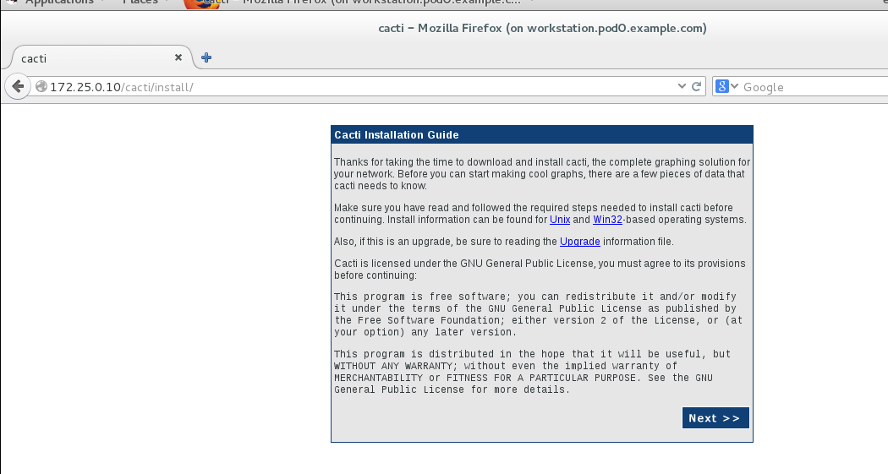

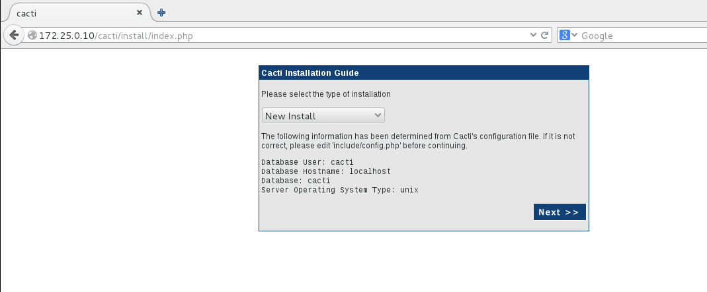

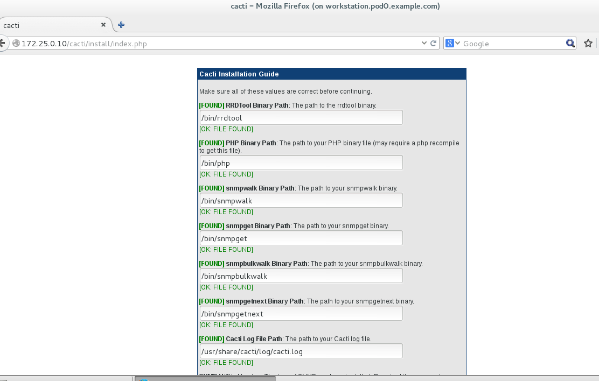

**初始用户名为admin，密码也为admin**

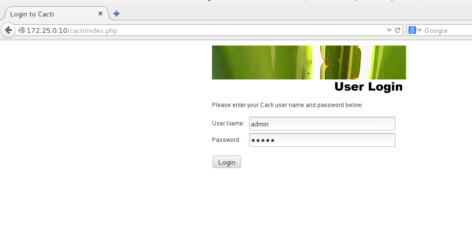

## 配置cacti监控本地服务器

cacti在监控过程当中，是采取snmp协议来获取数据，即本地需要支持snmp协议。

```shell
[root@servera cacti]# rpm -q net-snmp net-snmp-utils
net-snmp-5.7.2-20.el7.x86_64
net-snmp-utils-5.7.2-20.el7.x86_64
```

修改snmp主配置文件如下

```shell
[root@servera cacti]# vim /etc/snmp/snmpd.conf 

com2sec notConfigUser  default       public

####
# Second, map the security name into a group name:

#       groupName      securityModel securityName
group   notConfigGroup v1           notConfigUser
group   notConfigGroup v2c          notConfigUser
view    systemview    included   .1
[root@servera cacti]# systemctl restart snmpd
```

点击左边device，选择localhost，看到如下界面，在snmp options这里选择snmp version2：

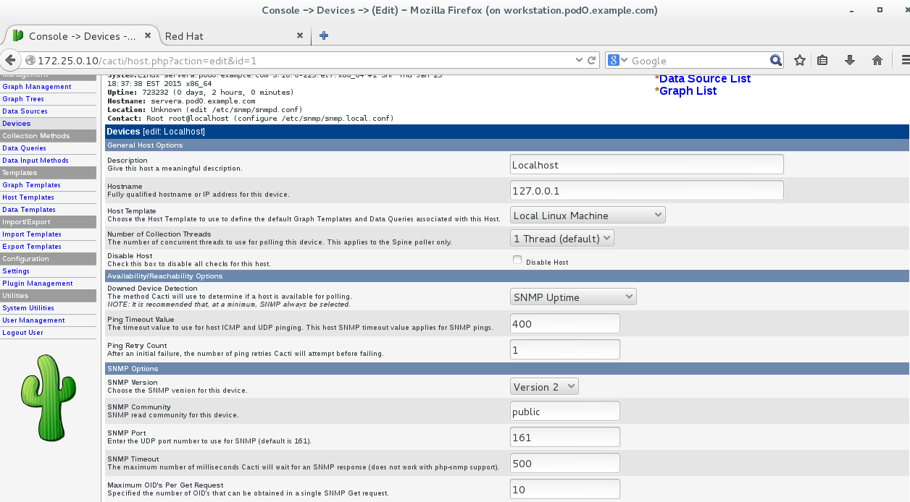

等五到十分钟，点击上方graphs，查看监控图形：

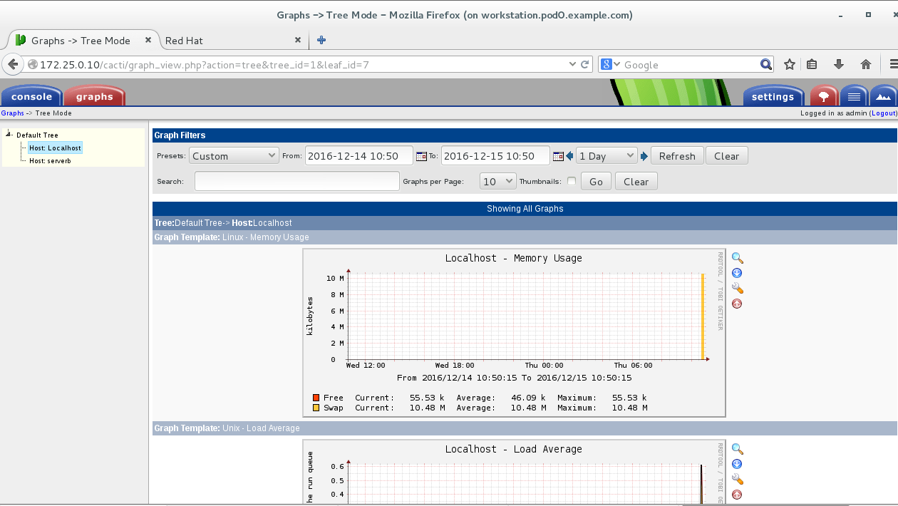


## 配置cacti监控远程服务器

环境：servera作为cacti服务器，serverb为被监控节点

在受监控节点上我们安装snmp相关软件

```shell
[root@serverb ~]# getenforce
Enforcing
[root@serverb ~]# setenforce 0
[root@serverb ~]# yum -y install net-snmp net-snmp-utils

[root@serverb ~]# vim /etc/snmp/snmpd.conf 

com2sec notConfigUser  default       public

####
# Second, map the security name into a group name:

#       groupName      securityModel securityName
group   notConfigGroup v1           notConfigUser
group   notConfigGroup v2c          notConfigUser
view    systemview    included   .1
[root@serverb ~]# systemctl restart snmpd
```

我们需要在 cacti 上设置新设备。首先使用浏览器登录 Cacti，然后在左侧“Management” 部分里点选“ Devices” ,然后在右上角点选“ Add”，填入ip地址等相关信息。

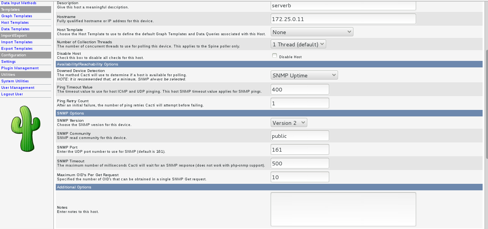

接下来，选择监控项，选择完成后点击save：

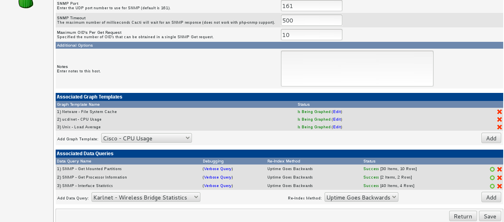

接下来：点击右上角“Create Graphs for this Host”，将所有需要出图的数据项打钩

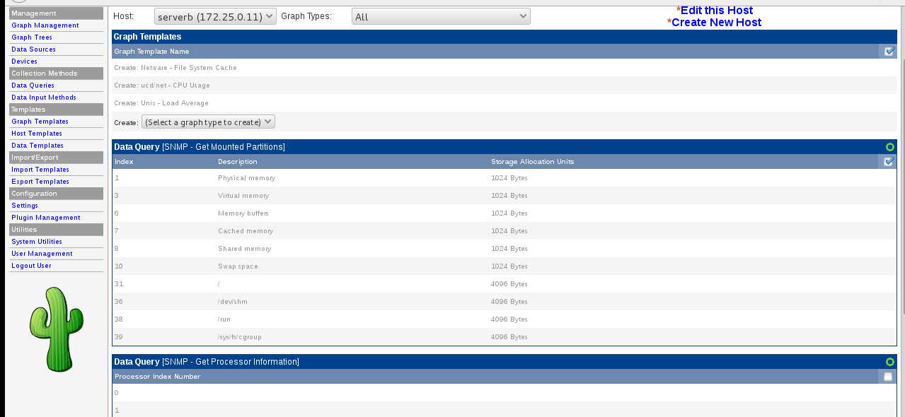接下来将创建的图形添加到 Cacti 的“ graphs” 标签中去。点击左栏“ Management” 里的” Graph Tree” 。然后点击中间位置的“ Default Tree” 。在“ Tree Iterms” 位置点击“ Add” ，并且在“tree item type”里选择“host”，如下图所示:

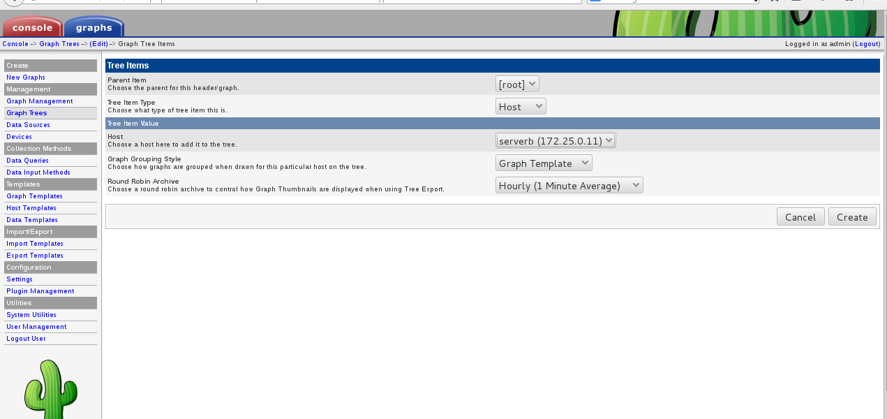

点击“ Create” ,等 5 分钟左右就可以看到“ graphs” 标签里有图像生成了。

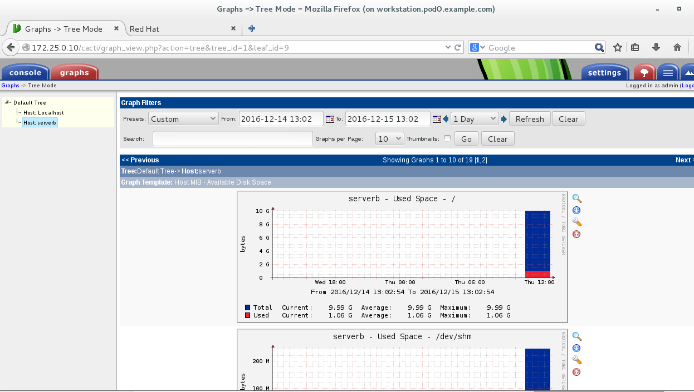

