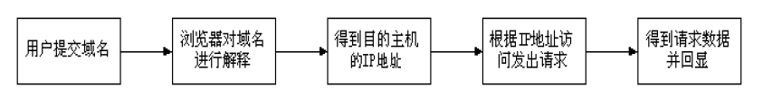
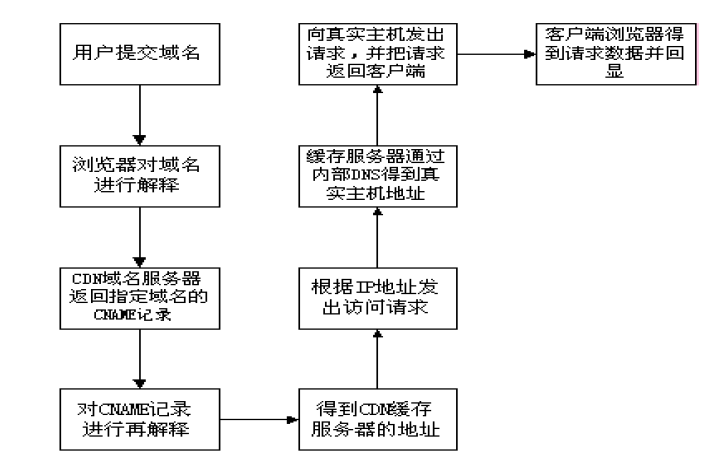

# CDN#

[TOC]

---

## 1.什么是cdn?##

随着互联网的高速发展，用户在使用网络的时，对于页面浏览的速度和效果越发的重视。一般而言，让一个用户等待的时间太过漫长，可能会导致实际访问我们站点的用户数量急剧降低，这是任何一家企业公司都不希望看到的事情。

特别是当用户与网站之间的链路被突发的大流量数据拥塞时，对于异地互联网用户急速增加的地区来说，访问质量不良更是一个急待解决的问题。如何才能让各地的用户都能够进行高质量的访问，并尽量减少由此而产生的费用和网站管理压力呢？内容发布网络（ContentDelivery Network，CDN）正是应此要求而设计。

CDN的全称是内容分发网络（Content Delivery Network),其设计目的是通过在现有的Internet中增加一层新的网络架构，将网站的内容发布到最接近用户的网络“边缘”，使用户可以就近取得所需的内容，提高用户访问网站的响应速度。 CDN有别于镜像，因为它比镜像更智能，或者可以做这样一个比喻：CDN=更智能的镜像+缓存+流量导流。因而，CDN可以明显提高Internet网络中信息流动的效率。从技术上全面解决由于网络带宽小、用户访问量大、网点分布不均等问题，提高用户访问网站的响应速度。

## 2.cdn的分类##

CDN的实现分为三类：镜像、高速缓存、专线。
镜像站点，是最常见的，它让内容直接发布，适用于静态和准动态的数据同步。但是购买和维护新服务器的费用较高，还必须在各个地区设置镜像服务器，配备专业技术人员进行管理与维护。对于大型网站来说，更新所用的带宽成本也大大提高了。

高速缓存， 成本较低，适用于静态内容。Internet的统计表明，超过80%的用户经常访问的是20%的网站的内容，在这个规律下，缓存服务器可以处理大部分客户 的静态请求，而原始的服务器只需处理约20%左右的非缓存请求和动态请求，于是大大加快了客户请求的响应时间，并降低了原始服务器的负载。

专线，让用户直接访问数据源，可以实现数据的动态同步。

## 3.CDN的结构

CDN网络架构主要由两大部分，分为中心和边缘两部分，中心指CDN网管中心和DNS重定向解析中心，负责全局负载均衡，设备系统安装在管理中心机房，边缘主要指异地节点，CDN分发的载体，主要由Cache Server和负载均衡器等组成。

狭义地讲，内容分发布网络(CDN)是一种新型的网络构建方式，它是为能在传统的IP网发布宽带丰富媒体而特别优化的网络覆盖层；而从广义的角度，CDN代表了一种基于质量与秩序的网络服务模式。简单地说，内容发布网(CDN)是一个经策略性部署的整体，包括分布式存储、负载均衡、网络请求的重定向和内容管理４个要件，而内容管理和全局
的网络流量管理(Traffic Management)是CDN的核心所在。通过用户就近性和服务器负载判断，CDN确保内容以一种极为高效的方式为用户的请求提供服务。总的来说，内容服务基于缓存服务器，也称作代理缓存(Surrogate)，它位于网络的边缘，距用户仅有"一跳"(Single Hop)之遥。同时代理缓存是内容提供商源服务器（通常位于CDN服务提供商的
数据中心）的一个透明镜像。这样的架构使得CDN服务提供商能够代表他们客户，即内容供应商，向最终用户提供尽可能好的体验，而这些用户是不能容忍请求响应时间有任何延迟的。据统计采用CDN技术，能处理整个网站页面的70%～95％的内容访问量，减轻服务器的压力，提升了网站的性能和可扩展性。
当用户访问加入CDN服务的网站时， 域名解析请求将最终交给全局负载均衡DNS进行处理。全局负载均衡DNS通过一组预先定义好的策略，将当时最接近用户的节点地址提供给用户，使用户能够得到快速的服务。同时，它还与分布在世界各地的所有CDN节点保持通信，搜集各节点的通信状态，确保不将用户的请求分配到不可用的CDN节点上。从技术实现上看CDN实际上是通过DNS做全局负载均衡的。

对于普通的Internet用户来讲，每个CDN节点就相当于一个放置在它周围的WEB。通过全局负载均衡DNS的控制，用户的请求被透明地指向离他最近的节点，节点中CDN服务器会像网站的原始服务器一样，响应用户的请求。由于它离用户更近，因而响应时间必然更快。

每个CDN节点至少由两部分组成：负载均衡设备和高速缓存服务器负载均衡设备负责每个节点中各个Cache的负载均衡，保证节点的工作效率；同时，负载均衡设备还负责收集节点与周围环境的信息，保持与全局负载DNS的通信，实现整个系统的负载均衡。

高速缓存服务器（Cache）负责存储客户网站的大量信息，就像一个靠近用户的网络服务器一样响应本地用户的访问请求。

CDN的管理系统是整个系统能够正常运转的保证。它不仅能对系统中的各个子系统和设备进行实时监控，对各种故障产生相应的告警，还可以实时监测到系统中总的流量和各节点的流量，并保存在系统的数据库中，使网管人员能够方便地进行进一步分析。通过完善的网管系统，用户可以对系统配置进行修改。

理论上，最简单的CDN网络有一个负责全局负载均衡的DNS和各节点一台CacheServer，即可运行。DNS支持根据用户源IP地址解析不同的IP，实现就近访问。为了保证高可用性等，需要监视各节点的流量、健康状况等。一个节点的单台Cache Server承载数量不够时，才需要多台Cache Server，多台Cache Server同时工作，才需要负载均衡器，使Cache Server群协同工作。

与目前现有的内容发布模式相比较，CDN强调了网络在内容发布中的重要性。通过引入主动的内容管理层的和全局负载均衡，CDN从根本上区别于传统的内容发布模式。在传统的内容发布模式中，内容的发布由内容提供商的应用服务器完成，而网络只表现为一个透明的数据传输通道，这种透明性表现在网络的质量保证仅仅停留在数据包的层面，而不能根据内容对象的不同区分服务质量。此外由于IP网的"尽力而为"的特性使得其质量证是依靠在用户和应用服务器之间端到端地提供充分的、远大于实际所需的带宽通量来实现的。在这样的内容发布模式下，不仅大量宝贵的骨干带宽被占用，同时内容提供商的应用服务器的负载也变得非常重，而且不可预计。

当发生一些热点事件和出现浪涌流量时，会产生局部热点效应，从而使应用服务器过载。这种基于中心的应用服务器的内容发布模式的另外一个缺陷在于个性化服务的缺失和对宽带服务价值链的扭曲。

由上图可见，用户访问未使用CDN缓冲网站的过程为:

1)、用户向浏览器提供要访问的域名；

2)、浏览器调用域名解析函数库对域名进行解析，以得到此域名对应的IP地址；

3)、浏览器使用所得到的IP地址，域名的服务主机发出数据访问请求；

4)、浏览器根据域名主机返回的数据显示网页的内容。

通过上图，我们可以了解到，使用了CDN缓存后网站的访问过程变为：
1)、用户向浏览器提供要访问的域名；

2)、浏览器调用域名解析库对域名进行解析，由于CDN对域名解析过程进行了调整，所以解析函数库一般得到的是该域名对应的CNAME记录，为了得到实际IP地址，浏览器需要再次对获得的CNAME域名进行解析以得到实际的IP地址；在此过程中，使用的全局负载均衡DNS解析，如根据地理位置信息解析对应的IP地址，使得用户能就近访问。

3)、此次解析得到CDN缓存服务器的IP地址，浏览器在得到实际的IP地址以后，向缓存服务器发出访问请求；

4)、缓存服务器根据浏览器提供的要访问的域名，通过Cache Server内部专用DNS解析得到此域名的实际IP地址，再由缓存服务器向此实际IP地址提交访问请求；

5)、缓存服务器从实际IP地址得得到内容以后，一方面在本地进行保存，以备以后使用，二方面把获取的数据返回给客户端，完成数据服务过程；

6)、客户端得到由缓存服务器返回的数据以后显示出来并完成整个浏览的数据请求过程。

通过以上的分析我们可以得到，为了实现既要对普通用户透明(即加入缓存以后用户客户端无需进行任何设置，直接使用被加速原有的域名即可访问)，又要在为指定的网站提供加速服务的同时降低对内容提供商的影响，只要修改整个访问过程中的域名解析部分，以实现透明的加速服务，下面是CDN网络实现的具体操作过程。

1)、作为内容提供商，只需要把域名解释权交给CDN运营商，其他方面不需要进行任何的修改；操作时，ICP修改自己域名的解析记录，一般用cname方式指向CDN网络Cache服务器的地址。

2)、作为CDN运营商，首先需要为ICP的域名提供公开的解析，为了实现sortlist，一般是把内容提供商的域名解释结果指向一个CNAME记录；

3)、当需要进行sorlist时，CDN运营商可以利用DNS对CNAME指向的域名解析过程进行特殊处理，使DNS服务器在接收到客户端请求时可以根据客户端的IP地址，返回相同域名的不同IP地址；

4)、由于从cname获得的IP地址，并且带有hostname信息，请求到达Cache Server之后，Cache Server必须知道源服务器的IP地址，所以在CDN运营商内部维护一个内部DNS服务器，用于解释用户所访问的域名的真实IP地址；

5)、在维护内部DNS服务器时，还需要维护一台授权服务器，控制哪些域名可以进行缓存，而哪些又不进行缓存，以免发生开放代理的情况。

