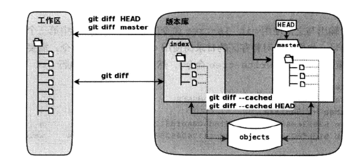
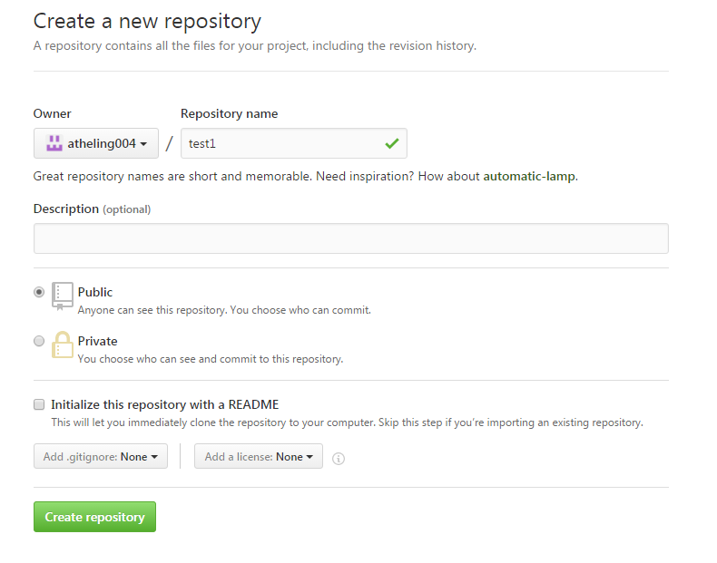
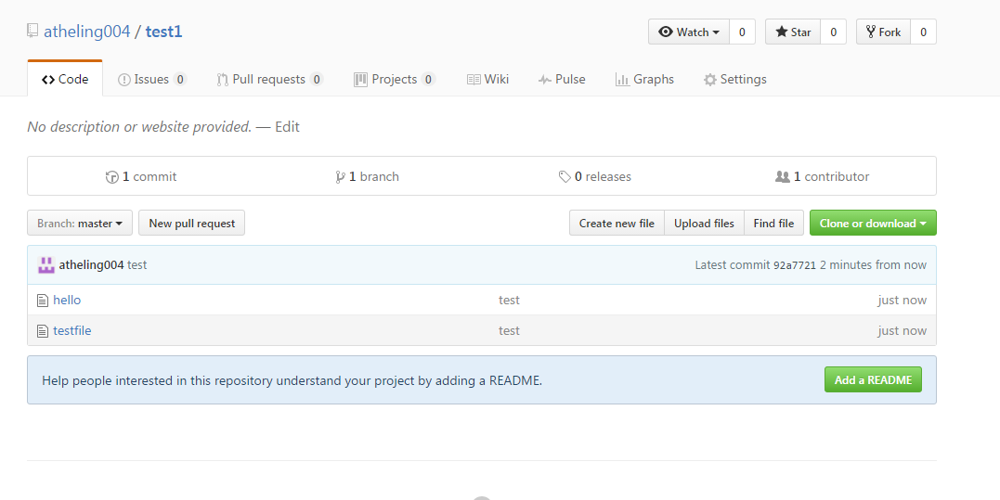
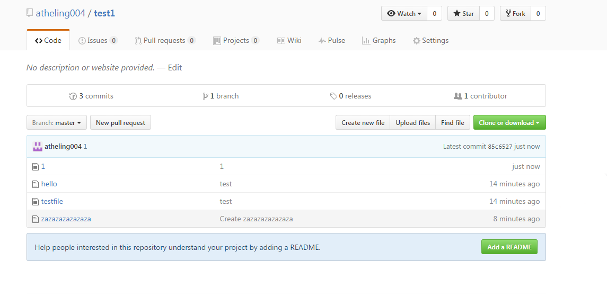

# git版本控制#

[TOC]

## 版本控制的历史及作用

### 版本控制的作用

对于IT这个行业来说，经常会遇到一个问题：代码分散的拷贝在各个分区之中，不知道哪个代码文件是最新的，哪个代码文件是最优的。失败的复制、替换经常会导致原来尚能运行的代码遭到破坏。于是，针对以上的问题就产生了一种解决方案，这种方案我们成为版本控制。版本控制系统是能够随着时间的推进记录一系列文件的变化以便于你以后想要的退回到某个版本的系统。

### 版本控制的历史

#### CVS
最早期的版本控制工具称为CVS，于1985年由荷兰阿姆斯特丹VU大学的Dick Grune教授完成开发，奠定了后续版本控制软件的模型基础。CVS采用C/S模型，版本库位于服务端，实际上存储的文件可以理解为一个RCS容器。每一个RCS文件以'.v‘作为后缀，保存该文件的每一次更改历史，使得其存储十分有效。然而CVS也存在如下缺点：1.效率不高，服务端文件越多，处理速度越慢。2.合并困难重重，经常会遇到严重冲突。3.不能直接对文件和目录的重命名进行版本控制，会破坏数据。

#### SVN
SVN全名为subversion，由collabNet公司于2000年开发，目的是为了弥补CVS的不足，创建一个性能更加强大的版本控制系统来取代CVS。到了2001年的时候，SVN已经可以用于市场环境。SVN拥有以下几个特征：1.轻量级拷贝。2.以授权文件的方式来实现版本库的授权。2.在工作区的隐藏目录下会保存一份冗余的原始拷贝。然而，SVB比起CVS在本质上并没有突破。到2009年年底，SVN被交由APACHE社区管理，至此svn成为了apache的一个子项目。

#### GIT
GIT由linux之父linus于2005年开发，在结构上比起SVN和CVS有很大的提升。可以说GIT是世界上目前最优秀的版本控制系统之一。GIT的每个功能都作为一条独立的命令，导致git庞大的命令集，但这并不妨碍各大程序人员对于GIT的喜爱，原因就在于它一个分布式的版本控制系统。此外：GIT虽然是基于linux操作系统开发的，但目前已经可以跨平台运行在多种操作系统之上，包括linux，MAC OS X，Windows等。

## 版本控制系统的分类

版本控制主要分为三大类：本地版本控制系统，集中式版本控制系统和分布式版本控制系统。

### 本地版本控制
将文件的各个版本以一定的数据格式存储在本地的磁盘，这种方式在一定的程度上解决了手动复制黏贴的问题，但无法解决多人协作的问题。

### 集中式版本控制
比起本地版本控制多了一个中央服务器，各个版本的数据存储在中央服务器，管理员可以控制开发人员的权限，而开发人员也可以从中央服务器拉取数据。集中式版本控制解决了团队协作问题，但缺点是所有数据存储在中央服务器，服务器一旦宕机，会造成不可估量的损失。SVN和CVS都是集中式版本控制。

###分布式版本控制
系统保存的不是文件变化的差两，而是文件的快照。分布式版本控制系统是分布式的，当你从中央服务器拷贝下来代码时，你拷贝的是一个完整的版本库，包括历史纪录，提交记录等，即使某一台机器宕机，也能够找到文件的完整备份。GIT就是分布式版本控制。

## GIT的安装

基本上所有Linux发行版都自带Git的软件安装包，RedHat Enterprise Linux系统也不例外，我们可以直接通过yum的方式去安装git，目前我们采用的git版本是1.8.3.1版本。

```shell
[root@servera ~]# yum -y install git
[root@servera ~]# git --version
git version 1.8.3.1
```

可以通过以下方式完成命令补全：

```shell
[root@servera ~]# cp /usr/share/doc/git-1.8.3.1/contrib/completion/git-completion.bash /etc/bash_completion.d
[root@servera ~]# source /etc/bash_completion.d/git-completion.bash 
```

## GIT环境初始化

### 设置全局参数

设置下git的配置变量，告诉git当前用户的姓名和邮件地址，配置的用户名和邮件地址将会在版本库提交时候用到。

```shell
[root@servera .git]# git config --global user.name "carol"
[root@servera .git]# git config --global user.email lijiayi@uplooking.com
```

### 创建工作目录并初始化

```shell
[root@servera ~]# cd /root
[root@servera ~]# ls
anaconda-ks.cfg
[root@servera ~]# mkdir workspace
[root@servera ~]# cd workspace/
[root@servera workspace]# git init
Initialized empty Git repository in /root/workspace/.git/
```

这里/root/workspace目录就是工作区。git ini为初始化命令，在执行完成之后会在该目录下生成一个.git的版本库。

## 提交文件更新

先在工作区生成一个文件

```shell
[root@servera workspace]# echo hello > welcome.txt 
[root@servera workspace]# ls
welcome.txt
[root@servera workspace]# cat welcome.txt 
hello
```

为了将这个新建立的文件添加到版本库，需要执行以下指令

```shell
[root@servera workspace]# git add welcome.txt
[root@servera workspace]# git commit -m "first"
[master c5171b5] first
 1 file changed, 1 insertion(+)
 create mode 100644 welcome.txt
```

## GIT基本概念##

在这里有三个概念。1.工作区   2.版本库   3.暂存区




实际上在上一个实践之中，我们经历了两次提交，主要和这个设计模式有关。

当工作区执行git add命令时，咱群出的目录树将被更新，同时工作区的文件内容会被写入到对象库中的一个新的对象中，而该对象的ID被记录在暂存区的文件索引中。

当执行git commit操作时候，暂存区的目录树会写到版本库中，最新指向的目录树就是提交时暂存区的目录树。

实际上，暂存区局像是一个虚拟的工作区，在这个虚拟工作区的目录树中，文件.git/index实际记录了文件名和文件的状态信息（时间戳、文件长度等等），文件的内容并没有实际存储其中，而是保存在了git对象库(.git/objects)中，文件索引建立起了对象库和实体对象之间的对应。图显示了工作区、暂存区和版本库之间的关系。

## GIT基本命令


### git diff

用来显示工作区和暂存区文件的差异

```shell
[root@servera workspace]# echo test  >> welcome.txt 
[root@servera workspace]# ls
welcome.txt
[root@servera workspace]# cat welcome.txt 
hello
test
[root@servera workspace]# ls
welcome.txt
[root@servera workspace]# git diff welcome.txt
diff --git a/welcome.txt b/welcome.txt
index ce01362..b2b9cc9 100644
--- a/welcome.txt
+++ b/welcome.txt
@@ -1 +1,2 @@
 hello
+test
```

### git status

用来查看改过的内容

```shell
[root@servera workspace]# git status
# On branch master
# Changes not staged for commit:
#   (use "git add <file>..." to update what will be committed)
#   (use "git checkout -- <file>..." to discard changes in working directory)
#
#	modified:   welcome.txt
#
no changes added to commit (use "git add" and/or "git commit -a")
[root@servera workspace]# 
```

### git log

 用来查看历史提交的日志

```shell
[root@servera workspace]# git log
commit a7a778652b1457b838beeca66e4334c35d97e826
Author: carol <lijiayi@uplooking.com>
Date:   Sun Nov 20 07:01:51 2016 -0500

    first
```

### git reset 

用来做回滚

恢复工作区的文件到上一个提交的版本：

```shell
[root@servera workspace]# echo test >> welcome.txt 
[root@servera workspace]# cat welcome.txt 
hello
test
[root@servera workspace]# git add welcome.txt
[root@servera workspace]# git commit -m "second"  # 以上的操作为再添加一个版本
[master 0d10fd9] second
 1 file changed, 1 insertion(+)
[root@servera workspace]# cat welcome.txt 
hello
test
[root@servera workspace]# git reset --hard HEAD^   # ^代表上一个版本，^^代表上上一个版本，当然往上100个版本写100个^比较容易数不过来，所以可以写成HEAD~100
HEAD is now at a7a7786 first
[root@servera workspace]# ls
welcome.txt
[root@servera workspace]# cat welcome.txt 
hello
```

恢复工作区到指定版本：

```shell
[root@servera workspace]# echo testok >> welcome.txt 
[root@servera workspace]# echo testok >> welcome.txt 
[root@servera workspace]# git add welcome.txt
[root@servera workspace]# git commit -m "third"  # 这里再添加一个版本
[master 3c3b1d9] third
 1 file changed, 2 insertions(+)
[root@servera workspace]# git log --graph --oneline  # 可以通过该参数查看到每个操作对应的ID
* 3c3b1d9 third
* a7a7786 first
[root@servera workspace]# git reset --hard a7a7786
HEAD is now at a7a7786 first
[root@servera workspace]# ls
welcome.txt
[root@servera workspace]# cat welcome.txt 
hello
```

### git  reflog

用来查看历史记录，可以结合reset完成恢复数据的操作

```shell
[root@servera workspace]# git reflog
a7a7786 HEAD@{0}: reset: moving to a7a7786
3c3b1d9 HEAD@{1}: commit: third
a7a7786 HEAD@{2}: reset: moving to HEAD^
0d10fd9 HEAD@{3}: commit: second
a7a7786 HEAD@{4}: reset: moving to HEAD^
4d65b14 HEAD@{5}: commit: second
a7a7786 HEAD@{6}: commit (initial): first
[root@servera workspace]# cat welcome.txt 
hello
[root@servera workspace]# git reset --hard HEAD@{1}
HEAD is now at 3c3b1d9 third
[root@servera workspace]# ls
welcome.txt
[root@servera workspace]# cat welcome.txt 
hello
testok
testok
```

### git checkout

 可以丢弃工作区的修改

```shell
[root@servera workspace]# echo carol >> welcome.txt 
[root@servera workspace]# git add welcome.txt
[root@servera workspace]# cat welcome.txt 
hello
testok
testok
carol #重新提交一个修改后的文件至工作区
[root@servera workspace]# git reset HEAD welcome.txt #如果已经提交给缓存区，则必须要做这步
Unstaged changes after reset:
M	welcome.txt
[root@servera workspace]# git checkout -- welcome.txt
[root@servera workspace]# cat welcome.txt 
hello
testok
testok
```

### git rm 

从版本库中删除文件

```shell
[root@servera workspace]# git rm welcome.txt
rm 'welcome.txt'
[root@servera workspace]# git commit -m "delete welcome"
[master ba79342] delete welcome
 1 file changed, 3 deletions(-)
 delete mode 100644 welcome.txt
[root@servera workspace]# ls
[root@servera workspace]# ls

```

## GIT分支控制

通常情况下，一套分支只用来存放一套代码，为了保证每套代码的独立性，我们会建立多个分支来分开管理。
| 命令                 | 说明         |
| :----------------- | :--------- |
| git branch         | 查看分支       |
| git branch name    | 创建分支       |
| git checkout name  | 切换分支       |
| git merge name     | 合并某分支到当前分支 |
| git branch -d name | 删除分支       |


```shell
[root@servera workspace]# git branch  # 查看fenzhi 
* master
[root@servera workspace]# git branch a #创建名为a的分支
[root@servera workspace]# git branch
  a
* master   # * 代表当前分支
[root@servera workspace]# git checkout a  # 切换分支
Switched to branch 'a'
[root@servera workspace]# git branch 
* a
  master
[root@servera workspace]# echo test > testfile
[root@servera workspace]# git add testfile
[root@servera workspace]# git commit -m 'a'　　# 重新提交个文件
[a 92abcd8] a
 1 file changed, 1 insertion(+)
 create mode 100644 testfile
[root@servera workspace]# ls
testfile
[root@servera workspace]# git status  # 可以看到已经提交给了a这个分支
# On branch a
nothing to commit, working directory clean
[root@servera workspace]# cd .git/
[root@servera .git]# ls
branches        config       HEAD   index  logs     ORIG_HEAD
COMMIT_EDITMSG  description  hooks  info   objects  refs
[root@servera .git]# cat HEAD 
ref: refs/heads/a   # 可以看到当前分支头部指向了a

[root@servera workspace]# git checkout master
Switched to branch 'master'
[root@servera workspace]# git merge a  # 合并分支，不建议这样做，可能会有冲突。
Updating ba79342..92abcd8
Fast-forward
 testfile | 1 +
 1 file changed, 1 insertion(+)
 create mode 100644 testfile
```

## GIT同步数据##

### git clone

git克隆的作用：备份，在分布式的集中化管理机制里，就可以通过克隆的方式，将远程的git版本库克隆至本地来进行修改。

```shell
[root@servera ~]# git clone /root/workspace/ /backup
Cloning into '/backup'...
done.
[root@servera ~]# cd /backup/
[root@servera backup]# ls
testfile
```

### git pull & git push

拉取和推送

```shell
推送：
[root@servera workspace]# git push /backup
warning: push.default is unset; its implicit value is changing in
Git 2.0 from 'matching' to 'simple'. To squelch this message
and maintain the current behavior after the default changes, use:

  git config --global push.default matching

To squelch this message and adopt the new behavior now, use:

  git config --global push.default simple

See 'git help config' and search for 'push.default' for further information.
(the 'simple' mode was introduced in Git 1.7.11. Use the similar mode
'current' instead of 'simple' if you sometimes use older versions of Git)

Counting objects: 4, done.
Delta compression using up to 2 threads.
Compressing objects: 100% (2/2), done.
Writing objects: 100% (3/3), 272 bytes | 0 bytes/s, done.
Total 3 (delta 0), reused 0 (delta 0)
remote: error: refusing to update checked out branch: refs/heads/master
remote: error: By default, updating the current branch in a non-bare repository
remote: error: is denied, because it will make the index and work tree inconsistent
remote: error: with what you pushed, and will require 'git reset --hard' to match
remote: error: the work tree to HEAD.
remote: error: 
remote: error: You can set 'receive.denyCurrentBranch' configuration variable t
remote: error: 'ignore' or 'warn' in the remote repository to allow pushing int
remote: error: its current branch; however, this is not recommended unless you
remote: error: arranged to update its work tree to match what you pushed in som
remote: error: other way.
remote: error: 
remote: error: To squelch this message and still keep the default behaviour, se
remote: error: 'receive.denyCurrentBranch' configuration variable to 'refuse'.
To /backup
 ! [remote rejected] master -> master (branch is currently checked out)
error: failed to push some refs to '/backup'
```

报错的原因：

默认更新非裸版本库的当前分支是不被允许的，因为这样会导致暂存区和工作区与你推送至版本库的新提交不一致。太古怪了。

```shell
拉取：
[root@servera workspace]# cd /backup
[root@servera backup]# ls
testfile
[root@servera backup]# git pull /root/workspace/
From /root/workspace
 * branch            HEAD       -> FETCH_HEAD
Updating 92abcd8..3191ffc
Fast-forward
 hello | 1 +
 1 file changed, 1 insertion(+)
 create mode 100644 hello
[root@servera backup]# ls
hello  testfile

```

## GitHub##

GitHub 是一个面向开源及私有软件项目的托管平台，因为只支持 Git 作为唯一的版本库格式进行托管，故名 GitHub

网站地址：https://github.com/

1）将本地版本库上传至github保存

1.先打开github，自行注册

2.在github上通过图形化界面配置一个版本库



3.将本地的版本库通过push的方式上传至远程

```shell
[root@servera backup]# git remote add carol https://github.com/atheling004/test1.git  #添加执行用户
[root@servera backup]# git push -u carol master
Username for 'https://github.com': atheling004
Password for 'https://atheling004@github.com':   # 输入用户名和密码
Counting objects: 4, done.
Delta compression using up to 2 threads.
Compressing objects: 100% (2/2), done.
Writing objects: 100% (4/4), 248 bytes | 0 bytes/s, done.
Total 4 (delta 0), reused 0 (delta 0)
To https://github.com/atheling004/test1.git
 * [new branch]      master -> master
Branch master set up to track remote branch master from carol.

```

4.查看结果

2）将远程github版本库中保存的文件存放至本地

1.现在github上通过create new file选项自行创建一个新文件，这里创建的文件名称为zazazazazazaza

2.执行以下操作

```shell
[root@servera backup]# git pull https://github.com/atheling004/test1.git
remote: Counting objects: 3, done.
remote: Compressing objects: 100% (2/2), done.
remote: Total 3 (delta 0), reused 0 (delta 0), pack-reused 0
Unpacking objects: 100% (3/3), done.
From https://github.com/atheling004/test1
 * branch            HEAD       -> FETCH_HEAD
Updating 92a7721..33a62ba
Fast-forward
 zazazazazazaza | 1 +
 1 file changed, 1 insertion(+)
 create mode 100644 zazazazazazaza
[root@foundation0 workspace]# ls
hello  testfile  zazazazazazaza


```

3）github的版本克隆（即远程版本克隆）

```shell
[root@foundation0 ~]# mkdir /test
[root@foundation0 ~]# cd /test/
[root@foundation0 test]# ls
[root@foundation0 test]# git clone https://github.com/atheling004/test1.git
Cloning into 'test1'...
remote: Counting objects: 7, done.
remote: Compressing objects: 100% (4/4), done.
remote: Total 7 (delta 1), reused 3 (delta 0), pack-reused 0
Unpacking objects: 100% (7/7), done.
[root@foundation0 test]# ls
test1
[root@foundation0 test]# cd test1/
[root@foundation0 test1]# ls
hello  testfile  zazazazazazaza
[root@foundation0 test1]# 

```

4）在本地版本库发生变更后上传

```shell
[root@foundation0 test1]# cat 1
testfile
[root@foundation0 test1]# git add 1
[root@foundation0 test1]# git commit -m 1
[root@foundation0 test1]# git push https://github.com/atheling004/test1.git
warning: push.default is unset; its implicit value is changing in
Git 2.0 from 'matching' to 'simple'. To squelch this message
and maintain the current behavior after the default changes, use:

  git config --global push.default matching

To squelch this message and adopt the new behavior now, use:

  git config --global push.default simple

See 'git help config' and search for 'push.default' for further information.
(the 'simple' mode was introduced in Git 1.7.11. Use the similar mode
'current' instead of 'simple' if you sometimes use older versions of Git)

Username for 'https://github.com': atheling004
Password for 'https://atheling004@github.com': 
Counting objects: 4, done.
Delta compression using up to 2 threads.
Compressing objects: 100% (2/2), done.
Writing objects: 100% (3/3), 252 bytes | 0 bytes/s, done.
Total 3 (delta 1), reused 0 (delta 0)
remote: Resolving deltas: 100% (1/1), completed with 1 local objects.
To https://github.com/atheling004/test1.git
   33a62ba..85c6527  master -> master

```

结果如下

