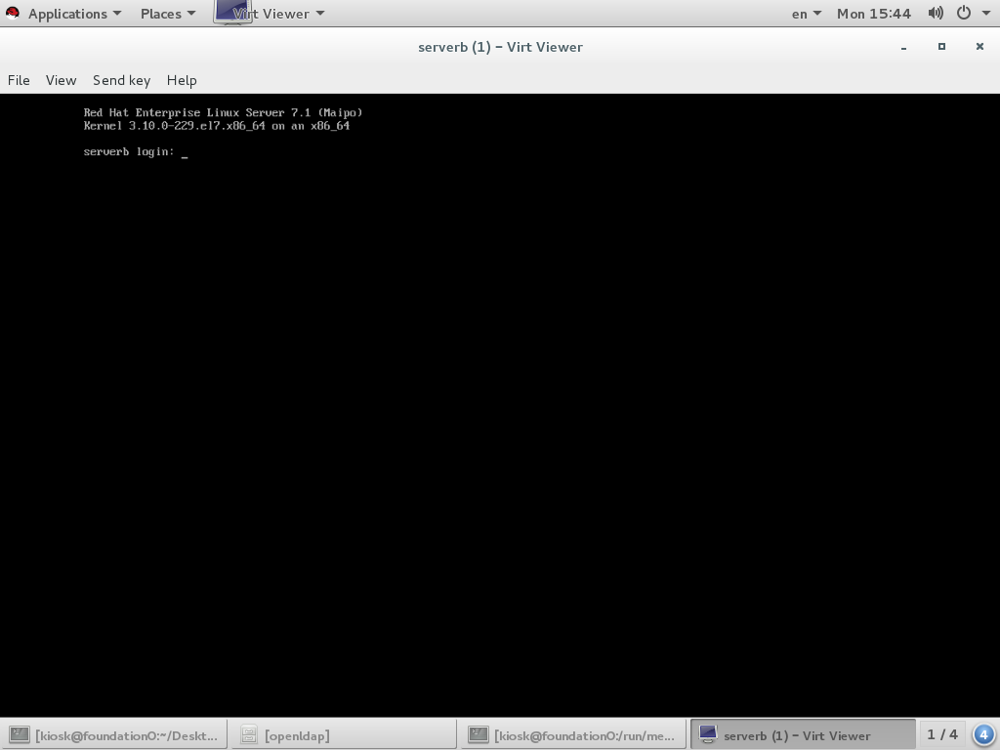
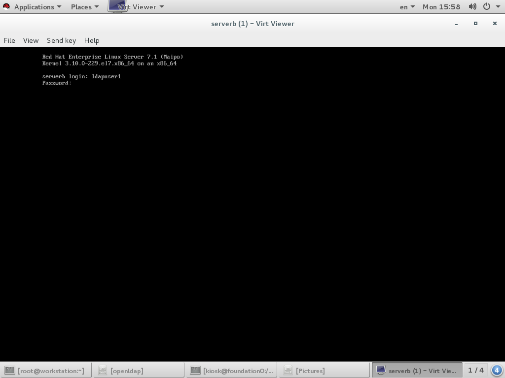
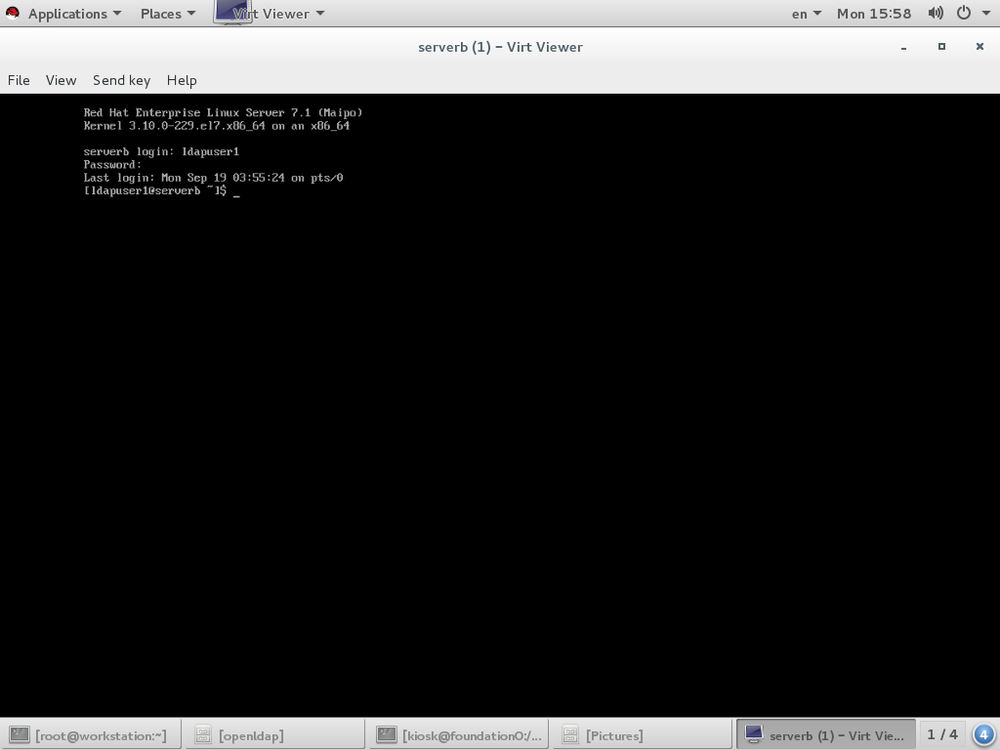
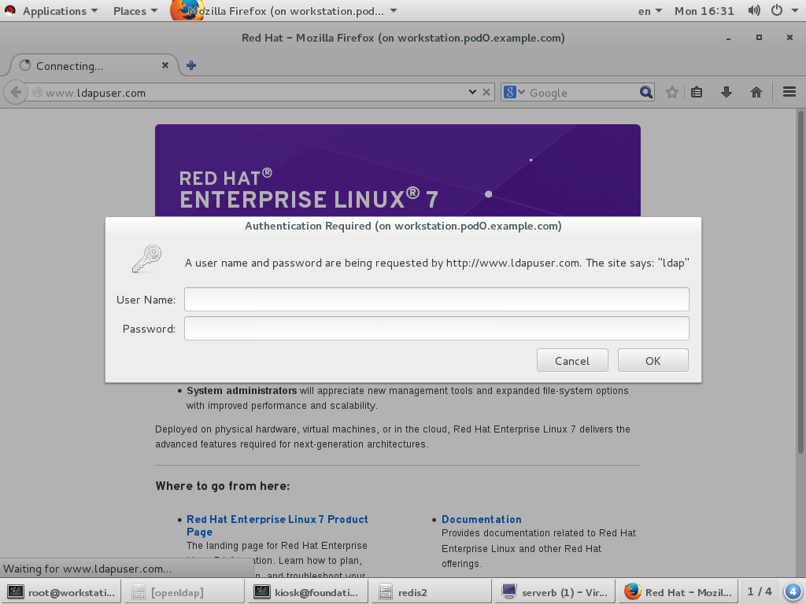
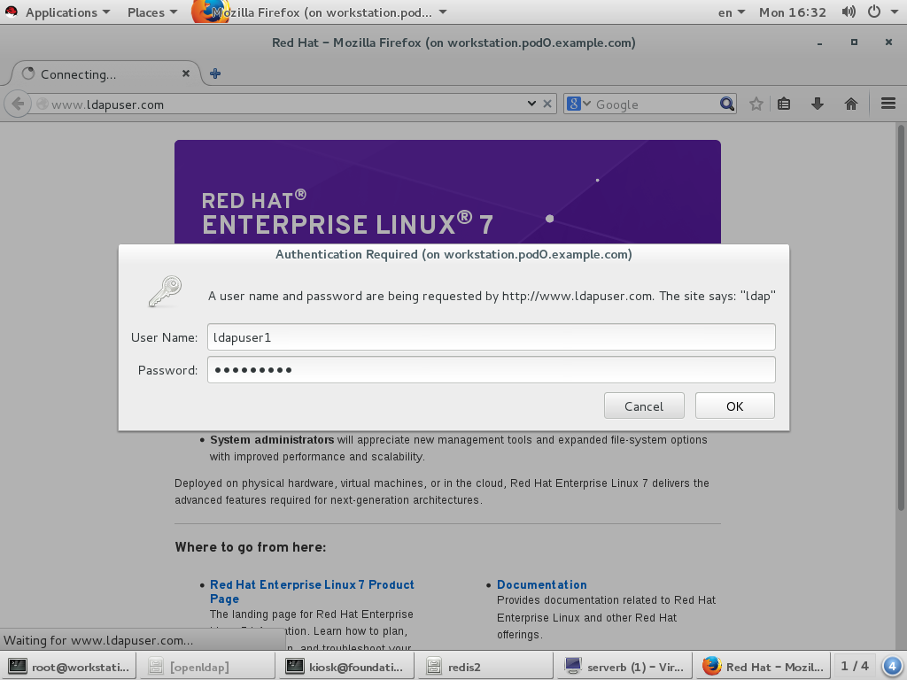
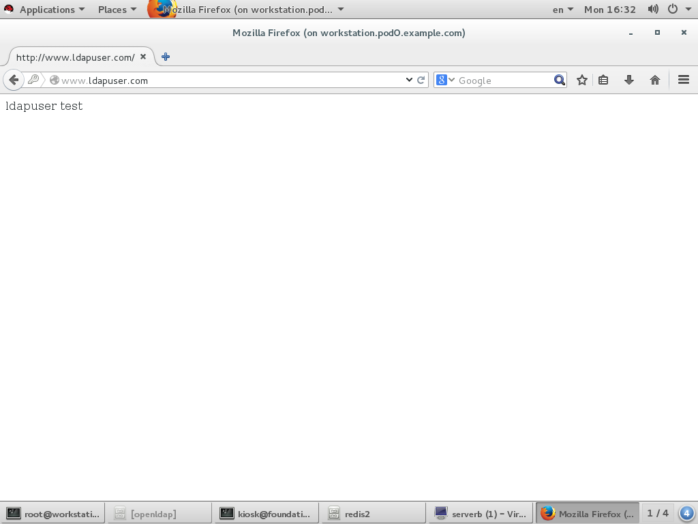

# openldap

[TOC]


## openldap简介

&#160; &#160; &#160; &#160;LDAP的全称Lightweight Directory Access Protocol。它是基于X.500标准的， 但是简单多了并且可以根据需要定制。与X.500不同，LDAP支持TCP/IP，这对访Internet是必须的。LDAP可以让运行在几乎所有计算机平台上的所有的应用程序 从LDAP目录中获取信息。提供了一个安全的集中化信息查询服务。LDAP目录中可以存储各种类型的数据：电子邮件地址、 邮件路由信息、人力资源数据、公用密匙、联系人列表，等等。作为系统集成中 的一个重要环节，可以简化员工在企业内部查询信息的步骤，甚至连主要的数据 源都可以放在任何地方。

&#160; &#160; &#160; &#160;LDAP对数据的读取做了很多优化，比如优化了数据类型，修改了锁机制，取消了 不必要的函数，取消了回滚机制等等，非常适用于读多写少的环境。如果你有一 些面向查询的服务，那LDAP无疑是一个不错的选择。
&#160; &#160; &#160; &#160;LDAP协议是跨平台的和标准的协议，得到了业界的广泛认可。产商都很愿意在产 品中加入对LDAP的支持，因为他们根本不用考虑另一端（客户端或服务端）是怎 么样的。

&#160; &#160;&#160; &#160;LDAP允许你根据需要使用ACI（一般都称为ACL或者访问控制列表）控制对数据读 和写的权限。ACI可以根据谁访问数据、访问什么数据、数据存在什么地方以及其 它对数据进行访问控制。这些都是由LDAP目录服务器完成，非常的安全。
在使用LDAP存储你的数据前，你应该先问以下几个问题

* 你的数据是不是需要在不同的平台上读取？
* 你的数据是不是很少发生更改，但是会被频繁的读取？
* 你的数据是否能存放于一个平面数据库中

&#160; &#160;&#160; &#160;如果都为是，那么恭喜，LDAP将是你最好的选择。

&#160; &#160;&#160; &#160;LDAP目录以树状的层次结构来存储数据。而不是用表格。正因为这样，我们在查 询时不能用SQL语句了。在这个树型结构上的每个数据节点，我们称之为“条目（Entry）” ，LDAP目录树的最顶部就是根，也就是所谓的"base DN"。为了好记， 我们常用公司的域名做base DN。比如本公司的域名是example.com，则我的base DN为 "dc=example, dc=com" 。在根目录下，要把数据从逻辑上区分开，大多数LDAP目录用OU从逻辑上把数据分开来。OU 表示“Organization Unit"，在X.500协议中 是用来表示公司内部的机构：销售部、财务部，等等。比如我要表示本公司销售 部的经理级人员，我们可以这样表示， "ou=manager,ou=sales,dc=example,dc=com"。 要表示本公司销售部的经理级人员flyer和sky。那么我可以这样写"uid=flyer,ou=manager, ou=sales,dc=example,dc=com"，"uid=sky,ou=manager, ou=sales,dc=example,dc=com"，可以看到这两个员工的条目有很多相同的字段，但最左端的uid是不一样的，以此来保证条目的唯一性，最左的描述又称为RDN。

&#160; &#160;&#160; &#160;在LDAP目录数据库中，所有的条目都必须定义objectClass这个属性。每个条目（ LDAP Entry）都要定义自己的Object Classes。Object Class定义了条目的属性 集，包括必有属性（requited attribute）和可选属性（option attribute）。

&#160; &#160;&#160; &#160;一个条目的属性是由它所继承的所有Object Classes的属性集合决定的，此外可 以包括LDAP中规定的“操作属性”（操作属性是一种独立于Object Class而存在 的属性，它可以赋给目录中的任意条目）。如果你想添加的属性不在Object Classes定义属性的范畴，也不是LDAP规定的操作属性，那么是不能直接绑定（在 LDAP中，给Entry赋予属性的过程称为绑定）到条目上的，你必须自定义一个含有 你需要的属性的Object Class，而后将此类型赋给条目。 Object Class是可以被 继承的，这使它看上去真的很像Java语言。继承类的对象实例也必须实现父类规 定的必有属性（requited attribute），同时拥有父类规定的可选属性（option attribute）。继承类可以扩展父类的必有属性和可选属性。

&#160; &#160;&#160; &#160;LDAP的另一个重要的组成部分就是Schema，Schema定义了LDAP目录所应遵循的结 构和规则，比如一个 objectclass会有哪些属性，这些属性又是什么结构等等。

> ldap 术语列表
> entry　条目：ldap内部的最基本的数据单元，ldap内部每个条目标识名称应该都是唯一的。


> dn：用于标识条目，由于entry标识应该唯一，所以每个dn应该是唯一的。其中顶层的起始DN称做base dn。dn标识过程中会用到的一些常见的属性字段如下：
>
> * cn : commonName 基本名称
> * sn：surname　姓氏
> * c：countryName　国家名称
> * o：organizationName　组织名称
> * ou：organizationalUnitName　组织单位名称　
> * l：localityName　市名
> * st：stateOrProvinceName　省或州名
> * street：streetAddress　住址


> 更多字段可参考RFC2256
> attribute　属性：用于描述条目的属性特征。比如有一个定义公司组织的条目，其属性可能包涵地址，传真等等。有一个定义用户人员的条目，其属性可能有帐号，密码，家目录等等。

## openldap基础配置与操作

### 安装openldap

相关安装包

| 包名               | 作用               |
| ---------------- | ---------------- |
| openldap         | 基础依赖包            |
| openldap-clients | 客户端常用命令包，查看修改所使用 |
| openldap-servers | 服务端主程序包          |
| compat-openldap  | ldap兼容库          |

安装命令

```shell
	yum install openldap openldap-clients openldap-servers
```
> 重要提示 ：请确保	ldap用户对　/var/lib/ldap 目录有读写权限


> ```shell
> chown　-R ldap.ldap /var/lib/ldap
> ```

&#160; &#160;&#160; &#160;

openldap server相关命令

| 命令         | 作用              |
| :--------- | :-------------- |
| slapacl    | 访问控制列表配置命令。     |
| slapadd    | 通过ldif文件添加条目的命令 |
| slapauth   | 认证授权相关命令        |
| slappasswd | 创建加密密码          |
| slaptest   | 检查配置文件命令        |

openldap client相关命令

| 命令         | 作用       |
| :--------- | :------- |
| ldapadd    | 添加条目命令   |
| ldapdelete | 删除条目命令   |
| ldapmodify | 修改条目命令   |
| ldappasswd | 设置用户密码命令 |
| ldapsearch | 查询条目命令   |

### 配置openldap

ldap配置文件与目录

| 配置文件                    | 作用        |
| :---------------------- | :-------- |
| /etc/openldap/ldap.conf | 客户端配置文件   |
| /etc/openldap/slapd.d/  | 服务端配置文件目录 |

> 提示：openldap不再使用/etc/openldap/slapd.conf配置文件，它通过/etc/openldap/slapd.d/目录来进行配置，如果你有一个slapd.conf配置文件，可以通过以下命令转换


> ```shell
> slaptest -f /etc/openldap/slapd.conf -F /etc/openldap/slapd.d/
> ```

####全局配置文件

> /etc/openldap/slapd.d/cn=config.ldif

主要参数

| 参数名称                  | 作用                        | 范例                                    |
| :-------------------- | :------------------------ | :------------------------------------ |
| olcAllows             | 定义启用功能特性，默认值为bind_v2      | olcAllows: bind\_v2                   |
| olcConnMaxPending     | 定义匿名会话的最大数量 ，默认值100       | olcConnMaxPending: 100                |
| olcConnMaxPendingAuth | 定义已认证会话的最大数量 ，默认值1000     | olcConnMaxPendingAuth: 1000           |
| olcDisallows          | 定义禁用功能特性                  | olcDisallows: bind_anon               |
| olcIdleTimeout        | 定义关闭空闲连接的等待时间             | olcIdleTimeout: 180                   |
| olcLogFile            | 定义日志文件                    | olcLogFile: /var/log/slapd.log        |
| olcReferral           | 定义一个Refer url地址，的服务器故障时使用 | olcReferral: ldap://root.openldap.org |
| olcWriteTimeout       | 定义写请求超时                   | olcWriteTimeout: 180                  |

####数据库配置文件

> /etc/openldap/slapd.d/cn=config/olcDatabase={1}bdb.ldif

| 参数名称        | 作用                    | 范例                                       |
| :---------- | :-------------------- | :--------------------------------------- |
| olcReadOnly | 数据库readonly模式，默认FALSE | olcReadOnly: TRUE                        |
| olcRootDN   | 定义管理员（无访问限制）          | olcRootDN: cn=root,dn=example,dn=com     |
| olcRootPW   | 定义管理员密码               | olcRootPW: {SSHA}WczWsyPEnMchFf1GRTweq2q7XJcvmSxD |
| olcSuffix   | 定义域名                  | olcSuffix: dc=example,dc=com             |

####建立安全连接

&#160; &#160;&#160; &#160;OpenLDAP的客户端和服务器可以使用Transport Layer Security（TLS）的框架，TLS是一个加密协议。
&#160; &#160;&#160; &#160;要使用TLS建立安全连接，必须在服务器与客户机上同时配置相关参数，服务器需要配置相关CA中心与自签名证书，客户端需要信任相关CA证书。

#####证书配置相关参数

服务端相关配置文件

> /etc/openldap/slapd.d/cn=config.ldif

| 参数名称                     | 作用           |
| :----------------------- | :----------- |
| olcTLSCACertificateFile  | 指定ＣＡ证书文件     |
| olcTLSCACertificatePath  | 指定ＣＡ文件目录     |
| olcTLSCertificateFile    | 指定server证书文件 |
| olcTLSCertificateKeyFile | 指定私钥文件       |

### 启动openldap

```shell
systemctl start slapd.service
```

### 系统用户转换迁移到openldap

安装编辑转换脚本

```shell
yum install migrationtools
vi /usr/share/migrationtools/migrate_common.ph
> # Default DNS domain
> $DEFAULT_MAIL_DOMAIN = "example.com";
> # Default base
> $DEFAULT_BASE = "dc=example,dc=com";
/usr/share/migrationtools/migrate_all_online.sh
```
## openldap认证系统登录用户

### 环境介绍

      总共使用3台虚拟机

| 主机                                       | 作用                                       |
| :--------------------------------------- | :--------------------------------------- |
| servera.pod0.example.com  (172.25.0.10/24) | 运行openldap服务，提供集中化认证与数据共享服务              |
| serverb.pod0.example.com (172.25.0.11/24) | 提供基本用户登录，ssh服务，ftp服务与http服务，所有的用户认证均通过servera来认证 |
| workstation.pod0.example.com  (172.25.0.9/24) | client测试端，通过ssh，ftp，http等方式访问serverb。    |

### 安装配置openldap

#### 安装opendap

```shell
[kiosk@foundation0 ~]$ rht-vmctl  start servera
[kiosk@foundation0 ~]$ ssh root@172.25.0.10
Last login: Sun Aug  9 17:52:00 2015
[root@servera ~]# iptables -F
[root@servera ~]# setenforce 0
[root@servera ~]# yum install openldap-clients migrationtools openldap-servers openldap -y
Loaded plugins: langpacks
rhel_dvd                                         | 4.1 kB     00:00     
(1/2): rhel_dvd/group_gz                           | 134 kB   00:00     
(2/2): rhel_dvd/primary_db                         | 3.4 MB   00:00     
Package openldap-2.4.39-6.el7.x86_64 already installed and latest version
Resolving Dependencies
--> Running transaction check
---> Package migrationtools.noarch 0:47-15.el7 will be installed
---> Package openldap-clients.x86_64 0:2.4.39-6.el7 will be installed
---> Package openldap-servers.x86_64 0:2.4.39-6.el7 will be installed
--> Processing Dependency: libltdl.so.7()(64bit) for package: openldap-servers-2.4.39-6.el7.x86_64
--> Running transaction check
---> Package libtool-ltdl.x86_64 0:2.4.2-20.el7 will be installed
--> Finished Dependency Resolution
Dependencies Resolved
========================================================================
 Package              Arch       Version             Repository    Size
========================================================================
Installing:
 migrationtools       noarch     47-15.el7           rhel_dvd      26 k
 openldap-clients     x86_64     2.4.39-6.el7        rhel_dvd     184 k
 openldap-servers     x86_64     2.4.39-6.el7        rhel_dvd     2.1 M
Installing for dependencies:
 libtool-ltdl         x86_64     2.4.2-20.el7        rhel_dvd      49 k
Transaction Summary
========================================================================
Install  3 Packages (+1 Dependent package)
Total download size: 2.3 M
Installed size: 5.4 M
Downloading packages:
(1/4): libtool-ltdl-2.4.2-20.el7.x86_64.rpm        |  49 kB   00:00     
(2/4): migrationtools-47-15.el7.noarch.rpm         |  26 kB   00:00     
(3/4): openldap-clients-2.4.39-6.el7.x86_64.rpm    | 184 kB   00:00     
(4/4): openldap-servers-2.4.39-6.el7.x86_64.rpm    | 2.1 MB   00:00     
------------------------------------------------------------------------
Total                                      7.0 MB/s | 2.3 MB  00:00     
Running transaction check
Running transaction test
Transaction test succeeded
Running transaction
  Installing : libtool-ltdl-2.4.2-20.el7.x86_64                     1/4
  Installing : openldap-servers-2.4.39-6.el7.x86_64                 2/4
  Installing : migrationtools-47-15.el7.noarch                      3/4
  Installing : openldap-clients-2.4.39-6.el7.x86_64                 4/4
  Verifying  : libtool-ltdl-2.4.2-20.el7.x86_64                     1/4
  Verifying  : openldap-servers-2.4.39-6.el7.x86_64                 2/4
  Verifying  : migrationtools-47-15.el7.noarch                      3/4
  Verifying  : openldap-clients-2.4.39-6.el7.x86_64                 4/4
Installed:
  migrationtools.noarch 0:47-15.el7                                     
  openldap-clients.x86_64 0:2.4.39-6.el7                                
  openldap-servers.x86_64 0:2.4.39-6.el7                                
Dependency Installed:
  libtool-ltdl.x86_64 0:2.4.2-20.el7                                    
Complete!
[root@servera ~]#
```

#### 配置启动openldap

&#160; &#160;&#160; &#160;openldap配置文件存放于/etc/openldap/slapd.d/目录下，你可以直接修改此目录下的文件，由于此文件格式本身并不直观，所以建议先使用旧式的配置文件/etc/openldap/slapd.conf，待配置完成后，再通过格式转换命令转成标准配置文件。

&#160; &#160;&#160; &#160;在配置过程中需要定义管理员密码，建议先使用slappasswd命令产生一个密文的密码，再将此密码定义到配置文件中，以提高安全性。实验中全局管理员密码为config

```shell
[root@servera ~]# slappasswd
New password:
Re-enter new password:
{SSHA}IeopqaxvZY1/I7HavmzRQ8zEp4vwNjmF
```

产生旧式的配置文件，并做格式转换

```shell
[root@servera ~]# vi /etc/openldap/slapd.conf
include         /etc/openldap/schema/corba.schema
include         /etc/openldap/schema/core.schema
include         /etc/openldap/schema/cosine.schema
include         /etc/openldap/schema/duaconf.schema
include         /etc/openldap/schema/dyngroup.schema
include         /etc/openldap/schema/inetorgperson.schema
include         /etc/openldap/schema/java.schema
include         /etc/openldap/schema/misc.schema
include         /etc/openldap/schema/nis.schema
include         /etc/openldap/schema/openldap.schema
include         /etc/openldap/schema/pmi.schema
include         /etc/openldap/schema/ppolicy.schema
include         /etc/openldap/schema/collective.schema
allow bind_v2
pidfile         /var/run/openldap/slapd.pid
argsfile        /var/run/openldap/slapd.args
####  Encrypting Connections
TLSCACertificateFile /etc/pki/tls/certs/ca.crt
TLSCertificateFile /etc/pki/tls/certs/slapd.crt
TLSCertificateKeyFile /etc/pki/tls/certs/slapd.key
### Database Config###          
database config
rootdn "cn=admin,cn=config"
rootpw {SSHA}IeopqaxvZY1/I7HavmzRQ8zEp4vwNjmF
access to * by dn.exact=gidNumber=0+uidNumber=0,cn=peercred,cn=external,cn=auth manage by * break
### Enable Monitoring
database monitor
# allow only rootdn to read the monitor
access to * by dn.exact="cn=admin,cn=config" read by * none
[root@servera ~]#
[root@servera ~]# rm -rf /etc/openldap/slapd.d/*
[root@servera ~]# slaptest -f /etc/openldap/slapd.conf -F /etc/openldap/slapd.d
config file testing succeeded
[root@servera ~]# chown -R ldap:ldap /etc/openldap/slapd.d
[root@servera ~]# chmod -R 000 /etc/openldap/slapd.d
[root@servera ~]# chmod -R u+rwX /etc/openldap/slapd.d
```

在配置过程中，由于安全需要，启动了相关加密，整个过程中定义
了相关证书文件

> TLSCACertificateFile /etc/pki/tls/certs/ca.crt
> TLSCertificateFile /etc/pki/tls/certs/slapd.crt
> TLSCertificateKeyFile /etc/pki/tls/certs/slapd.key

我们需要将这些文件创建出来，以便openldap可以使用密文传输。创建证书过程可以通过openssl命令实现，或者直接从服务器上下载证书创建脚本来创建证书。脚本在创建过程中使用的主机名为你当前hostname，如果要修改，可以自行更改脚本。

```shell
[root@servera ~]# wget http://172.25.254.254/content/courses/up200/rhel7.1/materials/mkcert.sh
--2016-09-18 03:45:24--  http://172.25.254.254/content/courses/up200/rhel7.1/materials/mkcert.sh
Connecting to 172.25.254.254:80... connected.
HTTP request sent, awaiting response... 200 OK
Length: 3454 (3.4K) [application/x-sh]
Saving to: ‘mkcert.sh’
100%[==============================>] 3,454       --.-K/s   in 0s      
2016-09-18 03:45:24 (355 MB/s) - ‘mkcert.sh’ saved [3454/3454]
[root@servera ~]# chmod +x mkcert.sh
[root@servera ~]# ./mkcert.sh --create-ca-keys
create the keys: my-ca.key,my-ca.crt
the keys will save in : /etc/pki/CA/ and /etc/pki/CA/private/
create finished , please check.
[root@servera ~]# ./mkcert.sh --create-ldap-keys
create the keys: ldap_server.key,ldap_server.crt
the keys will save in : /etc/pki/CA/
create finished , please check.
[root@servera ~]# ls /etc/pki/CA/
certs      index.txt.attr   ldap_server.csr  newcerts  serial.old
crl        index.txt.old    ldap_server.key  private
index.txt  ldap_server.crt  my-ca.crt        serial
[root@servera ~]# cd /etc/pki/CA/
[root@servera CA]# cp my-ca.crt /etc/pki/tls/certs/ca.crt
[root@servera CA]# cp ldap_server.key /etc/pki/tls/certs/slapd.key
[root@servera CA]# cp ldap_server.crt  /etc/pki/tls/certs/slapd.crt
[root@servera CA]# cd ~
```

检查一下配置是否正确

```shell
[root@servera ~]# cat /etc/openldap/slapd.d/cn\=config.ldif
# AUTO-GENERATED FILE - DO NOT EDIT!! Use ldapmodify.
# CRC32 ae3c5fca
dn: cn=config
objectClass: olcGlobal
cn: config
olcConfigFile: /etc/openldap/slapd.conf
olcConfigDir: /etc/openldap/slapd.d
olcAllows: bind_v2
olcArgsFile: /var/run/openldap/slapd.args
olcAttributeOptions: lang-
olcAuthzPolicy: none
olcConcurrency: 0
olcConnMaxPending: 100
olcConnMaxPendingAuth: 1000
olcGentleHUP: FALSE
olcIdleTimeout: 0
olcIndexSubstrIfMaxLen: 4
olcIndexSubstrIfMinLen: 2
olcIndexSubstrAnyLen: 4
olcIndexSubstrAnyStep: 2
olcIndexIntLen: 4
olcListenerThreads: 1
olcLocalSSF: 71
olcLogLevel: 0
olcPidFile: /var/run/openldap/slapd.pid
olcReadOnly: FALSE
olcReverseLookup: FALSE
olcSaslSecProps: noplain,noanonymous
olcSockbufMaxIncoming: 262143
olcSockbufMaxIncomingAuth: 16777215
olcThreads: 16
olcTLSCACertificateFile: /etc/pki/tls/certs/ca.crt
olcTLSCertificateFile: /etc/pki/tls/certs/slapd.crt
olcTLSCertificateKeyFile: /etc/pki/tls/certs/slapd.key
olcTLSVerifyClient: never
olcTLSProtocolMin: 0.0
olcToolThreads: 1
olcWriteTimeout: 0
structuralObjectClass: olcGlobal
entryUUID: 76d13f64-1285-1036-8231-1325989af1ca
creatorsName: cn=config
createTimestamp: 20160919072145Z
entryCSN: 20160919072145.074896Z#000000#000#000000
modifiersName: cn=config
modifyTimestamp: 20160919072145Z


[root@servera ~]# cat /etc/openldap/slapd.d/cn\=config/olcDatabase\=\{0\}config.ldif
# AUTO-GENERATED FILE - DO NOT EDIT!! Use ldapmodify.
# CRC32 ef81c122
dn: olcDatabase={0}config
objectClass: olcDatabaseConfig
olcDatabase: {0}config
olcAccess: {0}to *  by dn.base="gidNumber=0+uidNumber=0,cn=peercred,cn=external,cn=auth" manage  by * +0 break
olcAddContentAcl: TRUE
olcLastMod: TRUE
olcMaxDerefDepth: 15
olcReadOnly: FALSE
olcRootDN: cn=admin,cn=config
olcRootPW:: e1NTSEF9SWVvcHFheHZaWTEvSTdIYXZtelJROHpFcDR2d05qbUY=
olcSyncUseSubentry: FALSE
olcMonitoring: FALSE
structuralObjectClass: olcDatabaseConfig
entryUUID: 76daa130-1285-1036-8241-1325989af1ca
creatorsName: cn=config
createTimestamp: 20160919072145Z
entryCSN: 20160919072145.074896Z#000000#000#000000
modifiersName: cn=config
modifyTimestamp: 20160919072145Z

```

可以看到关键性的几个参数已经生效

> olcAllows: bind_v2
> olcTLSCACertificateFile: /etc/pki/tls/certs/ca.crt
> olcTLSCertificateFile: /etc/pki/tls/certs/slapd.crt
> olcTLSCertificateKeyFile: /etc/pki/tls/certs/slapd.key
>
>  dn: olcDatabase={0}config
>  olcDatabase: {0}config
>  olcAccess: {0}to *  by dn.base="gidNumber=0+uidNumber=0,cn=peercred,cn=externa l,cn=auth" manage  by * +0 break
>  olcRootDN: cn=admin,cn=config
> olcRootPW:: e1NTSEF9SWVvcHFheHZaWTEvSTdIYXZtelJROHpFcDR2d05qbUY=


再对openldap数据文件做一些基本配置定义就可以启动了。配置文件为DB_CONFIG

```shell
[root@servera ~]# rm -rf /var/lib/ldap/*
[root@servera ~]# chown ldap.ldap /var/lib/ldap
[root@servera ~]# cp -p /usr/share/openldap-servers/DB_CONFIG.example /var/lib/ldap/DB_CONFIG
[root@servera ~]# chown ldap. /var/lib/ldap/DB_CONFIG
[root@servera ~]# systemctl start  slapd.service
```

#### 创建用户数据库

openldap虽然已经启动，但并没有任何数据，添加数据主要分2步，先做一些定义，然后添加条目。
定义用户数据库

```shell
[root@servera ~]# mkdir ~/ldif
[root@servera ~]# vi ~/ldif/bdb.ldif
dn: olcDatabase=bdb,cn=config
objectClass: olcDatabaseConfig
objectClass: olcBdbConfig
olcDatabase: {1}bdb
olcSuffix: dc=example,dc=org
olcDbDirectory: /var/lib/ldap
olcRootDN: cn=Manager,dc=example,dc=org
olcRootPW: redhat
olcLimits: dn.exact="cn=Manager,dc=example,dc=org" time.soft=unlimited time.hard=unlimited size.soft=unlimited size.hard=unlimited
olcDbIndex: uid pres,eq
olcDbIndex: cn,sn,displayName pres,eq,approx,sub
olcDbIndex: uidNumber,gidNumber eq
olcDbIndex: memberUid eq
olcDbIndex: objectClass eq
olcDbIndex: entryUUID pres,eq
olcDbIndex: entryCSN pres,eq
olcAccess: to attrs=userPassword by self write by anonymous auth by dn.children="ou=admins,dc=example,dc=org" write  by * none
olcAccess: to * by self write by dn.children="ou=admins,dc=example,dc=org" write by * read
[root@servera ~]# ldapsearch -x -b "cn=config" -D "cn=admin,cn=config" -w config -h localhost dn -LLL | grep -v ^$
dn: cn=config
dn: cn=schema,cn=config
dn: cn={0}corba,cn=schema,cn=config
dn: cn={1}core,cn=schema,cn=config
dn: cn={2}cosine,cn=schema,cn=config
dn: cn={3}duaconf,cn=schema,cn=config
dn: cn={4}dyngroup,cn=schema,cn=config
dn: cn={5}inetorgperson,cn=schema,cn=config
dn: cn={6}java,cn=schema,cn=config
dn: cn={7}misc,cn=schema,cn=config
dn: cn={8}nis,cn=schema,cn=config
dn: cn={9}openldap,cn=schema,cn=config
dn: cn={10}pmi,cn=schema,cn=config
dn: cn={11}ppolicy,cn=schema,cn=config
dn: cn={12}collective,cn=schema,cn=config
dn: olcDatabase={-1}frontend,cn=config
dn: olcDatabase={0}config,cn=config
dn: olcDatabase={1}monitor,cn=config
[root@servera ~]# ldapadd -x -D "cn=admin,cn=config" -w config -f ~/ldif/bdb.ldif -h localhost
adding new entry "olcDatabase=bdb,cn=config"
[root@servera ~]# ldapsearch -x -b "cn=config" -D "cn=admin,cn=config" -w config -h localhost dn -LLL | grep -v ^$
dn: cn=config
dn: cn=schema,cn=config
dn: cn={0}corba,cn=schema,cn=config
dn: cn={1}core,cn=schema,cn=config
dn: cn={2}cosine,cn=schema,cn=config
dn: cn={3}duaconf,cn=schema,cn=config
dn: cn={4}dyngroup,cn=schema,cn=config
dn: cn={5}inetorgperson,cn=schema,cn=config
dn: cn={6}java,cn=schema,cn=config
dn: cn={7}misc,cn=schema,cn=config
dn: cn={8}nis,cn=schema,cn=config
dn: cn={9}openldap,cn=schema,cn=config
dn: cn={10}pmi,cn=schema,cn=config
dn: cn={11}ppolicy,cn=schema,cn=config
dn: cn={12}collective,cn=schema,cn=config
dn: olcDatabase={-1}frontend,cn=config
dn: olcDatabase={0}config,cn=config
dn: olcDatabase={1}monitor,cn=config
dn: olcDatabase={2}bdb,cn=config
```

可以看到第二次查询的时候，我们看到了自己定义的bdb

> dn: olcDatabase={2}bdb,cn=config

检查bdb配置

```shell
[root@servera ~]# cat /etc/openldap/slapd.d/cn\=config/olcDatabase\=\{2\}bdb.ldif
# AUTO-GENERATED FILE - DO NOT EDIT!! Use ldapmodify.
# CRC32 24749b9f
dn: olcDatabase={2}bdb
objectClass: olcDatabaseConfig
objectClass: olcBdbConfig
olcDatabase: {2}bdb
olcDbDirectory: /var/lib/ldap
olcSuffix: dc=example,dc=org
olcAccess: {0}to attrs=userPassword by self write by anonymous auth by dn.chil
 dren="ou=admins,dc=example,dc=org" write  by * none
olcAccess: {1}to * by self write by dn.children="ou=admins,dc=example,dc=org"
 write by * read
olcLimits: {0}dn.exact="cn=Manager,dc=example,dc=org" time.soft=unlimited time
 .hard=unlimited size.soft=unlimited size.hard=unlimited
olcRootDN: cn=Manager,dc=example,dc=org
olcRootPW:: cmVkaGF0
olcDbIndex: uid pres,eq
olcDbIndex: cn,sn,displayName pres,eq,approx,sub
olcDbIndex: uidNumber,gidNumber eq
olcDbIndex: memberUid eq
olcDbIndex: objectClass eq
olcDbIndex: entryUUID pres,eq
olcDbIndex: entryCSN pres,eq
structuralObjectClass: olcBdbConfig
entryUUID: bf8176ac-1285-1036-9b37-e346a96f1369
creatorsName: cn=admin,cn=config
createTimestamp: 20160919072347Z
entryCSN: 20160919072347.025734Z#000000#000#000000
modifiersName: cn=admin,cn=config
modifyTimestamp: 20160919072347Z

```

生效的关键性参数

> dn: olcDatabase={2}bdb
> objectClass: olcDatabaseConfig
> objectClass: olcBdbConfig
> olcDatabase: {2}bdb
> olcDbDirectory: /var/lib/ldap
> olcSuffix: dc=example,dc=org
> olcSuffix: dc=example,dc=org
> olcAccess: {0}to attrs=userPassword by self write by anonymous auth by dn.children="ou=admins,dc=example,dc=org" write  by * none
> olcRootDN: cn=Manager,dc=example,dc=org
> olcRootPW:: cmVkaGF0
>

添加用户条目过程中，本身条目格式定义比较麻烦，所以我通过ldap转换脚本来实现将系统用户转换成ldap用户。

```shell
[root@servera ~]# cd /usr/share/migrationtools/
[root@servera migrationtools]# vi /usr/share/migrationtools/migrate_common.ph
# Default DNS domain
$DEFAULT_MAIL_DOMAIN = "example.org";
# Default base
$DEFAULT_BASE = "dc=example,dc=org";
[root@servera migrationtools]# mkdir /ldapuser
[root@servera migrationtools]# groupadd ldapuser1 -g 100001
[root@servera migrationtools]# useradd ldapuser1 -u 100001 -g 100001 -d /ldapuser/ldapuser1
[root@servera migrationtools]# groupadd ldapuser2 -g 100002
[root@servera migrationtools]# useradd ldapuser2 -u 100002 -g 100002 -d /ldapuser/ldapuser2
[root@servera migrationtools]# echo uplooking | passwd ldapuser1 --stdin
Changing password for user ldapuser1.
passwd: all authentication tokens updated successfully.
[root@servera migrationtools]# echo uplooking | passwd ldapuser2 --stdin
Changing password for user ldapuser2.
passwd: all authentication tokens updated successfully.
[root@servera migrationtools]# ./migrate_base.pl > ~/ldif/base.ldif
[root@servera migrationtools]# ./migrate_passwd.pl /etc/passwd > ~/ldif/passwd.ldif
[root@servera migrationtools]# ./migrate_group.pl /etc/group > ~/ldif/group.ldif
[root@servera migrationtools]# cd
```

通过ldap的转换脚本，已经将所有系统中的用户转换成了ldap语法格式，总共有3个ldap文件

> ~/ldif/base.ldif
> ~/ldif/passwd.ldif
> ~/ldif/group.ldif

这3个文件中并非所有的内容都需要，我们实验过程中只需要将ldapuser1与ldapuser2添加到ldap用户数据库中，所以修改这3个文件，将不需要的内容删除，确保这3个文件的内容如下：

```shell
[root@servera ~]# vi ldif/base.ldif
dn: dc=example,dc=org
dc: example
objectClass: top
objectClass: domain
dn: ou=People,dc=example,dc=org
ou: People
objectClass: top
objectClass: organizationalUnit
dn: ou=Group,dc=example,dc=org
ou: Group
objectClass: top
objectClass: organizationalUnit
[root@servera ~]# vi ldif/passwd.ldif
dn: uid=ldapuser1,ou=People,dc=example,dc=org
uid: ldapuser1
cn: ldapuser1
objectClass: account
objectClass: posixAccount
objectClass: top
objectClass: shadowAccount
userPassword: {crypt}$6$bnRPbjMr$zA/LqFk9TSNMjQohKQ24l5pccMDD/kr0yO6gxXd8jbC3AVwGQ3WJqWNThjNpNZ3irAVM9pBIb.k.JakDCbPQa/
shadowLastChange: 17063
shadowMin: 0
shadowMax: 99999
shadowWarning: 7
loginShell: /bin/bash
uidNumber: 100001
gidNumber: 100001
homeDirectory: /ldapuser/ldapuser1
dn: uid=ldapuser2,ou=People,dc=example,dc=org
uid: ldapuser2
cn: ldapuser2
objectClass: account
objectClass: posixAccount
objectClass: top
objectClass: shadowAccount
userPassword: {crypt}$6$6rpvFntm$dVBVcMmLFDnvREB9rTBx83mGXvId7whrOBvnWWdQH0mqkTbshTu23oiVlXw7yGxgakNTSl/5/5E.V570oA7qV0
shadowLastChange: 17063
shadowMin: 0
shadowMax: 99999
shadowWarning: 7
loginShell: /bin/bash
uidNumber: 100002
gidNumber: 100002
homeDirectory: /ldapuser/ldapuser2
[root@servera ~]# vi ldif/group.ldif
dn: cn=ldapuser1,ou=Group,dc=example,dc=org
objectClass: posixGroup
objectClass: top
cn: ldapuser1
userPassword: {crypt}x
gidNumber: 100001
dn: cn=ldapuser2,ou=Group,dc=example,dc=org
objectClass: posixGroup
objectClass: top
cn: ldapuser2
userPassword: {crypt}x
gidNumber: 100002
[root@servera ~]#
```

*重要：ldif文件的格式要求非常，非常的严格，一定要注意空白行不能少了。*
最后将用户条目添加到ldap数据库中。

```shell
[root@servera ~]# ldapadd -x -D "cn=Manager,dc=example,dc=org" -w redhat -h localhost -f ~/ldif/base.ldif
adding new entry "dc=example,dc=org"
adding new entry "ou=People,dc=example,dc=org"
adding new entry "ou=Group,dc=example,dc=org"
[root@servera ~]# ldapadd -x -D "cn=Manager,dc=example,dc=org" -w redhat -h localhost -f ~/ldif/passwd.ldif
adding new entry "uid=ldapuser1,ou=People,dc=example,dc=org"
adding new entry "uid=ldapuser2,ou=People,dc=example,dc=org"
[root@servera ~]# ldapadd -x -D "cn=Manager,dc=example,dc=org" -w redhat -h localhost -f ~/ldif/group.ldif
adding new entry "cn=ldapuser1,ou=Group,dc=example,dc=org"
adding new entry "cn=ldapuser2,ou=Group,dc=example,dc=org"
```

在测试认证过程中，serverb主机需要用到ca.crt文件 ，与用户家目录，所以通过http方式共享出ca.crt文件，通过nfs方式共享出用户家目录。

```shell
[root@servera ~]# yum install httpd -y
Loaded plugins: langpacks
Resolving Dependencies
--> Running transaction check
---> Package httpd.x86_64 0:2.4.6-31.el7 will be installed
--> Processing Dependency: httpd-tools = 2.4.6-31.el7 for package: httpd-2.4.6-31.el7.x86_64
--> Processing Dependency: /etc/mime.types for package: httpd-2.4.6-31.el7.x86_64
--> Processing Dependency: libapr-1.so.0()(64bit) for package: httpd-2.4.6-31.el7.x86_64
--> Processing Dependency: libaprutil-1.so.0()(64bit) for package: httpd-2.4.6-31.el7.x86_64
--> Running transaction check
---> Package apr.x86_64 0:1.4.8-3.el7 will be installed
---> Package apr-util.x86_64 0:1.5.2-6.el7 will be installed
---> Package httpd-tools.x86_64 0:2.4.6-31.el7 will be installed
---> Package mailcap.noarch 0:2.1.41-2.el7 will be installed
--> Finished Dependency Resolution
Dependencies Resolved
========================================================================
 Package           Arch         Version            Repository      Size
========================================================================
Installing:
 httpd             x86_64       2.4.6-31.el7       rhel_dvd       1.2 M
Installing for dependencies:
 apr               x86_64       1.4.8-3.el7        rhel_dvd       103 k
 apr-util          x86_64       1.5.2-6.el7        rhel_dvd        92 k
 httpd-tools       x86_64       2.4.6-31.el7       rhel_dvd        79 k
 mailcap           noarch       2.1.41-2.el7       rhel_dvd        31 k
Transaction Summary
========================================================================
Install  1 Package (+4 Dependent packages)
Total download size: 1.5 M
Installed size: 4.3 M
Downloading packages:
(1/5): apr-1.4.8-3.el7.x86_64.rpm                  | 103 kB   00:00     
(2/5): httpd-2.4.6-31.el7.x86_64.rpm               | 1.2 MB   00:00     
(3/5): apr-util-1.5.2-6.el7.x86_64.rpm             |  92 kB   00:00     
(4/5): httpd-tools-2.4.6-31.el7.x86_64.rpm         |  79 kB   00:00     
(5/5): mailcap-2.1.41-2.el7.noarch.rpm             |  31 kB   00:00     
------------------------------------------------------------------------
Total                                      5.3 MB/s | 1.5 MB  00:00     
Running transaction check
Running transaction test
Transaction test succeeded
Running transaction
  Installing : apr-1.4.8-3.el7.x86_64                               1/5
  Installing : apr-util-1.5.2-6.el7.x86_64                          2/5
  Installing : httpd-tools-2.4.6-31.el7.x86_64                      3/5
  Installing : mailcap-2.1.41-2.el7.noarch                          4/5
  Installing : httpd-2.4.6-31.el7.x86_64                            5/5
  Verifying  : mailcap-2.1.41-2.el7.noarch                          1/5
  Verifying  : httpd-2.4.6-31.el7.x86_64                            2/5
  Verifying  : apr-1.4.8-3.el7.x86_64                               3/5
  Verifying  : apr-util-1.5.2-6.el7.x86_64                          4/5
  Verifying  : httpd-tools-2.4.6-31.el7.x86_64                      5/5
Installed:
  httpd.x86_64 0:2.4.6-31.el7                                           
Dependency Installed:
  apr.x86_64 0:1.4.8-3.el7             apr-util.x86_64 0:1.5.2-6.el7   
  httpd-tools.x86_64 0:2.4.6-31.el7    mailcap.noarch 0:2.1.41-2.el7   
Complete!
[root@servera ~]#
[root@servera ~]# cp /etc/pki/tls/certs/ca.crt /var/www/html/
[root@servera ~]# systemctl  start httpd
[root@servera ~]# vi /etc/exports
/ldapuser 172.25.0.0/24(rw,async)
[root@servera ~]# systemctl  start nfs
```

#### 配置serverb使用ldap认证

```shell
[kiosk@foundation0 Desktop]$ rht-vmctl  start serverb
Starting serverb.
[kiosk@foundation0 Desktop]$ ssh root@172.25.0.11
Last login: Sun Sep 18 04:03:47 2016 from 172.25.0.250
[root@serverb ~]# setenforce 0
[root@serverb ~]# yum install openldap openldap-clients nss-pam-ldapd -y
Loaded plugins: langpacks
Package openldap-2.4.39-6.el7.x86_64 already installed and latest version
Resolving Dependencies
--> Running transaction check
---> Package nss-pam-ldapd.x86_64 0:0.8.13-8.el7 will be installed
--> Processing Dependency: nscd for package: nss-pam-ldapd-0.8.13-8.el7.x86_64
---> Package openldap-clients.x86_64 0:2.4.39-6.el7 will be installed
--> Running transaction check
---> Package nscd.x86_64 0:2.17-78.el7 will be installed
--> Finished Dependency Resolution
Dependencies Resolved
========================================================================
 Package              Arch       Version             Repository    Size
========================================================================
Installing:
 nss-pam-ldapd        x86_64     0.8.13-8.el7        rhel_dvd     159 k
 openldap-clients     x86_64     2.4.39-6.el7        rhel_dvd     184 k
Installing for dependencies:
 nscd                 x86_64     2.17-78.el7         rhel_dvd     255 k
Transaction Summary
========================================================================
Install  2 Packages (+1 Dependent package)
Total download size: 597 k
Installed size: 1.1 M
Downloading packages:
(1/3): nscd-2.17-78.el7.x86_64.rpm                 | 255 kB   00:00     
(2/3): openldap-clients-2.4.39-6.el7.x86_64.rpm    | 184 kB   00:00     
(3/3): nss-pam-ldapd-0.8.13-8.el7.x86_64.rpm       | 159 kB   00:00     
------------------------------------------------------------------------
Total                                      2.0 MB/s | 597 kB  00:00     
Running transaction check
Running transaction test
Transaction test succeeded
Running transaction
  Installing : nscd-2.17-78.el7.x86_64                              1/3
  Installing : nss-pam-ldapd-0.8.13-8.el7.x86_64                    2/3
  Installing : openldap-clients-2.4.39-6.el7.x86_64                 3/3
  Verifying  : nss-pam-ldapd-0.8.13-8.el7.x86_64                    1/3
  Verifying  : nscd-2.17-78.el7.x86_64                              2/3
  Verifying  : openldap-clients-2.4.39-6.el7.x86_64                 3/3
Installed:
  nss-pam-ldapd.x86_64 0:0.8.13-8.el7                                   
  openldap-clients.x86_64 0:2.4.39-6.el7                                
Dependency Installed:
  nscd.x86_64 0:2.17-78.el7                                             
Complete!
[root@serverb ~]# id ldapuser1
id: ldapuser1: no such user
[root@serverb ~]# authconfig --enableldap --enableldapauth --ldapserver=servera.pod0.example.com --ldapbasedn="dc=example,dc=org" --enableldaptls --ldaploadcacert=http://servera.pod0.example.com/ca.crt   --update
[root@serverb ~]# id ldapuser1
uid=100001(ldapuser1) gid=100001(ldapuser1) groups=100001(ldapuser1)
```

目前只能通过验证，如果真使用ldapuser1用户登录，会发现在serverb上并没有用户家目录，所以需要将servera的ldapuser1...用户安目录挂接到serverb。挂接方式有2种，一种是写/etc/fstab文件的开机过程中自动挂接，另一种是使用autofs。推荐使用autofs。

```shell
[root@serverb ~]# su - ldapuser1
su: warning: cannot change directory to /ldapuser/ldapuser1: No such file or directory
-bash-4.2$
-bash-4.2$ exit
logout
[root@serverb ~]# yum install autofs -y
Loaded plugins: langpacks
Resolving Dependencies
--> Running transaction check
---> Package autofs.x86_64 1:5.0.7-48.el7 will be installed
--> Processing Dependency: libhesiod.so.0()(64bit) for package: 1:autofs-5.0.7-48.el7.x86_64
--> Running transaction check
---> Package hesiod.x86_64 0:3.2.1-3.el7 will be installed
--> Finished Dependency Resolution
Dependencies Resolved
========================================================================
 Package      Arch         Version                 Repository      Size
========================================================================
Installing:
 autofs       x86_64       1:5.0.7-48.el7          rhel_dvd       789 k
Installing for dependencies:
 hesiod       x86_64       3.2.1-3.el7             rhel_dvd        30 k
Transaction Summary
========================================================================
Install  1 Package (+1 Dependent package)
Total download size: 819 k
Installed size: 5.1 M
Downloading packages:
(1/2): autofs-5.0.7-48.el7.x86_64.rpm              | 789 kB   00:00     
(2/2): hesiod-3.2.1-3.el7.x86_64.rpm               |  30 kB   00:00     
------------------------------------------------------------------------
Total                                      2.9 MB/s | 819 kB  00:00     
Running transaction check
Running transaction test
Transaction test succeeded
Running transaction
  Installing : hesiod-3.2.1-3.el7.x86_64                            1/2
  Installing : 1:autofs-5.0.7-48.el7.x86_64                         2/2
  Verifying  : hesiod-3.2.1-3.el7.x86_64                            1/2
  Verifying  : 1:autofs-5.0.7-48.el7.x86_64                         2/2
Installed:
  autofs.x86_64 1:5.0.7-48.el7                                          
Dependency Installed:
  hesiod.x86_64 0:3.2.1-3.el7                                           
Complete!
[root@serverb ~]# vi /etc/auto.master
[root@serverb ~]# echo '/ldapuser /etc/auto.ldapuser' >> /etc/auto.master
[root@serverb ~]# echo '* -rw,soft,intr servera.pod0.example.com:/ldapuser/&' > /etc/auto.ldapuser
[root@serverb ~]# ls /
bin   dev  home  lib64  mnt  proc  run   srv  tmp  var
boot  etc  lib   media  opt  root  sbin  sys  usr
[root@serverb ~]# systemctl  start autofs
[root@serverb ~]# ls /
bin   dev  home      lib    media  mnt  opt   root  sbin  sys  usr
boot  etc  ldapuser  lib64  misc   net  proc  run   srv   tmp  var
[root@serverb ~]# su - ldapuser1
Last login: Mon Sep 19 03:35:19 EDT 2016 on pts/0
[ldapuser1@serverb ~]$ exit
logout
[root@serverb ~]# mount | grep ldapuser1
servera.pod0.example.com:/ldapuser/ldapuser1 on /ldapuser/ldapuser1 type nfs4 (ro,relatime,vers=4.0,rsize=65536,wsize=65536,namlen=255,soft,proto=tcp,port=0,timeo=600,retrans=2,sec=sys,clientaddr=172.25.0.11,local_lock=none,addr=172.25.0.10)
```

####serverb上使用tty登录测试








#### workstation使用ssh测试

```shell
[kiosk@foundation0 ~]$ rht-vmctl  start workstation
Starting workstation.
[kiosk@foundation0 ~]$ ssh root@172.25.0.9
Last login: Sun Aug  9 17:45:12 2015
[root@workstation ~]# ssh ldapuser1@172.25.0.11
The authenticity of host '172.25.0.11 (172.25.0.11)' can't be established.
ECDSA key fingerprint is 0b:1f:3b:13:2e:d2:10:53:4c:3d:c8:f4:86:24:d3:5e.
Are you sure you want to continue connecting (yes/no)? yes
Warning: Permanently added '172.25.0.11' (ECDSA) to the list of known hosts.
ldapuser1@172.25.0.11's password:
Last login: Mon Sep 19 03:48:08 2016 from 172.25.0.250
[ldapuser1@serverb ~]$ exit
logout
Connection to 172.25.0.11 closed.
```

#### openldap认证ftp登录用户

serverb安装启动vsftpd

```shell
[root@serverb ~]# yum install vsftpd -y
Loaded plugins: langpacks
Resolving Dependencies
--> Running transaction check
---> Package vsftpd.x86_64 0:3.0.2-9.el7 will be installed
--> Finished Dependency Resolution
Dependencies Resolved
========================================================================
 Package       Arch          Version              Repository       Size
========================================================================
Installing:
 vsftpd        x86_64        3.0.2-9.el7          rhel_dvd        166 k
Transaction Summary
========================================================================
Install  1 Package
Total download size: 166 k
Installed size: 343 k
Downloading packages:
vsftpd-3.0.2-9.el7.x86_64.rpm                      | 166 kB   00:00     
Running transaction check
Running transaction test
Transaction test succeeded
Running transaction
  Installing : vsftpd-3.0.2-9.el7.x86_64                            1/1
  Verifying  : vsftpd-3.0.2-9.el7.x86_64                            1/1
Installed:
  vsftpd.x86_64 0:3.0.2-9.el7                                           
Complete!
[root@serverb ~]# systemctl  start vsftpd
```

workstation测试

```shell
[root@workstation ~]# yum install lftp -y
Loaded plugins: langpacks
rhel_dvd                                                            | 4.1 kB  00:00:00     
(1/2): rhel_dvd/group_gz                                            | 134 kB  00:00:00     
(2/2): rhel_dvd/primary_db                                          | 3.4 MB  00:00:00     
Resolving Dependencies
--> Running transaction check
---> Package lftp.x86_64 0:4.4.8-3.el7 will be installed
--> Finished Dependency Resolution
Dependencies Resolved
===========================================================================================
 Package          Arch               Version                    Repository            Size
===========================================================================================
Installing:
 lftp             x86_64             4.4.8-3.el7                rhel_dvd             749 k
Transaction Summary
===========================================================================================
Install  1 Package
Total download size: 749 k
Installed size: 2.4 M
Downloading packages:
lftp-4.4.8-3.el7.x86_64.rpm                                         | 749 kB  00:00:00     
Running transaction check
Running transaction test
Transaction test succeeded
Running transaction
  Installing : lftp-4.4.8-3.el7.x86_64                                                 1/1
  Verifying  : lftp-4.4.8-3.el7.x86_64                                                 1/1
Installed:
  lftp.x86_64 0:4.4.8-3.el7                                                                
Complete!
[root@workstation ~]# lftp ldapuser1@172.25.0.11
Password:
lftp ldapuser1@172.25.0.11:~> ls -a
drwx------    2 100001   100001         59 Sep 19 07:24 .
drwxr-xr-x    3 0        0               0 Sep 19 07:42 ..
-rw-r--r--    1 100001   100001         18 Jan 11  2015 .bash_logout
-rw-r--r--    1 100001   100001        193 Jan 11  2015 .bash_profile
-rw-r--r--    1 100001   100001        231 Jan 11  2015 .bashrc
lftp ldapuser1@172.25.0.11:~> put anaconda-ks.cfg
9462 bytes transferred
lftp ldapuser1@172.25.0.11:~> ls -a
drwx------    2 100001   100001         81 Sep 19 07:56 .
drwxr-xr-x    3 0        0               0 Sep 19 07:56 ..
-rw-r--r--    1 100001   100001         18 Jan 11  2015 .bash_logout
-rw-r--r--    1 100001   100001        193 Jan 11  2015 .bash_profile
-rw-r--r--    1 100001   100001        231 Jan 11  2015 .bashrc
-rw-r--r--    1 100001   100001       9462 Sep 19 07:56 anaconda-ks.cfg
lftp ldapuser1@172.25.0.11:~> exit
[root@workstation ~]#
```

### openldap认证apache登录用户

serverb安装配置apache

```shell
[root@serverb ~]# yum install wget -y
Loaded plugins: langpacks
Package wget-1.14-10.el7_0.1.x86_64 already installed and latest version
Nothing to do
[root@serverb ~]# yum install wget -y
Loaded plugins: langpacks
Package wget-1.14-10.el7_0.1.x86_64 already installed and latest version
Nothing to do
[root@serverb ~]# rpm -e wget
[root@serverb ~]# yum install wget -y
Loaded plugins: langpacks
Resolving Dependencies
--> Running transaction check
---> Package wget.x86_64 0:1.14-10.el7_0.1 will be installed
--> Finished Dependency Resolution
Dependencies Resolved
========================================================================
 Package     Arch          Version                Repository       Size
========================================================================
Installing:
 wget        x86_64        1.14-10.el7_0.1        rhel_dvd        546 k
Transaction Summary
========================================================================
Install  1 Package
Total download size: 546 k
Installed size: 2.0 M
Downloading packages:
wget-1.14-10.el7_0.1.x86_64.rpm                    | 546 kB   00:00     
Running transaction check
Running transaction test
Transaction test succeeded
Running transaction
Warning: RPMDB altered outside of yum.
  Installing : wget-1.14-10.el7_0.1.x86_64                          1/1
  Verifying  : wget-1.14-10.el7_0.1.x86_64                          1/1
Installed:
  wget.x86_64 0:1.14-10.el7_0.1                                         
Complete!
[root@serverb ~]# yum install httpd -y
Loaded plugins: langpacks
Resolving Dependencies
--> Running transaction check
---> Package httpd.x86_64 0:2.4.6-31.el7 will be installed
--> Processing Dependency: httpd-tools = 2.4.6-31.el7 for package: httpd-2.4.6-31.el7.x86_64
--> Processing Dependency: /etc/mime.types for package: httpd-2.4.6-31.el7.x86_64
--> Processing Dependency: libapr-1.so.0()(64bit) for package: httpd-2.4.6-31.el7.x86_64
--> Processing Dependency: libaprutil-1.so.0()(64bit) for package: httpd-2.4.6-31.el7.x86_64
--> Running transaction check
---> Package apr.x86_64 0:1.4.8-3.el7 will be installed
---> Package apr-util.x86_64 0:1.5.2-6.el7 will be installed
---> Package httpd-tools.x86_64 0:2.4.6-31.el7 will be installed
---> Package mailcap.noarch 0:2.1.41-2.el7 will be installed
--> Finished Dependency Resolution
Dependencies Resolved
========================================================================
 Package           Arch         Version            Repository      Size
========================================================================
Installing:
 httpd             x86_64       2.4.6-31.el7       rhel_dvd       1.2 M
Installing for dependencies:
 apr               x86_64       1.4.8-3.el7        rhel_dvd       103 k
 apr-util          x86_64       1.5.2-6.el7        rhel_dvd        92 k
 httpd-tools       x86_64       2.4.6-31.el7       rhel_dvd        79 k
 mailcap           noarch       2.1.41-2.el7       rhel_dvd        31 k
Transaction Summary
========================================================================
Install  1 Package (+4 Dependent packages)
Total download size: 1.5 M
Installed size: 4.3 M
Downloading packages:
(1/5): apr-1.4.8-3.el7.x86_64.rpm                  | 103 kB   00:00     
(2/5): apr-util-1.5.2-6.el7.x86_64.rpm             |  92 kB   00:00     
(3/5): httpd-2.4.6-31.el7.x86_64.rpm               | 1.2 MB   00:00     
(4/5): httpd-tools-2.4.6-31.el7.x86_64.rpm         |  79 kB   00:00     
(5/5): mailcap-2.1.41-2.el7.noarch.rpm             |  31 kB   00:00     
------------------------------------------------------------------------
Total                                      5.2 MB/s | 1.5 MB  00:00     
Running transaction check
Running transaction test
Transaction test succeeded
Running transaction
  Installing : apr-1.4.8-3.el7.x86_64                               1/5
  Installing : apr-util-1.5.2-6.el7.x86_64                          2/5
  Installing : httpd-tools-2.4.6-31.el7.x86_64                      3/5
  Installing : mailcap-2.1.41-2.el7.noarch                          4/5
  Installing : httpd-2.4.6-31.el7.x86_64                            5/5
  Verifying  : mailcap-2.1.41-2.el7.noarch                          1/5
  Verifying  : httpd-2.4.6-31.el7.x86_64                            2/5
  Verifying  : apr-1.4.8-3.el7.x86_64                               3/5
  Verifying  : apr-util-1.5.2-6.el7.x86_64                          4/5
  Verifying  : httpd-tools-2.4.6-31.el7.x86_64                      5/5
Installed:
  httpd.x86_64 0:2.4.6-31.el7                                           
Dependency Installed:
  apr.x86_64 0:1.4.8-3.el7             apr-util.x86_64 0:1.5.2-6.el7   
  httpd-tools.x86_64 0:2.4.6-31.el7    mailcap.noarch 0:2.1.41-2.el7   
Complete!
[root@serverb ~]# wget http://172.25.254.254/content/courses/up200/rhel7.1/materials/mod_ldap_httpd.repo -O /etc/yum.repos.d/mod_ldap_httpd.repo
--2016-09-19 04:22:27--  http://172.25.254.254/content/courses/up200/rhel7.1/materials/mod_ldap_httpd.repo
Connecting to 172.25.254.254:80... connected.
HTTP request sent, awaiting response... 200 OK
Length: 136
Saving to: ‘/etc/yum.repos.d/mod_ldap_httpd.repo’
100%[==============================>] 136         --.-K/s   in 0s      
2016-09-19 04:22:27 (14.3 MB/s) - ‘/etc/yum.repos.d/mod_ldap_httpd.repo’ saved [136/136]
ot@serverb ~]# yum makecache
Loaded plugins: langpacks
mod_ldap_httpd                                   | 2.9 kB     00:00     
rhel_dvd                                         | 4.1 kB     00:00     
(1/5): mod_ldap_httpd/primary_db                   | 2.4 kB   00:00     
(2/5): mod_ldap_httpd/filelists_db                 |  950 B   00:00     
(3/5): mod_ldap_httpd/other_db                     | 2.2 kB   00:00     
(4/5): rhel_dvd/filelists_db                       | 3.1 MB   00:00     
(5/5): rhel_dvd/other_db                           | 1.3 MB   00:00     
Metadata Cache Created
[root@serverb ~]# yum install mod_ldap -y
Loaded plugins: langpacks
Resolving Dependencies
--> Running transaction check
---> Package mod_ldap.x86_64 0:2.4.6-31.el7 will be installed
--> Processing Dependency: apr-util-ldap for package: mod_ldap-2.4.6-31.el7.x86_64
--> Running transaction check
---> Package apr-util-ldap.x86_64 0:1.5.2-6.el7 will be installed
--> Finished Dependency Resolution
Dependencies Resolved
========================================================================
 Package           Arch       Version          Repository          Size
========================================================================
Installing:
 mod_ldap          x86_64     2.4.6-31.el7     mod_ldap_httpd      58 k
Installing for dependencies:
 apr-util-ldap     x86_64     1.5.2-6.el7      mod_ldap_httpd      17 k
Transaction Summary
========================================================================
Install  1 Package (+1 Dependent package)
Total download size: 76 k
Installed size: 134 k
Downloading packages:
(1/2): apr-util-ldap-1.5.2-6.el7.x86_64.rpm        |  17 kB   00:00     
(2/2): mod_ldap-2.4.6-31.el7.x86_64.rpm            |  58 kB   00:00     
------------------------------------------------------------------------
Total                                      570 kB/s |  76 kB  00:00     
Running transaction check
Running transaction test
Transaction test succeeded
Running transaction
  Installing : apr-util-ldap-1.5.2-6.el7.x86_64                     1/2
  Installing : mod_ldap-2.4.6-31.el7.x86_64                         2/2
  Verifying  : mod_ldap-2.4.6-31.el7.x86_64                         1/2
  Verifying  : apr-util-ldap-1.5.2-6.el7.x86_64                     2/2
Installed:
  mod_ldap.x86_64 0:2.4.6-31.el7                                        
Dependency Installed:
  apr-util-ldap.x86_64 0:1.5.2-6.el7                                    
Complete!
[root@serverb ~]# wget http://servera.pod0.example.com/ca.crt -O /etc/httpd/ca.crt
--2016-09-19 04:13:39--  http://servera.pod0.example.com/ca.crt
Resolving servera.pod0.example.com (servera.pod0.example.com)... 172.25.0.10
Connecting to servera.pod0.example.com (servera.pod0.example.com)|172.25.0.10|:80... connected.
HTTP request sent, awaiting response... 200 OK
Length: 1476 (1.4K)
Saving to: ‘/etc/httpd/ca.crt’
100%[==============================>] 1,476       --.-K/s   in 0s      
2016-09-19 04:13:39 (231 MB/s) - ‘/etc/httpd/ca.crt’ saved [1476/1476]
[root@serverb ~]# vi /etc/httpd/conf.d/www.ldapuser.com.conf
LDAPTrustedGlobalCert CA_BASE64 /etc/httpd/ca.crt
<VirtualHost *:80>
        ServerName www.ldapuser.com
        DocumentRoot /var/www/ldapuser.com
        <Directory "/var/www/ldapuser.com">
                AuthName ldap
                AuthType basic
                AuthBasicProvider ldap
                AuthLDAPUrl "ldap://servera.pod0.example.com/dc=example,dc=org" TLS
                Require valid-user
        </Directory>
</VirtualHost>
[root@serverb ~]# mkdir /var/www/ldapuser.com
[root@serverb ~]# echo ldapuser test > /var/www/ldapuser.com/index.html
[root@serverb ~]# systemctl  start httpd
```

workstation登录测试







