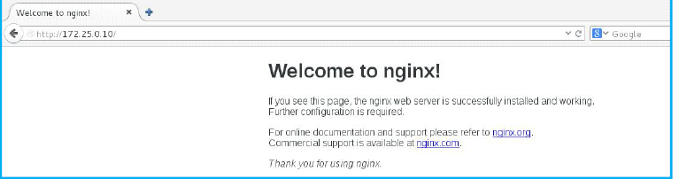
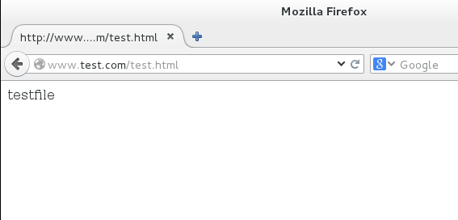
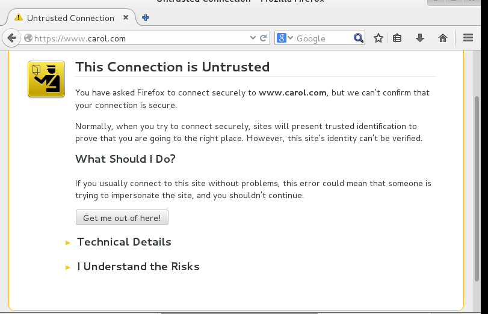
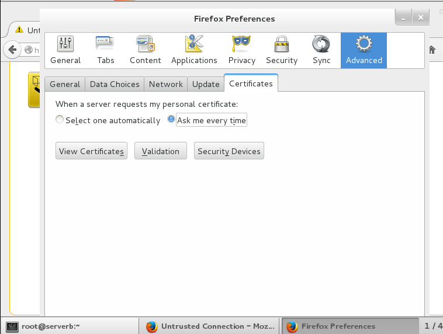
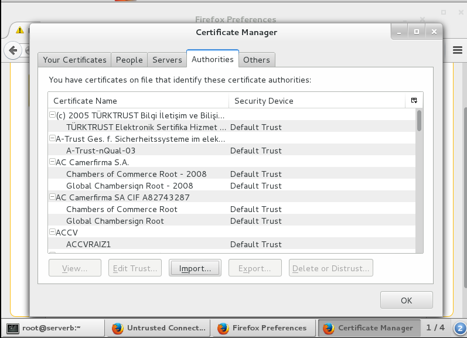
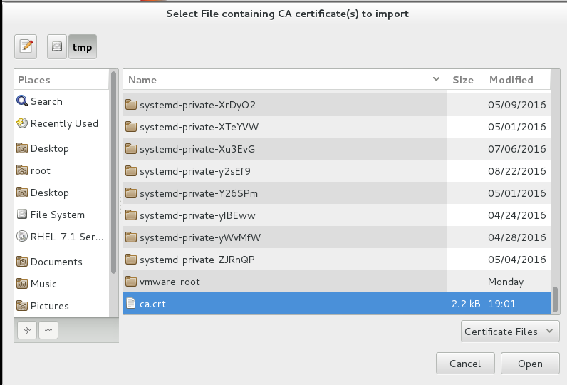
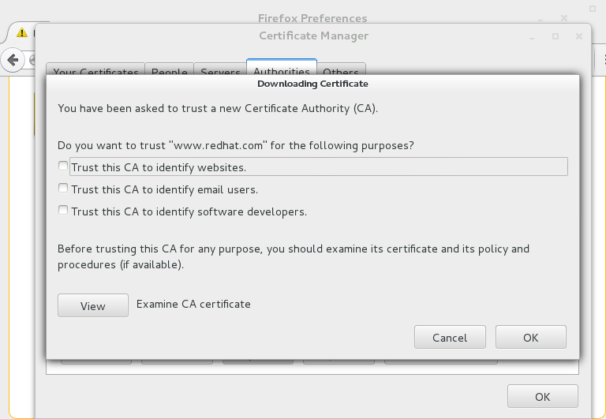
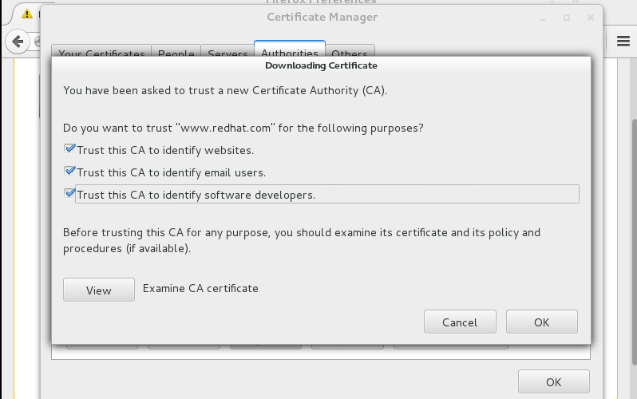
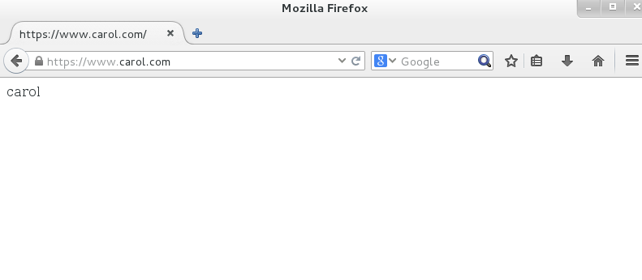

# nginx（上篇）#

---

2016-09-01 李家宜

### web服务器简介###

WEB 服务器也称为WWW(WORLD WIDE WEB)服务器，主要功能是提供网上信息浏览服务。在Internet 网络环境中，Web 服务无疑是最为流行的应用系统之一，有了web 站点，于企业而言，可以充分展示自己的产品，宣传企业形象，提供与客户交流、电子商务交易的平台等丰富的网络资源，已经成为很多人在网上查找、浏览信息的主要手段。于用户而言，用户可以通过简单的图形界面就可以访问各个大学、组织、公司等的最新信息和各种服务。如果你有条件，你可以注册一个域名，申请一个IP 地址，然后让你的ISP 将这个IP 地址解析到你的LINUX 主机上。然后，在LINUX 主机上架设一个WEB 服务器。你就可以将主页存放在这个自己的WEB 服务器上，通过它把自己的主页向外发布。

常用web服务器如下：

Unix 和Linux 平台下的常用Web 服务器有Apache、Nginx、Lighttpd、Tomcat、IBM WebSphere 等。目前应
用最广泛的Web 服务器是Apache。Windows 平台下最常用的服务器则是微软公司的IIS(Internet Information Server)。
**1.apache**

Apache 起初由Illinois 大学Urbana-Champaign 的国家高级计算程序中心开发。此后Apache 被开放源代码团体成员不断的发展和加强。1996 年4 月以来，Apache 一直是Internet 上最流行的HTTP 服务器，1999 年5 月它在57% 的网页服务器上运行，到了2005 年7 月这个比例上升到69%。Apache 是目前世界上用的最多的Web 服务器。
优势：

（1）开放源代码

（2）支持跨平台的应用(可以运行在几乎所有的Unix、Linux、Windows 系统平台之上)
（3）支持各种网络编程语言，如php，python，甚至微软的ASP 技术也能在apache 服务器中使用。
（4）模块化设计，使之具有良好的扩展性
（5）运行稳定，安全性好
Apache 的官方网站: http://www.apache.org
**2.lighttpd**

Lighttpd 是一个德国人领导的开源软件，其根本的目的是提供一个专门针对高性能网站。Lighttpd 是众多OpenSource轻量级的Web server 中较为优秀的一个。支持FastCGI, CGI, Auth, 输出压缩(output compress), URL 重写, Alias 等重要功能，而Apache 之所以流行，很大程度也是因为功能丰富，在Lighttpd 上很多功能都有相应的实现了，这点对于Apache 的用户是非常重要的，因为迁移到Lighttpd 就必须面对这些问题。
优势：

（1）内存消耗低
（2）安全性高
（3）兼容性好
（4）运行速度快
Lighttpd 的官方网站: http://www.lighttpd.net
**3.tomcat**

Tomcat 是一个免费的开源的Serlvet 容器，它是Apache 基金会的Jakarta 项目中的一个核心项目，由Apache、Sun和其它一些公司及个人共同开发而成。由于有了Sun 的参与和支持，最新的Servlet 和Jsp 规范总能在Tomcat 中得到体现。Tomcat 即是一个Jsp 和Servlet 的运行平台。同时Tomcat 又不仅仅是一个Servlet 容器，它也具有传统的Web 服务器的功能：处理Html 页面，但是与Apache 相比，它的处理静态Html 的能力就不如Apache，我们可以将Tomcat 和Apache 集成到一块，让Apache 处理静态Html，而Tomcat 处理Jsp 和Servlet。这种集成只需要修改一下Apache 和Tomcat 的配置文件即可。
Tomcat 的官方网站: http://tomcat.apache.org
**4.WebSphere Application Server**

WebSphere Application Server 是一种功能完善、开放的Web 应用程序服务器，是IBM 电子商务计划的核心部分。
基于Java 和Servlets 的Web 应用程序运行环境，包含了为Web 站点提供服务所需的一切，运行时可以协同并扩展
Apache、Netscape、IIS 和IBM 的HTTPWeb 服务器，因此可以成为强大的Web 应用服务器。
WebSphere 的官方网站: http://www.ibm.com
**5.IIS**

IIS 是Internet Information Server 的缩写，它是微软公司主推的服务器。IIS 与Window NT Server 完全集成在一起，因而用户能够利用Windows NT Server 和NTFS（NT File System，NT 的文件系统）内置的安全特性，建立强大，灵活而安全的Internet 和Intranet 站点。IIS 支持HTTP（Hypertext Transfer Protocol，超文本传输协议），FTP（File TransferProtocol，文件传输协议）以及SMTP 协议，通过使用CGI 和ISAPI，IIS 可以得到高度的扩展。
IIS 的官方网站: http://www.iis.net
**6.nginx**

Nginx 是俄罗斯人编写的十分轻量级的HTTP 服务器,Nginx，它的发音为“engine X”， 是一个高性能的HTTP 和反向代理服务器，同时也是一个IMAP/POP3/SMTP 代理服务器。Nginx 是由俄罗斯人Igor Sysoev 为俄罗斯访问量第二的Rambler.ru 站点开发的，它已经在该站点运行超过两年半了。Igor Sysoev 在建立的项目时，使用基于BSD 许可。自Nginx 发布四年来，Nginx 已经因为它的稳定性、丰富的功能集、示例配置文件和低系统资源的消耗而闻名。在俄罗斯许多大网站都已经使用它， 且一直表现不凡。截至2007 年4 月，俄罗斯大约有20%左右的虚拟主机是由nignx服务或代理的。Google 在线安全博客中统计Nginx 服务或代理了大约所有Internet 虚拟主机的4%。而Netcraft 的统计显示，Nginx 服务的主机在过去的一年里以四倍的速度增长并且在这几年里，它的排名还在不断上升。

---

### NGINX的优势

（1）Nginx 性能强大。专为性能优化而开发，性能是其最重要的考量,实现上非常注重效率。它支持内核Poll 模型，能
经受高负载的考验,有报告表明能支持高达50,000 个并发连接数。
（2）Nginx 稳定性高。其它HTTP 服务器当遇到访问的峰值，或者有人恶意发起慢速连接时，也很可能会导致服务器物
理内存耗尽频繁交换，失去响应只能重启服务器。例如当前Apache 一旦上到200 个以上进程，web 响应速度就明显非常缓慢了。而Nginx 采取了分阶段资源分配技术，使得它的CPU 与内存占用率非常低。Nginx 官方表示保持10,000 个没有活动的连接，它只占2.5M 内存，所以类似DOS 这样的攻击对Nginx 来说基本上是毫无用处的。就稳定性而言，nginx 比lighttpd 更胜一筹。
（3）Nginx 支持热部署。启动特别容易，并且几乎可以做到7*24 不间断运行，即使运行数个月也不需要重新启动。你还能够在不间断服务的情况下，对软件版本进行进行升级。
（4）Nginx 采用master-slave 模型。能够充分利用SMP 的优势，且能够减少工作进程在磁盘I/O 的阻塞延迟。
（5）Nginx 代码质量高。代码很规范，手法成熟， 模块扩展也很容易。
（6）Nginx 采用了一些os 提供的最新特性如对sendfile (Linux2.2+)，accept-filter(FreeBSD4.1+)，TCP_DEFER_ACCEPT (Linux 2.4+)的支持，从而大大提高了性能。
（7）nginx 处理请求是异步非阻塞的，而apache 则是阻塞型的，在高并发下nginx 能保持低资源低消耗高性能。
当然，nginx 还很年轻，多多少少存在一些问题，Nginx 的作者和社区都在一直努力解决，我们有理由相信nginx 将继续
以高速的增长率来分享轻量级HTTP 服务器市场，会有一个更美好的未来。

---

### nginx的安装###

nginx软件光盘不自带，需要去官网自行下载http://nginx.org/， 自从nginx1.9.5版本之后开始支持http2协议。

目前稳定版nginx1.8的版本，redhat提供的官方的rpm版本为1.6。


注意：由于apache和nginx同时会监听80端口，故开启nginx前，先将apache关闭。

[root@servera nginx-rpms]# rpm -ivh nginx-1.8.0-1.el7.ngx.x86_64.rpm 
warning: nginx-1.8.0-1.el7.ngx.x86_64.rpm: Header V4 RSA/SHA1 Signature, key ID 7bd9bf62: NOKEY
Preparing...                          ################################# [100%]
Updating / installing...

​	1:nginx-1:1.8.0-1.el7.ngx          ################################# [100%]

Thanks for using nginx!

Please find the official documentation for nginx here:
* http://nginx.org/en/docs/

Commercial subscriptions for nginx are available on:
* http://nginx.com/products

  ​

  软件结构如下：

````shell
[root@servera nginx-rpms]# rpm -ql nginx
/etc/logrotate.d/nginx
/etc/nginx
/etc/nginx/conf.d
/etc/nginx/conf.d/default.conf
/etc/nginx/conf.d/example_ssl.conf
/etc/nginx/fastcgi_params
/etc/nginx/koi-utf
/etc/nginx/koi-win
/etc/nginx/mime.types
/etc/nginx/nginx.conf
/etc/nginx/scgi_params
/etc/nginx/uwsgi_params
/etc/nginx/win-utf
/etc/sysconfig/nginx
/usr/lib/systemd/system/nginx.service
/usr/libexec/initscripts/legacy-actions/nginx
/usr/libexec/initscripts/legacy-actions/nginx/upgrade
/usr/sbin/nginx
/usr/share/nginx
/usr/share/nginx/html
/usr/share/nginx/html/50x.html
/usr/share/nginx/html/index.html
/var/cache/nginx
/var/log/nginx

````

nginx的启动：

````shell
[root@servera nginx-rpms]# systemctl start nginx
[root@servera nginx-rpms]# ps -ef | grep nginx
root       1438      1  0 10:14 ?        00:00:00 nginx: master process /usr/sbin/nginx -c /etc/nginx/nginx.conf
nginx      1439   1438  0 10:14 ?        00:00:00 nginx: worker process
root       1441   1374  0 10:14 pts/0    00:00:00 grep --color=auto nginx
````

客户端测试：

````
[kiosk@foundation0 Desktop]$ ssh root@172.25.0.9 -X
[root@workstation ~]# firefox
````



---

### nginx的基本配置

**1.主配置文件泛读 /etc/nginx/nginx.conf**

````shell
user  nginx;      
worker_processes  1;  #开启nginx的进程数

error_log  /var/log/nginx/error.log warn;  #错误日志
pid        /var/run/nginx.pid;  #进程文件


events {
    worker_connections  1024;  #每个进程数可支持的最大连接数
}
http {
    include       /etc/nginx/mime.types;   #文件扩展名与文件类型映射表
    default_type  application/octet-stream; # 默认文件类型

    log_format  main  '$remote_addr - $remote_user [$time_local] "$request" '   #对于maim日志类型记录
                      '$status $body_bytes_sent "$http_referer" '
                      '"$http_user_agent" "$http_x_forwarded_for"';
			
    access_log  /var/log/nginx/access.log  main;  #常规访问日志

    sendfile        on;   #开启高效文件传输模式
    #tcp_nopush     on; #

    keepalive_timeout  65;  #保持连接超时时间

    #gzip  on; 

    include /etc/nginx/conf.d/*.conf; #读取/etc/nginx/conf.d目录下以.conf结尾的扩展配置文件
}

````

**2.nginx进程管理**

进程是系统进行资源分配和调度的常见单位，在面向进程设计的程序中，进程是程序的基本执行实体，程序使用进程处理用户请求，进程是内存独享的，运行稳定，处理速度较快，但是资源占用比较大。
进程是线程的容器，也就是进程去开辟地址空间，线程去处理用户请求，在面向线程处理的程序中，线程是基本执行实体线
程是内存共享的，资源占用小，但是稳定性没有进程好。
Apache 在处理用户请求时，有perfork 模式和worker 模式两种，默认使用perfork 模式，即使用进程处理用户请求。

假设，处理一个动态页面需要4M内存，则在进程模式下，处理10个动态页面则需要4*10=40M空间，那么在大并发的情况下，就可能导致内存溢出，从而机器宕机。而在线程模式下，处理10个动态页面则不需要使用到40M的空间，线程是一种内存共享的方式，有一些代码段是可以反复被利用的，也就意味着10个动态页面需要的空间远小于40M，从而支持更大的并发。然而处理请求的方式跑在线程上也可能会发生一些问题，譬如一个线程崩溃了，则可能导致共享代码段受损，结果可能导致数千用户都受到该线程崩溃的影响。

实验：设置nginx 允许开启的进程数量和每个进程允许打开的线程数量

````shell
[root@servera nginx-rpms]# vim /etc/nginx/nginx.conf 
user  nginx;
worker_processes  4;

error_log  /var/log/nginx/error.log warn;
pid        /var/run/nginx.pid;


events {
    worker_connections  2048;
}

[root@servera nginx-rpms]# systemctl restart nginx
[root@servera nginx-rpms]# ps -ef | grep nginx
root       1534      1  0 11:14 ?        00:00:00 nginx: master process /usr/sbin/nginx -c /etc/nginx/nginx.conf
nginx      1535   1534  0 11:14 ?        00:00:00 nginx: worker process
nginx      1536   1534  0 11:14 ?        00:00:00 nginx: worker process
nginx      1537   1534  0 11:14 ?        00:00:00 nginx: worker process
nginx      1538   1534  0 11:14 ?        00:00:00 nginx: worker process
root       1540   1374  0 11:14 pts/0    00:00:00 grep --color=auto nginx

````

**3.nginx下的虚拟主机的配置**

**一：配置基于名称的虚拟主机：**

1）进入/etc/nginx/conf.d/目录，该目录是nginx 虚拟主机配置目录，该目录下有默认有两个文件，default.conf 文件是nginx的默认虚拟主机配置文件，也可作为之后自定义虚拟主机的模板，example_ssl.conf 文件是https 配置的模板文件，后续讲https时会再对该文件做详细说明。

2）配置自定义虚拟主机www.test.com（下述配置为最基本配置）

````shell
[root@servera conf.d]# vim www.test.com.conf 
[root@servera conf.d]# cat www.test.com.conf 
server {
    listen       80;
    server_name  www.test.com;
        root   /usr/share/nginx/test.com;
        index  index.html index.htm;
}
````

3）创建该虚拟主机网页文件存放目录及首页文件

````shell
[root@servera conf.d]# mkdir /usr/share/nginx/test.com
[root@servera conf.d]# echo test > /usr/share/nginx/test.com/index.html
````

4）重启服务

````shell
[root@servera conf.d]# systemctl restart nginx
````

5）登录workstation访问测试

````shell
[root@workstation Desktop]# echo "172.25.0.10 www.test.com" >> /etc/hosts
[root@workstation Desktop]# firefox
````


**二：location匹配字段**

location的匹配字段用来匹配url地址的路径部分。location匹配也可以采用正则表达式，有符号的location 优先级高。

下叙例子则演示了当匹配到/test.html这个页面的时候，将网站根目录临时切换到/usr/share/nginx/html目录下。

````shell
[root@servera ~]# vim /etc/nginx/conf.d/www.test.com.conf 
server {
    listen       80;
    server_name  www.test.com;
        root   /usr/share/nginx/test.com;
        index  index.html index.htm;
        location /test.html {
        root /usr/share/nginx/html;
        }
}
[root@servera ~]# cd /usr/share/nginx/html/
[root@servera html]# ls
50x.html  index.html
[root@servera html]# echo testfile > test.html
[root@servera html]# systemctl restart nginx

````

访问测试：



----

### 加密连接https

​	众所周知，我们在互联网上冲浪，一般都是使用的http 协议（超文本传输协议），默认情况下数据是明文传送的，这些数据在传输过程中都可能会被捕获和窃听，因此是不安全的。https 可以说是http 协议的安全版，就是为了满足对安全性要求比较高的用户而设计的。如果您的邮件中有敏感数据，不希望被人窃听；如果您不希望被钓鱼网站盗用帐号信息，如果您希望您在使用邮箱的过程中更安全，那么我们推荐您使用https 安全连接。
​	HTTPS 在HTTP 的基础上加入了SSL 协议，SSL 依靠证书来验证服务器的身份，并为浏览器和服务器之间的通信加密。SSL(Secure Socket Layer 安全套接层)为Netscape 所研发，用以保障在Internet 上数据传输之安全，利用数据加密技术，确保数据在网络上之传输过程中不会被截取及窃听。

数据密码方式常见的有以下两种：
（1）对称加密：采用单钥密码系统的加密方法，同一个密钥可以同时用作信息的加密和解密，这种加密方法称为对称加密，也称为单密钥加密。服务端生成公钥和私钥，服务端将公钥传递给客户端，客户端通过公钥加密自己的数据后传递给服务器。

​	对称加密算法的优点是算法公开、计算量小、加密速度快、加密效率高。

​	对称加密算法的缺点是在数据传送前，发送方和接收方必须商定好秘钥，然后使双方都能保存好秘钥。其次如果一方的秘钥被泄露，那么加密信息也就不安全了。另外，每对用户每次使用对称加密算法时，都需要使用其他人不知道的唯一秘钥，这会使得收、发双方所拥有的钥匙数量巨大，密钥管理成为双方的负担。

（2）非对称加密
​	非对称加密算法需要两个密钥来进行加密和解密，公钥和私钥。还是上述例子，乙方生成一对密钥并将公钥向甲方公开，得到该公钥的甲方使用该密钥对机密信息进行加密后再发送给乙方。乙方再用自己保存的私钥对加密后的信息进行解密。乙方只能用私钥解密由对应的公钥加密后的信息。同样，如果乙要回复加密信息给甲，那么需要甲先公布甲的公钥给乙用于加密，甲自己保存甲的私钥用于解密。在传输过程中，即使攻击者截获了传输的密文，并得到了乙的公钥，也无法破解密文，因为只有乙的私钥才能解密密文。

​	非对称加密与安全性更好，使用一对秘钥，一个用来加密，一个用来解密，而且公钥是公开的，秘钥是自己保存的。

​	非对称加密的缺点是加密和解密花费时间长、速度慢。

**https的配置说明**

环境：serverb作为CA中心，servera作为nginx配置ssl页面的web服务端

（1）servera上创建私钥

````shell
[root@servera html]# cd /etc/nginx/
[root@servera nginx]# mkdir key
[root@servera nginx]# cd key/
[root@servera key]# pwd
/etc/nginx/key
[root@servera key]# openssl genrsa 2048 > servera-web.key
Generating RSA private key, 2048 bit long modulus
............................+++
......................................+++
e is 65537 (0x10001)
````

（2）生成证书颁发请求

````shell
[root@servera key]# openssl genrsa 2048 > servera-web.key
Generating RSA private key, 2048 bit long modulus
............................+++
......................................+++
e is 65537 (0x10001)
[root@servera key]# openssl req -new -key servera-web.key -out servera-web.csr
You are about to be asked to enter information that will be incorporated
into your certificate request.
What you are about to enter is what is called a Distinguished Name or a DN.
There are quite a few fields but you can leave some blank
For some fields there will be a default value,
If you enter '.', the field will be left blank.
-----
Country Name (2 letter code) [XX]:CN
State or Province Name (full name) []:shanghai
Locality Name (eg, city) [Default City]:shanghai
Organization Name (eg, company) [Default Company Ltd]:carol Company .Ltd
Organizational Unit Name (eg, section) []:www.carol.com
Common Name (eg, your name or your server's hostname) []:www.carol.com
Email Address []:root@carol.com

Please enter the following 'extra' attributes
to be sent with your certificate request
A challenge password []:
An optional company name []:
[root@servera key]# ls
servera-web.csr  servera-web.key
````

（3）将证书颁发请求提交给CA中心（serverb模拟成CA中心）

````shell
[root@servera key]# scp servera-web.csr 172.25.0.11:~
servera-web.csr                               100% 1082     1.1KB/s   00:00  
````

（4） serverb模拟成CA，执行自签名操作

```shell
[root@serverb ~]# openssl genrsa -des3 -out ca.key 4096
Generating RSA private key, 4096 bit long modulus
......................++
......................................................................................................................................................................................................................................................................................................................................................................................................................................................................................................++
e is 65537 (0x10001)
Enter pass phrase for ca.key:                               # 此处设置密码需要在后续签名过程中用到       
Verifying - Enter pass phrase for ca.key:					# 密码位数不回显

[root@serverb ~]# openssl req -new -x509 -days 3650 -key ca.key -out ca.crt
Enter pass phrase for ca.key:    # 使用之前设置过的密码
You are about to be asked to enter information that will be incorporated
into your certificate request.
What you are about to enter is what is called a Distinguished Name or a DN.
There are quite a few fields but you can leave some blank
For some fields there will be a default value,
If you enter '.', the field will be left blank.
-----
Country Name (2 letter code) [XX]:CN
State or Province Name (full name) []:shanghai
Locality Name (eg, city) [Default City]:shanghai
Organization Name (eg, company) [Default Company Ltd]:redhat .Ltd
Organizational Unit Name (eg, section) []:www.redhat.com
Common Name (eg, your name or your server's hostname) []:www.redhat.com
Email Address []:redhat@redhat.com
[root@serverb ~]# 

```

（5）CA中心针对证书颁发请求创建证书

````shell
[root@serverb ~]# openssl x509 -req -days 365 -in servera-web.csr -CA ca.crt -CAkey ca.key -set_serial 01 -out servera-web.crt
Signature ok
subject=/C=CN/ST=shanghai/L=shanghai/O=carol Company .Ltd/OU=www.carol.com/CN=www.carol.com/emailAddress=root@carol.com
Getting CA Private Key
Enter pass phrase for ca.key:
````

（6）证书回传给客户端

````shell
[root@serverb ~]# scp servera-web.crt 172.25.0.10:/etc/nginx/key
The authenticity of host '172.25.0.10 (172.25.0.10)' can't be established.
ECDSA key fingerprint is 6c:49:1a:9c:b8:9c:4c:91:20:f6:7f:9c:da:ef:57:7f.
Are you sure you want to continue connecting (yes/no)? yes
Warning: Permanently added '172.25.0.10' (ECDSA) to the list of known hosts.
root@172.25.0.10's password: 
servera-web.crt                               100% 1688     1.7KB/s   00:00 
````

（7） ssl的配置

````shell
[root@servera key]# cd /etc/nginx/conf.d/
[root@servera conf.d]# vim www.carol.com.conf 
server {
    listen       443 ssl;  # https监听443端口
    server_name  www.carol.com; 

    ssl_certificate      /etc/nginx/key/servera-web.crt;  #证书存放位置
    ssl_certificate_key  /etc/nginx/key/servera-web.key;  #私钥存放位置

    ssl_session_cache shared:SSL:1m;
    ssl_session_timeout  5m;

    ssl_ciphers  HIGH:!aNULL:!MD5;    
#指出允许的密码，密码指定为openssl支持的格式
    ssl_prefer_server_ciphers   on;
#依赖SSLv3 和TLSv1 协议的服务器密码将优先于客户端密码
        root   /usr/share/nginx/carol.com;  #定义网站根目录相关
        index  index.html index.htm;
}

````

（8）创建网站根目录及测试首页

````shell
[root@servera conf.d]# mkdir /usr/share/nginx/carol.com
[root@servera conf.d]# echo carol > /usr/share/nginx/carol.com/index.html
````

（9） 重启服务

````shell
[root@servera conf.d]# systemctl restart nginx
````

（10）测试访问



该信息为此连接不受信任，模拟的CA中心并未纳入浏览器的CA中心列表中。

向浏览器导入CA中心过程如下

1.复制ca中心的crt文件至workstation

````shell
[root@serverb ~]# scp ca.crt  172.25.0.9:/tmp
The authenticity of host '172.25.0.9 (172.25.0.9)' can't be established.
ECDSA key fingerprint is cf:b8:23:57:84:0b:99:d6:89:7a:48:22:65:0e:ce:b9.
Are you sure you want to continue connecting (yes/no)? yes
Warning: Permanently added '172.25.0.9' (ECDSA) to the list of known hosts.
root@172.25.0.9's password: 
ca.crt                                        100% 2163     2.1KB/s   00:00 
````

2.workstation向浏览器导入ca中心

firefox -> 点击preferences，选择advanced标签，进入以下界面



点击view certificates进入以下界面



点击import，选择ca.crt文件，点击open



 



将三个√选上之后，OK点击退出，重新访问测试




----

### nginx的访问控制###

访问控制
（1）有时我们会有这么一种需求，就是你的网站并不想提供一个公共的访问或者某些页面不希望公开，我们希望的是某些特定的客户端可以访问。那么我们可以在访问时要求进行身份认证，就如给你自己的家门加一把锁，以拒绝那些不速之客。我们在服务课程中学习过apache 的访问控制，对于Nginx 来说同样可以实现，并且整个过程和Apache 非常的相似。

````shell
location /test.html {
auth_basic "info";   # 提示信息
auth_basic_user_file /usr/share/nginx/passwd.db;  #存放用户名和密码的文件
}
````

设置密码：

````shell
[root@servera nginx]# rpm -q httpd-tools
httpd-tools-2.4.6-31.el7.x86_64
[root@servera nginx]# htpasswd -cm /usr/share/nginx/passwd.db carol
New password: （输入密码）
Re-type new password: （again）
Adding password for user carol
````

（2）想阻止别人访某些目录下的特定文件，比如不希望别人访问我的”.txt”和”.doc”的文件，那么我们可以通过deny 的方式来做拒绝。

````shell
location ~* .(txt|doc)$ {	
 	deny all;
 }
````

此处~* 代表不区分大小写方式匹配。allow代表允许，deny代表不允许。
此处all 代表是客户端的IP，你也可以使用ip/mask 的方式来定义。