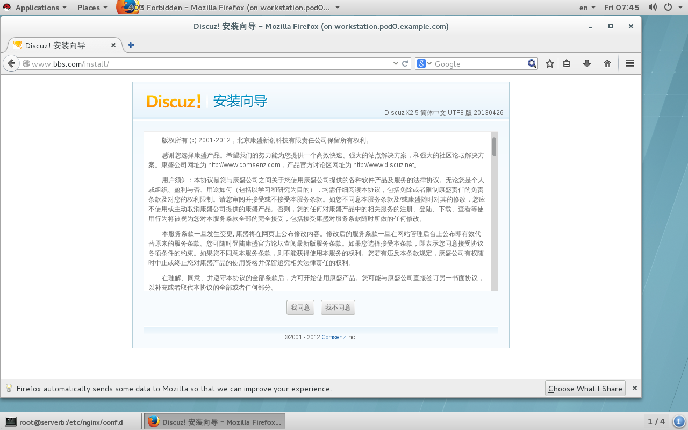
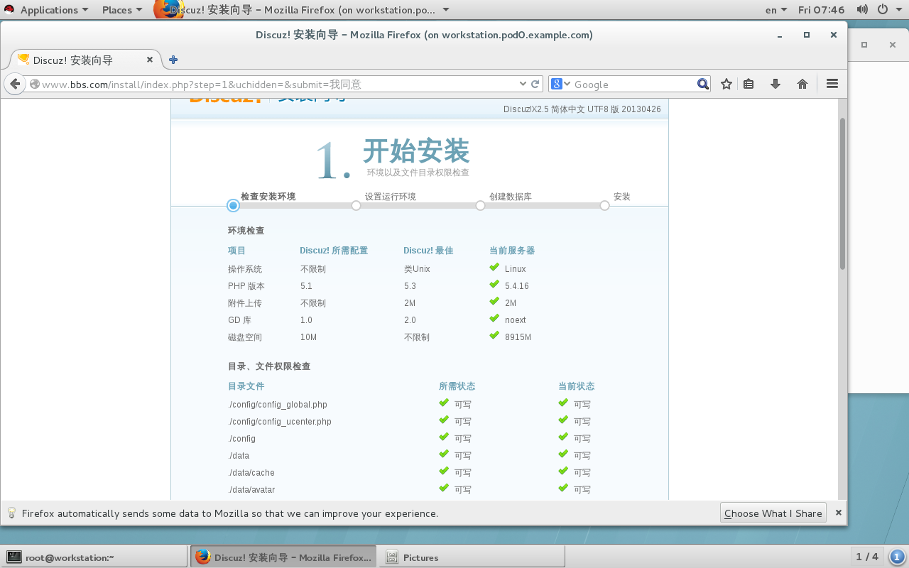
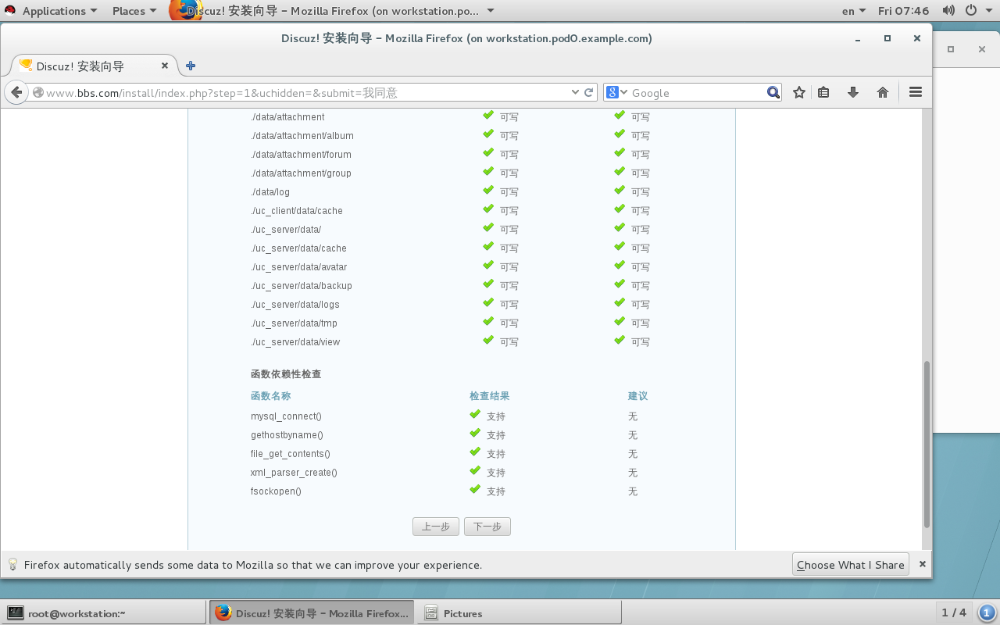
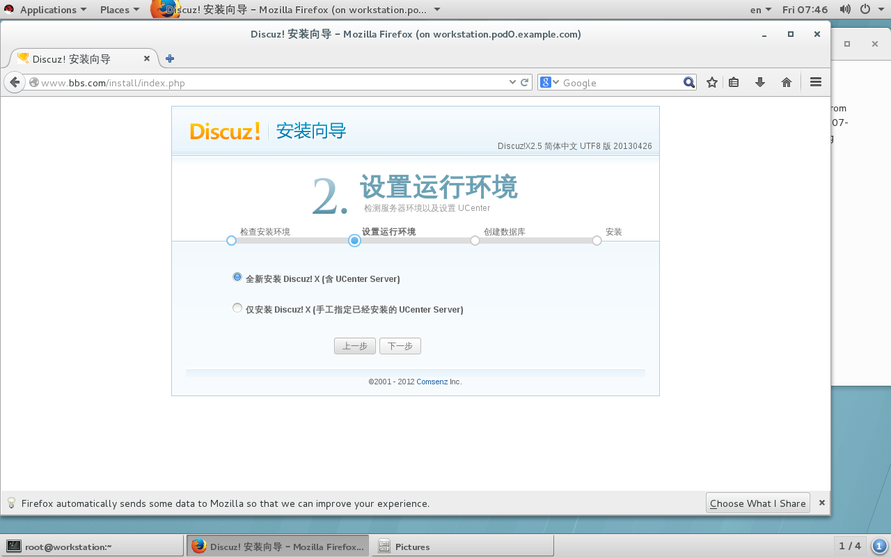
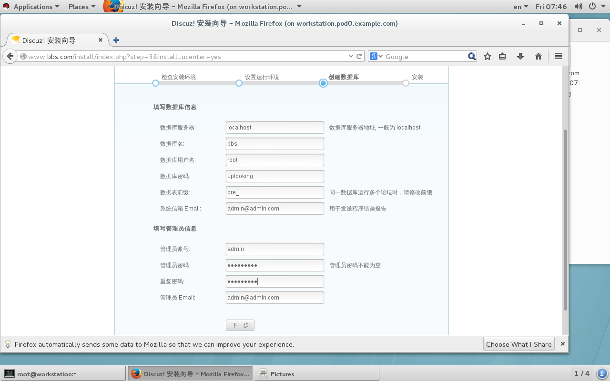
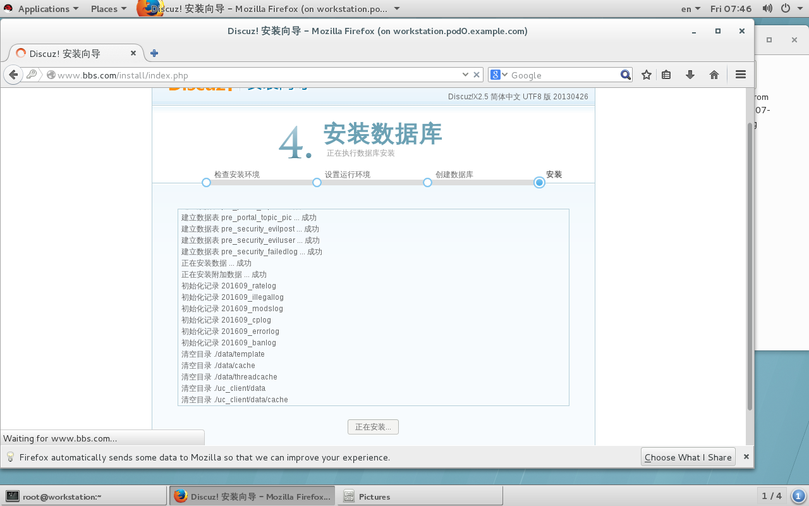
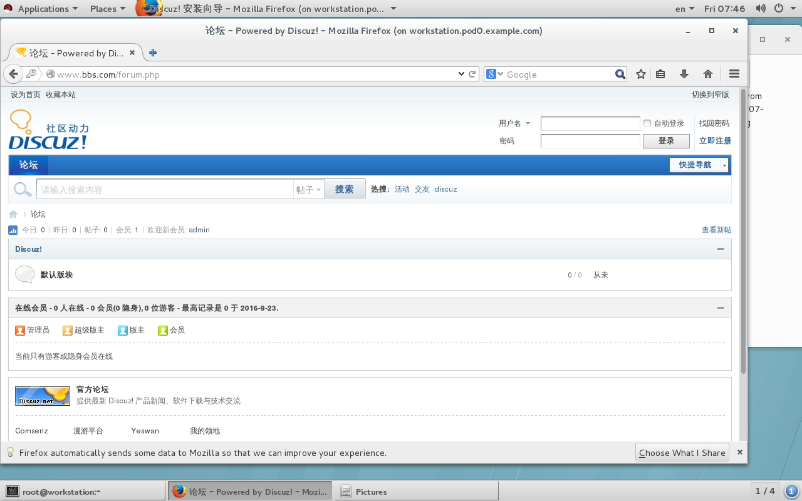

# nginx（下篇）

----

李家宜   20160923

### LNMP搭建过程###

**1.安装软件包**

​	用户在访问过程中如果访问动态页面，apache 和nginx 本身都解释不了php 页面，需要调用相应的php 进程，apache 在调用过程中会使用的libphp5.so 的模块从而调用php进程进行页面语言处理，

​	而对于nginx来说，所以需要安装额外程序来调用php进程，这类软件会被称为php的进程管理器。Php 进程管理器比较常见的有spawn-fcgi 和php-fpm。Spawn-cfgi 和php-fpm 相比，后者性能更高，但后者必须和php 程序版本完全一致，如果升级了php，那么php-fpm 程序也要做相应的版本升级。

本例中使用的spawn-fcgi 程序。

Php 进程管理器在lnmp 环境中的作用：

（1）监听端口，nginx 把请求交给php 管理器，php 管理器监听9000 端口

（2）调用和管理php 进程，管理程序去看你本地有没有php 命令，有的话调用起来，php 命令运行之后再去处理刚才收到的页面请求，处理php 请求。

以下命令安装了spawn-fcgi，php 程序、数据库程序和php 连接数据库的驱动。**

````shell
[root@serverb nginx-rpms]# rpm -ivh spawn-fcgi-1.6.3-5.el7.x86_64.rpm
[root@serverb epel]# yum install php php-mysql mariadb-server -y
````

**2.配置虚拟主机**

````shell
[root@serverb epel]# cd /etc/nginx/conf.d/
[root@serverb conf.d]# cp default.conf www.bbs.com.conf
[root@serverb conf.d]# vim www.bbs.com.conf
server {
       listen 80;
       server_name www.bbs.com;
       root /usr/share/nginx/bbs.com;
       index index.php index.html index.htm;
    location ~ \.php$ {
        fastcgi_pass 127.0.0.1:9000;   
 	    fastcgi_index index.php;
	    fastcgi_param SCRIPT_FILENAME /usr/share/nginx/bbs.com$fastcgi_script_name;
	    include fastcgi_params;
     }
}
[root@serverb conf.d]# mkdir /usr/share/nginx/bbs.com
[root@serverb conf.d]# systemctl restart nginx.service
````

**3.配置spawn-fcg**

````shell
[root@serverb conf.d]# vim /etc/sysconfig/spawn-fcgi
OPTIONS="-u nginx -g nginx -p 9000 -C 32 -F 1 -P /var/run/spawn-fcgi.pid -- /usr/bin/php-cgi"
[root@serverb conf.d]# systemctl start spawn-fcgi
[root@serverb conf.d]# systemctl enable spawn-fcgi
````

**4.数据库初始化**

````shell
[root@serverb conf.d]# systemctl enable mariadb.service
[root@serverb conf.d]# systemctl start mariadb.service
[root@serverb conf.d]# mysqladmin -u root password "uplooking"
````

**5.创建网站根目录相关**

````shell
[root@serverb php]# cp Discuz_X3.2_SC_UTF8.zip /tmp/
[root@serverb php]# cd /tmp/
[root@serverb tmp]# unzip Discuz_X3.2_SC_UTF8.zip
[root@serverb tmp]# cp -r upload/* /usr/share/nginx/bbs.com/
[root@serverb tmp]# chown nginx. /usr/share/nginx/bbs.com/ -R
````

**6.数据库授权**

```shell
[root@serverb tmp] mysql -uroot -puplooking
MariaDB [(none)]> grant all on bbs.* to root@'localhost' identified by 'uplooking';
MariaDB [(none)]> flush privileges;
```

**7.客户端访问**

````shell
[root@workstation ~]# echo “172.25.0.11 www.bbs.com” >> /etc/hosts
````















----

### LNMP迁移过程###

一般情况下，迁移需要有一定思路，建议按照以下思路执行

① 程序的迁移

② 配置文件的迁移

③ 数据文件的迁移

④ 相应的地址变更

⑤ 权限相关

⑥ 其他

**1.数据库迁移**

通常情况下，同一台服务器中，数据库是优先最容易出现性能瓶颈的服务，所以我们先将数据库迁移出来，迁移至serveri这台服务器。

（1）迁移mariadb-server 程序

````shell
[root@serveri ~]# yum -y install mariadb-server
````

（2）启动数据库服务

````shell
[root@serveri ~]# systemctl start mariadb
````

（3）将serverb（旧的数据库服务器）上的数据库导出备份到一个文件中

````shell
[root@serverb ~]# mysqldump --all-databases -uroot -puplooking > /tmp/mariadb.all.sql
````

（4）将导出的文件拷贝至新的数据库服务器serveri

````shell
[root@serverb ~]# scp /tmp/mariadb.all.sql 172.25.0.18:/tmp/
````

（5）在serveri 机器上将导出的数据库导入

````shell
[root@serveri ~]# mysql < /tmp/mariadb.all.sql
[root@serveri ~]# systemctl restart mariadb
````

（6）修改php 代码，将dbhost 改为新的数据库服务器

`````shell
[root@serverb ~]# for i in (find /usr/share/nginx/bbs.com/ -name *.php);do grep -q "uplooking" i && echo
$i;done
[root@serverb ~]# vim /usr/share/nginx/bbs.com/config/config_global.php
[root@serverb ~]# vim /usr/share/nginx/bbs.com/config/config_ucenter.php
[root@serverb ~]# vim /usr/share/nginx/bbs.com/uc_server/data/config.inc.php
`````

（7）授权。允许php 程序所在机器读取数据库中的内容。

````shell
[root@serveri ~]# echo "grant all on . to root@'172.25.0.11' identified by 'uplooking';" | mysql -uroot -puplooking
[root@serveri ~]# echo "grant all on . to root@'serverb.pod0.exmaple.com' identified by 'uplooking';" | mysql -uroot -puplooking
[root@serveri ~]# mysqladmin -uroot -puplooking flush-privileges
````

**2.php迁移**

将serverb上的php迁移至serverc

（1）安装php php-mysql spawn-fcgi 程序

````shell
[root@serverc ~]# yum -y install php php-mysql
[root@serverc ~]# mount 172.25.254.250:/content /mnt/
[root@serverc ~]# cd /mnt/items/nginx/nginx-rpms/
[root@serverc nginx-rpms]# rpm -ivh spawn-fcgi-1.6.3-5.el7.x86_64.rpm
````

（2）迁移配置文件。

````shell
[root@serverb ~]# scp /etc/sysconfig/spawn-fcgi 172.25.0.12:/etc/sysconfig/
````

（3）迁移数据文件

````shell
[root@serverb ~]# tar cf /tmp/datafile.tar /usr/share/nginx/bbs.com/
[root@serverb ~]# scp /tmp/datafile.tar 172.25.0.12:/tmp/
````

（4）地址变更：修改虚拟主机配置文件，访问php 的请求交给新的php 进程管理器所在机器做处理。

````shell
[root@serverb ~]# vim /etc/nginx/conf.d/www.bbs.com.conf
location ~ .php$ {
	fastcgi_pass 172.25.0.12:9000;
	fastcgi_index index.php;
	fastcgi_param SCRIPT_FILENAME /usr/share/nginx/bbs.com$fastcgi_script_name;	
	include fastcgi_params;
}

````

（5）权限变更：

权限变更涉及到ugo权限以及数据库授权的操作

````shell
[root@serverc ~]# groupadd -g 994 nginx
[root@serverc ~]# useradd -u 996 -g 994 nginx
[root@serverc ~]# setenforce 0
[root@serveri ~]# echo "grant all on . to root@'172.25.0.12' identified by 'uplooking';" | mysql -uroot -puplooking
[root@serveri ~]# echo "grant all on . to root@'serverc.pod0.example.com' identified by 'uplooking';" | mysql -uroot -puplooking
[root@serveri ~]# mysqladmin -uroot -puplooking flush-privileges
````

（6）重启服务

````shell
[root@serverb ~]# systemctl restart nginx.service
[root@serverb ~]# systemctl stop spawn-fcgi.service
[root@serverc ~]# systemctl restart spawn-fcgi.service
````

（7） 访问测试（略）

**3.PHP 程序复制**

通过程序拆分操作，每台服务器上已经只运行一个程序，但是可能还是不能够处理大量的用户请求，我们就可以使用程序
复制，也就是多台机器使用跑同一个程序，负载均衡。以php 程序复制为例。这里将开启第二台服务器servere作为第二胎php服务器。
（1）进入服务器公共目录，安装php 进程管理器spawn-fcfgi

````shell
[root@servere ~]# rpm -ivh spawn-fcgi-1.6.3-5.el7.x86_64.rpm
````

（2）安装php 程序和php 连接mariadb 的驱动

````shell
[root@servere ~]# yum -y install php php-mysql
````

（3）将第一台cgi 服务器上的配置文件复制到第二台cgi 服务器上

````shell
[root@serverc ~]# scp /etc/sysconfig/spawn-fcgi 172.25.0.14:/etc/sysconfig/
````

（4）将第一台cgi 服务器上的php 页面文件复制到第二台cgi 服务器上

````shell
[root@serverc ~]# tar cf /tmp/data.tar /usr/share/nginx/bbs.com/
[root@serverc ~]# scp /tmp/data.tar 172.25.0.14:/tmp/
[root@servere ~]# tar xf /tmp/data.tar -C /
````

（5）定义upsteam 字段，地址池中包含后台两台cgi 服务器，以便fastcgi_cgi 字段引用

```shell
[root@serverb ~]# vim /etc/nginx/nginx.conf
upstream php_pools {
	server 172.25.0.12:9000;
	server 172.25.0.14:9000;
}
```

（6）php 文件的访问请求交给后台cgi 服务器

````shell
[root@serverb ~]# vim /etc/nginx/conf.d/www.bbs.com.conf
location ~ .php$ {
	fastcgi_pass php_pools;
	fastcgi_index index.php;
	fastcgi_param SCRIPT_FILENAME /usr/share/nginx/bbs.com$fastcgi_script_name;
	include fastcgi_params;
}
````

（7）修改新的cgi 服务器上UGO 权限，保证nginx 用户对所有的php 文件有读写权限

````shell
[root@servere ~]# groupadd -g 994 nginx
[root@servere ~]# useradd -u 996 -g nginx nginx
[root@servere ~]# systemctl start spawn-fcgi.service
````

（8）数据库授权

````shell
[root@serveri ~]# echo "grant all on . to root@'172.25.0.14' identified by 'uplooking';" | mysql -uroot -puplooking
[root@serveri ~]# echo "grant all on . to root@'servere.pod0.example.com' identified by 'uplooking';" | mysql -uroot -puplooking
[root@serveri ~]# mysqladmin -uroot -puplooking flush-privileges
````

（9）客户端测试，两台cgi 服务器是否都能够正常工作。（略）
**4.共享存储问题**

如果后台是两台cgi 服务器，那么会存在数据一致性问题。比如，A 用户上传图片到论坛的请求经过轮询被提交到serverc机器，那么这张图片就会被保存到serverc 机器，以后如果B 用户的请求被提交到serverc 机器，那么B 用户可以访问下载该图片，但是如果用户C 请求经过轮询之后被提交到servere 机器，那么用户C 是不能浏览下载这张图片的，会出现报错（如图所示）。原因就是因为图片被上传到serverc 机器，servere 机器上没有这张图片。可通过共享存储来解决数据不一致的问题。


（1）serverj 作为共享存储服务器，安装上nfs_utils 和rpcbind 两个软件包（默认已安装）

````shell
[root@serverj ~]# rpm -q nfs-utils
nfs-utils-1.3.0-0.8.el7.x86_64
[root@serverj ~]# rpm -q rpcbind
rpcbind-0.2.0-26.el7.x86_64
````

（2）将其中一台cgi 服务器上的php 页面文件拷贝至共享存储服务器。

````shell
[root@serverc ~]# tar cf /tmp/data1.tar /usr/share/nginx/bbs.com/
[root@serverc ~]# tar cf /tmp/data1.tar /usr/share/nginx/bbs.com/
[root@serverj ~]# tar -xf /tmp/data1.tar -C /
````

（3）添加nginx 用户和组。

````shell
[root@serverj ～]# groupadd -g 994 nginx
[root@serverj ～]# useradd -u 996 -g nginx nginx
````

（4）配置nfs。

````shell
[root@serverj ～]# vim /etc/exports
/usr/share/nginx/bbs.com 172.25.0.0/255.255.255.0(rw)
````

（5）启动rpc 服务和nfs 服务。

````shell
[root@serverj ～]# systemctl start rpcbind
[root@serverj bbs.com]# systemctl restart nfs-server
````

（6）serverb、serverc 和servere 作为nfs 客户端去挂载共享存储服务器上共享出来的目录。（永久挂载写到/etc/fstab 文件）

````shell
[root@serverc ~]# mount 172.25.0.19:/usr/share/nginx/bbs.com /usr/share/nginx/bbs.com
[root@servere ~]# mount 172.25.0.19:/usr/share/nginx/bbs.com /usr/share/nginx/bbs.com
[root@serverb ~]# mount 172.25.0.19:/usr/share/nginx/bbs.com /usr/share/nginx/bbs.com
````

（7）客户端测试。再上传图片。（图略）