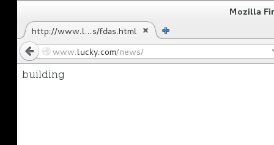
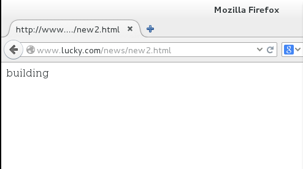
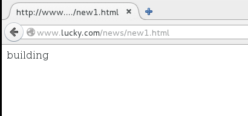
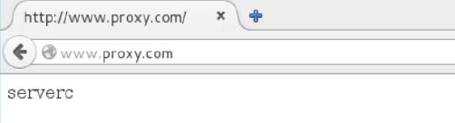
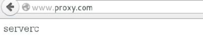
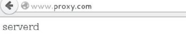
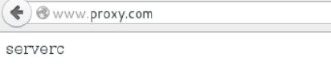

# nginx（中篇）#

---

### nignx的rewrite规则###

#### rewrite简介####

​	所谓rewrite规则，实际指的是地址重写技术。在生产环境里，出于某些原因，我们希望用户输入的url地址和对应请求文件所在实际位置不一致，然后通过服务端的配置将两者进行映射，而实现这种技术的方式就称为地址重写。重写技术通常情况下用于以下场景：

1.将复杂的动态页面url地址转换成简单的静态页面地址。

​	通常情况下，搜索引擎更喜欢静态页面形式的网页，搜索引擎对静态页面的评分一般要高于动态页面。所以UrlRewrite 可以让我们网站的网页更容易被搜索引擎所收录。

​	对于追求完美主义的网站设计师，就算是网页的地址也希望看起来尽量简洁明快。形如http://www.123.com/news/index.asp?id=123 的网页地址，自然是毫无美感可言，而用UrlRewrite 技术，你可以轻松把它显示为http://www.123.com/news/123.html。

2.安全性问题

​	从安全角度上讲，如果在url 中暴露太多的参数，无疑会造成一定量的信息泄漏，可能会被一些黑客利用，对你的系统造成一定的破坏，所以静态化的url 地址可以给我们带来更高的安全性。

#### rewrite规则####

​	rewrite规则可以通过两方面去描述

+ 匹配
+ 改写

**1.匹配**

1）location：只匹配$path,不匹配主机名等其他信息

2）if：可以匹配除路径以外的其他信息，如主机名、客户端ip 等。

if 的语法应用于server 和location 环境内，语法如下：

````
if (condition) { ....  }
````

if 可以支持如下条件判断匹配符号
~ 为区分大小写匹配

~* 为不区分大小写匹配

!~和!~*分别为区分大小写不匹配及不区分大小写不匹配

-f 和!-f 用来判断是否存在文件

-d 和!-d 用来判断是否存在目录

-e 和!-e 用来判断是否存在文件或目录

-x 和!-x 用来判断文件是否可执行

在匹配过程中可以引用一些Nginx 的全局变量，参考http://wiki.nginx.org/NginxHttpCoreModule 的Variables

$args, 请求中的参数;

$document_root, 针对当前请求的根路径设置值;

$http_host, 请求信息中的"Host"，如果请求中没有Host 行，则等于设置的服务器名;

$limit_rate, 对连接速率的限制;

$request_method, 请求的方法，比如"GET"、"POST"等;

$remote_addr, 客户端地址;

$remote_port, 客户端端口号;

$remote_user, 客户端用户名，认证用;

$request_filename, 当前请求的文件路径名

$scheme, 所用的协议，比如http 或者是https

$server_protocol, 请求的协议版本，"HTTP/1.0"或"HTTP/1.1";

$server_addr, 服务器地址，如果没有用listen 指明服务器地址，使用这个变量将发起一次系统调用以取得地址(造成资源浪费);

$server_name, 请求到达的服务器名;

$server_port, 请求到达的服务器端口号;
例4-1 匹配访问的url 地址是否是个目录

````shell
if (-d $request_filename) {
…;
}
````


例4-2 匹配访问的地址是否以www 开头

````shell
if ($hosts ~* ^www) {
…;
}
````

**2.改写：**

rewrite    旧地址   新地址    标记位
每行rewrite 指令最后应该根一个flag 标记，支持的flag 标记有如下四种最为常用：

````
last      相当于Apache 里的[L]标记，表示完成rewrite。
break 	  本条规则匹配完成后，终止匹配，不再匹配后面的规则
redirect  返回302 临时重定向，浏览器地址会显示跳转后的URL 地址
permanent 返回301 永久重定向，浏览器地址会显示跳转后URL 地址
````

​	last 和break 标记的区别在于，last 标记在本条rewrite 规则执行完后，会对其所在的server { … } 标签重新发起请求，而break 标记则在本条规则匹配完成后，停止匹配，不再做后续的匹配。另有些时候必须使用last，比如在使用alias 指令时。而使用proxy_pass 指令（见后面章节）时则必须使用break。
​	redirect 和permanent 区别则是返回的不同方式的重定向，对于客户端来说一般状态下是没有区别的。而对于搜索引擎，相对来说301 的重定向更加友好，如果我们把一个地址采用301 跳转方式跳转的话，搜索引擎会把老地址的相关信息带到新地址，同时在搜索引擎索引库中彻底废弃掉原先的老地址。使用302 重定向时，搜索引擎(特别是google)有时会查看跳转前后哪个网址更直观，然后决定显示哪个，如果它觉的跳转前的URL 更好的话，也许地址栏不会更改，那么很有可能出现URL 劫持的现像。

#### rewrite应用举例：

​	1.用户在访问www.joy.com 网站的news 目录时，我这个目录还在建设中，那么想要实现的就是用户访问该目录下
任何一个文件，返回的都是首页文件，给用户以提示。

````shell
#进入www.lucky.com 的网页文件根目录，该目录下创建news 测试目录，在news 下创建一些测试文件，测试文件中包含
index.html
[root@servera /]# cd /usr/share/nginx/lucky.com/
[root@servera joy.com]# mkdir news
[root@servera joy.com]# cd news/
[root@servera news]# echo building > index.html 
[root@servera news]# touch new1.html new2.html
#编写rewrite，因为是匹配路径，所以使用location 即可，如下所示，如果$path 中匹配到/news/，则将从/news/开始后边匹配任意字符的地址重写为/news/index.html，标记位使用break，停止匹配，如果使用last 则出现死循环，因为改写完成的地址中仍然包含/news，使用last 会进行二次改写。
[root@servera news]# vim /etc/nginx/conf.d/www.lucky.com.conf
server {
listen 80;
server_name www.lucky.com;
#charset koi8-r;
#access_log /var/log/nginx/log/host.access.log main;
root /usr/share/nginx/lucky.com;
index index.html index.htm;
location ~* /news/ {
rewrite ^/news/.* /news/index.html break;
}
#重启nginx 服务
[root@serverb news]# systemctl restart nginx.service
````







​	2.用户在访问www.joy.com 网站时访问地址如果为/uplook/11-22-33.html 重写后真实地址为/uplook/11/22/33.html
注：做URI 重写时，有时会发现URI 中含有相关参数，如果需要将这些参数保存下来，并且在重写过程中重新引用，我们可以用到( )进行保存和$N 进行引用的方式，最多保存9个字段。

````shell
#创建测试目录和文件
[root@serverb ~]# cd /usr/share/nginx/joy.com/
[root@serverb joy.com]# mkdir uplook
[root@serverb joy.com]# mkdir -p uplook/11/22
[root@serverb joy.com]# cd uplook/11/22
[root@serverb 22]# echo 1111111222222223333333 > 33.html
#编写rewrite，location 匹配$path,改写中使用到正则表达式，旧地址中^表示以某个字符串开始，[ ]表示匹配字符组的任一
字符，+表示匹配前一字符1 次及1 次以上，\表示转义，（）用于字符串保存，$表示以某个字符串结尾，新地址中$用于引用
保存的内存，$1 表示第一个被保存的字符串，依次类推。
[root@serverb 22]# vim /etc/nginx/conf.d/www.joy.com.conf
location ~* /uplook {
rewrite ^/uplook/([0-9]+)-([0-9]+)-([0-9]+)\.html$ /uplook/$1/$2/$3.html last;
}
#重启nginx 服务
[root@serverb 22]# systemctl restart nginx.service
````


​	3.用户在访问tom.joy.com 网站时访问的实际位置为/usr/share/nginx/joy.com/tom 目录下的文件。

```shell
 [root@serverb ~]# vim /etc/nginx/conf.d/www.joy.com.conf
 server {
 	listen 80;
 	server_name *.joy.com;
 	root /usr/share/nginx/joy.com;
 	index index.html index.htm;
 	if ( $http_host ~* ^www\.joy\.com$ ) {    
 		break;
 		}
 		#如果用户访问的是www.joy.com，则不做rewrite
 	if ( $http_host ~* ^(.*)\.joy\.com$ ) {    
 		set $domain $1;	
 		rewrite /.* /$domain/index.html break;
 	}
 #将用户输入的.joy.com 之前的字符串保存并将保存的内存赋值给domain 变量
 }
 #创建测试文件
[root@serverb ~]# cd /usr/share/nginx/joy.com/
[root@serverb joy.com]# mkdir tom
[root@serverb joy.com]# echo tom > tom/index.html
[root@serverb ~]# systemctl restart nginx.service

```

测试结果如下：


---

## Nginx 反向代理##

#### 反向代理及其特点####

反向代理（Reverse Proxy）方式是指以代理服务器来接受internet 上的连接请求，然后将请求转发给内部网络上的服务器，并将从服务器上得到的结果返回给internet 上请求连接的客户端，此时代理服务器对外就表现为一个服务器。反向代理又称为Web 服务器加速，是针对Web 服务器提供加速功能的。它作为代理Cache，但并不针对浏览器用户，而针对一台或多台特定Web 服务器（这也是反向代理名称的由来）。代理服务器可以缓存一些web 的页面，降低了web 服务器的访问量，所以可以降低web 服务器的负载。web 服务器同时处理的请求数少了，响应时间自然就快了。同时代理服务器也存了一些页面，可以直接返回给客户端，加速客户端浏览。实施反向代理，只要将反向代理设备放置在一台或多台Web 服务器
前端即可。当互联网用户访问某个WEB 服务器时，通过DNS 服务器解析后的IP 地址是代理服务器的IP 地址,而非原始Web
服务器的IP 地址,这时代理服务器设备充当Web 服务器，浏览器可以与它连接，无需再直接与Web 服务器相连。因此，大量
Web 服务工作量被转载到反向代理服务上。不但能够很大程度上减轻web 服务器的负担，提高访问速度，而且能够防止外
网主机直接和web 服务器直接通信带来的安全隐患。

Nginx proxy 是Nginx 的王牌功能，利用proxy 基本可以实现一个完整的7 层负载均衡，它有这些特色：

1. 功能强大，性能卓越，运行稳定。
2. 配置简单灵活。
3. 能够自动剔除工作不正常的后端服务器。
4. 上传文件使用异步模式。
5. 支持多种分配策略，可以分配权重，分配方式灵活。

#### 反向代理实验：####

​	1.前端serverb一台nginx反向代理服务器，后端serverc作为apache服务器。

````shell
[root@serverc ~]# yum install httpd
[root@serverc ~]# cd /var/www/html/
[root@serverc html]# echo serverc > index.html
[root@serverc html]# systemctl enable httpd.service
[root@serverc html]# systemctl start httpd.service
````

````shell
[root@serverb ~]# cd /etc/nginx/conf.d/
[root@serverb conf.d]# vim www.proxy.com.conf
server {
listen 80;
server_name www.proxy.com;
location / {
proxy_pass http://192.168.0.12;
#确定需要代理的URL，端口或socket。
}
[root@serverb conf.d]# systemctl restart nginx.service
````

````shell
[root@workstation ~]#echo 172.25.41.10 www.proxy.com >> /etc/hosts
````

测试结果如下：



​	2.后台server 是两台或两台以上，如下实验中，serverc 和serverd 都是由serverb 机器代理的服务器。

````shell
[root@serverb ~]# vim /etc/nginx/nginx.conf
 	upstream apache-servers {    
 	server 192.168.0.12:80;	
 	server 192.168.0.13:80;
 	}
 	#HTTP 负载均衡模块。upstream 这个字段设置一群服务器，可以将这个字段放在proxy_pass 和fastcgi_pass 指令中作为一个单独的实体，它们可以是监听不同端口的服务器，并且也可以是同时监听TCP 和Unix socket 的服务器。服务器可以指定不同的权重，默认为1
 	
````

````shell
[root@serverb ~]# vim /etc/nginx/conf.d/www.proxy.com.conf
location / {
      proxy_pass http://apache-servers;
#确定需要代理的URL，端口或socket。
      proxy_set_header Host $host;
#这个指令允许将发送到后端服务器的请求头重新定义或者增加一些字段。这个值可以是一个文本，变量或者它们的组合。
      proxy_set_header X-Forwarded-For $proxy_add_x_forwarded_for;
      proxy_next_upstream error timeout invalid_header http_500 http_502 http_503 http_504 http_404;
      proxy_set_header X-Real-IP $remote_addr;
}
[root@serverb ~]# systemctl restart nginx.service
````

访问结果如下：





​	3.upstream模块

upstream作用：HTTP 负载均衡模块。upstream 这个字段设置一群服务器，可以将这个字段放在proxy_pass 和fastcgi_pass 指令中作为一个单独的实体，它们可以是监听不同端口的服务器，并且也可以是同时监听TCP 和Unix socket 的服务器。

分配方式：
​	1.轮询（默认）
​	每个请求按时间顺序逐一分配到不同的后端服务器，如果后端服务器down 掉，能自动剔除。
 	2.weight：
​	权重分配方式：指定轮询几率，weight 和访问比率成正比，用于后端服务器性能不均的情况。

如下：

````shell
upstream bakend {
	server 192.168.0.12:80 weight=4;
	server 192.168.0.13:80 weight=1;
}
````

​	3.ip_hash 

​	每个请求按访问ip 的hash 结果分配，这样每个访客固定访问一个后端服务器，可以解决session 的问题

````shell
 upstream bakend {	
 	ip_hash;
 	server 192.168.0.12:80;
 	server 192.168.0.13:80;
 }
````

----

## Nginx 缓存

​	nginx也可以作为一个缓存服务器存在，主要是针对一些经常被访问的页面进行缓存的操作，从而减轻后端web服务器的压力。配置方法如下：

````shell

[root@serverb ~]# vim /etc/nginx/nginx.conf
	proxy_temp_path /usr/share/nginx/proxy_temp_dir 1 2;
	proxy_cache_path /usr/share/nginx/proxy_cache_dir levels=1:2 keys_zone=cache_web:50m inactive=1d max_size=30g;
upstream apache-servers {
	server 192.168.0.12:80 weight=4;
	server 192.168.0.13:80 weight=1;
}
````

````shell
[root@serverb ~]# mkdir -p /usr/share/nginx/proxy_temp_dir /usr/share/nginx/proxy_cache_dir
[root@serverb ~]# chown nginx /usr/share/nginx/proxy_temp_dir/ /usr/share/nginx/proxy_cache_dir/
[root@serverb ~]# vim /etc/nginx/conf.d/www.proxy.com.conf
location / {
proxy_pass http://apache-servers;
proxy_set_header Host $host;
proxy_set_header X-Forwarded-For $proxy_add_x_forwarded_for;
proxy_next_upstream error timeout invalid_header http_500 http_502 http_503 http_504 http_404;
proxy_set_header X-Real-IP $remote_addr;
proxy_redirect off;
client_max_body_size 10m;
client_body_buffer_size 128k;
proxy_connect_timeout 90;
proxy_send_timeout 90;
proxy_read_timeout 90;
proxy_cache cache_web;
proxy_cache_valid 200 302 12h;
proxy_cache_valid 301 1d;
proxy_cache_valid any 1h;
proxy_buffer_size 4k;
proxy_buffers 4 32k;
proxy_busy_buffers_size 64k;
proxy_temp_file_write_size 64k;
#对缓存做相关设置，如缓存文件大小等
}
[root@serverb ~]# systemctl restart nginx.service
[root@serverb ~]# ll /usr/share/nginx/proxy_cache_dir/
total 0
````

进行一次访问后

````shell
root@serverb ~]#ll /usr/share/nginx/proxy_cache_dir/
drwx------ 3 nginx nginx 15 Dec 9 15:00 4  a
[root@serverc html]# systemctl stop httpd.service
````

将服务停掉后，依旧能够访问对应页面，其实这个环节当中就是在读缓存。



看一下进程情况，我们会发现多了两个cache的进程。

```shell
[root@serverb nginx]# ps -ef | grep nginx
root      1706     1  0 04:50 ?        00:00:00 nginx: master process /usr/sbin/nginx -c /etc/nginx/nginx.conf
nginx     1707  1706  0 04:50 ?        00:00:00 nginx: worker process
nginx     1708  1706  0 04:50 ?        00:00:00 nginx: cache manager process
nginx     1709  1706  0 04:50 ?        00:00:00 nginx: cache loader process
root      1712  1570  0 04:50 pts/0    00:00:00 grep --color=auto nginx

```

产生这两个进程的原因实际这和nginx的设计模型有关，作为一个高度模块化的应用程序，并不是一开始就将所有模块加载进去，只有当进程真的需要这个模块的时候，对应模块才会被这个工作进程加载。这也是塑造成其性能高效的原因之一。

