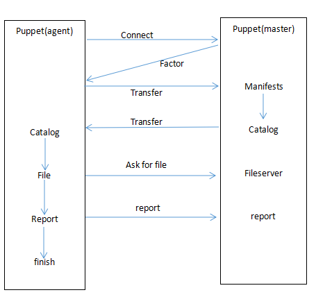

# puppet

---

[TOC]

---


### 1.什么是puppet

很多公司经常情况下会遇到这么一个问题，新应用开发完成之后，运维人员耗费了大量的时间在测试环境上完成了项目的部署，而迁移到线上环境依旧需要逐字逐句的变更配置，没日没夜的加班之后，才能够勉强保证新应用在线上环境正常运行。而与此同时，公司的领导层已经暴跳如雷，"我已经投入了大量的资金下去，为什么部署一个新的应用依旧需要花费这么久的时间？"

puppet的创始人luke kanies就曾经在这种环境中备受煎熬。于是他就开始思考，如何让系统管理员们能够更加高效的去完成工作。随即诞生的产物就是这款名为puppet的软件。

事实上，luke kanies在开发puppet之前，基本上都是采用perl来编写程序，但是当他想要用perl去编写脑中的这款程序的模型时发现无法实现。然后luke kanies尝试了python等语言，都没办法写出他心目中的功能。后来一个偶然的机会，朋友提起了ruby这种语言，表示该语言功能十分强大，所以luke kenies尝试了ruby，并且基于ruby语言开发出了puppet。

如果说企业想要多台服务器的维护成本，puppet是非常不错的工具之一，主要原因是由于puppet开源，并且功能非常完善。同样，puppet也会吸取好的建议，吸纳其他人员贡献的代码，从而不断的提升puppet的灵活程度及实用性。

---

### 2.puppet的工作过程

在大部分场景下，puppet采用的是一种C/S的模型，也可以称为M/A模型，m即master：服务端，a即agent：客户端。在master端上配置好相应的参数之后，agent端会根据master端的配置字段调整自身环境内容。

下面具体来看一下puppet是如何工作的？



1）agent和master互相建立连接，在此过程当中master必须对agent进行授权的操作，授权完成之后后续的访问请求通过ssl加密传输来进行。

2）master调用agent的factor工具获取agent主机的一些参数及变量。

3）master获取到agent的主机信息后，将发送给本机的manifests，进行配置字段查询。

4）根据匹配到agent对应的节点所需要的配置，解析编译生成catalog。（catalog又可以称为伪代码）

5）agent接收到catalog后，根据master的配置调整当前环境，例如软件包的安装等等。

6）如果涉及到文件传送，则会像master发起文件传输请求，用以获取所需文件。

7）上报当前情况。

8）结束。

---

### 3.puppet的安装

 在目前实验环境中包含两台机器：servera.example.com这台主机作为master端，serverb.example.com这台主机作为agent端。安装的puppet版本号为3.6.2的版本，原则上要求master、agent所使用的软件版本一致。如果不能保证M/A版本一致，要注意以下问题：

+ master版本高于agent版本才可能能够正常运行。

+ master和agent版本差距越大，正确运行的可能性越小，如果说一个0.2版本的agent搭配一个3.2版本的master基本上不可能正常运行。

+ 混合使用版本通常意味着无法获取完整的性能。

  在这里，我已经下载好了对应的软件，包括master、agent需要的软件包，以及提供ruby环境的软件包，如下所示：

  ```` shell
  [root@servera puppet]# ls
  facter-2.4.1-1.el7.x86_64.rpm
  hiera-1.3.4-1.el7.noarch.rpm
  puppet-3.6.2-3.el7.noarch.rpm
  puppet-firewalld-0.1.3-1.el7.noarch.rpm
  puppet-server-3.6.2-3.el7.noarch.rpm
  ruby-augeas-0.5.0-1.el7.x86_64.rpm
  rubygem-rgen-0.6.6-2.el7.noarch.rpm
  ruby-shadow-1.4.1-23.el7.x86_64.rpm
  ````

  现在我们就可以将软件进行安装，首先是master端：

  ````shell
  [root@servera puppet]# ls
  facter-2.4.1-1.el7.x86_64.rpm
  hiera-1.3.4-1.el7.noarch.rpm
  puppet-3.6.2-3.el7.noarch.rpm
  puppet-firewalld-0.1.3-1.el7.noarch.rpm
  puppet-server-3.6.2-3.el7.noarch.rpm
  ruby-augeas-0.5.0-1.el7.x86_64.rpm
  rubygem-rgen-0.6.6-2.el7.noarch.rpm
  ruby-shadow-1.4.1-23.el7.x86_64.rpm
  [root@servera puppet]# yum -y localinstall *.rpm
  Loaded plugins: product-id, subscription-manager
  This system is not registered to Red Hat Subscription Management. You can use subscription-manager to register.
  Examining facter-2.4.1-1.el7.x86_64.rpm: facter-2.4.1-1.el7.x86_64
  Marking facter-2.4.1-1.el7.x86_64.rpm to be installed
  Examining hiera-1.3.4-1.el7.noarch.rpm: hiera-1.3.4-1.el7.noarch
  Marking hiera-1.3.4-1.el7.noarch.rpm to be installed
  Examining puppet-3.6.2-3.el7.noarch.rpm: puppet-3.6.2-3.el7.noarch
  Marking puppet-3.6.2-3.el7.noarch.rpm to be installed
  Examining puppet-firewalld-0.1.3-1.el7.noarch.rpm: puppet-firewalld-0.1.3-1.el7.noarch
  Marking puppet-firewalld-0.1.3-1.el7.noarch.rpm to be installed
  Examining puppet-server-3.6.2-3.el7.noarch.rpm: puppet-server-3.6.2-3.el7.noarch
  Marking puppet-server-3.6.2-3.el7.noarch.rpm to be installed
  Examining ruby-augeas-0.5.0-1.el7.x86_64.rpm: ruby-augeas-0.5.0-1.el7.x86_64
  Marking ruby-augeas-0.5.0-1.el7.x86_64.rpm to be installed
  Examining rubygem-rgen-0.6.6-2.el7.noarch.rpm: rubygem-rgen-0.6.6-2.el7.noarch
  Marking rubygem-rgen-0.6.6-2.el7.noarch.rpm to be installed
  Examining ruby-shadow-1.4.1-23.el7.x86_64.rpm: ruby-shadow-1.4.1-23.el7.x86_64
  Marking ruby-shadow-1.4.1-23.el7.x86_64.rpm to be installed
  Resolving Dependencies
  --> Running transaction check
  ---> Package facter.x86_64 0:2.4.1-1.el7 will be installed
  --> Processing Dependency: /usr/bin/ruby for package: facter-2.4.1-1.el7.x86_64
  test                                                 | 2.9 kB     00:00     
  --> Processing Dependency: pciutils for package: facter-2.4.1-1.el7.x86_64
  ---> Package hiera.noarch 0:1.3.4-1.el7 will be installed
  --> Processing Dependency: ruby(release) for package: hiera-1.3.4-1.el7.noarch
  ---> Package puppet.noarch 0:3.6.2-3.el7 will be installed
  --> Processing Dependency: ruby(selinux) for package: puppet-3.6.2-3.el7.noarch
  ---> Package puppet-firewalld.noarch 0:0.1.3-1.el7 will be installed
  ---> Package puppet-server.noarch 0:3.6.2-3.el7 will be installed
  ---> Package ruby-augeas.x86_64 0:0.5.0-1.el7 will be installed
  --> Processing Dependency: augeas-libs >= 1.0.0 for package: ruby-augeas-0.5.0-1.el7.x86_64
  --> Processing Dependency: libaugeas.so.0(AUGEAS_0.1.0)(64bit) for package: ruby-augeas-0.5.0-1.el7.x86_64
  --> Processing Dependency: libaugeas.so.0(AUGEAS_0.10.0)(64bit) for package: ruby-augeas-0.5.0-1.el7.x86_64
  --> Processing Dependency: libaugeas.so.0(AUGEAS_0.11.0)(64bit) for package: ruby-augeas-0.5.0-1.el7.x86_64
  --> Processing Dependency: libaugeas.so.0(AUGEAS_0.12.0)(64bit) for package: ruby-augeas-0.5.0-1.el7.x86_64
  --> Processing Dependency: libaugeas.so.0(AUGEAS_0.14.0)(64bit) for package: ruby-augeas-0.5.0-1.el7.x86_64
  --> Processing Dependency: libaugeas.so.0(AUGEAS_0.16.0)(64bit) for package: ruby-augeas-0.5.0-1.el7.x86_64
  --> Processing Dependency: libaugeas.so.0(AUGEAS_0.8.0)(64bit) for package: ruby-augeas-0.5.0-1.el7.x86_64
  --> Processing Dependency: libaugeas.so.0()(64bit) for package: ruby-augeas-0.5.0-1.el7.x86_64
  ---> Package ruby-shadow.x86_64 0:1.4.1-23.el7 will be installed
  ---> Package rubygem-rgen.noarch 0:0.6.6-2.el7 will be installed
  --> Processing Dependency: ruby(rubygems) for package: rubygem-rgen-0.6.6-2.el7.noarch
  --> Running transaction check
  ---> Package augeas-libs.x86_64 0:1.1.0-17.el7 will be installed
  ---> Package libselinux-ruby.x86_64 0:2.2.2-6.el7 will be installed
  ---> Package pciutils.x86_64 0:3.2.1-4.el7 will be installed
  ---> Package ruby.x86_64 0:2.0.0.598-24.el7 will be installed
  --> Processing Dependency: rubygem(bigdecimal) >= 1.2.0 for package: ruby-2.0.0.598-24.el7.x86_64
  ---> Package ruby-libs.x86_64 0:2.0.0.598-24.el7 will be installed
  ---> Package rubygems.noarch 0:2.0.14-24.el7 will be installed
  --> Processing Dependency: rubygem(rdoc) >= 4.0.0 for package: rubygems-2.0.14-24.el7.noarch
  --> Processing Dependency: rubygem(psych) >= 2.0.0 for package: rubygems-2.0.14-24.el7.noarch
  --> Processing Dependency: rubygem(io-console) >= 0.4.2 for package: rubygems-2.0.14-24.el7.noarch
  --> Running transaction check
  ---> Package rubygem-bigdecimal.x86_64 0:1.2.0-24.el7 will be installed
  ---> Package rubygem-io-console.x86_64 0:0.4.2-24.el7 will be installed
  ---> Package rubygem-psych.x86_64 0:2.0.0-24.el7 will be installed
  --> Processing Dependency: libyaml-0.so.2()(64bit) for package: rubygem-psych-2.0.0-24.el7.x86_64
  ---> Package rubygem-rdoc.noarch 0:4.0.0-24.el7 will be installed
  --> Processing Dependency: ruby(irb) = 2.0.0.598 for package: rubygem-rdoc-4.0.0-24.el7.noarch
  --> Processing Dependency: rubygem(json) >= 1.7.7 for package: rubygem-rdoc-4.0.0-24.el7.noarch
  --> Running transaction check
  ---> Package libyaml.x86_64 0:0.1.4-11.el7_0 will be installed
  ---> Package ruby-irb.noarch 0:2.0.0.598-24.el7 will be installed
  ---> Package rubygem-json.x86_64 0:1.7.7-24.el7 will be installed
  --> Finished Dependency Resolution

  Dependencies Resolved

  ============================================================================
   Package       Arch   Version       Repository                         Size
  ============================================================================
  Installing:
   facter        x86_64 2.4.1-1.el7   /facter-2.4.1-1.el7.x86_64        271 k
   hiera         noarch 1.3.4-1.el7   /hiera-1.3.4-1.el7.noarch          54 k
   puppet        noarch 3.6.2-3.el7   /puppet-3.6.2-3.el7.noarch        4.2 M
   puppet-firewalld
                 noarch 0.1.3-1.el7   /puppet-firewalld-0.1.3-1.el7.noarch
                                                                         46 k
   puppet-server noarch 3.6.2-3.el7   /puppet-server-3.6.2-3.el7.noarch 5.6 k
   ruby-augeas   x86_64 0.5.0-1.el7   /ruby-augeas-0.5.0-1.el7.x86_64    52 k
   ruby-shadow   x86_64 1.4.1-23.el7  /ruby-shadow-1.4.1-23.el7.x86_64   21 k
   rubygem-rgen  noarch 0.6.6-2.el7   /rubygem-rgen-0.6.6-2.el7.noarch  307 k
  Installing for dependencies:
   augeas-libs   x86_64 1.1.0-17.el7  test                              332 k
   libselinux-ruby
                 x86_64 2.2.2-6.el7   test                              127 k
   libyaml       x86_64 0.1.4-11.el7_0
                                      test                               55 k
   pciutils      x86_64 3.2.1-4.el7   test                               90 k
   ruby          x86_64 2.0.0.598-24.el7
                                      test                               67 k
   ruby-irb      noarch 2.0.0.598-24.el7
                                      test                               88 k
   ruby-libs     x86_64 2.0.0.598-24.el7
                                      test                              2.8 M
   rubygem-bigdecimal
                 x86_64 1.2.0-24.el7  test                               79 k
   rubygem-io-console
                 x86_64 0.4.2-24.el7  test                               50 k
   rubygem-json  x86_64 1.7.7-24.el7  test                               75 k
   rubygem-psych x86_64 2.0.0-24.el7  test                               77 k
   rubygem-rdoc  noarch 4.0.0-24.el7  test                              318 k
   rubygems      noarch 2.0.14-24.el7 test                              212 k

  Transaction Summary
  ============================================================================
  Install  8 Packages (+13 Dependent packages)

  Total size: 9.3 M
  Total download size: 4.3 M
  Installed size: 19 M
  Downloading packages:
  (1/13): augeas-libs-1.1.0-17.el7.x86_64.rpm            | 332 kB   00:00     
  (2/13): libselinux-ruby-2.2.2-6.el7.x86_64.rpm         | 127 kB   00:00     
  (3/13): libyaml-0.1.4-11.el7_0.x86_64.rpm              |  55 kB   00:00     
  (4/13): pciutils-3.2.1-4.el7.x86_64.rpm                |  90 kB   00:00     
  (5/13): ruby-2.0.0.598-24.el7.x86_64.rpm               |  67 kB   00:00     
  (6/13): ruby-irb-2.0.0.598-24.el7.noarch.rpm           |  88 kB   00:00     
  (7/13): ruby-libs-2.0.0.598-24.el7.x86_64.rpm          | 2.8 MB   00:00     
  (8/13): rubygem-bigdecimal-1.2.0-24.el7.x86_64.rpm     |  79 kB   00:00     
  (9/13): rubygem-io-console-0.4.2-24.el7.x86_64.rpm     |  50 kB   00:00     
  (10/13): rubygem-json-1.7.7-24.el7.x86_64.rpm          |  75 kB   00:00     
  (11/13): rubygem-psych-2.0.0-24.el7.x86_64.rpm         |  77 kB   00:00     
  (12/13): rubygem-rdoc-4.0.0-24.el7.noarch.rpm          | 318 kB   00:00     
  (13/13): rubygems-2.0.14-24.el7.noarch.rpm             | 212 kB   00:00     
  ----------------------------------------------------------------------------
  Total                                          6.6 MB/s | 4.3 MB  00:00     
  Running transaction check
  Running transaction test
  Transaction test succeeded
  Running transaction
    Installing : ruby-libs-2.0.0.598-24.el7.x86_64                       1/21 
    Installing : hiera-1.3.4-1.el7.noarch                                2/21 
    Installing : ruby-shadow-1.4.1-23.el7.x86_64                         3/21 
    Installing : augeas-libs-1.1.0-17.el7.x86_64                         4/21 
    Installing : ruby-augeas-0.5.0-1.el7.x86_64                          5/21 
    Installing : libyaml-0.1.4-11.el7_0.x86_64                           6/21 
    Installing : rubygem-bigdecimal-1.2.0-24.el7.x86_64                  7/21 
    Installing : rubygem-json-1.7.7-24.el7.x86_64                        8/21 
    Installing : rubygem-psych-2.0.0-24.el7.x86_64                       9/21 
    Installing : rubygem-rdoc-4.0.0-24.el7.noarch                       10/21 
    Installing : ruby-irb-2.0.0.598-24.el7.noarch                       11/21 
    Installing : ruby-2.0.0.598-24.el7.x86_64                           12/21 
    Installing : rubygems-2.0.14-24.el7.noarch                          13/21 
    Installing : rubygem-io-console-0.4.2-24.el7.x86_64                 14/21 
    Installing : rubygem-rgen-0.6.6-2.el7.noarch                        15/21 
    Installing : pciutils-3.2.1-4.el7.x86_64                            16/21 
    Installing : facter-2.4.1-1.el7.x86_64                              17/21 
    Installing : libselinux-ruby-2.2.2-6.el7.x86_64                     18/21 
    Installing : puppet-3.6.2-3.el7.noarch                              19/21 
    Installing : puppet-server-3.6.2-3.el7.noarch                       20/21 
    Installing : puppet-firewalld-0.1.3-1.el7.noarch                    21/21 
    Verifying  : ruby-augeas-0.5.0-1.el7.x86_64                          1/21 
    Verifying  : libselinux-ruby-2.2.2-6.el7.x86_64                      2/21 
    Verifying  : puppet-server-3.6.2-3.el7.noarch                        3/21 
    Verifying  : rubygem-io-console-0.4.2-24.el7.x86_64                  4/21 
    Verifying  : pciutils-3.2.1-4.el7.x86_64                             5/21 
    Verifying  : libyaml-0.1.4-11.el7_0.x86_64                           6/21 
    Verifying  : rubygem-bigdecimal-1.2.0-24.el7.x86_64                  7/21 
    Verifying  : facter-2.4.1-1.el7.x86_64                               8/21 
    Verifying  : rubygem-rdoc-4.0.0-24.el7.noarch                        9/21 
    Verifying  : hiera-1.3.4-1.el7.noarch                               10/21 
    Verifying  : puppet-3.6.2-3.el7.noarch                              11/21 
    Verifying  : rubygem-json-1.7.7-24.el7.x86_64                       12/21 
    Verifying  : ruby-libs-2.0.0.598-24.el7.x86_64                      13/21 
    Verifying  : rubygems-2.0.14-24.el7.noarch                          14/21 
    Verifying  : ruby-shadow-1.4.1-23.el7.x86_64                        15/21 
    Verifying  : augeas-libs-1.1.0-17.el7.x86_64                        16/21 
    Verifying  : ruby-irb-2.0.0.598-24.el7.noarch                       17/21 
    Verifying  : puppet-firewalld-0.1.3-1.el7.noarch                    18/21 
    Verifying  : rubygem-psych-2.0.0-24.el7.x86_64                      19/21 
    Verifying  : ruby-2.0.0.598-24.el7.x86_64                           20/21 
    Verifying  : rubygem-rgen-0.6.6-2.el7.noarch                        21/21 

  Installed:
    facter.x86_64 0:2.4.1-1.el7         hiera.noarch 0:1.3.4-1.el7            
    puppet.noarch 0:3.6.2-3.el7         puppet-firewalld.noarch 0:0.1.3-1.el7 
    puppet-server.noarch 0:3.6.2-3.el7  ruby-augeas.x86_64 0:0.5.0-1.el7      
    ruby-shadow.x86_64 0:1.4.1-23.el7   rubygem-rgen.noarch 0:0.6.6-2.el7     

  Dependency Installed:
    augeas-libs.x86_64 0:1.1.0-17.el7                                         
    libselinux-ruby.x86_64 0:2.2.2-6.el7                                      
    libyaml.x86_64 0:0.1.4-11.el7_0                                           
    pciutils.x86_64 0:3.2.1-4.el7                                             
    ruby.x86_64 0:2.0.0.598-24.el7                                            
    ruby-irb.noarch 0:2.0.0.598-24.el7                                        
    ruby-libs.x86_64 0:2.0.0.598-24.el7                                       
    rubygem-bigdecimal.x86_64 0:1.2.0-24.el7                                  
    rubygem-io-console.x86_64 0:0.4.2-24.el7                                  
    rubygem-json.x86_64 0:1.7.7-24.el7                                        
    rubygem-psych.x86_64 0:2.0.0-24.el7                                       
    rubygem-rdoc.noarch 0:4.0.0-24.el7                                        
    rubygems.noarch 0:2.0.14-24.el7                                           

  Complete!
  ````

  其次是agent端：

  ````shell
  [root@serverb puppet]# ls
  facter-2.4.1-1.el7.x86_64.rpm
  hiera-1.3.4-1.el7.noarch.rpm
  puppet-3.6.2-3.el7.noarch.rpm
  puppet-firewalld-0.1.3-1.el7.noarch.rpm
  puppet-server-3.6.2-3.el7.noarch.rpm
  ruby-augeas-0.5.0-1.el7.x86_64.rpm
  rubygem-rgen-0.6.6-2.el7.noarch.rpm
  ruby-shadow-1.4.1-23.el7.x86_64.rpm
  [root@serverb puppet]# yum -y localinstall facter-2.4.1-1.el7.x86_64.rpm hiera-1.3.4-1.el7.noarch.rpm puppet-3.6.2-3.el7.noarch.rpm puppet-firewalld-0.1.3-1.el7.noarch.rpm ruby-augeas-0.5.0-1.el7.x86_64.rpm rubygem-rgen-0.6.6-2.el7.noarch.rpm ruby-shadow-1.4.1-23.el7.x86_64.rpm 
  Loaded plugins: product-id, subscription-manager
  This system is not registered to Red Hat Subscription Management. You can use subscription-manager to register.
  Repodata is over 2 weeks old. Install yum-cron? Or run: yum makecache fast
  Examining facter-2.4.1-1.el7.x86_64.rpm: facter-2.4.1-1.el7.x86_64
  Marking facter-2.4.1-1.el7.x86_64.rpm to be installed
  Examining hiera-1.3.4-1.el7.noarch.rpm: hiera-1.3.4-1.el7.noarch
  Marking hiera-1.3.4-1.el7.noarch.rpm to be installed
  Examining puppet-3.6.2-3.el7.noarch.rpm: puppet-3.6.2-3.el7.noarch
  Marking puppet-3.6.2-3.el7.noarch.rpm to be installed
  Examining puppet-firewalld-0.1.3-1.el7.noarch.rpm: puppet-firewalld-0.1.3-1.el7.noarch
  Marking puppet-firewalld-0.1.3-1.el7.noarch.rpm to be installed
  Examining ruby-augeas-0.5.0-1.el7.x86_64.rpm: ruby-augeas-0.5.0-1.el7.x86_64
  Marking ruby-augeas-0.5.0-1.el7.x86_64.rpm to be installed
  Examining rubygem-rgen-0.6.6-2.el7.noarch.rpm: rubygem-rgen-0.6.6-2.el7.noarch
  Marking rubygem-rgen-0.6.6-2.el7.noarch.rpm to be installed
  Examining ruby-shadow-1.4.1-23.el7.x86_64.rpm: ruby-shadow-1.4.1-23.el7.x86_64
  Marking ruby-shadow-1.4.1-23.el7.x86_64.rpm to be installed
  Resolving Dependencies
  --> Running transaction check
  ---> Package facter.x86_64 0:2.4.1-1.el7 will be installed
  --> Processing Dependency: /usr/bin/ruby for package: facter-2.4.1-1.el7.x86_64
  test                                                 | 2.9 kB     00:00     
  --> Processing Dependency: pciutils for package: facter-2.4.1-1.el7.x86_64
  ---> Package hiera.noarch 0:1.3.4-1.el7 will be installed
  --> Processing Dependency: ruby(release) for package: hiera-1.3.4-1.el7.noarch
  ---> Package puppet.noarch 0:3.6.2-3.el7 will be installed
  --> Processing Dependency: ruby(selinux) for package: puppet-3.6.2-3.el7.noarch
  ---> Package puppet-firewalld.noarch 0:0.1.3-1.el7 will be installed
  ---> Package ruby-augeas.x86_64 0:0.5.0-1.el7 will be installed
  --> Processing Dependency: augeas-libs >= 1.0.0 for package: ruby-augeas-0.5.0-1.el7.x86_64
  --> Processing Dependency: libaugeas.so.0(AUGEAS_0.1.0)(64bit) for package: ruby-augeas-0.5.0-1.el7.x86_64
  --> Processing Dependency: libaugeas.so.0(AUGEAS_0.10.0)(64bit) for package: ruby-augeas-0.5.0-1.el7.x86_64
  --> Processing Dependency: libaugeas.so.0(AUGEAS_0.11.0)(64bit) for package: ruby-augeas-0.5.0-1.el7.x86_64
  --> Processing Dependency: libaugeas.so.0(AUGEAS_0.12.0)(64bit) for package: ruby-augeas-0.5.0-1.el7.x86_64
  --> Processing Dependency: libaugeas.so.0(AUGEAS_0.14.0)(64bit) for package: ruby-augeas-0.5.0-1.el7.x86_64
  --> Processing Dependency: libaugeas.so.0(AUGEAS_0.16.0)(64bit) for package: ruby-augeas-0.5.0-1.el7.x86_64
  --> Processing Dependency: libaugeas.so.0(AUGEAS_0.8.0)(64bit) for package: ruby-augeas-0.5.0-1.el7.x86_64
  --> Processing Dependency: libaugeas.so.0()(64bit) for package: ruby-augeas-0.5.0-1.el7.x86_64
  ---> Package ruby-shadow.x86_64 0:1.4.1-23.el7 will be installed
  ---> Package rubygem-rgen.noarch 0:0.6.6-2.el7 will be installed
  --> Processing Dependency: ruby(rubygems) for package: rubygem-rgen-0.6.6-2.el7.noarch
  --> Running transaction check
  ---> Package augeas-libs.x86_64 0:1.1.0-17.el7 will be installed
  ---> Package libselinux-ruby.x86_64 0:2.2.2-6.el7 will be installed
  ---> Package pciutils.x86_64 0:3.2.1-4.el7 will be installed
  ---> Package ruby.x86_64 0:2.0.0.598-24.el7 will be installed
  --> Processing Dependency: rubygem(bigdecimal) >= 1.2.0 for package: ruby-2.0.0.598-24.el7.x86_64
  ---> Package ruby-libs.x86_64 0:2.0.0.598-24.el7 will be installed
  ---> Package rubygems.noarch 0:2.0.14-24.el7 will be installed
  --> Processing Dependency: rubygem(rdoc) >= 4.0.0 for package: rubygems-2.0.14-24.el7.noarch
  --> Processing Dependency: rubygem(psych) >= 2.0.0 for package: rubygems-2.0.14-24.el7.noarch
  --> Processing Dependency: rubygem(io-console) >= 0.4.2 for package: rubygems-2.0.14-24.el7.noarch
  --> Running transaction check
  ---> Package rubygem-bigdecimal.x86_64 0:1.2.0-24.el7 will be installed
  ---> Package rubygem-io-console.x86_64 0:0.4.2-24.el7 will be installed
  ---> Package rubygem-psych.x86_64 0:2.0.0-24.el7 will be installed
  --> Processing Dependency: libyaml-0.so.2()(64bit) for package: rubygem-psych-2.0.0-24.el7.x86_64
  ---> Package rubygem-rdoc.noarch 0:4.0.0-24.el7 will be installed
  --> Processing Dependency: ruby(irb) = 2.0.0.598 for package: rubygem-rdoc-4.0.0-24.el7.noarch
  --> Processing Dependency: rubygem(json) >= 1.7.7 for package: rubygem-rdoc-4.0.0-24.el7.noarch
  --> Running transaction check
  ---> Package libyaml.x86_64 0:0.1.4-11.el7_0 will be installed
  ---> Package ruby-irb.noarch 0:2.0.0.598-24.el7 will be installed
  ---> Package rubygem-json.x86_64 0:1.7.7-24.el7 will be installed
  --> Finished Dependency Resolution

  Dependencies Resolved

  ============================================================================
   Package          Arch   Version           Repository                  Size
  ============================================================================
  Installing:
   facter           x86_64 2.4.1-1.el7       /facter-2.4.1-1.el7.x86_64 271 k
   hiera            noarch 1.3.4-1.el7       /hiera-1.3.4-1.el7.noarch   54 k
   puppet           noarch 3.6.2-3.el7       /puppet-3.6.2-3.el7.noarch 4.2 M
   puppet-firewalld noarch 0.1.3-1.el7       /puppet-firewalld-0.1.3-1.el7.noarch
                                                                         46 k
   ruby-augeas      x86_64 0.5.0-1.el7       /ruby-augeas-0.5.0-1.el7.x86_64
                                                                         52 k
   ruby-shadow      x86_64 1.4.1-23.el7      /ruby-shadow-1.4.1-23.el7.x86_64
                                                                         21 k
   rubygem-rgen     noarch 0.6.6-2.el7       /rubygem-rgen-0.6.6-2.el7.noarch
                                                                        307 k
  Installing for dependencies:
   augeas-libs      x86_64 1.1.0-17.el7      test                       332 k
   libselinux-ruby  x86_64 2.2.2-6.el7       test                       127 k
   libyaml          x86_64 0.1.4-11.el7_0    test                        55 k
   pciutils         x86_64 3.2.1-4.el7       test                        90 k
   ruby             x86_64 2.0.0.598-24.el7  test                        67 k
   ruby-irb         noarch 2.0.0.598-24.el7  test                        88 k
   ruby-libs        x86_64 2.0.0.598-24.el7  test                       2.8 M
   rubygem-bigdecimal
                    x86_64 1.2.0-24.el7      test                        79 k
   rubygem-io-console
                    x86_64 0.4.2-24.el7      test                        50 k
   rubygem-json     x86_64 1.7.7-24.el7      test                        75 k
   rubygem-psych    x86_64 2.0.0-24.el7      test                        77 k
   rubygem-rdoc     noarch 4.0.0-24.el7      test                       318 k
   rubygems         noarch 2.0.14-24.el7     test                       212 k

  Transaction Summary
  ============================================================================
  Install  7 Packages (+13 Dependent packages)

  Total size: 9.3 M
  Total download size: 4.3 M
  Installed size: 19 M
  Downloading packages:
  (1/13): augeas-libs-1.1.0-17.el7.x86_64.rpm            | 332 kB   00:00     
  (2/13): libselinux-ruby-2.2.2-6.el7.x86_64.rpm         | 127 kB   00:00     
  (3/13): libyaml-0.1.4-11.el7_0.x86_64.rpm              |  55 kB   00:00     
  (4/13): pciutils-3.2.1-4.el7.x86_64.rpm                |  90 kB   00:00     
  (5/13): ruby-2.0.0.598-24.el7.x86_64.rpm               |  67 kB   00:00     
  (6/13): ruby-libs-2.0.0.598-24.el7.x86_64.rpm          | 2.8 MB   00:00     
  (7/13): rubygem-bigdecimal-1.2.0-24.el7.x86_64.rpm     |  79 kB   00:00     
  (8/13): rubygem-io-console-0.4.2-24.el7.x86_64.rpm     |  50 kB   00:00     
  (9/13): rubygem-json-1.7.7-24.el7.x86_64.rpm           |  75 kB   00:00     
  (10/13): rubygem-psych-2.0.0-24.el7.x86_64.rpm         |  77 kB   00:00     
  (11/13): rubygem-rdoc-4.0.0-24.el7.noarch.rpm          | 318 kB   00:00     
  (12/13): rubygems-2.0.14-24.el7.noarch.rpm             | 212 kB   00:00     
  (13/13): ruby-irb-2.0.0.598-24.el7.noarch.rpm          |  88 kB   00:00     
  ----------------------------------------------------------------------------
  Total                                          9.6 MB/s | 4.3 MB  00:00     
  Running transaction check
  Running transaction test
  Transaction test succeeded
  Running transaction
    Installing : ruby-libs-2.0.0.598-24.el7.x86_64                       1/20 
    Installing : hiera-1.3.4-1.el7.noarch                                2/20 
    Installing : ruby-shadow-1.4.1-23.el7.x86_64                         3/20 
    Installing : augeas-libs-1.1.0-17.el7.x86_64                         4/20 
    Installing : ruby-augeas-0.5.0-1.el7.x86_64                          5/20 
    Installing : libyaml-0.1.4-11.el7_0.x86_64                           6/20 
    Installing : rubygem-bigdecimal-1.2.0-24.el7.x86_64                  7/20 
    Installing : rubygem-json-1.7.7-24.el7.x86_64                        8/20 
    Installing : rubygem-psych-2.0.0-24.el7.x86_64                       9/20 
    Installing : rubygem-rdoc-4.0.0-24.el7.noarch                       10/20 
    Installing : ruby-irb-2.0.0.598-24.el7.noarch                       11/20 
    Installing : ruby-2.0.0.598-24.el7.x86_64                           12/20 
    Installing : rubygems-2.0.14-24.el7.noarch                          13/20 
    Installing : rubygem-io-console-0.4.2-24.el7.x86_64                 14/20 
    Installing : rubygem-rgen-0.6.6-2.el7.noarch                        15/20 
    Installing : pciutils-3.2.1-4.el7.x86_64                            16/20 
    Installing : facter-2.4.1-1.el7.x86_64                              17/20 
    Installing : libselinux-ruby-2.2.2-6.el7.x86_64                     18/20 
    Installing : puppet-3.6.2-3.el7.noarch                              19/20 
    Installing : puppet-firewalld-0.1.3-1.el7.noarch                    20/20 
    Verifying  : ruby-augeas-0.5.0-1.el7.x86_64                          1/20 
    Verifying  : libselinux-ruby-2.2.2-6.el7.x86_64                      2/20 
    Verifying  : rubygem-io-console-0.4.2-24.el7.x86_64                  3/20 
    Verifying  : pciutils-3.2.1-4.el7.x86_64                             4/20 
    Verifying  : libyaml-0.1.4-11.el7_0.x86_64                           5/20 
    Verifying  : rubygem-bigdecimal-1.2.0-24.el7.x86_64                  6/20 
    Verifying  : facter-2.4.1-1.el7.x86_64                               7/20 
    Verifying  : rubygem-rdoc-4.0.0-24.el7.noarch                        8/20 
    Verifying  : hiera-1.3.4-1.el7.noarch                                9/20 
    Verifying  : puppet-3.6.2-3.el7.noarch                              10/20 
    Verifying  : rubygem-json-1.7.7-24.el7.x86_64                       11/20 
    Verifying  : ruby-libs-2.0.0.598-24.el7.x86_64                      12/20 
    Verifying  : rubygems-2.0.14-24.el7.noarch                          13/20 
    Verifying  : ruby-shadow-1.4.1-23.el7.x86_64                        14/20 
    Verifying  : augeas-libs-1.1.0-17.el7.x86_64                        15/20 
    Verifying  : ruby-irb-2.0.0.598-24.el7.noarch                       16/20 
    Verifying  : puppet-firewalld-0.1.3-1.el7.noarch                    17/20 
    Verifying  : rubygem-psych-2.0.0-24.el7.x86_64                      18/20 
    Verifying  : ruby-2.0.0.598-24.el7.x86_64                           19/20 
    Verifying  : rubygem-rgen-0.6.6-2.el7.noarch                        20/20 

  Installed:
    facter.x86_64 0:2.4.1-1.el7        hiera.noarch 0:1.3.4-1.el7            
    puppet.noarch 0:3.6.2-3.el7        puppet-firewalld.noarch 0:0.1.3-1.el7 
    ruby-augeas.x86_64 0:0.5.0-1.el7   ruby-shadow.x86_64 0:1.4.1-23.el7     
    rubygem-rgen.noarch 0:0.6.6-2.el7 

  Dependency Installed:
    augeas-libs.x86_64 0:1.1.0-17.el7                                         
    libselinux-ruby.x86_64 0:2.2.2-6.el7                                      
    libyaml.x86_64 0:0.1.4-11.el7_0                                           
    pciutils.x86_64 0:3.2.1-4.el7                                             
    ruby.x86_64 0:2.0.0.598-24.el7                                            
    ruby-irb.noarch 0:2.0.0.598-24.el7                                        
    ruby-libs.x86_64 0:2.0.0.598-24.el7                                       
    rubygem-bigdecimal.x86_64 0:1.2.0-24.el7                                  
    rubygem-io-console.x86_64 0:0.4.2-24.el7                                  
    rubygem-json.x86_64 0:1.7.7-24.el7                                        
    rubygem-psych.x86_64 0:2.0.0-24.el7                                       
    rubygem-rdoc.noarch 0:4.0.0-24.el7                                        
    rubygems.noarch 0:2.0.14-24.el7                                           

  Complete!
  ````

  至此，安装完成。

### 4.puppet的M/A授权###

根据我们之前的工作原理说明，可以看出建立连接的第一步应该是授权的操作，那如何来进行M/A的授权认证操作呢？实际上，master和agent共同都具有一个配置文件 :***/etc/puppet/puppet.conf***，该配置文件定义了master和agent所需要的运行环境等等参数。进程启动前，会根据此配置文件对系统环境进行一个审核的操作，审核通过后进程才会启动。

- master上的配置：

  ​        在/etc/puppet/puppet.conf文件中追加：

  ​	***[master]***

  ​	***certname=master主机的主机名称***

````shell
[root@servera puppet]# hostname
servera.example.com
[root@servera puppet]# sed -i '$a[master]\ncertname=servera.pod0.example.com' /etc/puppet/puppet.conf
[root@servera puppet]# cat /etc/puppet/puppet.conf 
[main]
    # The Puppet log directory.
    # The default value is '$vardir/log'.
    logdir = /var/log/puppet

    # Where Puppet PID files are kept.
    # The default value is '$vardir/run'.
    rundir = /var/run/puppet

    # Where SSL certificates are kept.
    # The default value is '$confdir/ssl'.
    ssldir = $vardir/ssl

[agent]
    # The file in which puppetd stores a list of the classes
    # associated with the retrieved configuratiion.  Can be loaded in
    # the separate ``puppet`` executable using the ``--loadclasses``
    # option.
    # The default value is '$confdir/classes.txt'.
    classfile = $vardir/classes.txt

    # Where puppetd caches the local configuration.  An
    # extension indicating the cache format is added automatically.
    # The default value is '$confdir/localconfig'.
    localconfig = $vardir/localconfig
[master]
certname=servera.pod0.example.com
````

- agent上的配置：

  ​        在/etc/puppet/puppet.conf文件中***[main]***字段中追加一行

  ​	***server = master主机名***

````shell
[root@serverb puppet]# sed -i '/ssldir/aserver = servera.pod0.example.com' /etc/puppet/puppet.conf 
[root@serverb puppet]# cat /etc/puppet/puppet.conf 
[main]
    # The Puppet log directory.
    # The default value is '$vardir/log'.
    logdir = /var/log/puppet

    # Where Puppet PID files are kept.
    # The default value is '$vardir/run'.
    rundir = /var/run/puppet

    # Where SSL certificates are kept.
    # The default value is '$confdir/ssl'.
    ssldir = $vardir/ssl
server = servera.pod0.example.com
[agent]
    # The file in which puppetd stores a list of the classes
    # associated with the retrieved configuratiion.  Can be loaded in
    # the separate ``puppet`` executable using the ``--loadclasses``
    # option.
    # The default value is '$confdir/classes.txt'.
    classfile = $vardir/classes.txt

    # Where puppetd caches the local configuration.  An
    # extension indicating the cache format is added automatically.
    # The default value is '$confdir/localconfig'.
    localconfig = $vardir/localconfig
````

**注意：puppet配置过程中都是通过主机名去定位对应主机，则需要在这之前做好相应的解析工作。**

分别启动master和agent端的puppet服务，先启动master端，再启动agent端

1）master端的启动，启动完成后会优先对自己主机进行认证授权操作，在***/var/lib/puppet/ssl/ca/signed***目录下会生成***本机名称.pem***的文件，结果如下：

````shell
[root@servera ~]# systemctl start puppetmaster
[root@servera ~]# cd /var/lib/puppet/ssl/ca/signed/
[root@servera signed]# ls
servera.pod0.example.com.pem
````

2）agent端的启动，启动完成后会在***/var/lib/puppet/ssl/certificate_requests***生成***agent主机名.pem***的文件，并直接将认证请求文件发送给master端，放至在master端的***/var/lib/puppet/ssl/ca/requests***目录下，结果如下：

````shell
[root@serverb ~]# systemctl start puppet
[root@serverb ~]# cd /var/lib/puppet/ssl/certificate_requests/
[root@serverb certificate_requests]# ls
serverb.pod0.example.com.pem
------------------------------------------------
[root@servera signed]# cd ../requests/
[root@servera requests]# pwd
/var/lib/puppet/ssl/ca/requests
[root@servera requests]# ls
serverb.pod0.example.com.pem
-------------------------------------
````

**注意：在此过程当中，selinux如果处于enforcing的状态，会有相应的权限问题导致agent端无法正确创建请求认证文件，可执行setenforce 0指令，将selinux状态切换成permissive模式**

3）master端授权

master端授权可通过puppet cert指令来完成：

可以先通过--help选项查看一下帮助信息：

````shell
[root@servera requests]# puppet cert  --help

puppet-cert(8) -- Manage certificates and requests
========

SYNOPSIS
--------
Standalone certificate authority. Capable of generating certificates,
but mostly used for signing certificate requests from puppet clients.


USAGE
-----
puppet cert <action> [-h|--help] [-V|--version] [-d|--debug] [-v|--verbose]
  [--digest <digest>] [<host>]


DESCRIPTION
-----------
Because the puppet master service defaults to not signing client
certificate requests, this script is available for signing outstanding
requests. It can be used to list outstanding requests and then either
sign them individually or sign all of them.

ACTIONS
-------

Every action except 'list' and 'generate' requires a hostname to act on,
unless the '--all' option is set.

* clean:
  Revoke a host's certificate (if applicable) and remove all files
  related to that host from puppet cert's storage. This is useful when
  rebuilding hosts, since new certificate signing requests will only be
  honored if puppet cert does not have a copy of a signed certificate
  for that host. If '--all' is specified then all host certificates,
  both signed and unsigned, will be removed.

* fingerprint:
  Print the DIGEST (defaults to the signing algorithm) fingerprint of a
  host's certificate.

* generate:
  Generate a certificate for a named client. A certificate/keypair will
  be generated for each client named on the command line.

* list:
  List outstanding certificate requests. If '--all' is specified, signed
  certificates are also listed, prefixed by '+', and revoked or invalid
  certificates are prefixed by '-' (the verification outcome is printed
  in parenthesis).

* print:
  Print the full-text version of a host's certificate.

* revoke:
  Revoke the certificate of a client. The certificate can be specified either
  by its serial number (given as a hexadecimal number prefixed by '0x') or by its
  hostname. The certificate is revoked by adding it to the Certificate Revocation
  List given by the 'cacrl' configuration option. Note that the puppet master
  needs to be restarted after revoking certificates.

* sign:
  Sign an outstanding certificate request.

* verify:
  Verify the named certificate against the local CA certificate.

* reinventory:
  Build an inventory of the issued certificates. This will destroy the current
  inventory file specified by 'cert_inventory' and recreate it from the
  certificates found in the 'certdir'. Ensure the puppet master is stopped
  before running this action.

OPTIONS
-------
Note that any setting that's valid in the configuration
file is also a valid long argument. For example, 'ssldir' is a valid
setting, so you can specify '--ssldir <directory>' as an
argument.

See the configuration file documentation at
http://docs.puppetlabs.com/references/stable/configuration.html for the
full list of acceptable parameters. A commented list of all
configuration options can also be generated by running puppet cert with
'--genconfig'.

* --all:
  Operate on all items. Currently only makes sense with the 'sign',
  'clean', 'list', and 'fingerprint' actions.

* --digest:
  Set the digest for fingerprinting (defaults to the digest used when
  signing the cert). Valid values depends on your openssl and openssl ruby
  extension version.

* --debug:
  Enable full debugging.

* --help:
  Print this help message

* --verbose:
  Enable verbosity.

* --version:
  Print the puppet version number and exit.


EXAMPLE
-------
    $ puppet cert list
    culain.madstop.com
    $ puppet cert sign culain.madstop.com


AUTHOR
------
Luke Kanies


COPYRIGHT
---------
Copyright (c) 2011 Puppet Labs, LLC Licensed under the Apache 2.0 License

````

根据help指令里面我们可以看到以下几个常用选项：

+ clean 用于清除所有授权信息。


+ list  用于罗列来自于所有agent的认证请求。

+ revoke 用于取消某agent的授权。

+ sign 用于给某agent的认证请求进行授权的操作。


同样，现在我们就可以在master上针对agent（serverb）进行授权的操作：

````shell
[root@servera requests]# puppet cert --list
  "serverb.example.com" (SHA256) 3A:04:7B:E5:AB:69:D0:CA:9C:DC:85:CF:66:EC:F8:61:56:6D:53:B2:BB:9F:7E:9A:9C:C6:E9:AC:E0:CE:F3:D8
[root@servera requests]# puppet cert --sign "serverb.pod0.example.com"
Notice: Signed certificate request for serverb.pod0.example.com
Notice: Removing file Puppet::SSL::CertificateRequest serverb.pod0.example.com at '/var/lib/puppet/ssl/ca/requests/serverb.example.com.pem'
[root@servera requests]# cd ../signed/
[root@servera signed]# ls
servera.pod0.example.com.pem  serverb.pod0.example.com.pem              
[root@servera signed]# pwd
/var/lib/puppet/ssl/ca/signed
````

授权完成后，master主机上，原本放在***/var/lib/puppet/ssl/ca/requests/agent主机名.pem***会移动至***/var/lib/puppet/ssl/ca/signed/agent主机名.pem***

且在agent端会生成一个新的文件：***/var/lib/puppet/ssl/certs/agent主机名.pem***

### 5.puppet的自动认证授权

采用以上方式的确可以完成一对一的授权。然而，如果要签名的agent比较多怎么办？需要一个个签名吗？其实puppet提供了一个--all选项，能够一次完成对对台agent的授权操作。

````shell
[root@servera requests]# puppet cert --sign --all
Notice: Signed certificate request for serverb.pod0.example.com
Notice: Removing file Puppet::SSL::CertificateRequest serverb.pod0.example.com at '/var/lib/puppet/ssl/ca/requests/serverb.pod0.example.com.pem
````

但是该方式依旧需要手动去进行命令的输入，可能引发的后果就是想要被加入的agent主机没办法及时获取到授权从而建立ssl连接进行传输。

现在我们的需求是：来自于某一个域名的agent主机一旦启动，发送授权请求，master主机就自动针对该主机进行签名的操作，无需手动使用puppet cert --sign指令，即自动完成认证授权。

现在再开一台服务器，主机名为serverd.example.com，作为puppet的agent端，授权操作要求自动完成。配置过程如下：

master端的配置：

````shell
[root@servera requests]# cat >> /etc/puppet/puppet.conf << END
> autosign = /etc/puppet/autosign.conf
> autosign = true
> autosign = /etc/puppet/autosign.conf
> END
[root@servera requests]# tail -n5 /etc/puppet/puppet.conf
[master]
certname=servera.pod0.example.com
autosign = /etc/puppet/autosign.conf
autosign = true
autosign = /etc/puppet/autosign.conf
[root@servera requests]# cat >> /etc/puppet/autosign.conf << END
> *.example.com
> END
[root@servera requests]# systemctl restart puppetmaster
````

agent端的配置

````shell
[root@serverd puppet]# sed -i '/ssldir/aserver = servera.pod0.example.com' /etc/puppet/puppet.conf 
[root@serverd puppet]# systemctl restart puppet
````

以上操作完成之后，立刻就可以看到授权后的结果。

master端：

````shell
[root@servera signed]# pwd
/var/lib/puppet/ssl/ca/signed
[root@servera signed]# ls
servera.pod0.example.com.pem  serverd.pod0.example.com.pem
serverb.pod0.example.com.pem  
````

agent端：

````shell
[root@serverd certs]# pwd
/var/lib/puppet/ssl/certs
[root@serverd certs]# ls
ca.pem  serverd.pod0.example.com.pem
````

----

### 6.puppet的同步机制

M/A模式下的puppet的同步更新方式有两种，

1.Agent端主动去PuppetMaster端获取配置。

 默认情况下，puppet采取此方式完成同步的操作，且在不变更同步时间配置的情况下，agent端默认30分钟找master端做一次同步。如果要自定义同步时间，可在agent端的/etc/puppet/puppet.conf中配置runinterval参数

```` shell
[root@serverb /]# echo "runinterval = 5" >> /etc/puppet/puppet.conf
[root@serverb /]# cat /etc/puppet/puppet.conf 
[main]
    # The Puppet log directory.
    # The default value is '$vardir/log'.
    logdir = /var/log/puppet

    # Where Puppet PID files are kept.
    # The default value is '$vardir/run'.
    rundir = /var/run/puppet

    # Where SSL certificates are kept.
    # The default value is '$confdir/ssl'.
    ssldir = $vardir/ssl
server = servera.pod0.example.com
[agent]
    # The file in which puppetd stores a list of the classes
    # associated with the retrieved configuratiion.  Can be loaded in
    # the separate ``puppet`` executable using the ``--loadclasses``
    # option.
    # The default value is '$confdir/classes.txt'.
    classfile = $vardir/classes.txt

    # Where puppetd caches the local configuration.  An
    # extension indicating the cache format is added automatically.
    # The default value is '$confdir/localconfig'.
    localconfig = $vardir/localconfig
runinterval = 5
[root@serverb /]# systemctl restart puppet
[root@serverb /]# tail -f /var/log/messages
Aug 13 08:41:05 serverb puppet-agent[4275]: Finished catalog run in 0.01 seconds
Aug 13 08:41:10 serverb puppet-agent[4441]: Finished catalog run in 0.01 seconds
Aug 13 08:41:15 serverb puppet-agent[4607]: Finished catalog run in 0.01 seconds
Aug 13 08:41:20 serverb puppet-agent[4773]: Finished catalog run in 0.01 seconds
...
````

采用方式1的好处：若agent由于一些原因导致配置文件损坏，可以在同步时间周期内获取到正确的配置，不需人为进行处理。同样，配置该方式十分的简单易上手，能够根据需求变更同步周期。

采用方式1的劣势：多台agent同时像master发起同步请求，master可能会面临性能瓶颈问题。当然，该劣势可通过分批同步的方式去解决。除此之外，我们需要保证master端的操作足够安全，任何人修改master端的配置参数都会被符合节点要求的agent端同步更新，譬如有人在推送的脚本中写了rm -rf /\*，该操作同样会被同步到多台agent端执行，安全性会受到很严重的威胁。 					

2.PuppetMaster端使用puppet kick命令推送配置至agent端

该方式是通过puppetmaster端的puppet kick命令来同步配置的。

优势：

安全性比较高，更新之前可给相应检查代码的时间。

更新周期容易控制。

劣势：

agent端数据被篡改后很难实现及时恢复。

锁机制导致控制不是很灵活。 

​基本上方式2逐渐被企业环境所淘汰，在这里就不做说明了。

----

### 7.puppet的监听端口号

基本上涉及网络的服务都会有监听的端口号，用以区分不同服务的访问请求。

master端监听的端口号为8140。

````shell
[root@servera signed]# netstat -tulnp | grep 8140
tcp        0      0 0.0.0.0:8140            0.0.0.0:*               LISTEN      4280/ruby 
[root@servera signed]# firewall-cmd --permanent --add-port=8140/tcp
success
[root@servera signed]# firewall-cmd --reload
success
````

如果采用agent主动连接master的方式，就需要配置防火墙以保证master端的8140端口能够接受agent主机的请求。

---

### **8.puppet基础配置**

#### 1）全局入口文件：site.pp的创建####

/etc/puppet/manifests/site.pp是全局的入口文件，agent访问master获取配置参数的第一步就是读取site.pp内容，一切的管理工作都由site.pp开始。

site.pp的作用就是用来定义哪些节点（即agent）采用什么样的模块（配置字段）。首次配置puppetmaster，应自行创建该文件。

````shell
[root@servera manifests]# cat >> /etc/puppet/manifests/site.pp << END
> node 'serverb.example.com' {               //定义了需要使用puppet管理的节点为serverb.example.com
>   include 'myfile'    //模块名称定义为myfile,也就是说serverb这台机器要同步更新的内容在myfile模块内
> }
> END
[root@servera manifests]# cat /etc/puppet/manifests/site.pp 
node 'serverb.example.com' {
        include 'myfile'
}
````

通过以上配置，可以看到，现在serverb这个节点，要接受的配置字段写在myfile模块中，而其他主机的没有任何需要同步更新的内容。如果想写多台主机同步更新myfile模块里的内容，可以通过这种方式去完成：

````shell
[root@servera manifests]# cat /etc/puppet/manifests/site.pp
node 'serverb.example.com' {
        include 'myfile'
}
node 'serverd.example.com' {
        include 'myfile'
}
...
````

上述写法表示serverb和serverd两个节点同步的模块名称为myfile，但这种写法较为繁琐，有些时候，我们能够采用正则表达式来完成节点定义的配置，如下：

````shell
[root@servera manifests]# cat /etc/puppet/manifests/site.pp
node /^(serverb|serverd)\.example\.com$/ {
        include 'myfile'
}
````

上述内容表示serverb和serverd都采用myfile模块里的配置或者：

```shell
[root@servera manifests]# cat /etc/puppet/manifests/site.pp
node /^.*\.example\.com$/ {
        include 'myfile'
}
```
任何以example.com作为结尾的主机都采用myfile模块里的配置。

当然前提是能够建立ssl连接，如果没有通过授权，即便site.pp里面定义了节点和模块的对应关系，agent端也是没有办法正确从master上拉取配置。

然而有些时候，所有的节点写到同一个配置文件里很难进行后续的维护管理。那么实际上，我们可以通过import字段进行不同节点的进行分类操作，配置文件名称自拟。例如：

````shell
[root@servera ~]# echo "import 'site.pp'" > /etc/puppet/manifests/site.pp 
[root@servera ~]# cat /etc/puppet/manifests/site.pp
import 'nodes.pp'
[root@servera ~]# cat > /etc/puppet/manifests/nodes.pp << END
> node /^.*\.example\.com$/ {
>         include 'myfile'
> }
> END
[root@servera ~]# cat /etc/puppet/manifests/nodes.pp 
node /^.*\.example\.com$/ {
        include 'myfile'
}
````

#### 2）模块的创建及常用资源配置的写法####

在上述环节里，我们include了一个模块叫做myfile。当agent端通过node节点查看到自己要同步myfile这个模块之后，便会去***/etc/puppet/modules/myfile/manifests***目录下找一个名为***init.pp***的文件。该文件也可以理解为模块入口文件。若该目录没有，则需要手动去创建出来。

````shell
[root@servera ~]# mkdir -p /etc/puppet/modules/myfile/manifests
````

创建出来之后，就应该去编写init.pp这个文件，init.pp里格式理应如下：

````shell
class 模块名 {
	类型1　{ "标题1"：
	  属性1 => 值1，
	  属性2 => 值2，
	  属性3 => 值3
	  ...
	  属性N => 值N；
	  "标题2"：
	  属性 => 值，
	  .....
	  属性 => 值；
	}
	类型2 { "标题"：
	属性 => 值,
	....
	}
}
````

实际类型指的是操作的对象，标题指的是操作的实际目标，属性指的是控制的实际内容，值对应的是状态。

举个例子：现在我想给agent安装一个名为httpd的软件包，于是我们就可以这样写

````shell
package { “httpd”         # 操作的对象是软件，操作的实际目标是httpd 
 	ensure => present,    # 要求操作的实际内容是保证httpd存在或者不存在，状态为存在，即要求该软件安装
}
````

**puppet常用类型及属性简介**

**1.file类型（针对文件做操作的类型）**

常用属性：

​	ensure => 'absent|present|directory|link'         

​	group => ‘文件所属组名称’

​	 user => '文件拥有者名称'

​	mode => ‘文件权限值’

​	content => '文件内容'

​	force => ‘true|false’  	

​	source =>	

**file属性应用案例**：

推送/etc/fstab文件

/etc/fstab文件决定了开机时候的挂载情况，针对提供相同功能的主机，通常情况下挂载信息也是大同小异的，在这里我们就可以将文件推送给调用该模块的节点。

````shell
[root@servera etc]# cat /etc/puppet/modules/myfile/manifests/init.pp 
class myfile {
	file {"/etc/fstab":
	ensure => present,
	owner => root,
	group => root,
	source => 'puppet://servera.example.com/modules/myfile/etc/fstab',
	}
}
[root@servera etc]# mkdir -p /etc/puppet/modules/myfile/files/etc 
[root@servera files]# cp /etc/fstab /etc/puppet/modules/myfile/files/etc/fstab


注：以上souce代表的是源文件所在位置，不需要写files目录，默认就会去files目录下寻找相应的文件。


写完配置后，不需要重启服务，客户端就根据一定的同步周期去获取对应的配置文件了，可以通过日志看到相应的结果。
[root@serverb ~]# tailf /var/log/messages
Aug 16 11:24:17 serverb puppet-agent[4734]: Finished catalog run in 0.01 seconds
Aug 16 11:24:22 serverb puppet-agent[4900]: (/Stage[main]/Myfile/File[/etc/fstab]) Could not evaluate: Could not retrieve information from environment production source(s) puppet://servera.example.com/modules/myfile/etc/fstab
Aug 16 11:24:22 serverb puppet-agent[4900]: Finished catalog run in 0.04 seconds
Aug 16 11:24:27 serverb puppet-agent[5068]: (/Stage[main]/Myfile/File[/etc/fstab]) Could not evaluate: Could not retrieve information from environment production source(s) puppet://servera.example.com/modules/myfile/etc/fstab
Aug 16 11:24:27 serverb puppet-agent[5068]: Finished catalog run in 0.04 seconds
Aug 16 11:24:32 serverb puppet-agent[5236]: (/Stage[main]/Myfile/File[/etc/fstab]) Could not evaluate: Could not retrieve information from environment production source(s) puppet://servera.example.com/modules/myfile/etc/fstab
Aug 16 11:24:32 serverb puppet-agent[5236]: Finished catalog run in 0.04 seconds
Aug 16 11:24:37 serverb puppet-agent[5404]: (/Stage[main]/Myfile/File[/etc/fstab]) Could not evaluate: Could not retrieve information from environment production source(s) puppet://servera.example.com/modules/myfile/etc/fstab
Aug 16 11:24:37 serverb puppet-agent[5404]: Finished catalog run in 0.04 seconds
Aug 16 11:24:42 serverb puppet-agent[5572]: (/Stage[main]/Myfile/File[/etc/fstab]/content) content changed '{md5}71c72e221409b343ed9a69f9a2dfa15c' to '{md5}ff16538739bfe5d524783750dd88ae30'
````

**2.user、group类型应用（针对用户和组的设定类型）**

| user常用属性                        |                   group常用属性 |
| ------------------------------- | --------------------------: |
| ensure  => 'present \| absent ' | ensure => 'present\|absent' |
| uid => ’uid 编号‘                 |              gid => 'gid编号' |
| gid => '默认组编号'                  |                             |
| home => '家目录存放位置'               |                             |
| shell => '用户使用shell'            |                             |

**用户和组应用案例：**

部署多台主机创建tomcat用户。如果说想要部署jsp页面的话，会用到servlet容器，而tomcat就是比较常用的容器。若是采用jsvc的方式启动tomcat这个服务的话，就需要有一个名为tomcat的用户用来维护服务的正常运行。这个案例就是用来针对多台主机批量部署tomcat用户的典型案例。

    [root@servera etc]# vim /etc/puppet/modules/myfile/manifests/init.pp 
     class myfile {
     user { 'tomcat':
            require => group['tomcat'],
            ensure => present,
            uid => '666',
            gid => '666',
            home => '/home/tomcat',
            shell => '/sbin/nologin',
            }
            group { 'tomcat':
            ensure => present,
            gid => '666',
            }
            file { '/home/tomcat':
            ensure => directory,
            mode => '700',
            owner => 'tomcat',
            group => 'tomcat',
            require => user['tomcat'],
            }
         }


require资源是一个公有资源，代表的含义就是其他类型内容先执行，再执行当前类型。

比如说上文在user类型里写了 require => group['tomcat'], 那么实际上代表的含义就是先去执行group类型，标题为tomcat的内容，再来执行user类型tomcat标题的内容。于是我们从日志当中也能看到结果：组先被创建出来了，其次是用户，最后是家目录。

````shell
[root@serverb ~]# tail /var/log/messages
Aug 16 11:37:37 serverb puppet-agent[31620]: (/Stage[main]/Myfile/Group[tomcat]/ensure) created
Aug 16 11:37:37 serverb puppet-agent[31620]: (/Stage[main]/Myfile/User[tomcat]/ensure) created
Aug 16 11:37:37 serverb puppet-agent[31620]: (/Stage[main]/Myfile/File[/home/tomcat]/ensure) created
[root@serverb ~]# id tomcat
uid=666(tomcat) gid=666(tomcat) groups=666(tomcat)
[root@serverb ~]# ll -d /home/tomcat/
drwx------. 2 tomcat tomcat 6 Aug 16 11:37 /home/tomcat/
````

**3.package类型应用（针对软件的操作）**

package常用属性：

ensure => present | absent                   

默认情况下package资源采用yum的方式安装软件，如果要使用rpm的方式安装，则需要添加以下两个参数。

```shell
source => '/tmp/nginx-1.8.0-1.el7.ngx.x86_64.rpm',    //指定软件绝对路径
provider => 'rpm',				//指定由rpm的方式来进行安装
```

package属性应用案例：

批量部署数据库mysql环境，多台服务器安装mariadb-server：

master端配置：

````shell
[root@servera etc]# vim /etc/puppet/modules/myfile/manifests/init.pp
  class myfile {
  		package {'mariadb-server':
        ensure => present,
        }
  }
````

agent端结果：

````shell
[root@serverb tmp]# tail /var/log/messages -f
Aug 16 18:44:19 serverb yum[109385]: Installed: perl-Data-Dumper-2.145-3.el7.x86_64
Aug 16 18:44:20 serverb yum[109385]: Installed: 1:perl-Compress-Raw-Zlib-2.061-4.el7.x86_64
Aug 16 18:44:20 serverb yum[109385]: Installed: perl-Net-Daemon-0.48-5.el7.noarch
Aug 16 18:44:20 serverb yum[109385]: Installed: perl-Compress-Raw-Bzip2-2.061-3.el7.x86_64
Aug 16 18:44:20 serverb yum[109385]: Installed: perl-IO-Compress-2.061-2.el7.noarch
Aug 16 18:44:20 serverb yum[109385]: Installed: perl-PlRPC-0.2020-14.el7.noarch
Aug 16 18:44:20 serverb yum[109385]: Installed: perl-DBI-1.627-4.el7.x86_64
Aug 16 18:44:20 serverb yum[109385]: Installed: perl-DBD-MySQL-4.023-5.el7.x86_64
Aug 16 18:44:22 serverb yum[109385]: Installed: 1:mariadb-5.5.41-2.el7_0.x86_64
Aug 16 18:44:24 serverb systemd: Reloading.
Aug 16 18:44:25 serverb systemd: [/usr/lib/systemd/system/dm-event.socket:10] Unknown lvalue 'RemoveOnStop' in section 'Socket'
Aug 16 18:44:25 serverb systemd: [/usr/lib/systemd/system/lvm2-lvmetad.socket:9] Unknown lvalue 'RemoveOnStop' in section 'Socket'
Aug 16 18:44:25 serverb yum[109385]: Installed: 1:mariadb-server-5.5.41-2.el7_0.x86_64
Aug 16 18:44:26 serverb puppet-agent[109199]: (/Stage[main]/Myfile/Package[mariadb-server]/ensure) created

[root@serverb tmp]# rpm -q mariadb-server
mariadb-server-5.5.41-2.el7_0.x86_64
````

**4.service资源应用（针对服务状态的控制）**

常用属性

enable => 'true|false'     // 定义开机启动状态

ensure => ‘running | stopped’   //定义当前环境运行状态

service属性应用案例：

让mariadb服务运行起来，并且开机自启：

master端配置：

````shell
[root@servera etc]# vim /etc/puppet/modules/myfile/manifests/init.pp 
class myfile {
   package {'mariadb-server':
        ensure => present,
        }
        service {'mariadb':
        require => package['mariadb-server'],
        ensure => running,
        enable => true,
        }
}
````

agent端结果：

````shell
[root@serverb tmp]# tail -f /var/log/messages
Aug 16 18:55:21 serverb systemd: Started MariaDB database server.
Aug 16 18:55:22 serverb systemd: Reloading.
Aug 16 18:55:22 serverb systemd: [/usr/lib/systemd/system/dm-event.socket:10] Unknown lvalue 'RemoveOnStop' in section 'Socket'
Aug 16 18:55:22 serverb systemd: [/usr/lib/systemd/system/lvm2-lvmetad.socket:9] Unknown lvalue 'RemoveOnStop' in section 'Socket'
Aug 16 18:55:22 serverb puppet-agent[2453]: (/Stage[main]/Myfile/Service[mariadb]/ensure) ensure changed 'stopped' to 'running'

[root@serverb tmp]# systemctl status mariadb
mariadb.service - MariaDB database server
   Loaded: loaded (/usr/lib/systemd/system/mariadb.service; enabled)
   Active: active (running) since Tue 2016-08-16 18:55:21 EDT; 17s ago
 Main PID: 2721 (mysqld_safe)
   CGroup: /system.slice/mariadb.service
           ├─2721 /bin/sh /usr/bin/mysqld_safe --basedir=/usr
           └─2878 /usr/libexec/mysqld --basedir=/usr --datadir=/var/lib/mys...

Aug 16 18:55:19 serverb.example.com mariadb-prepare-db-dir[2642]: The lates...
Aug 16 18:55:19 serverb.example.com mariadb-prepare-db-dir[2642]: You can f...
Aug 16 18:55:19 serverb.example.com mariadb-prepare-db-dir[2642]: http://de...
Aug 16 18:55:19 serverb.example.com mariadb-prepare-db-dir[2642]: Support M...
Aug 16 18:55:19 serverb.example.com mariadb-prepare-db-dir[2642]: Corporati...
Aug 16 18:55:19 serverb.example.com mariadb-prepare-db-dir[2642]: Alternati...
Aug 16 18:55:19 serverb.example.com mariadb-prepare-db-dir[2642]: http://ma...
Aug 16 18:55:19 serverb.example.com mysqld_safe[2721]: 160816 18:55:19 mysq...
Aug 16 18:55:19 serverb.example.com mysqld_safe[2721]: 160816 18:55:19 mysq...
Aug 16 18:55:21 serverb.example.com systemd[1]: Started MariaDB database se...
Hint: Some lines were ellipsized, use -l to show in full.
````

以上这些属性就是常用的一些属性了，当然并没有包含所有的属性，如果有需求，可以访问https://docs.puppet.com/获取更详细的信息。

**5.公有属性应用**

 通常情况下，每一个资源配置都会有一个依赖关系，比如说，配置httpd服务的配置文件的前提就是httpd的软件已经安装，再比如，改完服务的配置文件需要将配置文件重新加载起来。这些操作就可以通过公有属性的配置将多个资源以某种方式关联起来。

1）notify

通常情况下notify属性是用来通知其他资源类型执行相应的操作。

2）subscire

和notify相反，被动通知。

3）require

require属性代表的含义是在本资源执行之前，确保其他资源已经被成功执行。

4）before

before属性和require相反，在资源执行成功后再执行其他资源。

举例：

````shell
[root@servera etc]# cat /etc/puppet/modules/myfile/manifests/init.pp 
class myfile {
	file {"/etc/dhcpd.conf":
	require => package['dhcp'],
	ensure => present,
	source => 'puppet://servera.example.com/modules/myfile/etc/dhcpd.conf',
	notify => service[dhcpd],
	}
	package{'dhcp':
		ensure => present,
	}
	service {'dhcpd':
		ensure => running,
		enable => true,
	}
}
````

课后练习实验要求：

使用以上学习内容完成以下操作：

1.以servera作为master端，server[b-e]作为agent端，配置好相应的授权。

2.在server[b-e]服务器上使用httpd搭建虚拟主机，站点名称为www.abc.com，网站根目录为/var/www/html/abc.com，要求每次配置文件修改完之后服务重启。

----

### 9.puppet的变量、模板、函数

#### 1）变量的定义及调用####

变量的定义通过$variable_name = value的方式完成。

下述例子我们申明了一个局部变量叫做content:

```shell
[root@servera manifests]# vim /etc/puppet/modules/myfile/manifests/init.pp 
class myfile {
        $content = "some content\n"
        file { "/tmp/test":
        ensure => present,
        content => "$content",
        }
}
```

变量也可以全局入口文件site.pp里申明成一个全局变量：

```shell
[root@servera manifests]# vim /etc/puppet/manifests/nodes.pp 
node /server[b-c]\.pod0\.example\.com/ {
        $content = "abc\n" 
        include 'myfile'
}
```

#### 2）facter变量的调用####

facter变量是用来获取每台节点服务器不同的一些信息参数的变量。

变量通过${::facter变量名}来调用。

````shell
 class myfile {
 	file { "/tmp/test":
        ensure => present,
        content => "${::hostname}",
        }
}
````

#### 3）模板的设置及调用####

通常情况下模板以erb作为结尾，文件存放于模块目录下一个叫做templates的目录下。

1）生成模板文件

```shell
[root@servera myfile]# pwd
/etc/puppet/modules/myfile
[root@servera myfile]# mkdir templates
[root@servera myfile]# cd templates
[root@servera templates]# vim testfile.erb 
my ip address <%= content %>   #　在模板里面调用变量采用<%= 变量名 %>
```

2）调用模板

```shell
[root@servera manifests]# vim /etc/puppet/modules/myfile/manifests/init.pp 
class myfile {
 file { "/tmp/testfile":
        ensure => present,
        content => template('myfile/testfile.erb'), # 调用模板
        }
}
```

#### 4）函数的设置及调用####

函数是一系列资源的集合。

1）定义

定义方式如下：

```shell
[root@servera manifests]# pwd
/etc/puppet/modules/myfile/manifests
[root@servera manifests]# vim init.pp 
class myfile {
        define create_file($myfile,$mycontent) {
                file { "$myfile":
                ensure => present,
                content => "$mycontent",
                }
        }
}

```

2）调用

调用方式如下：

```shell
[root@servera manifests]# cd /etc/puppet/manifests/
[root@servera manifests]# ls
nodes.pp  site.pp
[root@servera manifests]# vim nodes.pp 
node /server[b-c]\.pod0\.example\.com/ {
	$content = "abc\n"
	include 'myhttpd','myssh','myfile'
          myfile::create_file { "xxxxxx":  #函数的调用
                myfile => '/tmp/qwer',
                mycontent => "qwer\n",
        }
}
```

课后练习：


