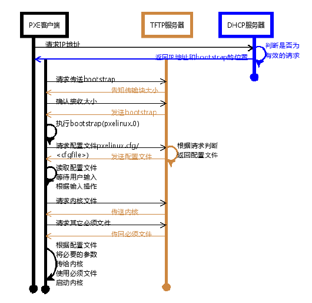
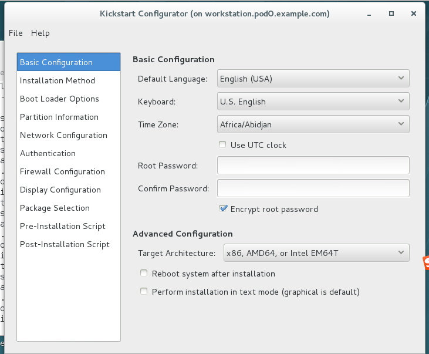

# 网络无人值守安装#

[TOC]


## 网络无人值守安装的作用

常见的Linux安装方式有光盘安装和U盘安装两种，如果我们有几十台甚至上百台服务器需要统一部署上架，不论是光盘安装还是U盘安装，在生产环境中都需要一台一台的逐个安装，即使你有足够多的光驱并刻录足够多的光盘，你也会发现这是一个既耗时又耗力的苦差事。因此，我们就希望于使用一种可以批量化部署的方案，以此解决减少部署时间和部署负责度的问题。这种方法就是网络无人值守安装方案。

网络无人值守安装就是通过网络启动时推送启动或安装选项，通过匹配被安装服务器的网卡MAC地址段确认安装源和安装方式的一种技术集合，它不是一种技术而是多种技术组合完成的。

## 网络无人值守安装的流程简介

1）DHCP：用以分配ip地址

2）预启动施行环境（PXE）：通过网卡引导计算机

3）PXELINUX：提供引导文件及内核等文件

4）kickstart文件：提供安装介质




## DHCP的部署

### dhcp简介

DHCP是DynamicHostConfigurationProtocol的缩写。

它的前身是BOOTP。BOOTP原本是用于无盘主机连接的网络上面的：网络主机使用BOOTROM而不是磁盘起动并连接上网络﹐BOOTP则可以自动地为那些主机设定TCP/IP环境。但BOOTP有一个缺点：在设定前须事先获得客户端的硬件MAC地址，而且与IP的对应是静态的。换而言之，BOOTP非常缺乏"动态性"，若在有限的IP资源环境中，BOOTP的一对一的对应关系会造成非常大的浪费。DHCP可以看作是BOOTP的增强版本﹐它分为两个部份：服务器端和客户端。所有的IP地址设定资料都由DHCP服务器集中管理﹐并负责处理客户端的DHCP要求；而客户端则会使用从服务器分配下来的IP环境资料。比较起BOOTP，DHCP透过“租约”的概念，有效且动态的分配客户端的TCP/IP设定，而且作为兼容考量，DHCP也完全照顾了BOOTPClient 的需求。

当DHCP 客户端第一次登录网络的时候，也就是客户发现本机上没有任何 IP 资料，它会向网络发出一个 DHCPDISCOVER封包。因为客户端还不知道自己属于哪一个网络，所以封包的来源位址会为 0.0.0.0 ，而目的位址则为 255.255.255.255 ，然后再附上DHCPDISCOVER 的信息，向网络进行广播。 当 DHCP 服务器监听到客户端发出的DHCPDISCOVER 广播后，它会从那些还没有租出的IP地址范围内按一定顺序选出一个IP 地址 ，连同其它TCP/IP 设置，回应给客户端一个DHCPOFFER 封包。由于客户端在开始的时候还没有 IP 位址，所以在其DHCPDISCOVER 封包内会带有其MAC 地址信息，并且有一个 XID 编号来辨别该封包，DHCP 服务器回应的DHCPOFFER封包则会根据这些资料传递给要求租约的客户。根据服务器端的设置，DHCPOFFER封包会包含一个租约期限的信息。如果客户端收到网络上多台DHCP 服务器的回应，只会挑选其中一个DHCPOFFER(通常是最先抵达的那个)，并且会向网络发送一个DHCPREQUEST广播封包，告诉所有DHCP 服务器它将指定接受哪一台服务器提供的 IP 地址。同时，客户端还会向网络发送一个ARP 封包，查询网络上面有没有其它机器使用该 IP 地址；如果发现该 IP 已经被占用，客户端则会送出一DHCPDECLINE 封包给 DHCP 服务器，拒绝接受其 DHCPOFFER，并重新发送 DHCPDISCOVER 信息。 当 DHCP 服务器接收到客户端的 DHCPREQUEST 之后，会向客户端发出一个DHCPACK 回应，以确认 IP 租约的正式生效，也就结束了一个完整的DHCP 工作过程。

**注意：dhcp是不能跨物理网络的，同样，如果说同一个环境中有多个dhcp服务器，则会选择使用最先返回结果的那个dhcp服务器提供的IP地址。**

所以在实验环境里，我们统一关闭eth0，以192.168.0.0/24网段的服务器来进行试验。

基础环境配置如下：

servera作为网关，serverg作为配置整体服务的服务器。

1）serverg关闭eth0

```shell
[kiosk@foundation0 Desktop]$ ssh root@172.25.0.10
Last login: Thu Dec  8 08:02:03 2016 from 172.25.0.250
[root@servera ~]# ssh root@192.168.0.16
The authenticity of host '192.168.0.16 (192.168.0.16)' can't be established.
ECDSA key fingerprint is 0b:1f:3b:13:2e:d2:10:53:4c:3d:c8:f4:86:24:d3:5e.
Are you sure you want to continue connecting (yes/no)? yes
Warning: Permanently added '192.168.0.16' (ECDSA) to the list of known hosts.
root@192.168.0.16's password: 
Last login: Thu Dec  8 08:01:22 2016 from 172.25.0.250
[root@serverg ~]# vim /etc/sysconfig/network-scripts/ifcfg-eth1
DEVICE=eth1
BOOTPROTO=static
ONBOOT=yes
TYPE=Ethernet
USERCTL=yes
IPV6INIT=no
IPADDR=192.168.0.16
GATEWAY=192.168.0.10
NETMASK=255.255.255.0
[root@serverg ~]# systemctl restart network
[root@serverg ~]# route -n 
Kernel IP routing table
Destination     Gateway         Genmask         Flags Metric Ref    Use Iface
0.0.0.0         192.168.0.10    0.0.0.0         UG    0      0        0 eth1
172.25.0.0      0.0.0.0         255.255.255.0   U     0      0        0 eth0
192.168.0.0     0.0.0.0         255.255.255.0   U     0      0        0 eth1
192.168.1.0     0.0.0.0         255.255.255.0   U     0      0        0 eth2
[root@serverg ~]# ifdown eth0
```

2）servera配置防火墙规则，让serverg访问172.25.254.250的数据包能够出去

```shell
[root@servera ~]# vim /etc/sysctl.conf 
net.ipv4.ip_forward = 1
[root@servera ~]# sysctl -p
net.ipv4.ip_forward = 1
[root@servera ~]# iptables -t nat -A POSTROUTING -s 192.168.0.0/24 -j SNAT --to-source 172.25.0.10
[root@serverg ~]# mount 172.25.254.250:/content /mnt
```

### 配置 DHCP

1）安装软件包

```shell
[root@serverg mnt]# yum -y install dhcp
Loaded plugins: langpacks
rhel_dvd                                                 | 4.1 kB     00:00     
(1/2): rhel_dvd/group_gz                                   | 134 kB   00:00     
(2/2): rhel_dvd/primary_db                                 | 3.4 MB   00:00     
Resolving Dependencies
--> Running transaction check
---> Package dhcp.x86_64 12:4.2.5-36.el7 will be installed
--> Finished Dependency Resolution

Dependencies Resolved

================================================================================
 Package       Arch            Version                  Repository         Size
================================================================================
Installing:
 dhcp          x86_64          12:4.2.5-36.el7          rhel_dvd          510 k

Transaction Summary
================================================================================
Install  1 Package

Total download size: 510 k
Installed size: 1.4 M
Downloading packages:
dhcp-4.2.5-36.el7.x86_64.rpm                               | 510 kB   00:00     
Running transaction check
Running transaction test
Transaction test succeeded
Running transaction
  Installing : 12:dhcp-4.2.5-36.el7.x86_64                                  1/1 
  Verifying  : 12:dhcp-4.2.5-36.el7.x86_64                                  1/1 

Installed:
  dhcp.x86_64 12:4.2.5-36.el7                                                   

Complete!

```

2）配置DHCP服务

```shell
[root@serverg mnt]# cp /usr/share/doc/dhcp-4.2.5/dhcpd.conf.example /etc/dhcp/dhcpd.conf 
cp: overwrite ‘/etc/dhcp/dhcpd.conf’? y
[root@serverg mnt]# vim /etc/dhcp/dhcpd.conf
allow booting; # 定义能够pxe启动
allow bootp; # 定义支持bootp

option domain-name "pod0.example.com";
option domain-name-servers 172.25.254.254;
default-lease-time 600; # 租约时间
max-lease-time 7200;

log-facility local7;

subnet 192.168.0.0 netmask 255.255.255.0 {
  range 192.168.0.50 192.168.0.60;  # 地址池范围
  option domain-name-servers 172.25.254.254;  # DNS服务器地址
  option domain-name "pod0.example.com"; # 域名
  option routers 192.168.0.10; # 网关
  option broadcast-address 192.168.0.255; # 广播地址
  default-lease-time 600; # 租约时间
  max-lease-time 7200;
  next-server 192.168.0.16; # tftp的服务器ip地址
  filename "pxelinux.0"; # 下载的引导文件的名字，pxe环境的文件名字都是pxelinux.0、
}

class "foo" {
  match if substring (option vendor-class-identifier, 0, 4) = "SUNW";
}

shared-network 224-29 {
  subnet 10.17.224.0 netmask 255.255.255.0 {
    option routers rtr-224.example.org;
  }
  subnet 10.0.29.0 netmask 255.255.255.0 {
    option routers rtr-29.example.org;
  }
  pool {
    allow members of "foo";
    range 10.17.224.10 10.17.224.250;
  }
  pool {
    deny members of "foo";
    range 10.0.29.10 10.0.29.230;
  }
  
[root@serverg mnt]# systemctl restart dhcpd

```

## 配置 TFTP

PXE(Preboot Execution Environment)是由Intel设计的协议，它可以使计算机通过网络启动。协议分为客户端和服务器两端，PXE 客户端在网卡的ROM中，当计算机引导时BIOS把PXE客户端调入内存执行，并显示出命令菜单，经用户选择后，PXE客户端将放置在远端的操作系统通过网络下载到本地运行。PXE协议的成功运行需要解决以下两个问题：第一，IP由谁和如何分配分配;第二，客户端所需系统内核和其他文件从哪里得到。

对于第一个问题，可以通过DHCP 服务解决，由DHCP 服务来给PXE 客户端分配一个IP地址，同时在配置DHCP Server时，需要增加相应的PXE特有配置。比如告诉PXE客户端所需文件到哪里找。至于第二个问题，在PXE 客户端所在的ROM中，已经存在了TFTP 客户端。PXE客户端使用TFTP 客户端，通过TFTP协议到TFTP 服务器上下载所需的文件。

1）tftp的安装

```shell
[root@serverg mnt]# yum -y install tftp-server
[root@serverg mnt]# ll -d /var/lib/tftpboot/
drwxr-xr-x. 2 root root 6 Jan 27  2014 /var/lib/tftpboot/
```

2）配置pxelinux.0相关文件

```shell
[root@serverg mnt]# yum -y install syslinux   # pxelinux.0文件由该软件提供
[root@serverg mnt]# cp /usr/share/syslinux/pxelinux.0 /var/lib/tftpboot/ # 将pxelinux.0的引导放至共享目录下。
[root@serverg tftpboot]# mkdir pxelinux.cfg
[root@serverg tftpboot]# cd pxelinux.cfg/
[root@serverg pxelinux.cfg]# ls
[root@serverg pxelinux.cfg]# touch default  # 建立pxelinux的相关配置文件，配置文件名称固定为default
[root@serverg pxelinux.cfg]# pwd
/var/lib/tftpboot/pxelinux.cfg
[root@serverg pxelinux.cfg]# vim default 
default vesamenu.c32 # 提供图形界面
timeout 60 # 超时时间
display boot.msg # 介绍信息
menu background splash.jpg # 背景图片
menu title Welcome to Global Learning Services Setup! 　# 大标题

label local  # 标签
        menu label Boot from ^local drive #　标题
        menu default　# 指定超时时间里没选标题，默认从那个标题进入
        localhost 0xffff # 本地启动位置

label install
        menu label Install rhel7
        kernel vmlinuz　# 内核所在位置
        append initrd=initrd.img ks=http://192.168.0.16/myks.cfg # 指定initrd文件及后续kickstart文件所在位置
```

3）相关文件放置到/var/lib/tftpboot

```shell
[root@serverg ~]# cd /mnt/rhel7.1/x86_64/dvd/isolinux
[root@serverg isolinux]# cp boot.msg vmlinuz vesamenu.c32 initrd.img /var/lib/tftpboot/
```

4）启动TFTP服务端

```shell
[root@serverg html]# vim /etc/xinetd.d/tftp 
service tftp
{
        socket_type             = dgram
        protocol                = udp
        wait                    = yes
        user                    = root
        server                  = /usr/sbin/in.tftpd
        server_args             = -s /var/lib/tftpboot
        disable                 = no
        per_source              = 11
        cps                     = 100 2
        flags                   = IPv4
}
[root@serverg html]# systemctl restart xinetd
```

## 部署Kickstart 文件

1）编辑kickstart自动应答文件，该文件可以自己手动编辑也可通过图形化界面编辑

图形化编辑工具

```shell
[root@workstation ~]# yum -y install system-config-kickstart
[root@workstation ~]# system-config-kickstart
```



也可以直接修改kickstart文件

```shell
[root@serverg ~]# cp anaconda-ks.cfg /var/www/html/
[root@serverg ~]# cd /var/www/html/
[root@serverg html]# mv anaconda-ks.cfg myks.cfg
[root@serverg html]# vim myks.cfg 
#version=RHEL7
# System authorization information
auth --enableshadow --passalgo=sha512
# Reboot after installation 
reboot # 装完系统之后是否重启
# Use network installation
url --url="http://192.168.0.16/dvd/"  # 网络安装介质所在位置
# Use graphical install
#graphical 
text # 采用字符界面安装
# Firewall configuration
firewall --enabled --service=ssh  # 防火墙的配置
firstboot --disable 
ignoredisk --only-use=vda
# Keyboard layouts
# old format: keyboard us
# new format:
keyboard --vckeymap=us --xlayouts='us' # 键盘的配置
# System language 
lang en_US.UTF-8 # 语言制式的设置
# Network information
network  --bootproto=dhcp # 网络设置
network  --hostname=localhost.localdomain
#repo --name="Server-ResilientStorage" --baseurl=http://download.eng.bos.redhat.com/rel-eng/latest-RHEL-7/compose/Server/x86_64/os//addons/ResilientStorage
# Root password
rootpw --iscrypted nope 
# SELinux configuration
selinux --disabled
# System services
services --disabled="kdump,rhsmcertd" --enabled="network,sshd,rsyslog,ovirt-guest-agent,chronyd"
# System timezone
timezone Asia/Shanghai --isUtc
# System bootloader configuration
bootloader --append="console=tty0 crashkernel=auto" --location=mbr --timeout=1 --boot-drive=vda 
# 设置boot loader安装选项 --append指定内核参数 --location 设定引导记录的位置
# Clear the Master Boot Record
zerombr # 清空MBR
# Partition clearing information
clearpart --all --initlabel # 清空分区信息
# Disk partitioning information
part / --fstype="xfs" --ondisk=vda --size=6144 # 设置根目录的分区情况
%post # 装完系统后执行脚本部分
echo "redhat" | passwd --stdin root
useradd carol
echo "redhat" | passwd --stdin carol
# workaround anaconda requirements
%end

%packages # 需要安装的软件包
@core
%end

```

配置httpd的共享服务，将myks.cfg和安装介质放置到/var/www/html目录下

```shell
[root@serverg ~]# yum -y install httpd
[root@serverg rhel7.1]# cd /var/www/html/
[root@serverg html]# ls
myks.cfg
[root@serverg html]# chown apache myks.cfg 
[root@serverg html]# mkdir dvd
[root@serverg html]# cd /mnt/rhel7.1/x86_64/isos
[root@serverg isos]# mount -o loop rhel-server-7.1-x86_64-dvd.iso /var/www/html/dvd/
[root@serverg html]# systemctl restart httpd
```

至此，整体安装完成。

打开install虚拟机测试，测试结果略