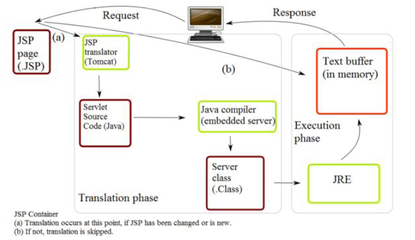
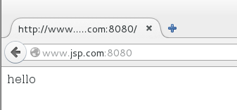
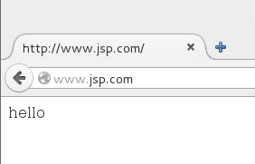
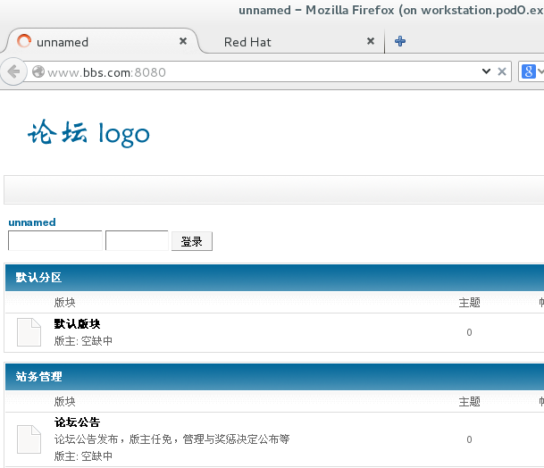
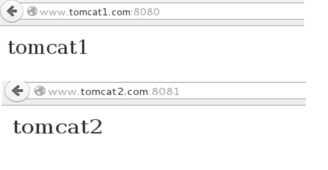

# TOMCAT配置文档#

## 1.Tomcat简介

Tomcat是一个免费的开源的Serlvet容器，它是Apache基金会的Jakarta项目中的一个核心项目，由Apache、Sun和其他一些公司及个人共同开发而成。由于有了Sun的参与和支持，最新的Servlet和JSP规范总能在Tomcat中得到体现。

简单来说apache/tomcat/servlet 这几者的关系就像：apache 是一辆车，这辆车上可以装php等物件，但是不能直接用来装像servelet 这样的水，想要装水怎么办，找个像tomcat 这样的桶。Tomcat 不能独立运行，因为真正用来解释java 页面的是jvm 程序，由tomcat 来调用jvm。



最初被发布出来的版本是Tomcat 3.0.x，当前的最新开发版本是9.0.课程环境中使用8.0 版本为例。

tomcat 官网：http://tomcat.apache.org/

## 2.TOMCAT的安装过程

1.安装jdk，tomcat本身是由java语言开发出来，需要有java虚拟机的环境才能够正常运行。

```shell
[root@servera tomcat]# rpm -ivh jdk-7u79-linux-x64.rpm 
```

2.安装tomcat

```shell
[root@servera tomcat]# mkdir /usr/local/tomcat # 创建tomcat的程序文件存放位置
[root@servera tomcat]# tar -xf apache-tomcat-8.0.24.tar.gz  -C /usr/local/tomcat   # 这里采用的是tomcat的8.0的版本，直接解压进/usr/local/tomcat目录下。
[root@servera tomcat]# cd /usr/local/tomcat
[root@servera tomcat]# ls
apache-tomcat-8.0.24
[root@servera tomcat]# cd apache-tomcat-8.0.24/
[root@servera apache-tomcat-8.0.24]# pwd
/usr/local/tomcat/apache-tomcat-8.0.24   # 该目录为tomcat服务的主目录
```

3.tomcat的基本结构

```shell
[root@servera apache-tomcat-8.0.24]# ls
bin   lib      logs    RELEASE-NOTES  temp     work
conf  LICENSE  NOTICE  RUNNING.txt    webapps
```

| bin              | lib     | logs   |
| ---------------- | ------- | ------ |
| 命令所在位置（包含状态控制脚本） | 库文件所在位置 | 日志所在位置 |
| conf             | temp    | work   |
| 配置文件所在位置         | 临时目录    | 工作目录   |
| webapps          |         |        |
| 默认网站根目录存放位置      |         |        |

4.tomcat的启动和关闭

1）启动：

```shell
[root@servera bin]# export JAVA_HOME=/usr/java/jdk1.7.0_79/    # 启动之前必须通过JAVA_HOME变量告知jdk所在路径
[root@servera bin]# ls
bootstrap.jar                 daemon.sh         startup.sh
catalina.bat                  digest.bat        tomcat-juli.jar
catalina.sh                   digest.sh         tomcat-native.tar.gz
catalina-tasks.xml            setclasspath.bat  tool-wrapper.bat
commons-daemon.jar            setclasspath.sh   tool-wrapper.sh
commons-daemon-native.tar.gz  shutdown.bat      version.bat
configtest.bat                shutdown.sh       version.sh
configtest.sh                 startup.bat
[root@servera bin]# ./startup.sh   # 调用启动脚本
Using CATALINA_BASE:   /usr/local/tomcat/apache-tomcat-8.0.24
Using CATALINA_HOME:   /usr/local/tomcat/apache-tomcat-8.0.24
Using CATALINA_TMPDIR: /usr/local/tomcat/apache-tomcat-8.0.24/temp
Using JRE_HOME:        /usr/local/java/jdk1.7.0_15/
Using CLASSPATH:       /usr/local/tomcat/apache-tomcat-8.0.24/bin/bootstrap.jar:/usr/local/tomcat/apache-tomcat-8.0.24/bin/tomcat-juli.jar
Tomcat started.
[root@servera bin]# ps -ef | grep tomcat
root      1713     1  5 07:06 pts/0    00:00:02 /usr/local/java/jdk1.7.0_15//bin/java -Djava.util.logging.config.file=/usr/local/tomcat/apache-tomcat-8.0.24/conf/logging.properties -Djava.util.logging.manager=org.apache.juli.ClassLoaderLogManager -Djava.endorsed.dirs=/usr/local/tomcat/apache-tomcat-8.0.24/endorsed -classpath /usr/local/tomcat/apache-tomcat-8.0.24/bin/bootstrap.jar:/usr/local/tomcat/apache-tomcat-8.0.24/bin/tomcat-juli.jar -Dcatalina.base=/usr/local/tomcat/apache-tomcat-8.0.24 -Dcatalina.home=/usr/local/tomcat/apache-tomcat-8.0.24 -Djava.io.tmpdir=/usr/local/tomcat/apache-tomcat-8.0.24/temp org.apache.catalina.startup.Bootstrap start
root      1737  1562  0 07:07 pts/0    00:00:00 grep --color=auto tomcat
```

2）关闭：

```shell
[root@servera bin]# ls
bootstrap.jar                 daemon.sh         startup.sh
catalina.bat                  digest.bat        tomcat-juli.jar
catalina.sh                   digest.sh         tomcat-native.tar.gz
catalina-tasks.xml            setclasspath.bat  tool-wrapper.bat
commons-daemon.jar            setclasspath.sh   tool-wrapper.sh
commons-daemon-native.tar.gz  shutdown.bat      version.bat
configtest.bat                shutdown.sh       version.sh
configtest.sh                 startup.bat
[root@servera bin]# ./shutdown.sh  # 调用关闭脚本
Using CATALINA_BASE:   /usr/local/tomcat/apache-tomcat-8.0.24
Using CATALINA_HOME:   /usr/local/tomcat/apache-tomcat-8.0.24
Using CATALINA_TMPDIR: /usr/local/tomcat/apache-tomcat-8.0.24/temp
Using JRE_HOME:        /usr/local/java/jdk1.7.0_15/
Using CLASSPATH:       /usr/local/tomcat/apache-tomcat-8.0.24/bin/bootstrap.jar:/usr/local/tomcat/apache-tomcat-8.0.24/bin/tomcat-juli.jar
[root@servera bin]# ps -ef | grep tomcat
root      1764  1562  0 07:09 pts/0    00:00:00 grep --color=auto tomcat
```

**可以看到该启动方式仅启动了一个进程，由root用户监听，相对来说不太安全。**

5.jsvc的方式启动

采用root+tomcat用户的方式启动服务。

root用户负责监听端口号。tomcat用户处理实际请求，该过程中需要有tomcat用户。

1）生成tomcat用户（uid，gid可随意指定，一般在rhel7版本中选择1-1000中未被占用的一个数字）

```shell
[root@servera tomcat]# groupadd -g 888 tomcat  
[root@servera tomcat]# useradd -g 888 -u 888 tomcat -s /sbin/nologin
[root@servera tomcat]# tar -czf - apache-tomcat-8.0.24/ | tar -xzf - -C /home/tomcat/
```

2）编译安装jsvc文件，并将jsvc文件存放至tomcat服务主目录下的bin目录下

````shell
[root@servera apache-tomcat-8.0.24]# cd bin/
[root@servera bin]# ls
bootstrap.jar                 daemon.sh         startup.sh
catalina.bat                  digest.bat        tomcat-juli.jar
catalina.sh                   digest.sh         tomcat-native.tar.gz
catalina-tasks.xml            setclasspath.bat  tool-wrapper.bat
commons-daemon.jar            setclasspath.sh   tool-wrapper.sh
commons-daemon-native.tar.gz  shutdown.bat      version.bat
configtest.bat                shutdown.sh       version.sh
configtest.sh                 startup.bat
[root@servera bin]# pwd
/home/tomcat/apache-tomcat-8.0.24/bin
[root@servera bin]# tar -xf commons-daemon-native.tar.gz 
[root@servera bin]# ls
bootstrap.jar                     configtest.sh     startup.bat
catalina.bat                      daemon.sh         startup.sh
catalina.sh                       digest.bat        tomcat-juli.jar
catalina-tasks.xml                digest.sh         tomcat-native.tar.gz
commons-daemon-1.0.15-native-src  setclasspath.bat  tool-wrapper.bat
commons-daemon.jar                setclasspath.sh   tool-wrapper.sh
commons-daemon-native.tar.gz      shutdown.bat      version.bat
configtest.bat                    shutdown.sh       version.sh
[root@servera bin]# cd commons-daemon-1.0.15-native-src/
[root@servera commons-daemon-1.0.15-native-src]# ls
LICENSE.txt  NOTICE.txt  README  RELEASE-NOTES.txt  unix  windows
[root@servera commons-daemon-1.0.15-native-src]# cd unix/
[root@servera unix]# ls
CHANGES.txt  configure.in  Makedefs.in  man     support
configure    INSTALL.txt   Makefile.in  native
[root@servera unix]# ./configure 
*** Current host ***
checking build system type... x86_64-unknown-linux-gnu
checking host system type... x86_64-unknown-linux-gnu
checking cached host system type... ok
*** C-Language compilation tools ***
checking for gcc... no
checking for cc... no
checking for cc... no
checking for cl... no
configure: error: no acceptable C compiler found in $PATH   # 需要安装gcc
See `config.log' for more details.
[root@servera unix]# yum -y install gcc &
[root@servera unix]# ./configure 
*** Current host ***
checking build system type... x86_64-unknown-linux-gnu
checking host system type... x86_64-unknown-linux-gnu
checking cached host system type... ok
*** C-Language compilation tools ***
checking for gcc... gcc
checking for C compiler default output file name... a.out
checking whether the C compiler works... yes
checking whether we are cross compiling... no
checking for suffix of executables... 
checking for suffix of object files... o
checking whether we are using the GNU C compiler... yes
checking whether gcc accepts -g... yes
checking for gcc option to accept ANSI C... none needed
checking for ranlib... ranlib
checking for strip... strip
*** Host support ***
checking C flags dependant on host system type... ok
*** Java compilation tools ***
checking for JDK os include directory...  linux
gcc flags added
checking how to run the C preprocessor... gcc -E
checking for egrep... grep -E
checking for ANSI C header files... yes
checking for sys/types.h... yes
checking for sys/stat.h... yes
checking for stdlib.h... yes
checking for string.h... yes
checking for memory.h... yes
checking for strings.h... yes
checking for inttypes.h... yes
checking for stdint.h... yes
checking for unistd.h... yes
checking sys/capability.h usability... no
checking sys/capability.h presence... no
checking for sys/capability.h... no
configure: WARNING: cannot find headers for libcap
*** Writing output files ***
configure: creating ./config.status
config.status: creating Makefile
config.status: creating Makedefs
config.status: creating native/Makefile
*** All done ***
Now you can issue "make"
[root@servera unix]# make
(cd native; make  all)
make[1]: Entering directory `/home/tomcat/apache-tomcat-8.0.24/bin/commons-daemon-1.0.15-native-src/unix/native'
gcc -g -O2 -DOS_LINUX -DDSO_DLFCN -DCPU=\"amd64\" -Wall -Wstrict-prototypes   -I/usr/java/jdk1.7.0_79//include -I/usr/java/jdk1.7.0_79//include/linux -c jsvc-unix.c -o jsvc-unix.o
gcc -g -O2 -DOS_LINUX -DDSO_DLFCN -DCPU=\"amd64\" -Wall -Wstrict-prototypes   -I/usr/java/jdk1.7.0_79//include -I/usr/java/jdk1.7.0_79//include/linux -c arguments.c -o arguments.o
gcc -g -O2 -DOS_LINUX -DDSO_DLFCN -DCPU=\"amd64\" -Wall -Wstrict-prototypes   -I/usr/java/jdk1.7.0_79//include -I/usr/java/jdk1.7.0_79//include/linux -c debug.c -o debug.o
gcc -g -O2 -DOS_LINUX -DDSO_DLFCN -DCPU=\"amd64\" -Wall -Wstrict-prototypes   -I/usr/java/jdk1.7.0_79//include -I/usr/java/jdk1.7.0_79//include/linux -c dso-dlfcn.c -o dso-dlfcn.o
gcc -g -O2 -DOS_LINUX -DDSO_DLFCN -DCPU=\"amd64\" -Wall -Wstrict-prototypes   -I/usr/java/jdk1.7.0_79//include -I/usr/java/jdk1.7.0_79//include/linux -c dso-dyld.c -o dso-dyld.o
gcc -g -O2 -DOS_LINUX -DDSO_DLFCN -DCPU=\"amd64\" -Wall -Wstrict-prototypes   -I/usr/java/jdk1.7.0_79//include -I/usr/java/jdk1.7.0_79//include/linux -c help.c -o help.o
gcc -g -O2 -DOS_LINUX -DDSO_DLFCN -DCPU=\"amd64\" -Wall -Wstrict-prototypes   -I/usr/java/jdk1.7.0_79//include -I/usr/java/jdk1.7.0_79//include/linux -c home.c -o home.o
gcc -g -O2 -DOS_LINUX -DDSO_DLFCN -DCPU=\"amd64\" -Wall -Wstrict-prototypes   -I/usr/java/jdk1.7.0_79//include -I/usr/java/jdk1.7.0_79//include/linux -c java.c -o java.o
gcc -g -O2 -DOS_LINUX -DDSO_DLFCN -DCPU=\"amd64\" -Wall -Wstrict-prototypes   -I/usr/java/jdk1.7.0_79//include -I/usr/java/jdk1.7.0_79//include/linux -c location.c -o location.o
gcc -g -O2 -DOS_LINUX -DDSO_DLFCN -DCPU=\"amd64\" -Wall -Wstrict-prototypes   -I/usr/java/jdk1.7.0_79//include -I/usr/java/jdk1.7.0_79//include/linux -c replace.c -o replace.o
gcc -g -O2 -DOS_LINUX -DDSO_DLFCN -DCPU=\"amd64\" -Wall -Wstrict-prototypes   -I/usr/java/jdk1.7.0_79//include -I/usr/java/jdk1.7.0_79//include/linux -c locks.c -o locks.o
gcc -g -O2 -DOS_LINUX -DDSO_DLFCN -DCPU=\"amd64\" -Wall -Wstrict-prototypes   -I/usr/java/jdk1.7.0_79//include -I/usr/java/jdk1.7.0_79//include/linux -c signals.c -o signals.o
ar cr libservice.a arguments.o debug.o dso-dlfcn.o dso-dyld.o help.o home.o java.o location.o replace.o locks.o signals.o
ranlib libservice.a
gcc   jsvc-unix.o libservice.a -ldl -lpthread -o ../jsvc
make[1]: Leaving directory `/home/tomcat/apache-tomcat-8.0.24/bin/commons-daemon-1.0.15-native-src/unix/native'
[root@servera unix]# cp jsvc /home/tomcat/apache-tomcat-8.0.24/bin/
````

3）优化tomcat命令，jsvc的方式启动实际执行的脚本为bin目录下的daemon.sh。

```shell
[root@servera bin]# ls
bootstrap.jar                     daemon.sh         startup.sh
catalina.bat                      digest.bat        tomcat-juli.jar
catalina.sh                       digest.sh         tomcat-native.tar.gz
catalina-tasks.xml                jsvc              tool-wrapper.bat
commons-daemon-1.0.15-native-src  setclasspath.bat  tool-wrapper.sh
commons-daemon.jar                setclasspath.sh   version.bat
commons-daemon-native.tar.gz      shutdown.bat      version.sh
configtest.bat                    shutdown.sh
configtest.sh                     startup.bat
[root@servera bin]# pwd
/home/tomcat/apache-tomcat-8.0.24/bin
[root@servera bin]# cp daemon.sh /etc/init.d/tomcat  # jsvc启动脚本复制到/etc/init.d目录下
[root@servera bin]# vim /etc/init.d/tomcat
CATALINA_HOME=/home/tomcat/apache-tomcat-8.0.24  # 申明tomcat命令和库文件所在位置
CATALINA_BASE=/home/tomcat/apache-tomcat-8.0.24  # 申明tomcat程序和配置文件及网站根目录所在位置
JAVA_HOME=/usr/java/jdk1.7.0_79/  # 申明jdk所在位置
```

4）运用jsvc的方式启动tomcat

```shell
[root@servera tomcat]# chown tomcat. -R apache-tomcat-8.0.24/  # 由于实际处理请求的用户身份为tomcat，该用户则必须有对应访问配置文件等的权限。
[root@servera tomcat]# service tomcat start
[root@servera tomcat]# ps -ef | grep tomcat
root     25576     1  0 07:24 ?        00:00:00 jsvc.exec -java-home /usr/local/java/jdk1.7.0_15/ -user tomcat -pidfile /usr/local/tomcat/apache-tomcat-8.0.24/logs/catalina-daemon.pid -wait 10 -outfile /usr/local/tomcat/apache-tomcat-8.0.24/logs/catalina-daemon.out -errfile &1 -classpath /usr/local/tomcat/apache-tomca-8.0.24/bin/bootstrap.jar:/usr/local/tomcat/apache-tomcat-8.0.24/bin/commons-daemon.jar:/usr/local/tomcat/apache-tomcat-8.0.24/bin/tomcat-juli.jar -Djava.util.logging.config.file=/usr/local/tomcat/apache-tomcat-8.0.24/conf/logging.properties -Djava.util.logging.manager=org.apache.juli.ClassLoaderLogManager -Djava.endorsed.dirs= -Dcatalina.base=/usr/local/tomcat/apache-tomcat-8.0.24 -Dcatalina.home=/usr/local/tomcat/apache-tomcat-8.0.24 -Djava.io.tmpdir=/usr/local/tomcat/apache-tomcat-8.0.24/temp org.apache.catalina.startup.Bootstrap
tomcat   25577 25576  3 07:24 ?        00:00:04 jsvc.exec -java-home /usr/local/java/jdk1.7.0_15/ -user tomcat -pidfile /usr/local/tomcat/apache-tomcat-8.0.24/logs/catalina-daemon.pid -wait 10 -outfile /usr/local/tomcat/apache-tomcat-8.0.24/logs/catalina-daemon.out -errfile &1 -classpath /usr/local/tomcat/apache-tomca-8.0.24/bin/bootstrap.jar:/usr/local/tomcat/apache-tomcat-8.0.24/bin/commons-daemon.jar:/usr/local/tomcat/apache-tomcat-8.0.24/bin/tomcat-juli.jar -Djava.util.logging.config.file=/usr/local/tomcat/apache-tomcat-8.0.24/conf/logging.properties -Djava.util.logging.manager=org.apache.juli.ClassLoaderLogManager -Djava.endorsed.dirs= -Dcatalina.base=/usr/local/tomcat/apache-tomcat-8.0.24 -Dcatalina.home=/usr/local/tomcat/apache-tomcat-8.0.24 -Djava.io.tmpdir=/usr/local/tomcat/apache-tomcat-8.0.24/temp org.apache.catalina.startup.Bootstrap
root     25612  1562  0 07:26 pts/0    00:00:00 grep --color=auto tomcat
```

**可以看到该方式启动了两个进程，一个进程root拥有，另一个进程由tomcat拥有**

----

## 3.TOMCAT的重点配置##

```shell
[root@servera conf]# pwd
/home/tomcat/apache-tomcat-8.0.24/conf  # 配置文件位置
[root@servera conf]# ls
Catalina             context.xml         tomcat-users.xml
catalina.policy      logging.properties  tomcat-users.xsd
catalina.properties  server.xml          web.xml
```

重点关注server.xml该配置文件，该文件为tomcat的主配置文件。

1）站点配置

```shell
[root@servera conf]# vim server.xml   
  <Host name="www.jsp.com"  appBase="jsp.com"    # 配置虚拟主机，name后面的参数为站点名称
            unpackWARs="true" autoDeploy="true">  # appBase后的参数为网站根目录，即实际jsp代码存放位置
        </Host>
[root@servera unix]# service tomcat start
[root@servera unix]# ps -ef | grep tomcat
[root@servera apache-tomcat-8.0.24]# service tomcat stop
[root@servera apache-tomcat-8.0.24]# service tomcat start
[root@servera apache-tomcat-8.0.24]# cd jsp.com/
[root@servera jsp.com]# mkdir ROOT
[root@servera jsp.com]# cd ROOT/  #实际网站代码必须放在ROOT目录下面。
[root@servera ROOT]# echo hello > index.jsp
```

访问结果测试：



注意：tomcat默认监听端口号为8080

2）端口变更：

```shell
[root@servera conf]# vim server.xml
找到以下字段：
  <Connector port="8080" protocol="HTTP/1.1"
               connectionTimeout="20000"
               redirectPort="8443" />
改为如下所示：
<Connector port="80" protocol="HTTP/1.1"
               connectionTimeout="20000"
               redirectPort="8443" />
[root@servera conf]# service tomcat stop  # 重启服务
[root@servera conf]# service tomcat start
```

访问结果如下：



---

## 4.TOMCAT的论坛搭建##

1）配置tomcat的虚拟主机

```shell
[root@servera conf]# pwd
/home/tomcat/apache-tomcat-8.0.24/conf
[root@servera conf]# vim server.xml 
 <Host name="www.bbs.com"  appBase="bbs.com"
            unpackWARs="true" autoDeploy="true">
<Valve className="org.apache.catalina.valves.AccessLogValve" directory="logs"
               prefix="localhost_access_log" suffix=".txt"
               pattern="%h %l %u %t &quot;%r&quot; %s %b" />
      </Host>
[root@servera bin]# service tomcat stop
[root@servera bin]# service tomcat start
[root@servera apache-tomcat-8.0.24]# ls
bbs.com  conf  LICENSE  NOTICE         RUNNING.txt  webapps
bin      lib   logs     RELEASE-NOTES  temp         work

```

2）将网页文件放置网站根目录下

```shell
[root@servera tomcat]# cp ejforum-2.3.zip /tmp
[root@servera tmp]# cd /home/tomcat/apache-tomcat-8.0.24/bbs.com/
[root@servera bbs.com]# ls
[root@servera bbs.com]# mkdir ROOT
[root@servera tmp]# cp ejforum-2.3/ejforum/* -r /home/tomcat/apache-tomcat-8.0.24/bbs.com/ROOT/
```

3）配置和数据库的连接

```shell
[root@servera tomcat]# tar -xf mysql-connector-java-5.1.36.tar.gz -C /tmp
[root@servera mysql-connector-java-5.1.36]# cp mysql-connector-java-5.1.36-bin.jar /home/tomcat/apache-tomcat-8.0.24/lib/ # 将数据库的连接文件放置到lib目录下
[root@servera mysql-connector-java-5.1.36]# cd /home/tomcat/apache-tomcat-8.0.24/bbs.com/ROOT/WEB-INF/
[root@servera WEB-INF]# ls
[root@servera WEB-INF]# cd conf/
[root@servera conf]# vim config.xml  # 将第一段注释掉，打开第二段和mysql的连接
<database maxActive="10" maxIdle="10" minIdle="2" maxWait="10000" 
                          username="javabbs" password="uplooking" 
                          driverClassName="com.mysql.jdbc.Driver" 
                          url="jdbc:mysql://localhost:3306/javabbs?characterEncoding=gbk&amp;autoReconnect=true&amp;autoReconnectForPools=true&amp;zeroDateTimeBehavior=convertToNull"
                          sqlAdapter="sql.MysqlAdapter"/>
```

4）配置数据库服务器

```shell
[root@servera conf]# yum -y install mariadb-server
[root@servera conf]# systemctl restart mariadb
[root@servera conf]# mysqladmin create javabbs  # 创建数据库
[root@servera script]# pwd
/tmp/ejforum-2.3/install/script
[root@servera script]# mysql javabbs < easyjforum_mysql.sql # 像数据库里面导入数据
[root@servera install]# mysql
Welcome to the MariaDB monitor.  Commands end with ; or \g.
Your MariaDB connection id is 6

Server version: 5.5.41-MariaDB MariaDB Server

Copyright (c) 2000, 2014, Oracle, MariaDB Corporation Ab and others.

Type 'help;' or '\h' for help. Type '\c' to clear the current input statement.

MariaDB [(none)]> grant all on javabbs.* to javabbs@'localhost' identified by 'uplooking';
Query OK, 0 rows affected (0.00 sec) # 授权
MariaDB [(none)]> grant all on javabbs.* to javabbs@'servera.pod0.example.com' identified by 'uplooking'; # 授权
Query OK, 0 rows affected (0.01 sec)

MariaDB [(none)]> flush privileges;
Query OK, 0 rows affected (0.00 sec)

```

5）修改权限相关

```shell
[root@servera install]# chown tomcat. -R /home/tomcat/apache-tomcat-8.0.24/ 
[root@servera install]# setenforce 0
[root@servera install]# service tomcat stop
[root@servera install]# service tomcat start
```

6）访问测试

```shell
[kiosk@foundation0 Desktop]$ rht-vmctl start workstation 
[kiosk@foundation0 Desktop]$ ssh root@172.25.0.9 -X
[root@workstation ~]# echo "172.25.0.10 www.bbs.com" >> /etc/hosts
```

访问结果如下：



----

## 5.nginx代理访问tomcat

通过上述配置，我们会发现，在客户端访问过程中，需要在$host 后添加上需要访问的端口号，略麻烦，
我们希望客户端访问的都是http 协议默认的80 端口，但是可以访问到后台多台服务器。这个时候我们可
以引入nignx，让nginx 作为代理服务器去代理用户请求。也就是说客户端找的是nginx 服务，nginx 服
务默认监听80 端口，然后nginx 将用户请求转交给后台监听不同端口的tomcat 虚拟主机。

这里以serverc作为nginx的反向代理服务器，将匹配到的所有请求转交给servera这台服务器。

```shell
[root@serverc nginx-rpms]# rpm -ivh nginx-1.8.0-1.el7.ngx.x86_64.rpm 
warning: nginx-1.8.0-1.el7.ngx.x86_64.rpm: Header V4 RSA/SHA1 Signature, key ID 7bd9bf62: NOKEY
Preparing...                          ################################# [100%]
Updating / installing...
   1:nginx-1:1.8.0-1.el7.ngx          ################################# [100%]
----------------------------------------------------------------------

Thanks for using nginx!

Please find the official documentation for nginx here:
* http://nginx.org/en/docs/

Commercial subscriptions for nginx are available on:
* http://nginx.com/products/

[root@serverc conf.d]# setenforce 0
[root@serverc nginx-rpms]# cd /etc/nginx/conf.d/
[root@serverc conf.d]# ls
default.conf  example_ssl.conf
[root@serverc conf.d]# cp default.conf www.bbs.com.conf
[root@serverc conf.d]# vim www.bbs.com.conf 
server {
    listen       80;
    server_name  www.bbs.com;
    location / {
        proxy_pass http://172.25.0.10:8080;
        proxy_set_header Host $host;
        proxy_set_header X-Forwarded-For $proxy_add_x_forwarded_for;
        proxy_next_upstream error timeout invalid_header http_500 http_502 http_503 http_504 http_404;
        proxy_set_header X-Real-IP $remote_addr;
        proxy_redirect off;
    }
}
[root@serverc conf.d]# systemctl start nginx
```

打开workstation访问测试：

```shell
[root@workstation ~]# vim /etc/hosts
172.25.0.12 www.bbs.com
[root@workstation ~]# firefox
```

测试结果图略

---

## 6.TOMCAT的数据库迁移##

数据库迁移，通常情况下数据库是最容易出现性能瓶颈的服务，于是我们先将该服务优先迁移至一台新的服务器。

迁移需求：从servera迁移至serveri。

1）程序的迁移：

```shell
[root@serveri ~]# setenforce 0
[root@serveri ~]# yum -y install mariadb-server
```

2）数据文件的迁移：

```shell
[root@servera ~]# mysqldump -A > /tmp/all.sql
[root@servera ~]# scp /tmp/all.sql 172.25.0.18:/tmp
The authenticity of host '172.25.0.18 (172.25.0.18)' can't be established.
ECDSA key fingerprint is 0b:1f:3b:13:2e:d2:10:53:4c:3d:c8:f4:86:24:d3:5e.
Are you sure you want to continue connecting (yes/no)? yes
Warning: Permanently added '172.25.0.18' (ECDSA) to the list of known hosts.
root@172.25.0.18's password: 
all.sql                                                  100%  527KB 527.1KB/s   00:00  
[root@serveri ~]# systemctl start mariadb
[root@serveri ~]# mysql < /tmp/all.sql 
[root@serveri ~]# systemctl restart mariadb
```

3）配置文件修改：

```shell
[root@servera ~]# cd /home/tomcat/
[root@servera tomcat]# cd apache-tomcat-8.0.24/
[root@servera apache-tomcat-8.0.24]# cd bbs.com/
[root@servera bbs.com]# cd ROOT/
[root@servera ROOT]# vim WEB-INF/conf/config.xml 

<database maxActive="10" maxIdle="10" minIdle="2" maxWait="10000" 
                          username="javabbs" password="uplooking" 
                          driverClassName="com.mysql.jdbc.Driver" 
                          url="jdbc:mysql://172.25.0.18:3306/javabbs?characterEncoding=gbk&amp;autoReconnect=true&amp;autoReconnectForPools=true&amp;zeroDateTimeBehavior=convertToNull"
                          sqlAdapter="sql.MysqlAdapter"/>

```

4）数据库服务器授权

```shell
[root@serveri ~]# mysql
Welcome to the MariaDB monitor.  Commands end with ; or \g.
Your MariaDB connection id is 2
Server version: 5.5.41-MariaDB MariaDB Server

Copyright (c) 2000, 2014, Oracle, MariaDB Corporation Ab and others.

Type 'help;' or '\h' for help. Type '\c' to clear the current input statement.

MariaDB [(none)]> grant all on javabbs.* to javabbs@'172.25.0.10' identified by 'uplooking';
Query OK, 0 rows affected (0.01 sec)

MariaDB [(none)]> grant all on javabbs.* to javabbs@'servera.pod0.example.com' identified by 'uplooking';
Query OK, 0 rows affected (0.00 sec)

MariaDB [(none)]> flush privileges;
Query OK, 0 rows affected (0.00 sec)
```

5）停止原servera上mysql，并访问测试

```shell
[root@servera ROOT]# systemctl stop mariadb
```

访问测试结果略

---

## 7.tomcat的程序复制##

单台tomcat的性能有限，当我们发现一台服务器无法承载当前访问量的情况下，可以考虑再复制一台tomcat，加上负载均衡的配置，实现以多台服务器同时提供服务的状态。

这里复制一台serverb作为tomcat的第二台服务器。

1.在serverb上安装jdk

```shell
[root@serverb tomcat]# rpm -ivh jdk-7u79-linux-x64.rpm  
```

2.将servera上的tomcat相关程序配置和数据文件迁移至serverb

```shell
[root@servera tomcat]# tar -czf /tmp/tomcat.tgz /home/tomcat/apache-tomcat-8.0.24/ /etc/init.d/tomcat
tar: Removing leading `/' from member names
[root@servera tomcat]# scp /tmp/tomcat.tgz 172.25.0.11:/tmp
The authenticity of host '172.25.0.11 (172.25.0.11)' can't be established.
ECDSA key fingerprint is 0b:1f:3b:13:2e:d2:10:53:4c:3d:c8:f4:86:24:d3:5e.
Are you sure you want to continue connecting (yes/no)? yes
Warning: Permanently added '172.25.0.11' (ECDSA) to the list of known hosts.
root@172.25.0.11's password: 
tomcat.tgz                                    100%   14MB  14.4MB/s   00:00    
[root@servera tomcat]# 
[root@serverb tmp]# ls
tomcat.tgz
[root@serverb tmp]# tar -xf tomcat.tgz  -C /
```

3.修改权限相关

```shell
[root@serverb tomcat]# groupadd -g 888 tomcat
[root@serverb tomcat]# useradd -u 888 tomcat -g 888 -s /sbin/nologin
useradd: warning: the home directory already exists.
Not copying any file from skel directory into it.
[root@serverb tomcat]# setenforce 0
```

4.数据库授权

```shell
MariaDB [(none)]> grant all on javabbs.* to javabbs@'172.25.0.11' identified by 'uplooking';
Query OK, 0 rows affected (0.01 sec)

MariaDB [(none)]> grant all on javabbs.* to javabbs@'serverb.pod0.example.com' identified by 'uplooking';
Query OK, 0 rows affected (0.00 sec)

MariaDB [(none)]> flush privileges;
Query OK, 0 rows affected (0.00 sec)

```

5.启动服务

```shell
[root@serverb tomcat]# service tomcat start
[root@serverb tomcat]# ps -ef | grep tomcat
root     25373     1  0 09:54 ?        00:00:00 jsvc.exec -java-home /usr/java/jdk1.7.0_79/ -user tomcat -pidfile /home/tomcat/apache-tomcat-8.0.24//logs/catalina-daemon.pid -wait 10 -outfile /home/tomcat/apache-tomcat-8.0.24//logs/catalina-daemon.out -errfile &1 -classpath /home/tomcat/apache-tomcat-8.0.24//bin/bootstrap.jar:/home/tomcat/apache-tomcat-8.0.24//bin/commons-daemon.jar:/home/tomcat/apache-tomcat-8.0.24//bin/tomcat-juli.jar -Djava.util.logging.config.file=/home/tomcat/apache-tomcat-8.0.24//conf/logging.properties -Djava.util.logging.manager=org.apache.juli.ClassLoaderLogManager -Djava.endorsed.dirs= -Dcatalina.base=/home/tomcat/apache-tomcat-8.0.24/ -Dcatalina.home=/home/tomcat/apache-tomcat-8.0.24/ -Djava.io.tmpdir=/home/tomcat/apache-tomcat-8.0.24//temp org.apache.catalina.startup.Bootstrap
tomcat   25374 25373 60 09:54 ?        00:00:04 jsvc.exec -java-home /usr/java/jdk1.7.0_79/ -user tomcat -pidfile /home/tomcat/apache-tomcat-8.0.24//logs/catalina-daemon.pid -wait 10 -outfile /home/tomcat/apache-tomcat-8.0.24//logs/catalina-daemon.out -errfile &1 -classpath /home/tomcat/apache-tomcat-8.0.24//bin/bootstrap.jar:/home/tomcat/apache-tomcat-8.0.24//bin/commons-daemon.jar:/home/tomcat/apache-tomcat-8.0.24//bin/tomcat-juli.jar -Djava.util.logging.config.file=/home/tomcat/apache-tomcat-8.0.24//conf/logging.properties -Djava.util.logging.manager=org.apache.juli.ClassLoaderLogManager -Djava.endorsed.dirs= -Dcatalina.base=/home/tomcat/apache-tomcat-8.0.24/ -Dcatalina.home=/home/tomcat/apache-tomcat-8.0.24/ -Djava.io.tmpdir=/home/tomcat/apache-tomcat-8.0.24//temp org.apache.catalina.startup.Bootstrap
root     25401  1574  0 09:54 pts/0    00:00:00 grep --color=auto tomcat
```

6.配置nginx做代理（serverc做nginx服务器，servera和serverb作为tomcat服务器，以nginx的默认规则分配负载）

```shell
[root@serverc conf.d]# vim /etc/nginx/nginx.conf 
 upstream java_pool {
        server 172.25.0.10:8080;
        server 172.25.0.11:8080;
        }
[root@serverc conf.d]# vim /etc/nginx/conf.d/www.bbs.com.conf 
server {
    listen       80;
    server_name  www.bbs.com;
    location / {
        proxy_pass http://java_pool;
        proxy_set_header Host $host;
        proxy_set_header X-Forwarded-For $proxy_add_x_forwarded_for;
        proxy_next_upstream error timeout invalid_header http_500 http_502 http_503 http_504 http_404;
        proxy_set_header X-Real-IP $remote_addr;
        proxy_redirect off;
    }
}
[root@serverc conf.d]# systemctl restart nginx
```

---

## 8.Session问题##

多个tomcat 要一起协同工作有几种办法，可以考虑的方案有以下几个：

1. 使用tomcat 自带的cluster 方式，多个tomcat 见自动实时复制session 信息，配置起来很简单。但
   这个方案的效率比较低，在大并发下表现并不好。

2. 利用nginx 的基于访问ip 的hash 路由策略，保证访问的ip 始终被路由到同一个tomcat 上，这个配
   置更简单。但是我们的应用很可能是某一个局域网大量用户同时登录，这样负载均衡就没什么作用了。

3. 利用memcached 或redis 等把多个tomcat 的session 集中管理，这是最直接的解决方案，但是操作
   起来也最为复杂。
   我们的系统既要求性能，又要比较好的利用上负载均衡，所以第3 个方案是首选。
   memcached 或redis 比较
   如果简单地比较Redis 与Memcached 的区别，大多数都会得到以下观点：
   1 Redis 不仅仅支持简单的k/v 类型的数据，同时还提供list，set，hash 等数据结构的存储。
   2 Redis 支持数据的备份，即master-slave 模式的数据备份。
   3 Redis 支持数据的持久化，可以将内存中的数据保持在磁盘中，重启的时候可以再次加载进行使用。
   在Redis 中，并不是所有的数据都一直存储在内存中的。这是和Memcached 相比一个最大的区别（我个
   人是这么认为的）。
   Redis 只会缓存所有的key 的信息，如果Redis 发现内存的使用量超过了某一个阀值，将触发swap 的操
   作，Redis 根据“swappability = age*log(size_in_memory)”计算出哪些key 对应的value 需要swap
   到磁盘。然后再将这些key 对应的value 持久化到磁盘中，同时在内存中清除。这种特性使得Redis 可以
   保持超过其机器本身内存大小的数据。当然，机器本身的内存必须要能够保持所有的key，毕竟这些数据
   是不会进行swap 操作的。
   同时由于Redis 将内存中的数据swap 到磁盘中的时候，提供服务的主线程和进行swap 操作的子线程会
   共享这部分内存，所以如果更新需要swap 的数据，Redis 将阻塞这个操作，直到子线程完成swap 操作
   后才可以进行修改。
   当从Redis 中读取数据的时候，如果读取的key 对应的value 不在内存中，那么Redis 就需要从swap 文
   件中加载相应数据，然后再返回给请求方。这里就存在一个I/O 线程池的问题。在默认的情况下，Redis
   会出现阻塞，即完成所有的swap 文件加载后才会相应。这种策略在客户端的数量较小，进行批量操作的
   时候比较合适。但是如果将Redis 应用在一个大型的网站应用程序中，这显然是无法满足大并发的情况的。
   所以Redis 运行我们设置I/O 线程池的大小，对需要从swap 文件中加载相应数据的读取请求进行并发操
   作，减少阻塞的时间。
   redis、memcache、mongoDB 对比
   从以下几个维度，对redis、memcache、mongoDB 做了对比，欢迎拍砖
   1、性能
   都比较高，性能对我们来说应该都不是瓶颈
   总体来讲，TPS 方面redis 和memcache 差不多，要大于mongodb
   2、操作的便利性
   memcache 数据结构单一
   redis 丰富一些，数据操作方面，redis 更好一些，较少的网络IO 次数
   mongodb 支持丰富的数据表达，索引，最类似关系型数据库，支持的查询语言非常丰富
   3、内存空间的大小和数据量的大小
   redis 在2.0 版本后增加了自己的VM 特性，突破物理内存的限制；可以对key value 设置过期时间（类似
   memcache）
   memcache 可以修改最大可用内存,采用LRU 算法
   mongoDB 适合大数据量的存储，依赖操作系统VM 做内存管理，吃内存也比较厉害，服务不要和别的服
   务在一起
   4、可用性（单点问题）
   对于单点问题，
   redis，依赖客户端来实现分布式读写；主从复制时，每次从节点重新连接主节点都要依赖整个快照,无增量
   复制，因性能和效率问题，
   所以单点问题比较复杂；不支持自动sharding,需要依赖程序设定一致hash 机制。
   一种替代方案是，不用redis 本身的复制机制，采用自己做主动复制（多份存储），或者改成增量复制的方
   式（需要自己实现），一致性问题和性能的权衡
   Memcache 本身没有数据冗余机制，也没必要；对于故障预防，采用依赖成熟的hash 或者环状的算法，
   解决单点故障引起的抖动问题。
   mongoDB 支持master-slave,replicaset（内部采用paxos 选举算法，自动故障恢复）,auto sharding 机
   制，对客户端屏蔽了故障转移和切分机制。
   5、可靠性（持久化）
   对于数据持久化和数据恢复，
   redis 支持（快照、AOF）：依赖快照进行持久化，aof 增强了可靠性的同时，对性能有所影响
   memcache 不支持，通常用在做缓存,提升性能；
   MongoDB 从1.8 版本开始采用binlog 方式支持持久化的可靠性
   6、数据一致性（事务支持）
   Memcache 在并发场景下，用cas 保证一致性
   redis 事务支持比较弱，只能保证事务中的每个操作连续执行
   mongoDB 不支持事务
   7、数据分析
   mongoDB 内置了数据分析的功能(mapreduce),其他不支持
   8、应用场景
   redis：数据量较小的更性能操作和运算上
   memcache：用于在动态系统中减少数据库负载，提升性能;做缓存，提高性能（适合读多写少，对于数据
   量比较大，可以采用sharding）
   MongoDB:主要解决海量数据的访问效率问题。

   这里就通过ip_hash的方式来解决session问题

   ```shell
   [root@serverc conf.d]# vim /etc/nginx/nginx.conf 
           upstream java_pool {
           ip_hash;
           server 172.25.0.10:8080;
           server 172.25.0.11:8080;
           }
   [root@serverc conf.d]# systemctl restart nginx
   ```

   ​

   ​


---

## 9.共享存储##

这里就通过nfs来配置共享存储服务器，用来解决数据一致性的问题。

共享存储服务器为serverj

```shell
[kiosk@foundation0 Desktop]$ rht-vmctl fullreset serverj
Are you sure you want to full reset serverj? (y/n) y
Powering off serverj.
Full resetting serverj.
Downloading virtual machine definition file for serverj.
######################################################################## 100.0%
Downloading virtual machine disk image up200-serverj-vda.qcow2
######################################################################## 100.0%
Creating virtual machine disk overlay for up200-serverj-vda.qcow2
Downloading virtual machine disk image up200-serverj-vdb.qcow2
######################################################################## 100.0%
Creating virtual machine disk overlay for up200-serverj-vdb.qcow2
Downloading virtual machine disk image up200-serverj-vdc.qcow2
######################################################################## 100.0%
Creating virtual machine disk overlay for up200-serverj-vdc.qcow2
Starting serverj.

```

1）先将数据代码文件拷贝至serverj

```shell
[root@servera tomcat]# tar -czf /tmp/bbs.tgz /home/tomcat/apache-tomcat-8.0.24/bbs.com/ 
tar: Removing leading `/' from member names
[root@servera tomcat]# scp /tmp/bbs.tgz 172.25.0.19:/tmp
The authenticity of host '172.25.0.19 (172.25.0.19)' can't be established.
ECDSA key fingerprint is 0b:1f:3b:13:2e:d2:10:53:4c:3d:c8:f4:86:24:d3:5e.
Are you sure you want to continue connecting (yes/no)? yes
Warning: Permanently added '172.25.0.19' (ECDSA) to the list of known hosts.
root@172.25.0.19's password: 
bbs.tgz                                       100% 4412KB   4.3MB/s   00:00 
[root@serverj ~]# cd /tmp
[root@serverj tmp]# ls
bbs.tgz  ks-script-cV2Wfw  ks-script-v0OKjq  yum.log
[root@serverj tmp]# tar -xf bbs.tgz  -C /
```

2）配置exports文件

```shell
[root@serverj tmp]# vim /etc/exports 
/home/tomcat/apache-tomcat-8.0.24/bbs.com 172.25.0.0/24(rw)
[root@serverj tmp]# systemctl restart nfs
```

3）挂载至tomcat服务器本地

```shell
[root@servera tomcat]# showmount -e 172.25.0.19
Export list for 172.25.0.19:
/home/tomcat/apache-tomcat-8.0.24/bbs.com 172.25.0.0/24
[root@servera tomcat]#  mount 172.25.0.19:/home/tomcat/apache-tomcat-8.0.24/bbs.com /home/tomcat/apache-tomcat-8.0.24/bbs.com
[root@serverb tomcat]#  mount 172.25.0.19:/home/tomcat/apache-tomcat-8.0.24/bbs.com /home/tomcat/apache-tomcat-8.0.24/bbs.com
```

4）访问测试（略）

---

## 10.tomcat多实例##

在之前虚拟主机配置章节中，tomcat 虚拟主机配置过程中停掉一个虚拟主机的运行，会导致所有虚拟主机都停止运行，因为这些虚拟主机都在同一个进程，同一个实例下操作。所以为了让多个网站之间互不影响，我们可以通过多实例的方式来操作。

1）先停止tomcat服务

```shell
[root@servera bin]# service tomcat stop
```

2）额外创建几个目录用来存放tomcat不同的虚拟主机

```shell
[root@servera bin]# cd /home/tomcat/
[root@servera tomcat]# ls
apache-tomcat-8.0.24
[root@servera tomcat]# mkdir tomcat1
[root@servera tomcat]# mkdir tomcat2
```

3）将原来的安装目录下重要的配置文件拷贝至这两个新建的目录下。（不需要所有都拷贝，有些比如许
可证等没有拷贝的必要）

```shell
[root@servera tomcat]# cd apache-tomcat-8.0.24/
[root@servera apache-tomcat-8.0.24]# cp -rp logs/ temp/ tomcat1.com/ work/ webapps/ conf/ ../tomcat1/
[root@servera apache-tomcat-8.0.24]# cp -rp logs/ temp/ tomcat2.com/ work/ webapps/ conf/ ../tomcat2/
```

（4）将原来的安装目录下多余的文件删掉，只保留bin、lib、temp、work 等目录就可以了。

```shell
[root@servera apache-tomcat-8.0.24]# rm -rf LICENSE NOTICE RELEASE-NOTES RUNNING.txt conf logs tomcat1.com tomcat2.com webapps
[root@servera apache-tomcat-8.0.24]# ls
bin lib temp work
```

（5）第一台虚拟主机的配置信息

```shell
[root@servera apache-tomcat-8.0.24]# cd ../tomcat1/
[root@servera tomcat1]# vim conf/server.xml
<Connector port="8080" protocol="HTTP/1.1"
connectionTimeout="20000" redirectPort="8443" />
---
<Host name="www.tomcat1.com" appBase="tomcat1.com"
unpackWARs="true" autoDeploy="true">
</Host>
```

（6）第二台虚拟主机的配置信息（注意第二台虚拟主机需要和第一台虚拟主机监听不同端口）

```shell
[root@servera tomcat1]# cd ../tomcat2/
[root@servera tomcat2]# vim conf/server.xml
<Connector port="8081" protocol="HTTP/1.1"
connectionTimeout="20000" redirectPort="8443" />
---
<Host name="www.tomcat2.com" appBase="tomcat2.com"
unpackWARs="true" autoDeploy="true">
</Host>
```

（7）创建第一台虚拟主机服务状态控制脚本，修改CATALINA_HOME 变量（声明tomcat 程序中命令和
库文件所在位置）以及CATALINA_BASE 变量（声明tomcat 程序中配置文件、网站根目录等所在位置）
两个变量。

```shell
[root@servera tomcat2]# cd /etc/init.d/
[root@servera init.d]# mv tomcat tomcat1
[root@servera init.d]# vim tomcat1
export CATALILA_HOME="/home/tomcat/apache-tomcat-8.0.24/"
export CATALINA_BASE="/home/tomcat/tomcat1"
```

（8）创建第二台虚拟主机服务状态控制脚本，同上。

```shell
[root@servera init.d]# cp tomcat1 tomcat2
[root@servera init.d]# vim tomcat2
export CATALINA_HOME="/home/tomcat/apache-tomcat-8.0.24/"
export CATALINA_BASE="/home/tomcat/tomcat2"
```

（9）启动两台虚拟主机。

```shell
[root@servera init.d]# /etc/init.d/tomcat1 start
[root@servera init.d]# /etc/init.d/tomcat2 start
[root@servera init.d]# netstat -ltunp | grep 8080
tcp6 0 0 :::8080 :::* LISTEN 5749/jsvc.exec
[root@servera init.d]# netstat -ltunp | grep 8081
tcp6 0 0 :::8081 :::* LISTEN 5782/jsvc.exec
```

（10）客户端workstation 机器测试两台虚拟主机是否都可以正常访问。

