#CCNA

[TOC]

CCNA为思科认证的网络工程师
CCNA认证标志着具备安装、配置、运行中型路由和交换网络，并进行故障排除的能力。

cisco系列认证
| 证书路径  |     网络工程师     | 资深网络工程师             | 网络专家          |
| :---- | :-----------: | ------------------- | ------------- |
| 设计    |     CCDA      | CCDP                | CCDE          |
| 安全    | CCNA Security | CCNP Security(CCSP) | CCIE Security |
| 路由和交换 |     CCNA      | CCNP                | CCIE R&S      |

课程目标：
	OSI、TCP/IP基础强化
	网络设备介绍
	网络设备原理及IOS基本命令行操作
	交换技术（VLAN VTP）
	路由技术（静态路由 RIP 单臂路由）
	网络安全技术（ACL）

使用模拟器软件：PacketTracer6.0 最新的为7.0
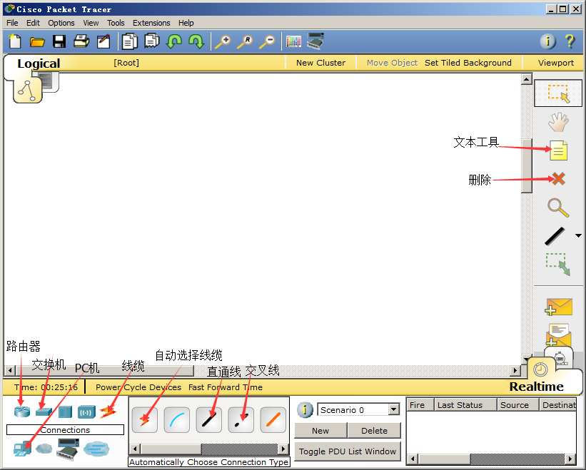
PC机说明
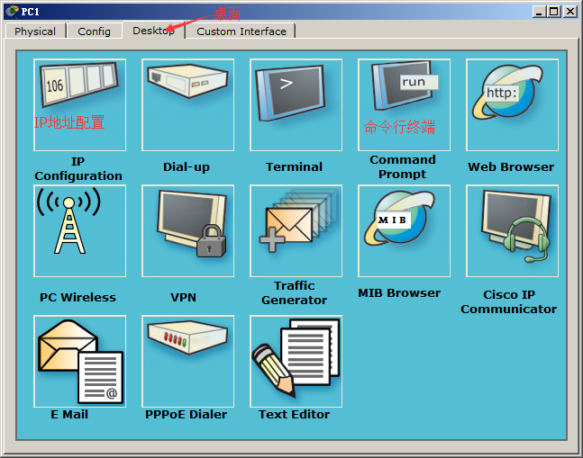
PC机ip地址说明
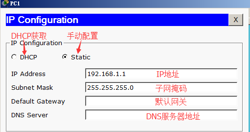
PC机命令行说明
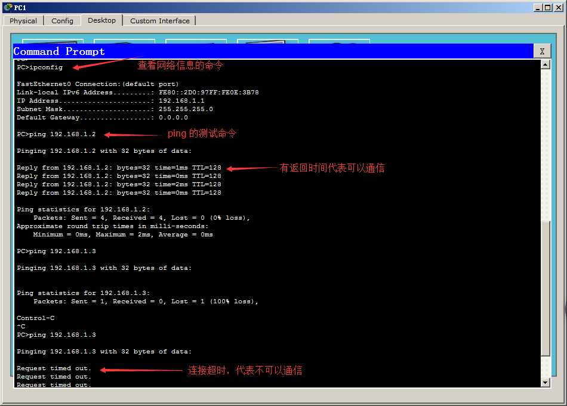
简介线缆的连接
568A和568B
同种设备之间用交叉线
异种设备之间用直通线

##交换机（Switch）
以太网交换机	是用来连接局域网的主要设备
交换机能够根据以太网帧中目标地址智能的转发数据，因此交换机工作在数据链路层
交换机分割冲突域，实现全双工通信
交换机数据转发原理
转发
交换机根据MAC地址表单播转发数据帧
学习
MAC地址表是交换机学习接收的数据帧的源MAC地址来形成的
广播
如果目的地址在MAC地址表中没有，交换机就向除接收到该数据帧的端口外的其他所有端口广播该数据帧
更新
交换机MAC地址表的老化时间是300秒
交换机如果发现一个帧的入端口和MAC地址表中源MAC地址的所在端口不同，交换机将MAC地址重新学习到新的端口
单工	只有一个信道，传输方向只能是单向的  如：广播
半双工	只有一个信道，在同一时刻，只能是单向传输  如：对讲机
全双工	双信道，同时可以有双向数据传输  如：电话

冲突与冲突域	     如果冲突过多，则传输效率就会降低
分割冲突域	      为了提高传输效率，分割冲突域

交换机背板交换矩阵结构（网上查找CISCO交换机产品讲解演示）	 交换机的每个端口访问另一个端口时，都有一条专有的链路，不会产生冲突
冲突域与广播域
广播域指接收同样广播消息的节点的集合，如：在该集合中的任何一个节点传输一个广播帧，则所有其他能收到这个帧的节点都被认为是该广播帧的一部分
交换机分割冲突域，但是不分割广播域，即交换机的所有端口属于同一个广播域

交换机的配置模式
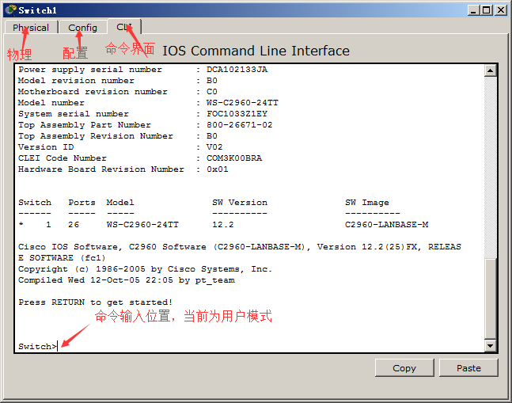


用户模式：Switch>
特权模式：Switch>enable	//进入特权模式的命令
                 Switch#	//当前属于特权模式
全局配置模式：Switch#config terminal	//进入全局配置模式的命令
                     Switch(config)#	//当前属于全局配置模式
接口配置模式：Switch(config)#interface fa0/1		
                     Switch(config-if)#	//当前属于接口模式
Line模式：Switch(config)#line console 0
                 Switch(config-line)#	//Line模式
其他实例：
switch#show running-config	//查看配置信息
switch#show mac-address-table	//查看MAC地址表
switch#show vlan	//详细查看VLAN信息
switch#show vlan brief	//简洁查看VLAN信息
switch#write		//保存配置
switch#copy running-config startup-config	//保存配置
说明：running-config是缓存中的配置信息，startup-config是交换机启动时读取的配置信息
switch(config)#hostname 名字	//可以设定该设备的名字
switch(config)#enable password 密码	//设定进入特权模式时需要密码认证（在配置信息中明文显示）
switch(config)#enable secret 密码		//设定进入特权模式时需要密码认证（在配置信息中密文显示）
switch(config)#interface range f0/1-10	//把f0/1到f0/10的接口设置成组（可以同时配置在组中的所有接口）
switch(config)#interface range f0/1,f0/5,f0/10	//把f0/1,f0/5,f0/10的接口设置成组
switch(config-if-range)#	//当前属于接口模式
exit  //返回上一级模式
end	//直接返回特权模式
在show前面加上do支持在配置模式或接口模式下查看信息
例：(conifg)#do show running-config
在命令行中输入“?”可以查看命令帮助
使用“Tab”键可以使用命令补全(以该命令为起始的只有一个命令时可使用)
命令缓存上键可以查看在当前模式下所使用过的命令
命令简写:当以该命令为起始的命令只有一个时可以省略后面的字符
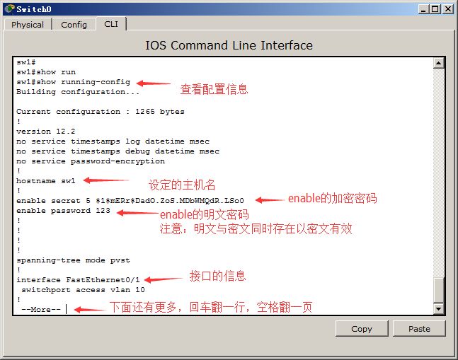
###VLAN

vlan（虚拟局域网）是一组逻辑上的设备和用户，这些设备和用户并不受物理位置的限制，可以根据功能、部门及应用等因素将它们组织起来，相互之间的通信就好像它们在同一个网段中一样。一个VLAN一个广播域，可以通过虚拟局域网控制广播活动；可提高网络的安全性。

在一个物理局域网中相同网段所有人都可以相互通信，如果划分不同的VLAN可以实现在同局域网中相同网段也是不可以相互通信的，可以根据现实情况来提高安全性

VLAN的划分大致可以分为静态划分和动态划分
静态划分是通过物理的端口号来进行划分，而动态划分可以通过MAC地址（网卡的唯一标识符）来进行划分，还有基于路由和策略等来进行划分

VLAN的相关命令

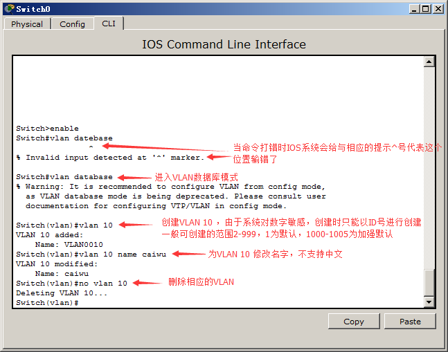

VLAN基于物理端口静态划分实验
公司有财务部，销售部，市场部。需求同部门的可以相互通信，不同部门的不可以通信。
需求设备：一台cisco2960交换机，6台PC机器，使用直通线相连
思路：首先需要有三个VLAN，财务部VLAN10，销售部VLAN20，市场部VLAN30。假设两个PC一个部门，财务部的PC1和PC2连接在交换机的F0/1和F0/2；销售部的PC3和PC4链接在交换机的F0/3和F0/4；市场部的PC5和PC6链接在交换机的F0/5和F0/6。各个PC机配置相同网段的IP地址例：192.168.1.1/24到192.168.1.6/24
网络拓扑图
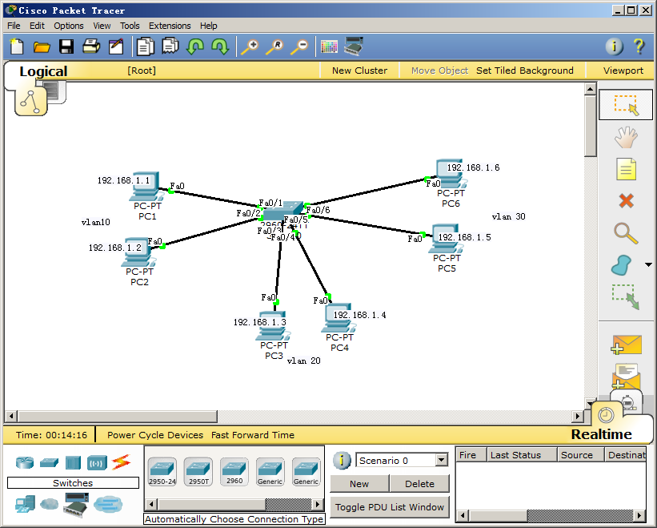

``` ios
配置步骤：
switch>enable			//进入特权模式
switch#vlan database		//进入vlan数据库模式
switch(vlan)#vlan 10		//创建vlan10
switch(vlan)#vlan 20		//创建vlan20
switch(vlan)#vlan 30		//创建vlan30
switch(vlan)#exit		//退出vlan数据库模式
switch#configure terminal	//进入全局配置模式
switch(config)#interface range f0/1-2	//进入f0/1-f02组接口模式
switch(config-if-range)#switchport access vlan 10	//将该接口加入到vlan10中
switch(config-if-range)#exit		//返回全局配置模式
switch(config)#interface range f0/3-4	//进入f0/3-f04组接口模式
switch(config-if-range)#switchport access vlan 20	//将该接口加入到vlan20中
switch(config-if-range)#exit		//返回全局配置模式
switch(config)#interface range f0/5-6	//进入f0/5-f06组接口模式
switch(config-if-range)#switchport access vlan 30	//将该接口加入到vlan30中
switch(config-if-range)#end	//返回特权模式
switch#show vlan brief	//简洁的方式查看VLAN信息
vlan编号  vlan名字			状态		    端口号
VLAN 	Name               Status        Ports
1       default            active        Fa0/7, Fa0/8, Fa0/9, Fa0/10.....
20		VLAN0010           active        Fa0/1, Fa0/2
20    	VLAN0020           active        Fa0/3, Fa0/4
30   	VLAN0030           active        Fa0/5, Fa0/6
```
验证：
PC1 使用ping命令来ping一下PC2-PC6的机器发现只能ping通，同VLAN的PC2其他的均ping不通。实现了同局域网相同网段不同VLAN之间无法通信


实验2：

如果是两台或多台交换机的相同VLAN要实现通信，必须在设备与设备相连的接口配置为trunk模式状态。二层交换机所有的接口为access模式。access模式只允许配置一个vlan；trunk模式可以让不同设备相同vlan进行通信。

需求设备：两台cisco2960交换机，使用交叉线相连；4台PC机器，两台PC机链接一台交换机，所有PC机的IP地址需要相同网段

思路：两台交换机各配置添加VLAN10和VLAN20，并将属于该交换机的pc机分别加入到vlan10和vlan20，让两台相同VLAN的PC机测试连通性。（无法通信）这时当前交换机的接口默认为access模式无法实现不同设备相同VLAN之间的通信(两台交换机的VLAN信息都是独立的)，让两台交换机相连的接口设置为trunk模式就可以实现不同设备相同VLAN之间的通信。
网络拓扑图
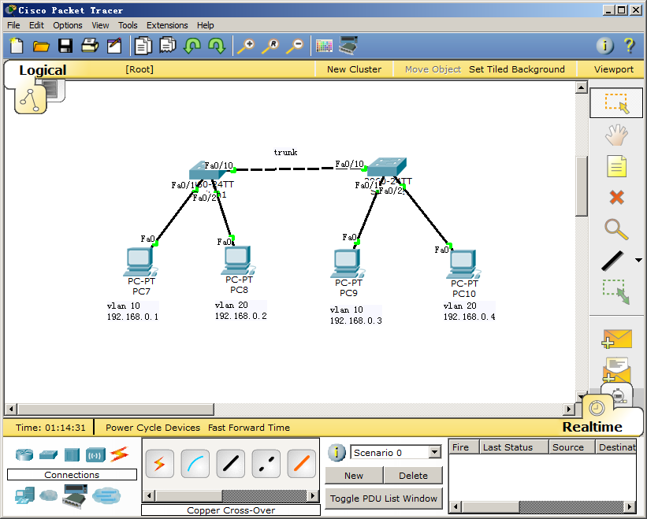
``` ios
配置步骤：
switch1：
switch>enable			
switch#vlan database		
switch(vlan)#vlan 10		
switch(vlan)#vlan 20		
switch(vlan)#exit		
switch#configure terminal	
switch(config)#interface f0/1
switch(config-if)#switchport access vlan 10
switch(config-if)#exit
switch(config)#interface f0/2
switch(config-if)#switchport access vlan 20
switch(config)#interface f0/10				//进入f0/10接口
switch(config-if)#switchport mode trunk		//将该接口模式设置为turnk模式
由于网络拓补结构的设置，switch2的配置和switch1的是设置一样
```
验证
使用PC来ping对面相同VLAN的PC是否可以ping通，再ping一下不同VLAN的PC机，是否可以通

###VTP

VTP(VLAN TRUNKING PROTOCOL) VLAN中继协议，该协议属于cisco私有协议。
VTP负责在VTP域内同步VLAN信息，这样就不必在每个交换上配置相同的VLAN信息。VTP最重要的作用是，将进行变动时可能会出现在的配置不一致性降至最低。

VTP域
VTP域也称为VLAN管理域，有一个以上共享VTP域名互相连接的交换机组成。也就是说，VTP域是一组VTP域名相同并通过中继链路相互连接的交换机。
下面是VTP域的要求：
1、域内的每台交换机都必须使用相同的域名，不论是通过配置实现，还是由交换自动学到的。
2、交换机必须是相邻的，即相邻的交换机需要具有相同的域名。
3、在所有交换机之间，必须配置中继链路(trunk)。
如果上述条件任何一项不满足，则VTP域不能联通，信息也就无法跨越分离部分进行传送。
VTP模式有3种 服务器模式（Server）客户机模式（Client）透明模式（Transparent）
服务器模式（Server）
提供VTP消息：包括VLAN ID和名字信息
学习相同域名的VTP消息
转发相同域名的VTP消息
可以添加、删除和更改VLAN VLAN信息写入NVRAM
该模式下不能使用扩展
客户机模式（Client）
请求VTP消息
学习相同域名的VTP消息
转发相同域名的VTP消息
不可以添加、删除和更改VLAN VLAN信息不会写入NVRAM
注意：该模式下不能使用增强型软件映像提供的VID，即只能使用2-1001这一段的值。1，1002-1005均为系统默认VID。要使用1006-4096作VID的值，只能关闭VTP或采用透明模式。
透明模式（Transparent）
不提供VTP消息
不学习VTP消息
转发VTP消息
可以添加、删除和更改VLAN，只在本地有效 VLAN信息写入NVRAM
新交换机出厂时的默认配置是预配置为VLAN1，VTP 模式为服务器。

VTP的相关命令
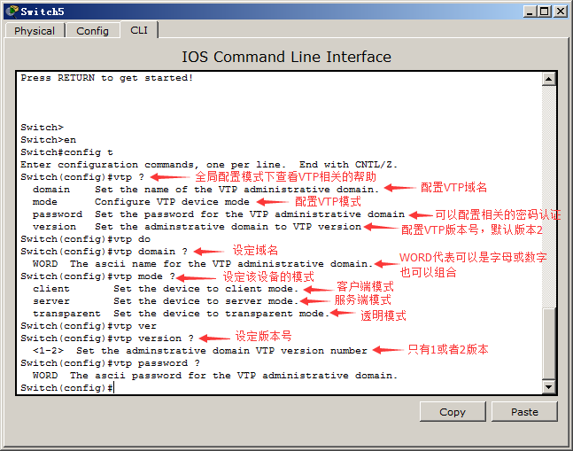

网络拓扑图
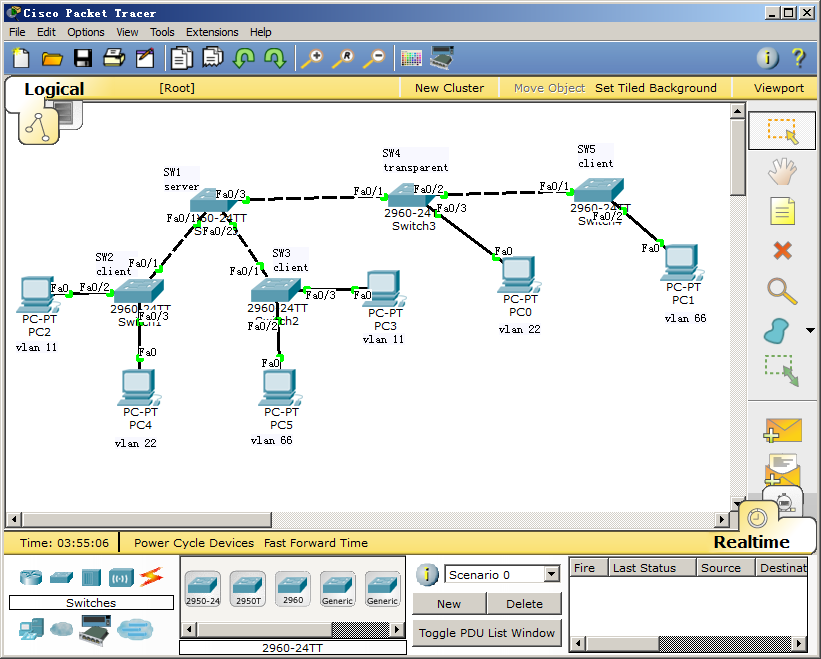

```ios
配置步骤：
SW1：server
switch>enable
switch#vlan database		
switch(vlan)#vlan 11		
switch(vlan)#vlan 22
switch(vlan)#vlan 66
switch(vlan)#exit
switch#configure terminal
Switch(config)#vtp domain moon					//设置域名为moon
Changing VTP domain name from NULL to moon		//域名从null(空)改为moon
Switch(config)#vtp mode server					//设置模式为服务端
Device mode already VTP SERVER.
Switch(config)#vtp password 123					//设置认证密码，可以不用设置
Setting device VLAN database password to 123
Switch(config)#interface range f0/1-3
Switch(config-if-range)#switchport mode trunk
Switch(config-if-range)#end						//返回特权模式
Switch#show vtp status							//查看VTP信息
VTP Version                     : 2				//VTP版本号
Configuration Revision          : 3
Maximum VLANs supported locally : 255			//支持最大VLAN数
Number of existing VLANs        : 8				//现有的VLAN数(5个是默认的有的，3个新加上去的)
VTP Operating Mode              : Server		//当前VTP模式
VTP Domain Name                 : moon			//当前VTP域名
VTP Pruning Mode                : Disabled		//VTP修剪关闭(该模拟器系统不支持修剪)
VTP V2 Mode                     : Disabled		//VTP V2模式关闭
VTP Traps Generation            : Disabled		
MD5 digest                      : 0xCB 0xA6 0x07 0x14 0x4C 0xF9 0x3F 0xB1 
Configuration last modified by 0.0.0.0 at 3-1-93 03:59:07
Local updater ID is 0.0.0.0 (no valid interface found)
----------------------------------------------------------------------------------------------
SW2：client
switch>enable
switch#configure terminal
Switch(config)#vtp domain moon					//设置域名为moon(必须设置相同的域名)
Changing VTP domain name from NULL to moon
Switch(config)#vtp mode client 					//设置模式为客户端
Setting device to VTP CLIENT mode
Switch(config)#vtp password 123					//设置认证密码(如果服务端配置了认证客户端必须也需要设置才能保证vtp信息的正常学习)
Setting device VLAN database password to 123	
Switch(config)#interface f0/1
Switch(config-if)#switchport mode trunk 
Switch(config-if)#interface f0/2				//在接口模式可以直接切换到别的接口
Switch(config-if)#switchport access vlan 11
Switch(config-if)#interface f0/3
Switch(config-if)#switchport access vlan 22
Switch(config-if)#end
Switch#show vlan brief 	 //当前交换机并没有添加VLAN但是作为客户端可以向服务端请求VLAN信息

VLAN Name                             Status    Ports
---- -------------------------------- --------- -------------------------------
1    default                          active    Fa0/4, Fa0/5, Fa0/6, Fa0/7
                                                Fa0/8, Fa0/9, Fa0/10, Fa0/11
                                                Fa0/12, Fa0/13, Fa0/14, Fa0/15
                                                Fa0/16, Fa0/17, Fa0/18, Fa0/19
                                                Fa0/20, Fa0/21, Fa0/22, Fa0/23
                                                Fa0/24, Gig1/1, Gig1/2
11   VLAN0011                         active    Fa0/2
22   VLAN0022                         active    Fa0/3
66   VLAN0066                         active    
1002 fddi-default                     active    
1003 token-ring-default               active    
1004 fddinet-default                  active    
1005 trnet-default                    active
Switch#show vtp status 	//再查看一下相应的客户端的vtp信息
VTP Version                     : 2
Configuration Revision          : 3
Maximum VLANs supported locally : 255
Number of existing VLANs        : 8
VTP Operating Mode              : Client
VTP Domain Name                 : moon
VTP Pruning Mode                : Disabled
VTP V2 Mode                     : Disabled
VTP Traps Generation            : Disabled
MD5 digest                      : 0xF1 0x7E 0x82 0x3B 0xEF 0xDA 0x37 0x5E 
Configuration last modified by 0.0.0.0 at 3-1-93 00:35:28
----------------------------------------------------------------------------------------------
SW3：client
switch>enable
switch#configure terminal
Switch(config)#vtp mode
Switch(config)#vtp domain moon					//设置域名为moon(必须设置相同的域名)
Changing VTP domain name from NULL to moon
switch#configure terminal
Switch(config)#vtp mode client 					//设置模式为客户端
Setting device to VTP CLIENT mode
Switch(config)#vtp password 123					
Setting device VLAN database password to 123	
Switch(config)#interface f0/1
Switch(config-if)#switchport mode trunk 
Switch(config-if)#interface f0/2				//在接口模式可以直接切换到别的接口
Switch(config-if)#switchport access vlan 66
Switch(config-if)#interface f0/3
Switch(config-if)#switchport access vlan 11
Switch(config-if)#end
Switch#show vlan brief 

VLAN Name                             Status    Ports
---- -------------------------------- --------- -------------------------------
1    default                          active    Fa0/4, Fa0/5, Fa0/6, Fa0/7
                                                Fa0/8, Fa0/9, Fa0/10, Fa0/11
                                                Fa0/12, Fa0/13, Fa0/14, Fa0/15
                                                Fa0/16, Fa0/17, Fa0/18, Fa0/19
                                                Fa0/20, Fa0/21, Fa0/22, Fa0/23
                                                Fa0/24, Gig1/1, Gig1/2
11   VLAN0011                         active    Fa0/3
22   VLAN0022                         active    
66   VLAN0066                         active    Fa0/2
1002 fddi-default                     active    
1003 token-ring-default               active    
1004 fddinet-default                  active    
1005 trnet-default                    active
Switch#show vtp status 
VTP Version                     : 2
Configuration Revision          : 3
Maximum VLANs supported locally : 255
Number of existing VLANs        : 8
VTP Operating Mode              : Client
VTP Domain Name                 : moon
VTP Pruning Mode                : Disabled
VTP V2 Mode                     : Disabled
VTP Traps Generation            : Disabled
MD5 digest                      : 0xF1 0x7E 0x82 0x3B 0xEF 0xDA 0x37 0x5E 
Configuration last modified by 0.0.0.0 at 3-1-93 00:35:28
--------------------------------------------------------------------------------------------------------
SW4:transparent
Switch>enable
switch#vlan database		
switch(vlan)#vlan 22	//由于透明模式不会学习服务端的VLAN信息，想要通信必须自己手动添加不会影响其他模式。
switch(vlan)#exit
switch#configure terminal
Switch(config)#vtp mode transparent		//设置为透明模式，透明模式可以忽视域名和认证，详细看透明模式的特点
Switch(config)#interface range f0/1-2
Switch(config-if-range)#switchport mode trunk
Switch(config-if-range)#interface f0/3
Switch(config-if)#switchport access vlan 22
Switch(config-if)#end
Switch#show vlan brief 

VLAN Name                             Status    Ports
---- -------------------------------- --------- -------------------------------
1    default                          active    Fa0/4, Fa0/5, Fa0/6, Fa0/7
                                                Fa0/8, Fa0/9, Fa0/10, Fa0/11
                                                Fa0/12, Fa0/13, Fa0/14, Fa0/15
                                                Fa0/16, Fa0/17, Fa0/18, Fa0/19
                                                Fa0/20, Fa0/21, Fa0/22, Fa0/23
                                                Fa0/24, Gig1/1, Gig1/2
22   VLAN0022                         active    Fa0/3
1002 fddi-default                     active    
1003 token-ring-default               active    
1004 fddinet-default                  active    
1005 trnet-default                    active    

Switch#show vtp status 
VTP Version                     : 2
Configuration Revision          : 0
Maximum VLANs supported locally : 255
Number of existing VLANs        : 6
VTP Operating Mode              : Transparent
VTP Domain Name                 : moon
VTP Pruning Mode                : Disabled
VTP V2 Mode                     : Disabled
VTP Traps Generation            : Disabled
MD5 digest                      : 0xE2 0x63 0x72 0xFA 0x85 0x9C 0x87 0x05 
Configuration last modified by 0.0.0.0 at 0-0-00 00:00:00
--------------------------------------------------------------------------------------------------------
SW5：client
switch>enable
switch#configure terminal
Switch(config)#vtp mode
Switch(config)#vtp domain moon					
Changing VTP domain name from NULL to moon
switch#configure terminal
Switch(config)#vtp mode client 					
Setting device to VTP CLIENT mode
Switch(config)#vtp password 123					
Setting device VLAN database password to 123	
Switch(config)#interface f0/1
Switch(config-if)#switchport mode trunk 
Switch(config-if)#interface f0/2				
Switch(config-if)#switchport access vlan 66
Switch(config-if)#end
Switch#show vlan brief 

VLAN Name                             Status    Ports
---- -------------------------------- --------- -------------------------------
1    default                          active    Fa0/3, Fa0/4, Fa0/5, Fa0/6
                                                Fa0/7, Fa0/8, Fa0/9, Fa0/10
                                                Fa0/11, Fa0/12, Fa0/13, Fa0/14
                                                Fa0/15, Fa0/16, Fa0/17, Fa0/18
                                                Fa0/19, Fa0/20, Fa0/21, Fa0/22
                                                Fa0/23, Fa0/24, Gig1/1, Gig1/2
11   VLAN0011                         active    
22   VLAN0022                         active    
66   VLAN0066                         active    Fa0/2
1002 fddi-default                     active    
1003 token-ring-default               active    
1004 fddinet-default                  active    
1005 trnet-default                    active  
Switch#show vtp status 
VTP Version                     : 2
Configuration Revision          : 3
Maximum VLANs supported locally : 255
Number of existing VLANs        : 8
VTP Operating Mode              : Client
VTP Domain Name                 : moon
VTP Pruning Mode                : Disabled
VTP V2 Mode                     : Disabled
VTP Traps Generation            : Disabled
MD5 digest                      : 0xF1 0x7E 0x82 0x3B 0xEF 0xDA 0x37 0x5E 
Configuration last modified by 0.0.0.0 at 3-1-93 00:35:28

测试所有的PC机属于相同网段但是只有相同的VLAN可以进行通信，可以在服务端随意添加修改和删除客户端会和服务端进行同步
```

排错：

1.看交换机相连的接口是否trunk

2.各个交换机的域名模式是否正确

3.认证是否设置

4.PC的接口是否正确加入vlan，注意连pc机的接口不要设置trunk

5.多使用show vlan brief和show vtp status 来查看信息

思考：什么情况下查看vlan信息时相应的接口会消失，再接口加入vlan后误删除vlan应该怎么进行恢复。

## 路由器（router）

路由器（Router），是连接因特网中各局域网、广域网的设备，它会根据信道的情况自动选择和设定路由，以最佳路径，按前后顺序发送信号。 路由器是互联网络的枢纽。路由器（Router）又称网关设备（Gateway）是用于连接多个逻辑上分开的网络，所谓逻辑网络是代表一个单独的网络或者一个子网。当数据从一个子网传输到另一个子网时，可通过路由器的路由功能来完成。因此，路由器具有判断网络地址和选择IP路径的功能，它能在多网络互联环境中，建立灵活的连接，可用完全不同的数据分组和介质访问方法连接各种子网，路由器只接受源站或其他路由器的信息，属网络层的一种互联设备。

路由器是根据路由表来进行道路的选择，如果路由表中没有相关目的地的路径则无法到达目的地。

路由器的基础命令以及模式之间的切换同交换机一样

在打开路由时会比交换机多出一个向导选项这里选择no来跳过此步骤

--- System Configuration Dialog ---


Continue with configuration dialog? [yes/no]: no

router#show ip route		//查看路由表

Codes: C - connected, S - static, I - IGRP, R - RIP, M - mobile, B - BGP

D - EIGRP, EX - EIGRP external, O - OSPF, IA - OSPF inter area
N1 - OSPF NSSA external type 1, N2 - OSPF NSSA external type 2
E1 - OSPF external type 1, E2 - OSPF external type 2, E - EGP
i - IS-IS, L1 - IS-IS level-1, L2 - IS-IS level-2, ia - IS-IS inter area

C：代表直连路由

S：代表静态路由

R：代表以RIP协议（动态路由协议中的一种）

I：代表以IGRP协议

B：BGP协议（外部协议）

D：EIGRP协议（IGRP的升级版）

O：OSPF协议

### 直连路由

实验：

2811系列路由一台，PC机两台。目的两台PC机可以ping通

网络拓扑图


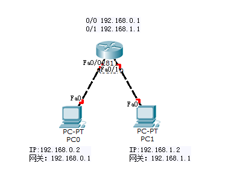

注意：路由是实现跨越子网之间的通信，所以路由的两个点不能是相同子网的网段。但是线的两端必须是相同网段才可以进行通信。

配置步骤：

```ios
R1
Router>enable											
Router#configure terminal 
Router(config)#interface f0/0									//进入f0/0接口
Router(config-if)#ip address 192.168.0.1 255.255.255.0			//为该接口设置IP地址及子网掩码
Router(config-if)#no shutdown									//打开该端口（路由的所有接口默认关闭）
Router(config-if)#interface f0/1								
Router(config-if)#ip address 192.168.1.1 255.255.255.0
Router(config-if)#no shutdown 
Router(config-if)#end											//返回特权模式
Router#show ip route											//查看路由表
Codes: C - connected, S - static, I - IGRP, R - RIP, M - mobile, B - BGP
       D - EIGRP, EX - EIGRP external, O - OSPF, IA - OSPF inter area
       N1 - OSPF NSSA external type 1, N2 - OSPF NSSA external type 2
       E1 - OSPF external type 1, E2 - OSPF external type 2, E - EGP
       i - IS-IS, L1 - IS-IS level-1, L2 - IS-IS level-2, ia - IS-IS inter area
       * - candidate default, U - per-user static route, o - ODR
       P - periodic downloaded static route

Gateway of last resort is not set

C    192.168.0.0/24 is directly connected, FastEthernet0/0		//多出了相应的直连路由
C    192.168.1.0/24 is directly connected, FastEthernet0/1

PC机：设定相应网段的IP地址以及网关地址
```

验证：两台PC机互ping

思考：如果要跨越子网通信必须要有网关，网关相当于当前局域网的出口，也可以说网关是其他机器来访问本地的如果，所以跨子网的通信网关必不可少。一般的网关地址都是相邻的路由器接口的IP地址。（直连路由的重点）

### 静态路由

静态路由是指如果路由表中没有去往目的地的路，那么就手动添加一条路由到路由表中

Router(config)#ip route 目标网段 目标网段子网掩码 下一跳地址 	    //手动添加一条路由

注意：

目标网段是指目的地的网段位置（当前拓扑图中和本地路由表进行对比缺少去哪的路，哪里就是目标网段）

下一跳地址必须达到要求：

1.该地址必须是当前已知的准确IP地址(可以是静态路由学习到的)

2.该地址必须认识目标网段

实验：

2811系列路由3台，PC机3台。目的三台PC机可以ping通

网络拓扑图

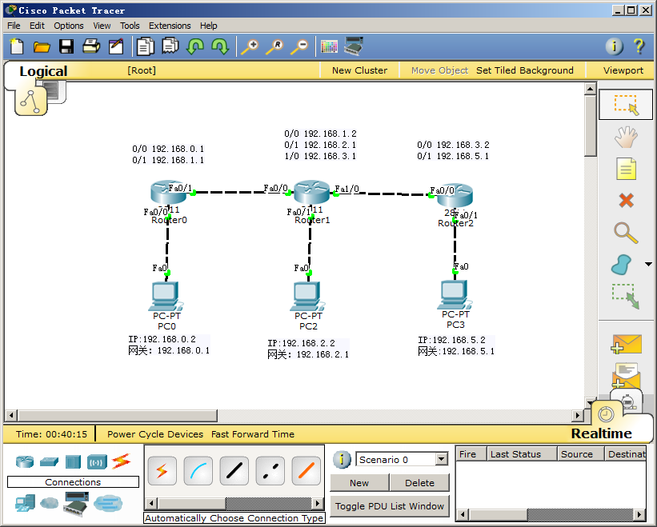

```IOS
配置步骤：
R1
Router>enable											
Router#configure terminal 
Router(config)#interface f0/0									
Router(config-if)#ip address 192.168.0.1 255.255.255.0			
Router(config-if)#no shutdown									
Router(config-if)#interface f0/1								
Router(config-if)#ip address 192.168.1.1 255.255.255.0
Router(config-if)#no shutdown 
Router(config-if)#end											
Router#show ip route									
Codes: C - connected, S - static, I - IGRP, R - RIP, M - mobile, B - BGP
       D - EIGRP, EX - EIGRP external, O - OSPF, IA - OSPF inter area
       N1 - OSPF NSSA external type 1, N2 - OSPF NSSA external type 2
       E1 - OSPF external type 1, E2 - OSPF external type 2, E - EGP
       i - IS-IS, L1 - IS-IS level-1, L2 - IS-IS level-2, ia - IS-IS inter area
       * - candidate default, U - per-user static route, o - ODR
       P - periodic downloaded static route

Gateway of last resort is not set

C    192.168.0.0/24 is directly connected, FastEthernet0/0		
C    192.168.1.0/24 is directly connected, FastEthernet0/1

Router#configure terminal 
Router(config)#ip route 192.168.2.0 255.255.255.0 192.168.1.2	//手动添加去往192.168.2.0网段的路由
Router(config)#ip route 192.168.3.0 255.255.255.0 192.168.1.2	//手动添加去往192.168.3.0网段的路由
Router(config)#ip route 192.168.5.0 255.255.255.0 192.168.3.2	//手动添加去往192.168.5.0网段的路由
Router(config)#do show ip route
Codes: C - connected, S - static, I - IGRP, R - RIP, M - mobile, B - BGP
       D - EIGRP, EX - EIGRP external, O - OSPF, IA - OSPF inter area
       N1 - OSPF NSSA external type 1, N2 - OSPF NSSA external type 2
       E1 - OSPF external type 1, E2 - OSPF external type 2, E - EGP
       i - IS-IS, L1 - IS-IS level-1, L2 - IS-IS level-2, ia - IS-IS inter area
       * - candidate default, U - per-user static route, o - ODR
       P - periodic downloaded static route

Gateway of last resort is not set

C    192.168.0.0/24 is directly connected, FastEthernet0/0
C    192.168.1.0/24 is directly connected, FastEthernet0/1
S    192.168.2.0/24 [1/0] via 192.168.1.2					//手动添加的路由表
S    192.168.3.0/24 [1/0] via 192.168.1.2
S    192.168.5.0/24 [1/0] via 192.168.3.2

R2
Router>enable											
Router#configure terminal 
Router(config)#interface f0/0									
Router(config-if)#ip address 192.168.1.2 255.255.255.0			
Router(config-if)#no shutdown									
Router(config-if)#interface f0/1								
Router(config-if)#ip address 192.168.2.1 255.255.255.0
Router(config-if)#no shutdown 
Router(config-if)#interface f1/0								
Router(config-if)#ip address 192.168.3.1 255.255.255.0
Router(config-if)#no shutdown 
Router(config-if)#end	
Router#show ip route
Codes: C - connected, S - static, I - IGRP, R - RIP, M - mobile, B - BGP
       D - EIGRP, EX - EIGRP external, O - OSPF, IA - OSPF inter area
       N1 - OSPF NSSA external type 1, N2 - OSPF NSSA external type 2
       E1 - OSPF external type 1, E2 - OSPF external type 2, E - EGP
       i - IS-IS, L1 - IS-IS level-1, L2 - IS-IS level-2, ia - IS-IS inter area
       * - candidate default, U - per-user static route, o - ODR
       P - periodic downloaded static route

Gateway of last resort is not set

C    192.168.1.0/24 is directly connected, FastEthernet0/0
C    192.168.2.0/24 is directly connected, FastEthernet0/1
C    192.168.3.0/24 is directly connected, FastEthernet1/0

Router#configure terminal 
Router(config)#ip route 192.168.0.0 255.255.255.0 192.168.1.1
Router(config)#ip route 192.168.5.0 255.255.255.0 192.168.3.2
Router(config)#do show ip route
Codes: C - connected, S - static, I - IGRP, R - RIP, M - mobile, B - BGP
       D - EIGRP, EX - EIGRP external, O - OSPF, IA - OSPF inter area
       N1 - OSPF NSSA external type 1, N2 - OSPF NSSA external type 2
       E1 - OSPF external type 1, E2 - OSPF external type 2, E - EGP
       i - IS-IS, L1 - IS-IS level-1, L2 - IS-IS level-2, ia - IS-IS inter area
       * - candidate default, U - per-user static route, o - ODR
       P - periodic downloaded static route

Gateway of last resort is not set

S    192.168.0.0/24 [1/0] via 192.168.1.1
C    192.168.1.0/24 is directly connected, FastEthernet0/0
C    192.168.2.0/24 is directly connected, FastEthernet0/1
C    192.168.3.0/24 is directly connected, FastEthernet1/0
S    192.168.5.0/24 [1/0] via 192.168.3.2

R3
Router>enable											
Router#configure terminal 
Router(config)#interface f0/0									
Router(config-if)#ip address 192.168.3.2 255.255.255.0			
Router(config-if)#no shutdown									
Router(config-if)#interface f0/1								
Router(config-if)#ip address 192.168.5.1 255.255.255.0
Router(config-if)#no shutdown 
Router(config-if)#end											
Router#show ip route
Codes: C - connected, S - static, I - IGRP, R - RIP, M - mobile, B - BGP
       D - EIGRP, EX - EIGRP external, O - OSPF, IA - OSPF inter area
       N1 - OSPF NSSA external type 1, N2 - OSPF NSSA external type 2
       E1 - OSPF external type 1, E2 - OSPF external type 2, E - EGP
       i - IS-IS, L1 - IS-IS level-1, L2 - IS-IS level-2, ia - IS-IS inter area
       * - candidate default, U - per-user static route, o - ODR
       P - periodic downloaded static route

Gateway of last resort is not set

C    192.168.3.0/24 is directly connected, FastEthernet0/0
C    192.168.5.0/24 is directly connected, FastEthernet0/1

Router#configure terminal
Router(config)#ip route 192.168.0.0 255.255.255.0 192.168.3.1
Router(config)#ip route 192.168.1.0 255.255.255.0 192.168.3.1
Router(config)#ip route 192.168.2.0 255.255.255.0 192.168.3.1
Router(config)#do show ip route
Codes: C - connected, S - static, I - IGRP, R - RIP, M - mobile, B - BGP
       D - EIGRP, EX - EIGRP external, O - OSPF, IA - OSPF inter area
       N1 - OSPF NSSA external type 1, N2 - OSPF NSSA external type 2
       E1 - OSPF external type 1, E2 - OSPF external type 2, E - EGP
       i - IS-IS, L1 - IS-IS level-1, L2 - IS-IS level-2, ia - IS-IS inter area
       * - candidate default, U - per-user static route, o - ODR
       P - periodic downloaded static route

Gateway of last resort is not set

S    192.168.0.0/24 [1/0] via 192.168.3.1
S    192.168.1.0/24 [1/0] via 192.168.3.1
S    192.168.2.0/24 [1/0] via 192.168.3.1
C    192.168.3.0/24 is directly connected, FastEthernet0/0
C    192.168.5.0/24 is directly connected, FastEthernet0/1
```

验证：

3台PC相互ping

思考：可以将下一跳地址都交给中间的路由来进行跳转（中间的路由必须全部指对）

### 单臂路由

实验：

实现不同VLAN之间的通信；把不同的VLAN配成不同的子网（网段）通过路由器使之通信

2811路由一台，2960交换机一台，两台PC机

网络拓扑图

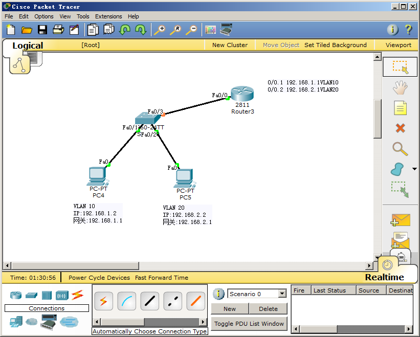

```IOS
配置步骤：
SW1
switch>enable			
switch#vlan database		
switch(vlan)#vlan 10		
switch(vlan)#vlan 20		
switch(vlan)#exit		
switch#configure terminal	
switch(config)#interface f0/1
switch(config-if)#switchport access vlan 10
switch(config-if)#exit
switch(config)#interface f0/2
switch(config-if)#switchport access vlan 20
switch(config)#interface f0/3				
switch(config-if)#switchport mode trunk		

R1
Router>enable											
Router#configure terminal 
Router(config)#interface f0/0									
Router(config-if)#no shutdown		
Router(config)#interface f0/0.1			//创建子接口
Router(config-subif)#encapsulation dot1Q 10		//该接口和VLAN 10进行封装
Router(config-subif)#ip address 192.168.1.1 255.255.255.0 //设置该接口的IP地址(VLAN 10的网关地址)
Router(config)#interface f0/0.2			//创建子接口
Router(config-subif)#encapsulation dot1Q 20		//该接口和VLAN 20进行封装
Router(config-subif)#ip address 192.168.2.1 255.255.255.0 //设置该接口的IP地址(VLAN 20的网关地址)
Router(config-if)#end
Router#show ip route
Codes: C - connected, S - static, I - IGRP, R - RIP, M - mobile, B - BGP
       D - EIGRP, EX - EIGRP external, O - OSPF, IA - OSPF inter area
       N1 - OSPF NSSA external type 1, N2 - OSPF NSSA external type 2
       E1 - OSPF external type 1, E2 - OSPF external type 2, E - EGP
       i - IS-IS, L1 - IS-IS level-1, L2 - IS-IS level-2, ia - IS-IS inter area
       * - candidate default, U - per-user static route, o - ODR
       P - periodic downloaded static route

Gateway of last resort is not set

C    192.168.1.0/24 is directly connected, FastEthernet0/0.1
C    192.168.2.0/24 is directly connected, FastEthernet0/0.2
```

验证：

两台PC相互PING通

注意：交换机与路由相连的接口必须trunk

### 三层交换机

三层交换机是指在三层(网络层)工作的交换机，交换机拥有了路由的功能。

实验：

使用三层交换机使不同的VLAN进行通信(和单臂路由的原理一样，只是实现的方法不同)

一台三层交换机，一台二层交换机，3台PC机

网络拓扑图

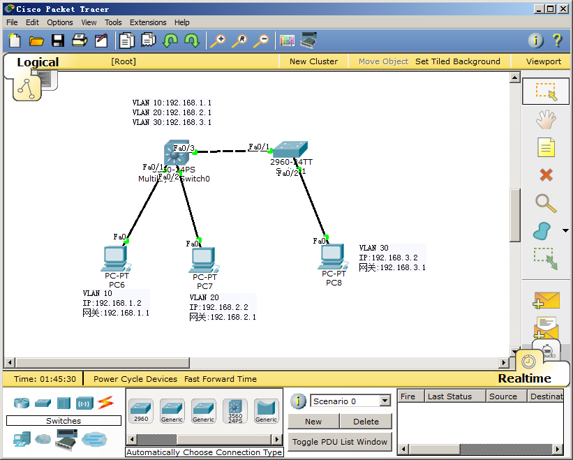

```IOS
配置步骤：
SW1
switch>enable			
switch#vlan database		
switch(vlan)#vlan 10		
switch(vlan)#vlan 20		
switch(vlan)#exit		
switch#configure terminal	
switch(config)#interface f0/1
switch(config-if)#switchport mode trunk
switch(config-if)#exit
switch(config)#interface f0/2
switch(config-if)#switchport access vlan 30

三层交换机
switch>enable			
switch#vlan database		
switch(vlan)#vlan 10		
switch(vlan)#vlan 20
switch(vlan)#vlan 30
switch(vlan)#exit		
switch#configure terminal	
switch(config)#interface f0/1
switch(config-if)#switchport access vlan 10	
switch(config)#interface f0/2
switch(config-if)#switchport access vlan 20	
switch(config)#interface vlan 10							//创建VLAN10接口
Switch(config-if)#ip address 192.168.1.1 255.255.255.0		//设置IP地址（VLAN10的网关地址）
switch(config)#interface vlan 20							//创建VLAN20接口
Switch(config-if)#ip address 192.168.2.1 255.255.255.0		//设置IP地址（VLAN20的网关地址）
switch(config)#interface vlan 30							//创建VLAN30接口
Switch(config-if)#ip address 192.168.3.1 255.255.255.0		//设置IP地址（VLAN30的网关地址）
Switch(config-if)#end
Switch#show ip route
Codes: C - connected, S - static, I - IGRP, R - RIP, M - mobile, B - BGP
       D - EIGRP, EX - EIGRP external, O - OSPF, IA - OSPF inter area
       N1 - OSPF NSSA external type 1, N2 - OSPF NSSA external type 2
       E1 - OSPF external type 1, E2 - OSPF external type 2, E - EGP
       i - IS-IS, L1 - IS-IS level-1, L2 - IS-IS level-2, ia - IS-IS inter area
       * - candidate default, U - per-user static route, o - ODR
       P - periodic downloaded static route

Gateway of last resort is not set

C    192.168.1.0/24 is directly connected, Vlan10
C    192.168.2.0/24 is directly connected, Vlan20
C    192.168.3.0/24 is directly connected, Vlan30
```

验证

三台PC机进行ping的测试

注意：这里的创建VLAN接口相当于单臂路由中的创建子接口加封装VLAN


